# Identity Protection 2 つのリスク ポリシーの導入メリットについて

こんにちは。 Azure Identity チームの山口です。

今回は Azure AD Premium P2 ライセンスにて利用可能な Azure AD Identity Protection (以降 Identity Protection と呼称) が持つ 2 つのリスク ポリシー「ユーザー リスク ポリシー」と「サインイン リスク ポリシー」の導入メリットをご紹介したいと思います。

本 Blog の記事は以下のような方を対象としています。

- Identity Protection の機能を知りたい

- すでに Azure AD Premium P2 を購入しており、そこに含まれる Identity Protection をこれから活用していきたい

- セキュリティ管理の強化を検討しており、 Azure AD Premium P2 ライセンスの購入および利用を検討したい

## Microsoft が持つ脅威の検出について

Microsoft は 毎日約 6.5 兆個以上のシグナルを検知分析しお客様の Identity やデータを脅かす脅威を特定し保護をしています。
下の絵に描かれている「Identities」は Microsoft が外部の脅威から守るべきものとしてありますが、その具体的なソリューションの一つが今回紹介をする Identity Protection です。

[The evolution of Microsoft Threat Protection, November update](https://www.microsoft.com/security/blog/2018/11/13/the-evolution-of-microsoft-threat-protection-november-update/)

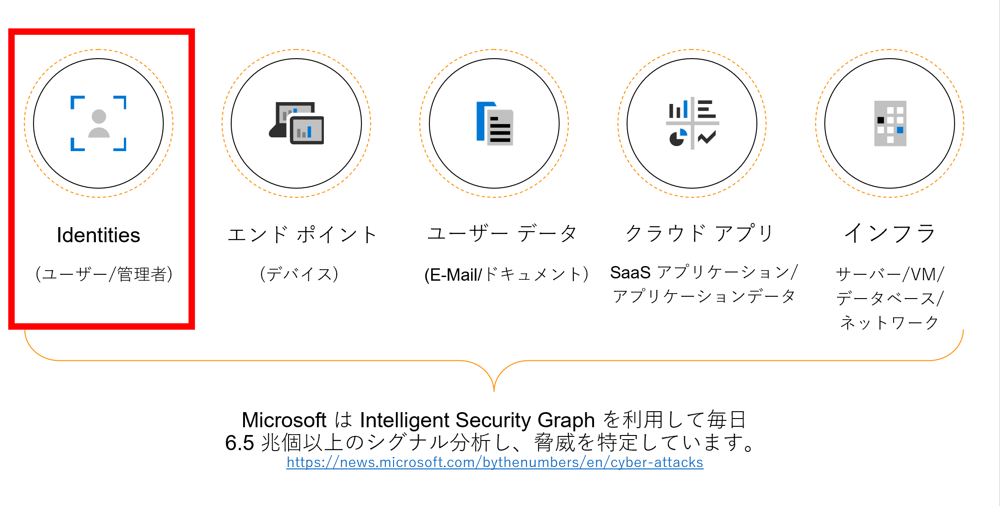

## Identity Protection とは

Identity Protection は Microsoft が持つ脅威の検出ソリューションの一つで Azure Advanced Threat Protection や Microsoft Cloud App Security と連携し ID に関するリスクを検出 /管理 / 保護することができます。

今回の記事では詳しく触れていませんが、「サインイン リスク」と「ユーザー リスク」という 2 つの異なるタイプのリスクを検出可能で、今回ご紹介する「ユーザー リスク ポリシー」と「サインイン リスク ポリシー」という 2 つのポリシーを組み合わせて利用することでこれらのリスクから ID を自動的に守る運用が実現できます。

## Identity Protection 導入の 3 ステップについて

Identity Protection には「ユーザー リスク ポリシー」と「サインイン リスク ポリシー」という 2 つのポリシーがあります。
また、ユーザー リスクおよび サインインのリスクを条件付きアクセス ポリシーと組み合わせることができます。

いきなり全てを利用しようとすると大変ですので、次のような  3 ステップを順に実施していくことをお勧めします。
本記事では「ステップ 1」および「ステップ 2」を解説します。

## Identity Protection リスク検出の仕組み (概要)
Identity Protection は内部に膨大なデータを蓄積し日々分析をしており、イメージとしては下記のようなサイクルで動作しています。

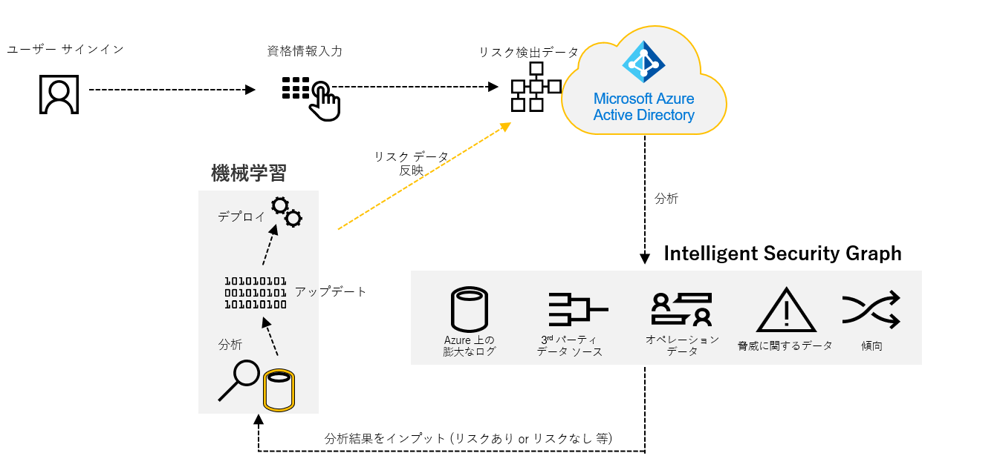

Identity Protection は Microsoft のデータセンターに蓄積された膨大なログや脅威に関するデータを基に、機械学習を用いて自動的にリスクの判定を行います。常に最新のセキュリティ データが判定に活用されることで、その結果を基にリスク検出を行います。

このリスク検出をユーザーの「サインイン」の単位で制御を行うのが「サインイン リスク ポリシー」となり、「ユーザー単位」で制御を行うのが「ユーザー リスク ポリシー」になります。

## 「サインイン リスク ポリシー」と「ユーザー リスク ポリシー」の違い

具体的にこの 2 つのポリシーの何が違うのか、という点をまとめました。

それぞれのポリシーの特徴について個別に解説していきます。

#### サインイン リスク ポリシーの特徴
サインイン リスク ポリシーでは「リアルタイム」のリスクを検知し、「サインイン リスク ポリシー」の定義に従った制御を行います。
例えば、ユーザーが  Tor ブラウザーなどを利用してアクセス元の IP アドレスを隠してアクセスを試行したサインインに対して Identity Protection による制御を行えます。
ここで行える制御は、対象のユーザーのサインインを「ブロック」するか「多要素認証」 (MFA) を要求させることです。

例えば攻撃者がサインインを試行した際に MFA を強制することで、攻撃者が MFA を突破することは難しいためサインインを自動的に防ぐことができます。

#### サインイン リスク ポリシー導入前に必要な設定

ポリシー制御対象のユーザーに Microsoft Authenticator などの MFA 設定を完了してもらう必要があります。
Identity Protection の導入によらず MFA 設定は強く推奨されることですが、従業員の数が多い企業であればあるほど、MFA の設定を全従業員に浸透させるまでの時間が必要になってくると思いますし、様々な考慮しなければならない要件もあるかと思います。
これをサポートする機能として「MFA 登録ポリシー」という機能が Identity Protection に用意されています。

#### MFA 登録ポリシーの活用
MFA 登録ポリシーを有効にすると、MFA の設定をユーザーに促すことが可能となります。
また、ユーザーは 14 日の間であれば MFA の設定をスキップすることが可能ですが、必ず割り当ての対象となっているユーザーはこの 14 日の期間までに MFA の設定を完了させる必要があります。

具体的には、Azure ポータルより [Azure Active Directory] → [セキュリティ] → [Identity Protection] → [MFA 登録ポリシー] の順に選択した後に表示される下記画面ショット上で行います。

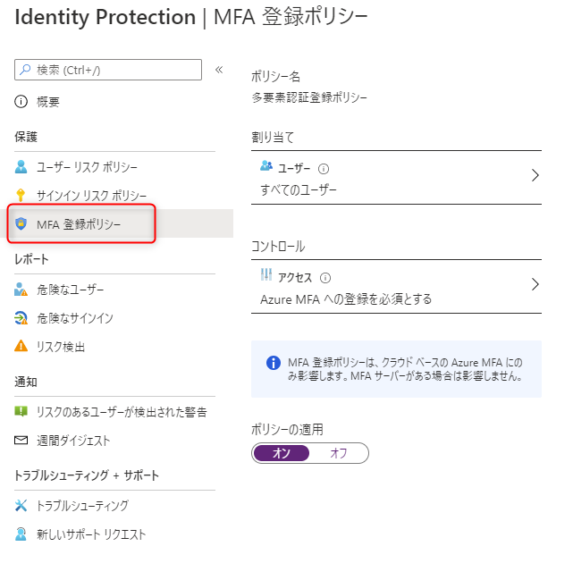

対象のユーザーは「すべてのユーザー」もしくは「ユーザー個別、グループ単位」で設定できますし、一部のユーザーをポリシーの対象外として設定することも可能です。

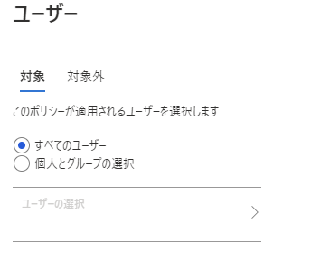

アクセスの項目は下記画面ショットのように「Azure MFA への登録を必須とする」という選択肢しかありません。これを有効化します。

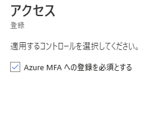

最後に「ポリシーの適用」を「オン」にし設定を「保存」することで MFA 登録 ポリシーの設定は完了になります。

例えば対象のユーザーが Azure AD 上のアプリケーションにサインインした際には下記画面ショットが表示され MFA の設定が促されます。
「今はしない (期限まで xx 日です)」をクリックすると MFA の設定をスキップすること可能ですが、記載されている期日までには必ず MFA の設定を完了させる必要があります。

なお、 Azure AD での MFA をどのように導入するかという点については、次の資料もあわせてご活用ください。

[Azure MFA 導入パターンを網羅的にご紹介！](../azure-active-directory/MFA_configuration_scenarios.md)

#### サインイン リスク ポリシー設定方法
Identity Protection の「サインイン リスク ポリシー」は Azure AD の「グローバル管理者」と「セキュリティ管理者」が設定できます。
具体的には、Azure ポータルより [Azure Active Directory] → [セキュリティ] → [Identity Protection] → [サインイン リスク ポリシー] の順に選択した後に表示される下記画面ショット上で行います。

対象のユーザーは「すべてのユーザー」もしくは「ユーザー個別、グループ単位」で設定でき、一部のユーザーをポリシーの対象外として設定することも可能です。

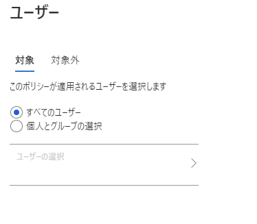

次に「サインイン リスク」についてはリスク レベルの「低・中・高」の 3 段階を指定し、ユーザーがサインインしたときにどのリスク レベル以上のリスクを検知した際に後述する「コントロール」の制御方法を動作させるかを定義します。
なお、Microsoft ではサインイン リスクのリスクレベルは「中以上」を設定することを推奨しています。

最後に「アクセス」の設定を行います。
サインイン リスクを検知した際に対象のユーザーのアクセスを「ブロック」させるか何も制御せずに「アクセスを許可」させるか「アクセスを許可」させるが「多要素を要求」させるかの 3 パターンを選択することができます。

Microsoft では「アクセス許可」＋「多要素認証を要求する」設定を推奨しています。

最後に「ポリシーの適用」を「オン」にし設定を「保存」することでサインイン リスク ポリシーの設定は完了になります。

#### サインイン リスク ポリシー有効時の動作 (多要素認証の強制)

「アクセス」の項目で「アクセス許可」＋「多要素認証を要求する」を設定した際の動作は以下のような画面が表示されます。
この場合多要素認証を行う必要があるため「検証」をクリックします。

対象のユーザーが設定している多要素認証で認証可能な方法を選択します。

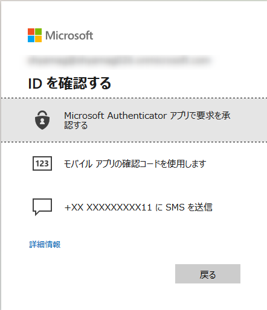

以下は SMS コードを利用した多要素認証の例ですが設定している携帯電話あてに通知されたコードを正しく入力し「検証」をクリックすることで目的のアプリケーションにサインインが可能になります。

逆に言うと、悪意のあるアクターはこの時に要求される多要素認証は突破できないので悪意のあるアクターからのサインインを退けることが可能となります。

#### サインイン リスク ポリシー有効時の動作 (アクセスのブロック)
一方「アクセス」の項目で「アクセスのブロック」を設定した場合の動作は以下のように文字通りサインインがブロックされます。

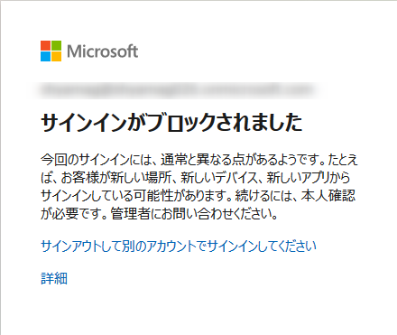

この場合、攻撃者のサインインはブロックできます。一方、利用者の IP アドレスが VPN を経由したり、しなかったりで頻繁に変更されるなどによりリスクが検出されてしまうと、正規なユーザーであってもブロックされてしまいます。

そのようなことが無いように、サインイン リスク ポリシーの「アクセス」の設定については、「アクセス許可」＋「MFA を要求する」とすることを推奨しています。

#### ユーザー リスク ポリシーの特徴
ユーザー リスク ポリシーはリアルタイムの情報に加えて、「オフライン」のリスクと呼ばれるリスク情報を利用して、ユーザー アカウント単位でリスクを判定したうえで「ユーザー リスク ポリシー」の定義の制御を行います。

例えば Azure AD テナント上のアプリケーションにサインインした後に、当該のユーザーが外部のダークウェブ上でやり取りされているアカウントであることが Identity Protection が特定した場合、オフライン リスクである「漏洩した資格情報」と判定します。この一連のオペレーションを Identity Protection が自動的に行います。

ユーザー リスク ポリシーの制御方法としてはユーザー リスクを検知した際に対象のユーザーのアクセスを「ブロック」するか「パスワードの変更」を要求させることが可能です。

ポイントとしては一度ユーザーがリスク検知の対象となるとそのユーザーのリスクを修復するまでは、サインインが攻撃者によるものなのか、通常のユーザーによるものなのか区別なく、アクセスが制御されます。

そのため、「アクセスのブロック」を制御方法とした場合はユーザー自身が手動でパスワードをリセットするか「ヘルプデスク管理者」や「特権認証管理者」が Azure ポータル上でパスワードをリセットしてリスクを修復まではサインインができなくなります。そのため、お勧めの設定としては、制御を [パスワードの変更] にします。
ただし、この制御にするためには、 ユーザー自身がパスワードを変更できるようにするためのセルフ サービス パスワード リセット (SSPR) の環境を用意しておく必要があります。その具体的な設定を紹介します。

#### ユーザー リスク ポリシー導入前に必要な設定

オンプレミスに Active Directory ドメインが存在し、オンプレミスからパスワード同期をするような構成を取られているケースが多いと思います。この場合、 SSPR 実現するために「パスワード ライトバック」の構成が必要です。

このパスワード ライトバックの構成は Azure AD Connect サーバー上で行う必要があります。
具体的には Azure AD Connect のオプション機能で「パスワードの書き戻し」を有効にする必要があります。

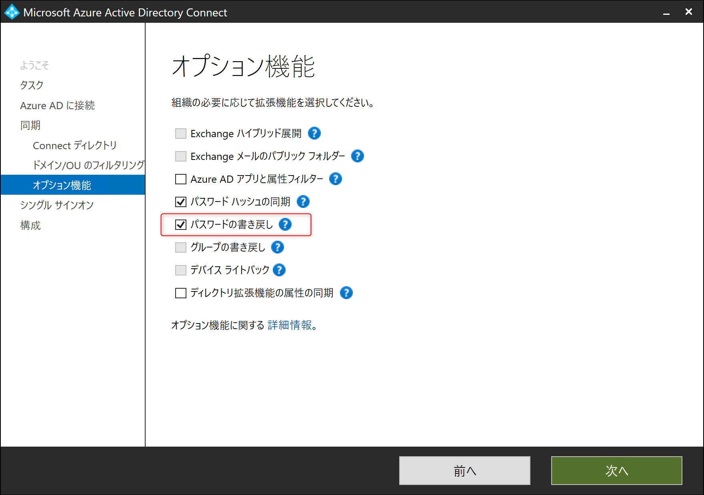

パスワード ライトバックを有効化するための詳細な手順は下記弊社公開情報が参考になりますので、こちらをご参照の上、パスワード ライトバックの構成を完了させてください。

[チュートリアル:オンプレミス環境への Azure Active Directory のセルフサービス パスワード リセットのライトバックを有効にする](https://docs.microsoft.com/ja-jp/azure/active-directory/authentication/tutorial-enable-sspr-writeback/)

#### ユーザー リスク ポリシー設定方法

Identity Protection の「ユーザー リスク ポリシー」は Azure AD の「グローバル管理者」と「セキュリティ管理者」が設定することができます。
具体的には、Azure ポータルより [Azure Active Directory] → [セキュリティ]→[Identity Protection]→[ユーザー リスク ポリシー]の順に選択いただいた後に表示される下記画面ショット上で行います。

対象のユーザーは「サインイン リスク ポリシー」と同様に「すべてのユーザー」もしくは「ユーザー個別、グループ単位」で設定することも可能で、一部のユーザーをポリシーの対象外として設定することも可能です。

次に「ユーザー リスク」についてはリスク レベルの「低・中・高」の 3 段階を設定でき、ユーザーがサインインしたときにどのリスク レベル以上のリスクを検知した際に後述する「コントロール」の制御方法を動作させるかを定義できます。
なお、Microsoft ではユーザー リスクのリスクレベルは「高以上」を設定することを推奨しています。

最後に「アクセス」の設定を行います。
ユーザー リスクを検知した際に対象のユーザーのアクセスを「ブロック」させるか何も制御せずに「アクセスを許可」させるか「アクセスを許可」させるが「パスワードの変更を必須」とさせるかの 3 パターンを選択することができます。

Microsoft では「アクセス許可」＋「パスワードの変更を必須」の設定を推奨しています。

最後に「ポリシーの適用」を「オン」にし設定を「保存」することでユーザー リスク ポリシーの設定は完了になります。

#### ユーザー リスク ポリシー有効時の動作 (パスワード リセットの強制)

「アクセス」の項目で「アクセス許可」＋「パスワードの変更を必須」を設定した際の動作は以下のような画面が表示されます。
この場合パスワードの変更を行う必要があるため「検証」をクリックします。

パスワードをリセットするために必要な多要素認証の方法を選択します。

下記画面ショットは SMS 通知を選択した場合の例ですが、設定している携帯電話番号に通知されたコードを入力し「検証」をクリックします。

パスワードの変更を促す画面に遷移しますので、新しいパスワードを設定の上、「サインイン」をクリックします。

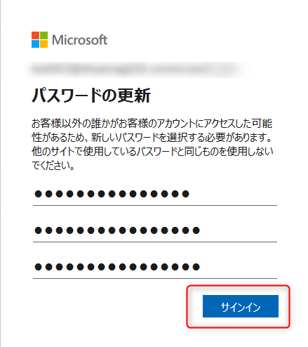

#### ユーザー リスク ポリシー有効時の動作 (アクセスのブロック)

一方「アクセス」の項目で「アクセスのブロック」を設定した場合の動作は以下のように文字通りアカウント自体がブロックされる動作になります。

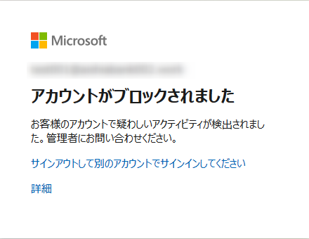

## まとめ

今回は Identity Protection が持っている 2 つのリスク ポリシー「サインイン リスク ポリシー」と「ユーザー リスク ポリシー」を有効化することのメリットと、実際にそれぞれのポリシーを有効化した際の動作をご紹介しました。

機能の紹介というよりは、実際の導入にあたっての参考になるような情報になっていればと願っています。
ID に関するリスク管理をぜひ Identity Protection に任せていただき、本来の業務に注力できるようご利用のご検討をいただけますと幸いです。
