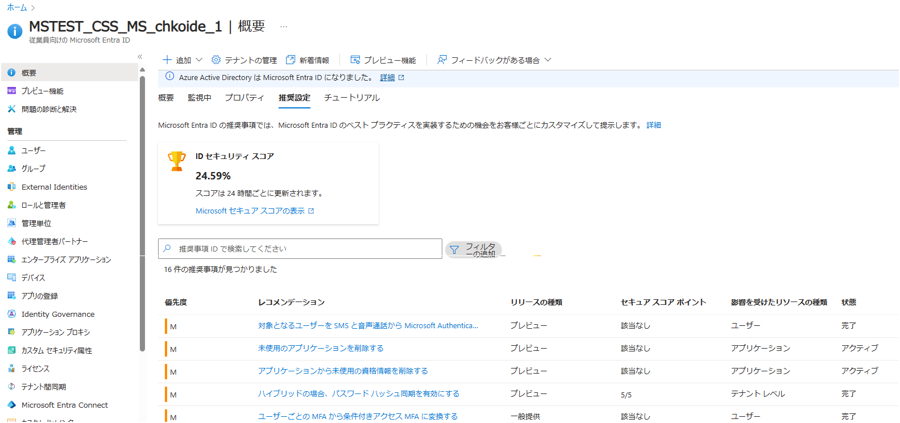

# 重要なお知らせ: Azure AD Graph API の廃止

こんにちは！ Azure ID チームの小出です。

本記事は 2024 年 4 月 1 日に米国の Microsoft Entra (Azure AD) Blog で公開された [Important update: Azure AD Graph API retirement](https://techcommunity.microsoft.com/t5/microsoft-entra-blog/important-update-azure-ad-graph-api-retirement/ba-p/4090534) をもとに、日本語に分かりやすくおまとめしなおしたものになります。ご不明点等ございましたらサポート チームまでお問い合わせください。

---

2023 年 6 月に、[Azure Active Directory (Azure AD) Graph API サービスの非推奨化に向けた 3 年間の告知期間が完了したこと](https://jpazureid.github.io/blog/azure-active-directory/important-azure-ad-graph-retirement-and-powershell-module/) をお伝えしました。このサービスは現在廃止サイクルに入っており、実際の動作停止は今後段階的に行われる予定です。今回のお知らせでは、この最初の段階の詳細と、停止される Azure AD Graph API を使用しているアプリケーションを特定するための新しい [Entra の推奨事項の機能](https://learn.microsoft.com/ja-jp/entra/identity/monitoring-health/overview-recommendations) について詳細をお知らせいたします。

お客様がこの変更に対応できるよう定期的なアップデートを提供することで、お客様をサポートしてまいりますことをお約束します。

## Azure AD Graph の廃止についてのアップデート

2024 年 6 月 30 日以降、Azure AD Graph 廃止の第一段階の展開を開始します。

具体的には、2024 年 6 月 30 日以降に作成された [Entra ID アプリケーション](https://learn.microsoft.com/ja-jp/entra/identity-platform/application-model) は、Azure AD Graph API (https://graph.windows.net) への API リクエストでエラーが発生するようになります。一部のアプリケーションでは、Microsoft Graph への移行が完了していない可能性があるかと思いますので、2024 年 6 月 30 日以降に作成されたアプリケーションが、2025 年 6 月まで Azure AD Graph API を使用できるようにするオプションの構成を提供するつもりです。

ソフトウェアのインストールやセットアップの一環として、アプリケーション作成が必要なソフトウェアを開発または配布しているシナリオがあり、なおかつこれらのアプリケーションが Azure AD Graph API にアクセスする必要がある場合、新たに作成されたアプリケーションで Azure AD Graph API からエラーが返されるようになりますので、可能な限り早めに下記対応を実施ください。具体的には、アプリケーションを Microsoft Graph に移行するか (推奨)、ソフトウェアのセットアップの一部として作成されるアプリケーションを以下に説明するように構成し、アプリの利用者が今回の変更の影響を受けないようにする必要があります。

2024 年 6 月 30 日以前に作成されたアプリケーションには、現段階では影響はありません。また、2024 年 6 月 30 日以前に作成されたアプリケーションであれば、テナントで既に同意済みのアプリケーションをふくめ影響はありません。2024 年の後半には、Azure AD Graph 廃止に伴う次の段階が始まり、既存のアプリケーションが Azure AD Graph API へのリクエストを行うことができなくなる予定ですので、そのタイミングで改めて詳細なスケジュールを提供いたします。

上記をまとめると、下記のようになります。

| 日付 | どうなるか？ | どうすればいいか？ |
| --- | --- | --- |
| 2024 年 6 月 30 日以降 | この日以降に作成された新しいアプリケーションについて、Azure AD Graph API (https://graph.windows.net) への API リクエストでエラー (HTTP 403) が発生し、応答が返されなくなる。それまでに作成された既存のアプリケーションは引き続き利用できる。 | インストールやセットアップの一環で、アプリケーションを新しく作成するようなアプリを開発している場合には、Graph API に移行するか、 引き続き 1 年間 Azure AD Graph API を利用できるようにするオプション (blockAzureADGraphAccess  = false) を設定する。 |
| 2024 年後半 (具体的な日付は未定だが、実施する最低 3 か月前には発表します) | 既存の作成済みアプリケーションについて、 Azure AD Graph API (https://graph.windows.net) への API リクエストでエラー (HTTP 403) が発生し、応答が返されなくなる。 | Graph API に移行するか、引き続き Azure AD Graph API を利用できるようにするオプション (blockAzureADGraphAccess  = false) を設定する。 |
| 未定 (最終状態) | すべてのアプリケーションについて、 Azure AD Graph API (https://graph.windows.net) への API リクエストでエラーが発生し、応答が返されなくなる。blockAzureADGraphAccess = false を設定しても使えなくなります。 | Graph API に移行する。 |

## Azure AD Graph へのアクセスを延長するよう新しいアプリケーションを構成する方法

2024 年 6 月 30 日以降に作成されたアプリケーションで、Azure AD Graph API へのアクセスを延長できるようにするには、作成後にアプリケーションの構成を変更する必要があります。この設定変更は、[AuthenticationBehaviors](https://learn.microsoft.com/ja-jp/graph/applications-authenticationbehaviors?tabs=http) インターフェースで行います。blockAzureADGraphAccess フラグを false に設定することで、新しく作成されたアプリケーションは、さらに廃止サイクルが進むまで Azure AD Graph API を使用し続けることができます。

この第一段階では、**2024 年 6 月 30 日以降に作成されたアプリケーションのみ** が影響を受けます。2024 年 6 月 30 日より前から存在する既存のアプリケーションは、authenticationBehaviors プロパティが設定されていなくても、Azure AD Graph API を引き続き使用できます。この変更がロールアウトされた後 (2024 年 6 月 30 日以降)、 blockAzureADGraphAccess を **true** に設定することで、既存のアプリケーションの挙動をテストしたり、Azure AD Graph API を使用しないようにしたりすることもできます。

### Microsoft Graph REST API の例

**個別のアプリケーションの authenticationBehaviors プロパティを読み取る:**

```http
GET https://graph.microsoft.com/beta/applications/afe88638-df6f-4d2a-905e-40f2a2d451bf/authenticationBehaviors   
```

**新しいアプリケーションで Azure AD Graph へのアクセスを延長して許可するため authenticationBehaviors プロパティを設定する:**

```http
PATCH https://graph.microsoft.com/beta/applications/afe88638-df6f-4d2a-905e-40f2a2d451bf/authenticationBehaviors   
Content-Type: application/json  

{  
    "blockAzureADGraphAccess": false  
}  
```

### Microsoft Graph PowerShell の例

***個別のアプリケーションの authenticationBehaviors プロパティを読み込む:***

```powershell
Import-Module Microsoft.Graph.Beta.Applications  
Connect-MgGraph -Scopes "Application.Read.All"  

Get-MgBetaApplication -ApplicationId afe88638-df6f-4d2a-905e-40f2a2d451bf -Property "id,displayName,appId,authenticationBehaviors" 
```

**authenticationBehaviorsプロパティを設定して、新しいアプリケーションに対して拡張Azure AD Graphアクセスを許可する:**

```powershell
Import-Module Microsoft.Graph.Beta.Applications  
Connect-MgGraph -Scopes "Application.ReadWrite.All"  

params = @{ 
  authenticationBehaviors = @{ 
    blockAzureADGraphAccess = $false  
  } 
}  
Update-MgBetaApplication -ApplicationId $applicationId -BodyParameter $params 
```

## よくある質問

Q. Azure AD Graph API を使用しているアプリケーションがテナント内にあるか検索するにはどうすればよいですか？

A. Microsoft Entra の概要ページにある「推奨設定」タブを活用ください。「推奨設定」機能は、テナントが安全で健全な状態にあることを確認し、Microsoft Entra ID で利用可能な機能を最大限活用するのに役立つ推奨事項を提供します。

最近、テナントで Azure AD Graph API を使用しているアプリケーションとサービス プリンシパルに関する情報を提供する 2 つの Entra 推奨事項の展開を開始しました。これらの新しい推奨事項は、影響を受けるアプリケーションとサービスプリンシパルを特定し、お客様が速やかに Microsoft Graph に移行できるようサポートします。



---

Q. 2024 年 6 月 30 日以降、Azure AD Graphを使用するアプリケーションはどうなりますか？

A. 2024 年 6 月 30 日までに登録された既存のアプリケーションは、この時点では影響を受けません。2024 年 6 月 30 日以降に作成されたアプリケーションが影響を受けないようにするには、アプリケーションの authenticationBehaviors プロパティで blockAzureADGraphAccess 属性を false に設定ください。このように設定されていない場合、Azure AD Graph API へのリクエスト時にエラー（HTTP 403）が発生します。

---

Q. 今後の廃止サイクルではどうなりますか？

A. 今回の更新では、2024 年 6 月 30 日以降に始まる Azure AD Graph 廃止の第一段階について説明しました。今後数ヶ月の間に、Azure AD Graph の第二段階目の廃止に向けたタイムラインをお知らせする予定です。第二段階では、既存のアプリケーションを含むすべてのアプリケーションに対し、AuthenticationBehaviors プロパティ (blockAzureADGraphAccess: false) が構成されていない限り、Azure AD Graph API の使用をブロックするよう計画しています。  

この次の段階のリタイアの前に、最低 3 ヶ月の事前通知が提供されます。今後も本記事にて順次アップデート情報をご案内します。

---

Q. Azure AD Graph の現在のサポート体制について教えてください。

A. Azure AD Graph API は廃止サイクルに入っておりますため、セキュリティ関連の修正以外の SLA やメンテナンスのコミットメントはありません。

---

Q. Microsoft Graph について教えてください。

A. Microsoft Entra サービスや Microsoft Teams、Microsoft Intune などの Microsoft 365 サービスにアクセスするためのエンドポイントを提供します。Microsoft Graph は、Azure AD Graphで利用可能だったすべての機能と、ID 保護や認証方法などの新しい API を備えています。Microsoft Graph は、Azure AD Graph で利用できなかった新しい機能が搭載されているほか、従来の Azure AD Graph よりも安全ですので、ぜひ移行を実施ください。

---

Q. Azure AD と Microsoft Online PowerShell モジュールについてはどうなりますか？ 

A. 2024 年 3 月 30 日をもって、AzureAD、AzureADPreview、Microsoft Online (MSOL) の PowerShell モジュールは非推奨となり、セキュリティ修正のサポートのみとなります。Microsoft Graph PowerShell への移行が必要です。詳しくは [MSOnline / AzureAD PowerShell から Graph PowerShell SDK への移行について 1_概要](https://jpazureid.github.io/blog/azure-active-directory/azuread-module-retirement1/) をご覧ください。  

以下の資料についてもご活用いただければ幸いです。

- [Azure AD Graph から Microsoft Graph にアプリを移行する](https://learn.microsoft.com/ja-jp/graph/migrate-azure-ad-graph-overview)
- [Azure AD Graph アプリ移行計画のチェックリスト](https://learn.microsoft.com/ja-jp/graph/migrate-azure-ad-graph-planning-checklist)
- [Azure AD Graph から Microsoft Graph への移行に関する FAQ](https://learn.microsoft.com/ja-jp/graph/migrate-azure-ad-graph-faq)
