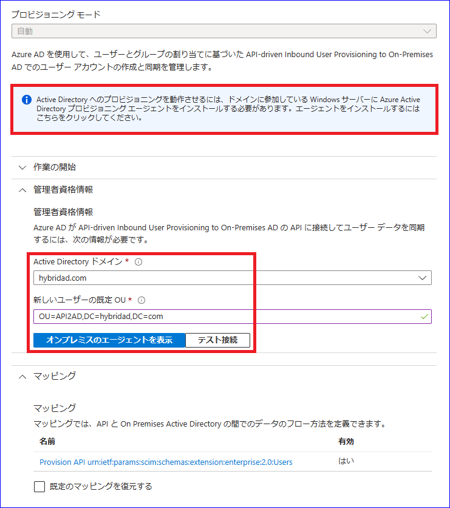
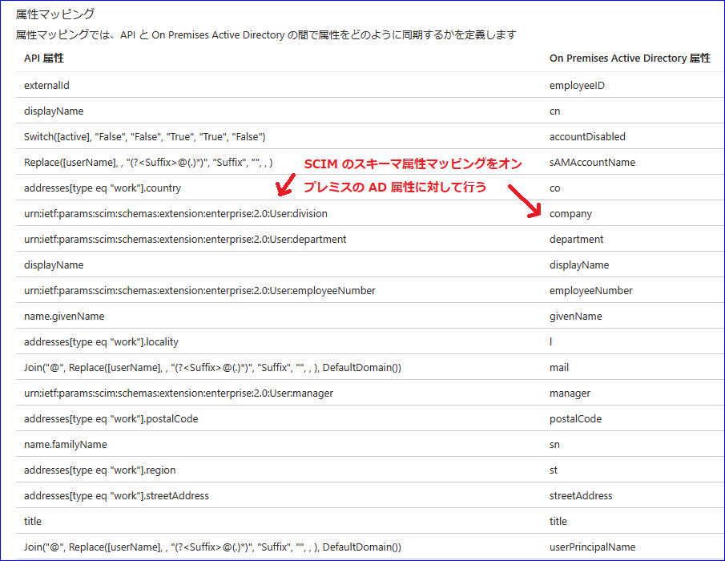
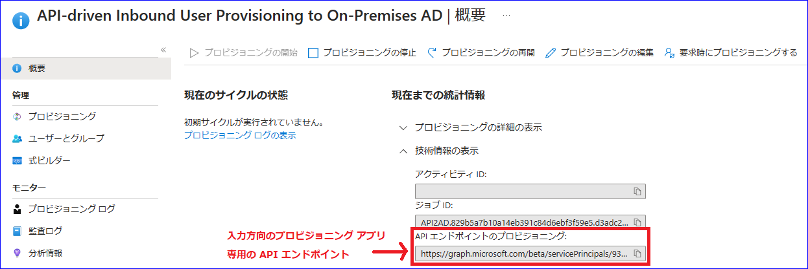

# あらゆるデータソースから Microsoft Entra ID に ID を同期する新しい方法のご紹介

こんにちは、Azure Identity サポート チームの 高田 です。

本記事は、2023 年 8 月 23 日に米国の Azure Active Directory Identity Blog で公開された [Introducing a New Flexible Way of Bringing Identities from Any Source into Microsoft Entra ID!](https://techcommunity.microsoft.com/t5/microsoft-entra-azure-ad-blog/introducing-a-new-flexible-way-of-bringing-identities-from-any/ba-p/2466927) を意訳したものになります。ご不明点等ございましたらサポート チームまでお問い合わせください。

---

皆さんこんにちは。

**Microsoft Entra の API によるプロビジョニング** が **パブリック プレビュー** になったことをお知らせいたします！

本日の発表により、人事データベースを起点としたプロビジョニングのサポートが拡大され、以下のような最も要望の多かったご要望に対応いたします: 

- クラウド専用ユーザーやハイブリッド ユーザー (オンプレミスの Active Directory アカウントが必要なユーザー) を、信頼できるソースから自動的にプロビジョニングする。
- お客様が希望する自動化ツールを使用して、CSV ファイルや SQL の一時テーブルなどからデータをインポートする。
- 標準の SCIM のスキーマ属性を使用してシステム間のスキーマの違いを抽象化し、一貫したマッピング体験を提供することで統合をよりシンプルにする。
- [ライフサイクル ワークフロー](https://jpazureid.github.io/blog/azure-active-directory/lifecycle-workflows-ga/) を活用し、あらゆるシステムから同期されてくるユーザーの入社、異動、退社ワークフローを自動化する。

ある一般的なお客様シナリオでは、企業が従業員の管理にクラウド人材管理 (HCM) プラットフォームを使用しており、ベンダーや請負業者のデータ管理については、毎晩別途 CSV を生成しているというものがあります。これらのデータ ソースのどちらでも、ご要望の自動化ツールを使用して Microsoft Entra の API ベースのプロビジョニングに情報を送信し、ユーザーを同期できます。プロビジョニングを行う各サービスが、それぞれのユーザーに対して自動的に適切な処理を行うことで、Microsoft [Entra ID Governance ライフサイクル ワークフロー](https://jpazureid.github.io/blog/azure-active-directory/lifecycle-workflows-ga/) を組み合わせ、IAM 管理者が指定した入社、異動、退社プロセスを自動化することも可能です。

## わずか 3 ステップであらゆるデータソースから ID を同期

### ステップ 1 - API ベースのプロビジョニング アプリの構成

Microsoft Entra ポータルに、アプリケーション管理者もしくはハイブリッド ID の管理者ロールを持つユーザとしてサインインします。エンタープライズ アプリのギャラリーに 2 つの新しいプロビジョニング アプリケーションが表示されるはずです:

- API-driven Inbound User Provisioning to Azure AD: 信頼できるデータ ソースからクラウド専用のユーザー アカウントをプロビジョニングする場合に [このアプリを構成](https://learn.microsoft.com/ja-jp/azure/active-directory/app-provisioning/inbound-provisioning-api-configure-app) します。
- API-driven Inbound User Provisioning to On-Premises AD: まずオンプレミスの Active Directory にユーザー アカウントをプロビジョニングしてから、Microsoft Entra Cloud Sync / Connect Sync を使用して Microsoft Entra ID に同期したい場合は、[このアプリを構成](https://learn.microsoft.com/ja-jp/azure/active-directory/app-provisioning/inbound-provisioning-api-configure-app) します。

プロビジョニングの対象がオンプレミスの Active Directory ドメインの場合は、[Microsoft Entra プロビジョニング エージェント](https://learn.microsoft.com/ja-jp/azure/active-directory/hybrid/cloud-sync/how-to-install) をダウンロードして設定ください。設定後に、プロビジョニング アプリで Active Directory ドメインを選択できます。

既定では、プロビジョニング アプリは、標準の [SCIM Core User スキーマ](https://www.rfc-editor.org/rfc/rfc7643.html#section-4.1) と [SCIM Enterprise User スキーマ拡張](https://www.rfc-editor.org/rfc/rfc7643.html#section-4.3) を、対応する Microsoft Entra ID / オンプレミス Active Directory ユーザー属性にマッピングします。

Microsoft Entra のプロビジョニング サービスにより、プロビジョニング アプリ用に固有の API エンドポイントが作成されます。この API エンドポイントの値を "概要" ブレードからコピーいただけます。[プロビジョニングの開始] を選択すると、この API エンドポイントでインバウンド プロビジョニングの要求を受け付けるようになります。

インバウンド プロビジョニング API のエンドポイントは以下の形式となります:

https://graph.microsoft.com/beta/servicePrincipals/{servicePrincipalId}/synchronization/jobs/{jobId}...

ここで {servicePrincipalId} はプロビジョニング アプリのオブジェクト ID を表し、{jobId} はプロビジョニングのジョブ ID を表します。

### ステップ 2 - アプリまたはサービスに ID データのアップロード権限を付与

このステップでは、インバウンド プロビジョニング API を呼び出すアプリまたはサービスを Microsoft Entra ID に登録し、必要なアクセス許可を付与します。次のいずれかの方法が利用可能です:

- [サービス プリンシパルを構成する](https://learn.microsoft.com/ja-jp/azure/active-directory/app-provisioning/inbound-provisioning-api-grant-access#configure-a-service-principal)
- [マネージド ID を構成する](https://learn.microsoft.com/ja-jp/azure/active-directory/app-provisioning/inbound-provisioning-api-grant-access#configure-a-managed-identity)

管理者の同意機能を用いて、以下の Graph API のアクセス許可を付与します:

- SynchronizationData-User.Upload  
- AuditLog.Read.All

### ステップ 3 - お好みの自動化ツールを使用して ID データをアップロード

これで、プロビジョニング (/bulkUpload) API エンドポイントに ID データを安全にアップロードする準備が整いました。API ベースのプロビジョニングの優れた点は、ユーザー データが存在するシステム側において、ID の作成もしくは更新のどちらが必要かを判断するカスタム ロジックの実装が必要ないことです。同期元のシステムからデータをアップロードするだけで、IAM 管理者によって設定されたマッピングルールに基づいて Microsoft Entra のプロビジョニング サービスが各ユーザー レコードに対する適切な操作を自動的に決定および実行します。

## その他の統合シナリオ

上記のステップでは、クラウド上の Microsoft Entra ID とオンプレミスの Active Directory にプロビジョニングする方法を紹介しました。これらの手順を適用して、さらにいくつかエンタープライズの人事統合シナリオを実現することができます。

### シナリオ 1: IT チームがあらゆるソースから人事データの抽出結果をインポート

エンタープライズの統合シナリオでは、単純なテキスト ファイル、CSV ファイル、SQL の一時テーブルが一般的に使用されます。従業員、請負業者、およびベンダー情報は、定期的にこれらのフォーマットのいずれかにエクスポートされ、自動化ツールを使用して Microsoft Entra ID と同期されます。API ベースのプロビジョニングにより、IT チームは任意の自動化ツール (例: PowerShell スクリプトまたは Azure Logic Apps) を使用して、このようなデータ統合をよりシンプルに実現できます。

### シナリオ 2: 人事情報を扱うソフトウェア ベンダーが Microsoft Entra ID と直接インバウンド同期を構築

API ベースのプロビジョニングにより、人事情報を扱うソフトウェア ベンダーはネイティブな同期処理を提供し、人事データベースの変更を自動的に Microsoft Entra ID およびオンプレミスの Active Directory ドメインに取り込むようにすることが可能となります。例えば、人事アプリや学生情報システムのアプリでは、トランザクションが完了するとすぐに、または一日の終わりに一括更新として Microsoft Entra ID にデータを送信するということもできます。

### シナリオ 3: システム インテグレータが同期元システム用により多くのコネクターを構築

システム インテグレータは、同期元システムから Microsoft Entra ID への ID データの流れに関するさまざまな統合要件を満たすため、カスタムの人事データ連携コネクターを構築することができます。

## お客様やパートナーの声

プレビューでは、お客様やパートナー様から素晴らしいフィードバックをいただいております。

**Microsoft Entra の API ベースのプロビジョニングにより、クラウドとオンプレミスで直接 ID をプロビジョニングし、人事アプリケーションと統合することで、クラウド ファーストのビジョンを達成することができる見込みです。レガシーなインフラを取り除き、多くのバラバラな状態のワークフローを自動化し、さらにオンプレミス Active Directory インフラへの依存を減らすこともできます。これにより、セキュリティ、効率性、ユーザー体験を向上出来ると考えています。**  
Avanade 社 シニア ディレクター Sachin Desai 氏

**API ベースのプロビジョニングにより、人事部が Active Directory と Microsoft Entra ID の ID ライフサイクルとデータをよりよく管理できるようになりました。Lifecycle Workflows の機能と組み合わせることで、入社と離職の処理が簡単かつシームレスになり、手作業がなくなることで、常に最新の ID 状態を保つことができるようになります！**  
InSpark 社 プリンシパル コンサルタント および Microsoft Most Valuable Professional (MVP) Pim Jacobs 氏

**Microsoft Entra の API ベースのインバウンド プロビジョニングは、既存の技術により制約を受けている顧客にとって非常に有用な機能であり、あらゆる顧客が入社、異動、離職の処理を自動化出来る、そのきっかけとなるものです。**  
Kocho 社 シニア アーキテクト兼チーム リーダー Martyn Gill 氏

**API ベースのプロビジョニングにより、弊社のお客様は SmartHR の従業員情報と Microsoft Entra ID を紐づけできるようになります。これにより、従業員の入社、異動、離職に伴うアカウント管理に必要な時間と労力が削減されます。SmartHR は、この統合の構築においてマイクロソフトと提携できることをうれしく思います！**  
SmartHR 社 プロダクト エンジニア Takumi Kanzaki 氏

**Rippling は、給与、経費、および福利厚生を 1 つの統合プラットフォームで自動化することで、人事、IT、および財務を一括して管理できるようお客様を支援しています。Microsoft Entra の API ベースのプロビジョニングにより、この自動化をさらに広げ、クラウドかオンプレミスかに関係なく、より多くの業務アプリへスムーズにアクセス出来るようになります。マイクロソフトと提携することで、顧客にこのシームレスな体験を提供できることを楽しみにしています！**  
Rippling 社 プロダクト リード Sam Gnesin 氏

## 是非お試しください

この新しい機能により、クラウドまたはオンプレミスのどちらでホストされているかに関係なく、より柔軟にデータ ソースと ID データを同期することが可能となりました。HR/IT チームと連携し、[Azure Logic Apps](https://learn.microsoft.com/ja-jp/azure/logic-apps/logic-apps-overview)、[Power Automate](https://learn.microsoft.com/ja-jp/power-automate/getting-started)、[Azure Functions](https://learn.microsoft.com/ja-jp/azure/azure-functions/functions-overview?pivots=programming-language-csharp)、[Azure Data Factory](https://learn.microsoft.com/ja-jp/azure/data-factory/introduction) などの自動化ツールを用いて、人事データを取得、変換、マージして、新しいプロビジョニング API エンドポイントにデータをアップロード出来るようになります。

お好みの API テスト ツールを用いて API ベースのプロビジョニングを構成し、評価できますので、その際は以下のチュートリアルのいずれかを参照ください:

- [cURLを使ったクイック スタート](https://learn.microsoft.com/ja-jp/azure/active-directory/app-provisioning/inbound-provisioning-api-curl-tutorial)
- [Postman を使用したクイック スタート ](https://learn.microsoft.com/ja-jp/azure/active-directory/app-provisioning/inbound-provisioning-api-postman)
- [Microsoft Graph Explorer を使用したクイック スタート](https://learn.microsoft.com/ja-jp/azure/active-directory/app-provisioning/inbound-provisioning-api-graph-explorer)

その他の自動化ツールで評価を始めるには、以下のサンプルのいずれかを参照ください:

- [PowerShell による API ベースのプロビジョニングの実装](https://learn.microsoft.com/ja-jp/azure/active-directory/app-provisioning/inbound-provisioning-api-powershell)
- [Azure Logic Apps による API ベースのプロビジョニングの実装](https://learn.microsoft.com/ja-jp/azure/active-directory/app-provisioning/inbound-provisioning-api-logic-apps)

[API ベースのプロビジョニング](https://learn.microsoft.com/ja-jp/azure/active-directory/app-provisioning/inbound-provisioning-api-concepts) 機能はプレビューであり、Microsoft Entra ID P1 (旧 Azure AD Premium P1) 以上のライセンスがあれば利用を開始できます。ライセンス条件は一般提供 (GA) 開始時に公開されます。

ご質問がある場合は、[よくある質問](https://learn.microsoft.com/ja-jp/azure/active-directory/app-provisioning/inbound-provisioning-api-faqs) をご覧ください。

また、皆様からのフィードバックもお待ちしております！[Azure フォーラム](https://aka.ms/AzureADFeedback)、または Twitter で [@AzureAD](https://twitter.com/azuread) をタグ付けして、フィードバックを共有ください。  

Joseph Dadzie - Partner Director of Product Management  
LinkedIn: [@joedadzie](https://www.linkedin.com/in/joedadzie/)  
Twitter: [@joe_dadzie](https://www.linkedin.com/in/joedadzie/)

