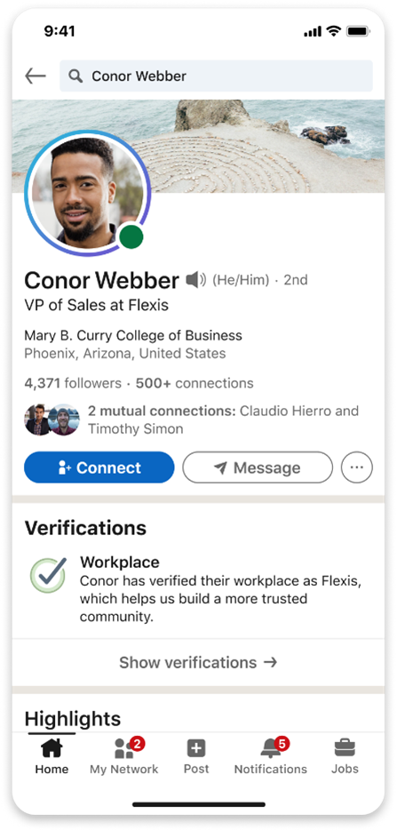

# Microsoft Entra Verified ID で LinkedIn 上での職場を証明する新しい方法の紹介

こんにちは、Azure Identity サポート チームの 張替 です。

本記事は、2023 年 4 月 12 日に米国の Azure Active Directory Identity Blog で公開された [Introducing a new way to verify your workplace on LinkedIn with Microsoft Entra Verified ID - Microsoft Community Hub](https://techcommunity.microsoft.com/t5/microsoft-entra-azure-ad-blog/introducing-a-new-way-to-verify-your-workplace-on-linkedin-with/ba-p/3627349) を意訳したものになります。ご不明点等ございましたらサポート チームまでお問い合わせください。

---

本日、LinkedIn をお使いの何百万もの方々が、Microsoft Entra Verified ID の資格情報を使用して、職場の認証ができるようになることをお知らせします。職場の認証は、LinkedIn メンバーのプロフィールに表示され、一覧にある勤務先が正確であることを確認するとともに、他のメンバーや組織に対して信頼と信憑性の印として機能します。

## 職場の認証を行うための従業員 ID の発行方法

組織は、わずか数分で Verified ID を使用して、ブランドやビジネス ニーズに合わせたデジタル従業員 ID を作成することが可能です。LinkedIn メンバーは、プロフィール上の「職場を認証する」ボタンをクリックし、携帯電話で数回タップするだけで、組織が発行するデジタル従業員 ID を受け取ることができます。従業員 ID の認証情報が LinkedIn と共有されると、職場の認証がプロフィールに表示されます。

職場の認証の詳細と実装方法については、マイクロソフトの ID およびネットワーク アクセス担当のプレジデントである Joy Chik による [このブログ記事](https://www.microsoft.com/en-us/security/blog/2023/04/12/linkedin-and-microsoft-entra-introduce-a-new-way-to-verify-your-workplace/) をぜひお読みください。

## LinkedIn で従業員 ID を発行して勤務先を確認するための準備を整える

組織のグローバル管理者の方で、LinkedIn での職場認証の準備をされたい方は、[こちらのフォーム](https://forms.office.com/Pages/ResponsePage.aspx?id=v4j5cvGGr0GRqy180BHbR5RXCPyJ0yZAs6VJmUULNKZUQlJVOEFIVEpPS1Y1M1hMSUZMN0c1WEpPTS4u) からパイロット プログラムにご登録をお願いします。

## 今すぐ検証済み ID を発行しましょう

Verified ID の資格情報は、多くのシナリオで信頼性や信憑性、検証可能性を高め、コスト、時間および連携のストレスを削減することが可能です。すぐに Verified IDを使用して従業員 ID を発行可能です。わずか数分で完了します。始めるには、以下の [チュートリアル](https://learn.microsoft.com/en-us/azure/active-directory/verifiable-credentials/) をご覧ください。
