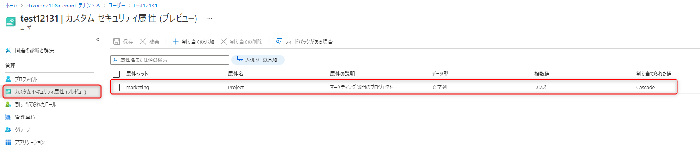
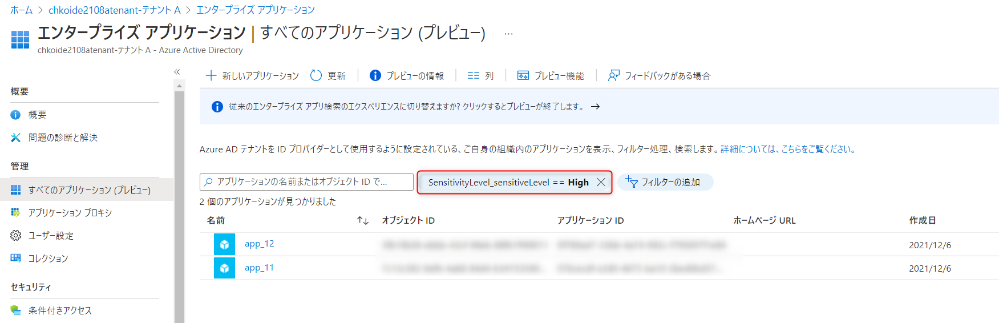
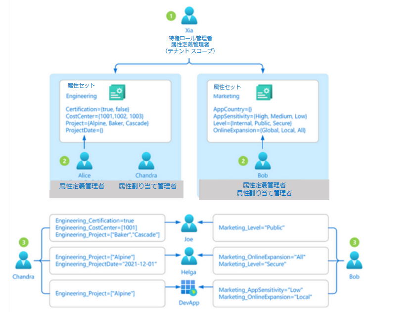

# Azure AD カスタム セキュリティ属性の紹介

こんにちは、 Azure ID チームの小出です。

本記事は、2021 年 12 月 1 日に米国の Azure Active Directory Identity Blog で公開された [Introducing Azure AD custom security attributes](https://techcommunity.microsoft.com/t5/azure-active-directory-identity/introducing-azure-ad-custom-security-attributes/ba-p/2147068) を意訳したものになります。ご不明点などございましたら、サポート チームまでお問い合わせください。
 
---

今回の Microsoft Azure Active Directory (Azure AD) のカスタム セキュリティ属性と、ABAC (Attribute Based Access Control / 属性ベースのアクセス制御) 条件におけるユーザー属性のパブリック プレビューは、前回の Azure Storage における ABAC 条件の [パブリック プレビュー](https://techcommunity.microsoft.com/t5/azure-active-directory-identity/introducing-attribute-based-access-control-abac-in-azure/ba-p/2147069) を踏まえたものです。Azure AD のカスタム セキュリティ属性 (以下、カスタム属性) は、Azure AD で定義できるキーと値のペアで、ユーザーやサービス プリンシパル (エンタープライズ アプリケーション)、マネージド ID などの Azure AD オブジェクトに割り当てることができます。カスタム属性を使用すると、ユーザーのコスト センターやエンタープライズ アプリケーションを所有するビジネス ユニットなどのビジネス固有の情報を追加し、特定のユーザーがそれらの属性を管理できるようになります。ユーザー属性は、Azure ロール割り当ての ABAC 条件で使用することができ、リソース属性だけの場合よりも、さらにきめ細かいアクセス制御が可能になります。Azure AD のカスタム セキュリティ属性の利用には、Azure AD Premium ライセンスが必要です。
 
カスタム属性機能は、Azure AD での属性の管理や Azure ロール割り当てでの ABAC 条件について寄せられたフィードバックにもとづいて開発されました。

- いくつかのシナリオでは、ユーザーに関する機密情報を Azure AD に保存し、許可されたユーザーのみがこの情報を読み取ったり管理したりできるようにする必要があります。たとえば、各従業員の職位を保存し、人事部の特定のユーザーのみがその属性を読み取り、管理できるようにします。
- ビジネス ユニットや秘密度のレベルなどの属性を持つエンタープライズ アプリケーションを分類してレポートする必要があります。たとえば、アプリケーションを所有するビジネス ユニットごとに、各エンタープライズ アプリケーションを追跡します。
- Azure ストレージ リソースに関して、API アクセス キーや SAS トークンから、一元化された一貫性のあるアクセス制御 (Azure RBAC + ABAC) に移行することで、セキュリティ態勢を改善する必要があります。API アクセス キーや SAS トークンは、ID に紐づけられていないないため、アクセス キーやトークンを持っている人は誰でもリソースにアクセスすることができます。 スケーラブルにセキュリティ対策を強化するためには、数百万の Azure Storage Blob へのアクセスを少ないロール割り当てで管理できるよう、リソース属性とともにユーザー属性が必要です。

ここでは、どのように属性を管理し、Azure ADオブジェクトをフィルタリングすればよいか、Azure でアクセス制御を拡張する方法を簡単に見てみましょう。
 
## ステップ 1: Azure AD での属性の定義

最初のステップは、関連する属性の集まりである "属性セット" を作成することです。たとえば、マーケティング部門に関連する属性を参照したい場合は、「marketing」という名前の属性セットを作成することができます。次に、属性セット内の属性と、属性セットの特徴を定義します。たとえば、属性にはあらかじめ定義された値しか使用できないことや、属性に割り当てられる値は 1 つか、もしくは複数かなどを指定します。この例では、プロジェクト属性に3つの値 (Cascade、Baker、Skagit) があり、ユーザーには 3 つの値のうち 1 つしか割り当てられません。下の図は、上記の例を示しています。

## ステップ 2: ユーザーまたはエンタープライズ アプリケーションへの属性の割り当て

属性が定義されると、ユーザー、エンタープライズ アプリケーション、およびマネージド ID に割り当てることができます。

属性を割り当てると、属性を使ってユーザーやアプリケーションをフィルタリングできます。たとえば、秘密度レベルが「高」のすべてのエンタープライズ アプリケーションを確認することができます。

## ステップ 3: 属性管理の委任

属性を管理するために利用できる Azure AD の組み込みロールは 4 つあります。

| アクセス許可                                                      | グローバル管理者 | 属性定義管理者 | 属性割り当て管理者 | 属性定義閲覧者 | 属性割り当て閲覧者 | 
| ----------------------------------------------------------------- | ---------------- | -------------- | ------------------ | -------------- | ------------------ | 
| 属性セットを読み取る                                              |                  | 〇             | 〇                 | 〇             | 〇                 | 
| 属性の定義を読み取る                                              |                  | 〇             | 〇                 | 〇             |                    | 
| ユーザーやアプリ (サービス プリンシパル) の属性割り当てを読み取る |                  |                | 〇                 |                | 〇                 | 
| 属性セットを追加もしくは編集する                                        |                  | 〇             |                    |                |                    | 
| 属性の定義を追加、編集もしくは非アクティブ化する                        |                  | 〇             |                    |                |                    | 
| ユーザーやアプリ (サービス プリンシパル) へ属性を割り当てる       |                  |                | 〇                 |                |                    | 

既定ではグローバル管理者とグローバル閲覧者は、属性を作成、読み取り、または更新することができません。グローバル管理者または特権ロール管理者は、属性を管理するために、属性管理ロールを他のユーザーまたは自身に割り当てる必要があります。これら 4 つのロールは、テナントまたは属性セットのスコープで割り当てることができます。テナント スコープで役割を割り当てると、すべての属性セットの管理を委任することができます。属性セットのスコープで役割を割り当てると、特定の属性セットの管理を委任することができます。例を挙げて説明します。

1. Xia は特権ロール管理者です。そのため、Xia はテナント レベルで属性定義管理者ロールを自身に割り当てます。これにより、彼女は属性セットを作成することができます。
2. エンジニアリング部門では、Alice が属性の定義を担当し、Chandra が属性の割り当てを担当しています。Xia はエンジニアリング属性セットを作成し、Alice には属性定義管理者ロールを、Chandra にはエンジニアリング属性セット スコープの属性割り当て管理者ロールを割り当て、Alice と Chandra が必要最小限の権限を持つようにします。
3. マーケティング部門では、Bob が属性の定義と割り当てを担当しています。Xia は、マーケティング属性セットを作成し、属性定義管理者と属性割り当て管理者のロールを Bob に割り当てます。
 
## ステップ 4: 少ない Azure ロール割り当てできめ細かなアクセス制御を実現する

前回のブログ記事 [Azure ロール割り当てでの ABAC 条件](https://techcommunity.microsoft.com/t5/azure-active-directory-identity/introducing-attribute-based-access-control-abac-in-azure/ba-p/2147069) で紹介した架空の例をもとに考えてみましょう。 Bob は、照明や家電など何千ものカテゴリの商品を販売するホームセンター チェーンである Contoso 株式会社営業チームの Azure サブスクリプション所有者です。これらのカテゴリの日次売上レポートは、その日 (たとえば 2021-03-24) の Azure ストレージ コンテナに保存されており、中央の財務チームのメンバーは、より簡単にレポートにアクセスできます。Charlie は照明カテゴリのセールス マネージャーで、照明カテゴリの売上レポートをどのストレージコンテナでも読めるようにする必要がありますが、他のカテゴリーのレポートを読むことはできません。
 
リソース属性（例えば、blob インデックス タグ）だけでは、Bob は Charlie のロール割り当てを 1 つ作成し、blob インデックス タグが「category = lighting」となっている blob への読み取りアクセスを制限する条件を追加する必要があります。Bob は Charlie のようなユーザーの数だけ、多くのロール割り当てを作成する必要があります。リソース属性と併用してユーザー属性を使用すると、Bob は Azure AD グループ内のすべてのユーザーを対象とした 1 つのロール割り当てを作成し、"ユーザーの category 属性値が blob の category タグ値と一致する" ように要求する ABAC 条件を追加することができます。Azure AD 管理者の Xia は、「contosocentralfinance」という属性セットを作成し、Bob に属性セットの Azure AD 属性定義管理者と属性割り当て管理者のロールを割り当て、Bob が自分の仕事をするのに最低限必要な権限を与えます。以下の図は、このシナリオを示しています。

Bob は、ユーザー属性とリソース属性を使って、ABAC 条件ビルダーで次のような条件を書きます。

まとめると、ユーザー属性、リソース属性、ABAC 条件を使えば、わずか 1 つのロール割り当てで、何百万もの Azure ストレージ Blob へのアクセスを管理することができるのです。  

## 監査とツール

属性には機密情報が含まれ、アクセスを許可または拒否することができるため、属性の定義、割り当て、および割り当て解除に関するアクティビティは Azure AD 監査ログに記録されます。属性に関連するタスクの管理と自動化には、ポータルに加えて、PowerShell や Microsoft Graph API を使用できます。Azure CLI、PowerShell、または Azure Resource Manager テンプレートと Azure REST API を使用して、Azure ロール割り当ての ABAC 条件を管理することもできます。
 
## リソース

始めやすいように、条件のサンプルを含むいくつかの [例](https://docs.microsoft.com/ja-jp/azure/storage/common/storage-auth-abac-examples?toc=/azure/role-based-access-control/toc.json) を用意しています。Contoso 株式会社の [例](https://docs.microsoft.com/ja-jp/azure/role-based-access-control/conditions-custom-security-attributes-example) では、ABAC 条件を使用して Azure ストレージ Blob に関するシナリオのアクセス制御をどのように拡張できるかを案内しています。また、Azure AD のドキュメント、[How-to](https://docs.microsoft.com/ja-jp/azure/active-directory/fundamentals/custom-security-attributes-manage)、[トラブルシューティング](https://docs.microsoft.com/ja-jp/azure/active-directory/fundamentals/custom-security-attributes-troubleshoot) のガイドも利用できます。

Azure AD の [カスタム セキュリティ属性](https://docs.microsoft.com/ja-jp/azure/active-directory/fundamentals/custom-security-attributes-overview) と [Azure ストレージの ABAC 条件](https://docs.microsoft.com/ja-jp/azure/role-based-access-control/conditions-overview) について、皆様のご意見をお待ちしています。今後、Azure AD の条件付きアクセスでカスタム セキュリティ属性を使用する方法についても紹介するのでぜひ楽しみにしておいてください。皆様からのご意見、[今後のシナリオ](https://forms.office.com/pages/responsepage.aspx?id=v4j5cvGGr0GRqy180BHbR-lT4fPHJUBHjqPLpZfcitlUQkVNUTg1UjFaUldJQlMyOUVVNDBGTlBRTi4u) のアイデアをお待ちしています。
