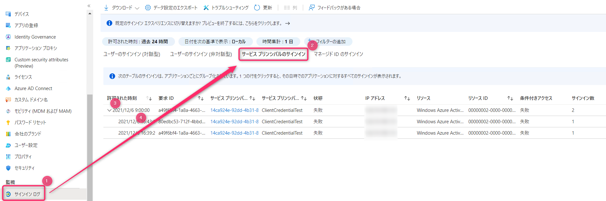
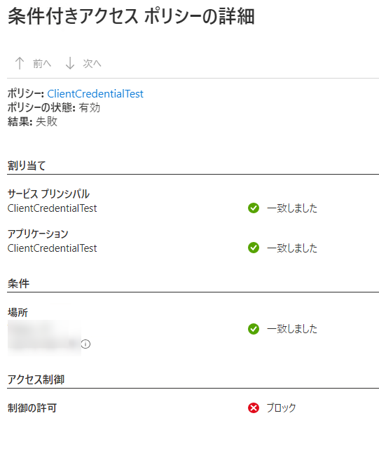

# 条件付きアクセスにワークロード ID を対象とする機能がプレビューとして追加されました

本記事は [Azure Tech Advent Calendar 2021](https://qiita.com/advent-calendar/2021/microsoft-azure-tech) 7 日目の記事です。
Japan Azure Identity Support Blog では、お問合せの多い事象へのトラブルシューティング方法や、英文で公開された記事の日本語訳の情報を発信しています。今回の記事では、以下のプレビュー機能の紹介となります。

ワークロード ID 用の条件付きアクセス (プレビュー)
https://docs.microsoft.com/ja-jp/azure/active-directory/conditional-access/workload-identity

従来、条件付きアクセスは "ユーザー" の "リソース" へのサインインを制御する機能でした。今回のプレビューによって、"ワークロード ID (アプリケーション)" のサインインに対して IP アドレス ベースの制御を構成することが可能になりました。様々な機能が追加されてきている条件付きアクセスにおいて、遂に！アプリケーションの ID を使用したサインインに対しても制御することができるようになったのかと感慨深い気持ちになったため紹介します。

主に公開情報の内容をなぞって、補足するような内容になります。最新の情報は、公開情報のページを確認ください。

Advent Calendar からこの記事にたどり着いた方は、普段 Azure をご利用いただいてるユーザーの方々かと思いますが、この機能を設定することはできないかもしれません。
条件付きアクセスはサブスクリプションの所有者ではなく、Azure AD (テナント) のグローバル管理者など、組織内における権限を持ったユーザーが設定を行う機能です。組織の管理者ではなく、普段 Azure を利用されているユーザーにおいては、この機能がどういった操作に作用するのか知っておいていただければと思いました。

まずは、この機能の対象について公開情報の内容を抜粋しつつ、Azure の利用者向けの補足になるような情報をまとめています。後半には、Azure AD の管理者寄りの情報を記載しています。

## ワークロード ID に該当するアプリケーションのサインインについて

この機能で制御対象となるのは、例えば、以下の方法を利用したサインインです。

- `az login --service-principal -u <app-id> -p <password-or-cert> --tenant <tenant>`
参考 : [Azure CLI を使用してサインインする](https://docs.microsoft.com/ja-jp/cli/azure/authenticate-azure-cli#sign-in-with-a-service-principal)
- `Connect-AzAccount -CertificateThumbprint $Thumbprint -ApplicationId $ApplicationId -Tenant $TenantId -ServicePrincipal`
参考 : [Connect-AzAccount](https://docs.microsoft.com/en-us/powershell/module/az.accounts/Connect-AzAccount?view=azps-6.6.0#example-7--connect-using-certificates)
- `Connect-AzureAD -TenantId $tenant.ObjectId -ApplicationId  $sp.AppId -CertificateThumbprint $thumb`
参考 : [Connect-AzureAD](https://docs.microsoft.com/en-us/powershell/module/azuread/connect-azuread?view=azureadps-2.0#example-3--connect-a-session-as-a-service-principal)

ユーザーの ID とパスワードを入力するのではなく、アプリケーションの資格情報としてシークレットもしくは証明書を利用するサインインが制御対象になります。

ただし、すべてのアプリではなく適用対象となるアプリケーションは、シングルテナント アプリケーションのみです。
Azure Portal から登録する際に、`Azure Active Directory` > `アプリの登録` > `+ 新規登録`  からアプリを追加する際に **"この組織ディレクトリのみに含まれるアカウント"** を選択して作成されたアプリケーションが対象となります。


上記以外にも、以下のコマンドで作成されたアプリケーションなども該当します。

`az ad sp create-for-rbac`
参考 : [az ad sp](https://docs.microsoft.com/en-us/cli/azure/ad/sp?view=azure-cli-latest)

先ほどの方法でサインインを行うようなアプリをワークロード ID と呼び、公開情報ではユーザーとは異なる次の考慮点があるとしています。

> ワークロード ID とは、アプリケーションまたはサービス プリンシパルが (場合によってはユーザーのコンテキストにある) リソースにアクセスすることを可能にする ID です。 これらのワークロード ID は、従来のユーザー アカウントとは次のように異なります。
>
> - 通常、正式なライフサイクル プロセスがありません。
> - 資格情報またはシークレットをどこかに保存する必要があります。
> - アプリケーションで複数の ID を使用することができます。
>
> これらの相違点により、ワークロード ID の管理が困難になり、リークのリスクが高まり、アクセスをセキュリティで保護できる可能性が低くなります。

ワークロード ID の例外となるのは、以下のアプリとなります。

- マネージド ID
- マルチテナント アプリケーション (サードパーティー の SaaS アプリ)
- マイクロソフトが提供するサービスが動作するためのアプリケーション

マネージド ID を利用したサインインは、Azure VM 上であれば以下のようなコマンドで実行されます。

`az login --identity`
`Add-AzAccount -identity`
参考) [Azure VM 上でマネージド ID を使用してサインインする](https://docs.microsoft.com/ja-jp/azure/active-directory/managed-identities-azure-resources/how-to-use-vm-sign-in)

上記のコマンドでシークレットなどを指定していないように、マネージド ID はアプリケーションに資格情報を埋め込むことなく安全にリソースアクセスが可能な方法であり、制御の対象になりません。
ご利用の Azure サービスがマネージド ID をサポートされており、置き換えることが可能でしたらマネージド ID を利用するように変更いただくことを推奨します。

[マネージド ID をサポートする Azure サービス](https://docs.microsoft.com/ja-jp/azure/active-directory/managed-identities-azure-resources/services-support-managed-identities)

このプレビューは、マネージド ID などを除いたワークロード ID のサインインに対して IP アドレスベースの制御を構成する機能です。

## 制御対象となったときの動作

ワークロード ID 用の条件付きアクセスの機能によってサインインがブロックされたとき、Azure AD から 400 エラーとともに、次に例示するメッセージが返されます。

``` Json
{
    "error": "invalid_grant",
    "error_description": "AADSTS53003: Access has been blocked by Conditional Access policies. The access policy does not allow token issuance.\r\nTrace ID: a50bbe59-dd02-42f6-b6b1-3931021e0f02\r\nCorrelation ID: 355da6cc-ab30-4456-91aa-0be3e8e0925c\r\nTimestamp:****",
    "error_codes": [
        53003
    ],
    "timestamp": "****",
    "trace_id": "a50bbe59-dd02-42f6-b6b1-3931021e0f02",
    "correlation_id": "355da6cc-ab30-4456-91aa-0be3e8e0925c",
    "error_uri": "https://login.microsoftonline.com/error?code=53003",
    "suberror": "message_only",
    "claims": "{\"access_token\":{\"capolids\":{\"essential\":true,\"values\":[\"da9d1d9d-2cf5-498f-8463-69025e65fe48\"]}}}"
}
```

AADSTS53003 は、条件付きアクセスによってサインインがブロックされたときに表示されるメッセージです。
条件付きアクセスは、組織の管理者によって設定されています。現状 IP アドレスの制御のみが構成できるため、現在の実行環境からのアクセスがブロックされるように構成されている可能性があります。
ポリシーを変更する権限を持たない場合は、アクセス可能なように設定変更することはできないため、必要に応じてテナント内で権限を持つ管理者に確認ください。

この条件付きアクセスは、ワークロード ID の様な管理が困難になることが想定されるアプリケーションへの制御です。Azure サービスを利用されている場合は、安全なリソース アクセスが可能なマネージド ID に変更できないか検討します。

## ポリシーの設定に関連する補足

設定を行う管理者向けに、補足となるような情報を QA 形式でまとめてみました。参考になれば幸いです。

Q.  条件付きアクセスをワークロード ID 用に構成しようとすると、選択できる項目が減ってしまう。設定する方法はないか？

A.  ポリシーの対象をワークロード ID にした場合、ワークロード ID 用の条件付きアクセスの機能で現在利用できる項目のみの表記に変わります。
`クラウド アプリまたは操作` の項目では、**"すべてのクラウド アプリ"** を選び、すべてのサインインが対象になるように構成する必要があります。
また、現在構成可能なのは IP アドレス ベースの条件と、制御としてブロックのみ利用できます。

------

Q.  組織内で、ワークロード ID に分類されるアプリを確認したい。

A.  ワークロード ID に分類されるオブジェクトは、少なくとも `Azure Active Directory` > `アプリの登録` > `対象のアプリを選択` > `認証`  の項目から `サポートされているアカウントの種類` が **"この組織ディレクトリのみに含まれるアカウント"** として設定されているものです。


3rd Party の SaaS や、マルチテナントアプリ以外のアプリについて抽出する例について紹介します。
一部、マイクロソフトのサービスを利用するためのアプリが含まれる可能性があります。

以下のスクリプトをグローバル管理者のアカウントを利用して実行ください。
Microsoft Graph PowerShell SDK を利用するため、事前に以下のコマンドでモジュールをインストールします。

`Install-Module Microsoft.Graph`
参考) [Microsoft Graph PowerShell SDK](https://github.com/microsoftgraph/msgraph-sdk-powershell)

次のコマンドを順に実行します。
グローバル管理者でのサインイン時に、Microsoft Graph PowerShell SDK に対する Application.Read.All の権限を許可するように表示された場合は、承諾する必要があります。

``` PowerShell
Connect-MgGraph -Scope "Application.Read.All"
Get-MgApplication -Filter "signInAudience eq 'AzureADMyOrg'" -All | where {$_.ApplicationTemplateId -eq $null}
```

出力結果は以下のコマンドなどで CSV 形式で保存できます。

``` PowerShell
Get-MgApplication -Filter "signInAudience eq 'AzureADMyOrg'" -All | where {$_.ApplicationTemplateId -eq $null} | select DisplayName,AppId,SignInAudience |  Export-Csv -Path "<出力先のパス>" -NoTypeInformation
```

------

Q.  マネージド ID の利用に関しても何かしらの制御を構成したい。

A.  ワークロード ID の条件付きアクセスにおいては、マネージド ID は対象外であるため、割り当てられているロールが適切であるか確認します。
Azure AD 内のユーザーやグループの操作は、グローバル管理者などが適切なロールや権限を付与しない限り、変更できません。

------

Q.  制御の適用状況を確認したい。

A.  サインイン ログを確認します。
`Azure Active Directory` > `サインイン ログ` の項目から表示するログを `サービス プリンシパルのサインイン` に変更します。
サービス プリンシパルのサインインでは、同じサインインリクエストは指定された時間でまとめられて表示されます。
まとめられた項目を展開すると、それぞれのサインインの詳細を選択することができるようになるため、確認したい項目を選択します。(画像内 3 ~ 4)



表示されたブレードにて、`条件付きアクセス` のタブを選択します。  
設定したポリシー名を選択します。


以下は、許可していない IP アドレスからのサインインがブロックされたときの例です。  
この点はユーザーの条件付きアクセスと同じような確認ができます。



------

Q.  `サポートされているアカウントの種類` がマルチ テナントとなっているアプリに対してもポリシーが構成できるけど動作しますか？

A.  現状の動作として、対象のアプリケーションを選択する際に、`アプリの登録` > `対象のアプリを選択` > `認証`  の項目から `サポートされているアカウントの種類` が **"任意の組織ディレクトリ内のアカウント (任意の Azure AD ディレクトリ - マルチ テナント)"** として設定されているアプリでも、ポリシーの対象として設定できます。
しかし、サインインの判定時に対象外のアプリケーションであるか評価されるため、制御が適用されません。
対象外のアプリとは、以下に分類されるアプリとなります。

- マネージド ID
- マルチテナント アプリケーション (サードパーティー の SaaS アプリ)
- マイクロソフトが提供するサービスが動作するためのアプリケーション

意図せずポリシーが適用されていない場合、サインインログから接続元の IP アドレスを確認することと併せて、念のため `サポートされているアカウントの種類` を確認ください。
ワークロード ID としてサインインを行う場合、基本的には登録しているテナント外にサインインをすることはないため、シングル テナントとして構成します。
シングル テナントアプリに変更することでポリシーの対象となります。
`サポートされているアカウントの種類` を変更することが可能な権限を持つユーザーは以下のとおりです。
必要に応じて、適切なユーザーのみがアプリケーションの設定が可能なように権限を設定します。

- グローバル管理者
- アプリケーション管理者
- クラウド アプリケーション管理者
- 対象のアプリケーションの所有者

## まとめ

プレビュー機能である、ワークロード ID の条件付きアクセスについて紹介しました。
主に、どういった操作がワークロード ID のサインインとして対象となるのか、その具体例について補足してみました。
動作としては思った通りの結果を得て、構成できる制御も少ないため目立った機能ではないかもしれないですが、個人的には遂にアプリケーションのサインインに対して制御を構成できるようになったことにとっても感心していました。Azure AD には様々な機能が追加されて行っています、今後の展開が楽しみです。
