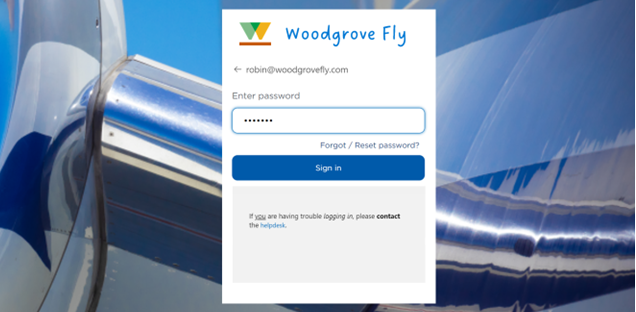
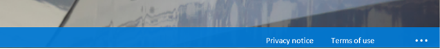
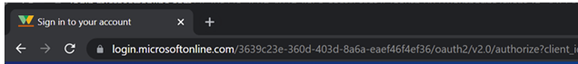
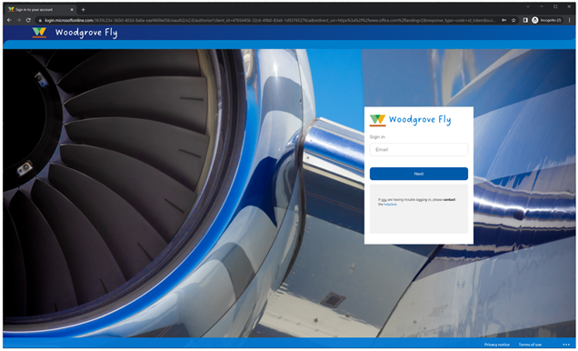

# Azure AD における新しい "会社のブランド" 機能の紹介

こんにちは、Azure Identity サポート チームの高田です。

本記事は、2022 年 11 月 28 日に米国の Azure Active Directory Identity Blog で公開された [Introducing enhanced company branding for sign-in experiences in Azure AD](https://techcommunity.microsoft.com/t5/microsoft-entra-azure-ad-blog/introducing-enhanced-company-branding-for-sign-in-experiences-in/ba-p/3094110) を意訳したものになります。ご不明点等ございましたらサポート チームまでお問い合わせください。

---

皆さんんにちは。

この度、Azure AD と Microsoft 365 アプリで用いられている既定の認証フローをより柔軟かつユーザー中心的にカスタマイズできるよう、会社のブランド機能を再デザインしましたのでお知らせします。新しいユーザー体験は、Azure AD 上で動作する B2B、B2E、ファースト パーティ アプリケーションのユースケースを含む、ディレクトリ内のユーザーと外部ユーザーへのサインインに適用されます。パブリック プレビューは、本日より試用できます。

## あなたのお客様にあなただけの体験を

これらのカスタマイズの機能は、ユーザーの体験をより詳細に制御したいというお客様のフィードバックに基づいて追加されました。顧客向けアプリケーションを構築する場合、B2C プラットフォームでの経験から、信頼関係を構築する上で美しくブランディングされたユーザー体験が重要です。

会社のブランド機能の強化により、既定のサインイン ページや、特定のブラウザ言語を対象にしたページのデザインをカスタマイズできるようになりました。さらに、セルフ サービス パスワード リセット (SSPR)、フッターのハイパーリンク、ブラウザ アイコンのカスタマイズ、スタイル シート (CSS) によるサインイン体験の設定、事前に定義されたテンプレートを使用してヘッダーとフッターを有効にすることも可能になりました。

## サインイン体験を構成する

新しいカスタマイズ機能は、テナントの Azure ポータルで「会社のブランド」ブレードを使用して構成できます。この画面では、ユーザーが組織のサインイン ページにアクセスしたときに表示されるカスタマイズ結果を設定することができます。これは特定のブラウザー言語ごとに構成することも可能です。

会社のブランドのブレードで利用可能なすべての新しい設定は以下のとおりです。

### レイアウトの構成

サインイン ページでウェブページの各要素の配置を指定することができます。

### カスタムのセルフ サービス パスワード リセットのハイパーリンク

この機能により、サインイン ページでのセルフ サービス パスワード リセットのリンクを表示したり、隠したり、カスタマイズすることが可能です。

### フッターのハイパーリンクのカスタマイズ

サインイン ページのフッターに表示されるプライバシーと利用規約の URL および表示文字列をカスタマイズいただけます。

### Favicon の設定

ウェブ ブラウザーのタブに表示されるアイコンを設定いただけます。

設定がアップロードされると、最終的なユーザー体験をご覧いただくことができます。

Azue AD Premium もしくは Office 365 を利用して、会社のブランド機能をぜひ利用ください。

会社のブランド機能については [こちら](https://learn.microsoft.com/ja-jp/azure/active-directory/fundamentals/how-to-customize-branding) もご参照ください。

いつものように、皆様からのフィードバックをお待ちしております。

Robin Goldstein  
Director of Product Management, Microsoft identity
