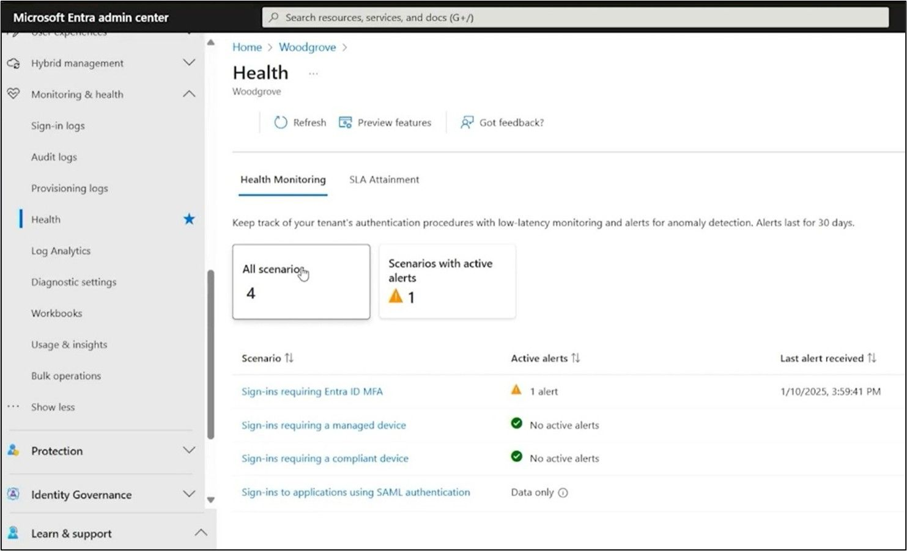
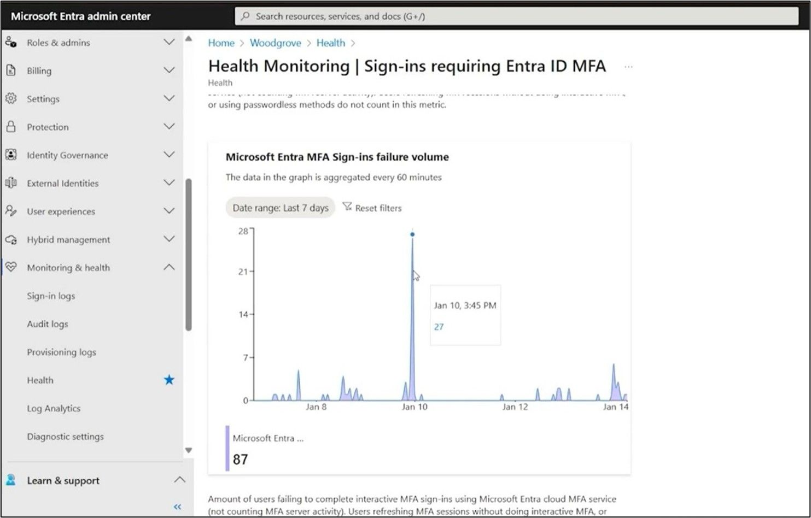

# Microsoft Entra Health アラートのご紹介: テナントの監視機能の強化

こんにちは、Azure & Identity サポート チームの高田です。

本記事は、2025 年 3 月 11 日に米国の Microsoft Entra Blog で公開された [Introducing Microsoft Entra Health alerts: An enhancement to tenant health monitoring](https://techcommunity.microsoft.com/blog/microsoft-entra-blog/introducing-microsoft-entra-health-alerts-an-enhancement-to-tenant-health-monito/4352583) の抄訳です。ご不明点はサポート チームまでお問い合わせください。

---

## テナントの正常性を高め管理者の目をより届きやすくする Microsoft Entra の監視システムの改善

Microsoft Entra Health アラートのリリースをこの度発表いたします。本機能はテナントの正常性が低下している可能性を検出するもので、既存の正常性メトリクスの追加機能としてテナントの監視機能を強化するというものです。本アラート機能は 2024 年 5 月の [ブログ記事](https://jpazureid.github.io/blog/azure-active-directory/tenant-health-transparency-and-observability/) で解説された、品質と耐障害性に対する取り組みの一環となります。パブリック プレビューが利用可能になってから最初の 1 か月間で数千のテナントによって既に使用されており、お客様テナントの正常性を監視および管理するのに活用いただいています。

近年 Microsoft Entra は耐障害性に多額の投資を行っており、その結果非常に高い可用性を実現しています。これらの取り組みにより、業界標準の認証の可用性 SLA である 99.99% を一貫して上回り、毎月 99.999% の稼働率をほぼ到達しているという状況です。しかし、テナントの正常性を最大限に高めるにあたっては、問題発生時やサービス品質の低下が生じた際にも自社の IT 運用やユーザーのサポートを行うお客様との積極的なパートナーシップが必要であることも弊社では認識しております。また、侵入やリスクを阻止しつつ、ストレスなく適切なユーザーがアクセスできるようにするということが、組織の円滑な運営を維持するために重要であると考えております。サービスの障害が生じた際や、今後起きるであろう障害に備えて予防措置を講じる場合は、ID サービス プロバイダーからタイムリーに情報の通知も必要です。弊社ではパートナーシップを大幅に促進するため、エンド ツー エンドの監視機能を開発しており、テナント レベルで Microsoft Entra 管理センターよりご利用いただけます。

この度、すでに提供済みである低遅延の正常性メトリクスと統合された自動アラート機能を発表いたします。この機能は Microsoft Entra 管理センター内の「[正常性](https://entra.microsoft.com/#view/Microsoft_AAD_DXP/ScenarioHealthSummary.ReactView)」画面に統合されており、以下の例では、多要素認証 (MFA) の失敗がスパイクしているデモ画像をご覧いただけます。

**注意**: この機能には、月間アクティブ ユーザー数が 100 以上の Microsoft Entra Premium  ライセンスを持つテナントが必要です。

アラートの発報機能は、平常時のパターンを元にして、個々のテナント内での平常時からの異常な変化を監視する異常検出システムに基づいています。アラート機能はテナントごとに調整されていますので、アラートの発報はその組織の一般的な認証パターンに基づいて行われることとなり、個々のテナントごとに影響を精査いただけます。これにより、正常性を把握するにあたり、[Azure Service Health ページ](https://azure.status.microsoft/ja-jp/status) にて確認いただいていた従来のサービス インシデントの通知よりも、よりきめ細かい情報を確認いただけます。

これらの正常性の監視データとアラートは、Microsoft Entra 管理センターで参照いただけます。サードパーティのツールやデータ パイプラインとの統合をご要望の場合は、Microsoft Graph を用いることでこれらのデータにアクセスが可能です。監視のフローについて概要を示します。

1. **テナント単位での正常性メトリクス データ**: Premium ライセンスを持つテナントに対し、テナント単位の正常性メトリクスが低遅延で送信されます。正常性データの観測は、MFA、条件付きアクセスで管理されたデバイス、条件付きアクセスの準拠済みデバイス、Security Assertion Markup Language (SAML) サインインに対して提供されます。
2. **異常検出**: 異常検出のシステムが、正常性データをテナント レベルで監視し、平常時のパターンから逸脱した場合にテナントにアラートを発報します。Premium ライセンスを持つテナントに月間アクティブ ユーザーが最低 100 必要です。
3. **通知のオプション**: アラートが発報された場合に備え、ユーザーまたは配布グループに E メールの通知を設定できます。通知は、監視シナリオごとに異なる方法を使うよう構成できます。また、お客様独自で通知の連携システムを開発する場合は、Microsoft Graph からアラートを照会する方法もご利用いただけます。
4. **アラートの調査**: アラートは Microsoft Entra 管理センター、Azure ポータル、または Microsoft Graph にて調査できます。これらのツールを用いて影響を評価し、修復のヒントを得るとともに、根本原因を調査して問題に対処できます。

上記のプロセスを一般的なシナリオを例に見てみましょう。ここでは、大企業のテナント内で Microsoft Entra の MFA サインイン エラーが平常時よりも大幅に増加しているという例をあげます。認証とアクセスの管理を担当するチームに問題の調査を指示する E メール通知が飛ばされます。そのチームの IT エンジニアがアラートを確認し、MFA のサインイン エラー データを分析して、根本原因を調査します。アラートには、影響を受けるアプリケーションとユーザーの情報が含まれており、それらを監査ログとサインイン ログとで共に活用することで、異常を引き起こした直近のアプリケーションの構成変更を特定できました。エンジニアが問題を修正したことで、問題の検出から数分以内に MFA のサインインが正常に戻りました。

月間アクティブ ユーザー数が 100 人を超える Premium ライセンス付きのテナントをお持ちの場合は、Microsoft Entra 管理センターで [正常性](https://entra.microsoft.com/#view/Microsoft_AAD_DXP/ScenarioHealthSummary.ReactView) のページを開いて、今すぐ正常性アラート機能をお試しください。まずは、各シナリオを担当する組織内のグループに E メール通知を送信するようにアラートを構成いただければと思います。低遅延のテナント固有のアラートを提供することで、テナントの正常性を事前に監視および管理できます。

この機能はお客様の生産性と成功をサポートし、高品質で耐障害性のあるサービスを提供するという Microsoft Entra のコミットメントをより強くするものです。弊社はこれからも正常性の監視機能の革新と改善を続けてまいりますので、さらなる更新と機能強化にご期待ください。

Shobhit Sahay  
Principal Group Product Manager
