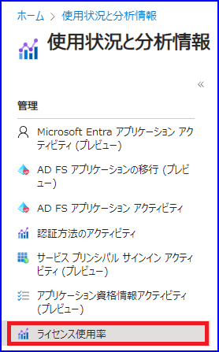

# 

こんにちは、Azure Identity サポート チームの 高田 です。
 
本記事は、2024 年 2 月 20 日に米国の Microsoft Entra Blog で公開された [Introducing Microsoft Entra License Utilization Insights](https://techcommunity.microsoft.com/t5/microsoft-entra-blog/introducing-microsoft-entra-license-utilization-insights/ba-p/3796393) を意訳したものになります。ご不明点等ございましたらサポート チームまでお問い合わせください。

---

現在、80 万を超えるお客様が、エンドユーザーの生産性を向上させながらセキュリティを確保し、絶えず変化する脅威に対応するため Microsoft Entra を利用しています。お客様からは、Entra の使用状況についてより透明性を高めたいという要望を頻繁に頂戴しており、特にライセンスに関する要望が多く寄せられています。本日、Microsoft Entra ライセンス利用ポータルのパブリック プレビューを発表できることを嬉しく思います。この新機能は、Premium 機能の現在の利用状況を把握することで、お客様が Entra ID Premium ライセンスを最適化できるようにするものです。

この投稿では、Entra ID Premium ライセンスを最大限に活用するために、この Entra ID ライセンス利用の概要を説明いたします。

Entra ID ライセンス利用ポータルでは、Entra ID P1 および P2 ライセンスの数と、ライセンスの種類に対応する主要機能の利用状況を確認できます。パブリック プレビューでは条件付きアクセスとリスクベースの条件付きアクセスの使用状況を確認いただけますが、一般提供時には、他の SKU (ライセンス) や対応する機能の使用状況も含まれるように拡張される予定です。この機能により、ライセンス数と、ライセンスで利用できる機能の利用状況をより良く把握できるようになります。また、テナントで発生する可能性のある使用過多の問題 (ライセンス違反) に対処するのにも役立ちます。

## パブリック プレビューを試す

ライセンスの使用状況と分析情報のポータルは [使用状況と分析情報] ブレード配下にあります。

このポータルでは、Entra ID Premium P1 および P2 ライセンス (該当する場合) に対応する機能について情報を提示します。これらの知見を活用することで、ユーザーを保護し管理するとともに、ライセンス条項を確実に遵守することができます。以下は、Entra ポータルで表示される機能の使用状況のスクリーンショットです:

## 今後

Entra の利用状況をよりよく把握できるようこの機能を継続的に改善していく所存です。この新しい機能についてのご意見をぜひお聞かせください。

Shobhit Sahay
