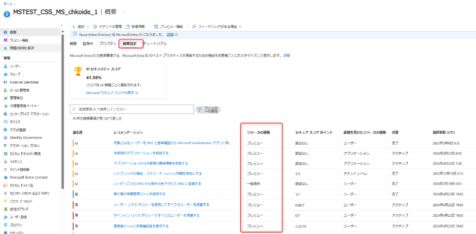
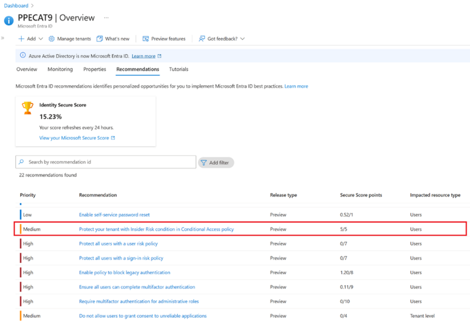
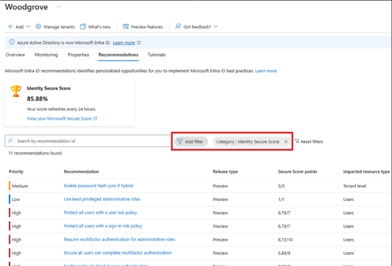

# セキュリティと生産性を向上させる Microsoft Entra 「推奨設定 (レコメンデーション)」 の新規機能の紹介

こんにちは、Azure Identity サポート チームの 夏木 です。
 
本記事は、2024 年 4 月 2 日に米国の Microsoft Entra (Azure AD) Blog で公開された [Introducing new and upcoming Entra Recommendations to enhance security and productivity](https://techcommunity.microsoft.com/t5/microsoft-entra-blog/introducing-new-and-upcoming-entra-recommendations-to-enhance/ba-p/3796390) の抄訳です。ご不明点等ございましたらサポート チームまでお問い合わせください。

----

テナント内の無数の設定やリソースを管理するのは時として困難です。 セキュリティ リスクが増大し、前例のない世界的な脅威が広がる時代において、企業/組織はセキュリティ体制を強化するために信頼できるガイダンスを求めています。そのため、弊社では [Microsoft Entra レコメンデーション](https://techcommunity.microsoft.com/t5/microsoft-entra-blog/introducing-new-and-upcoming-entra-recommendations-to-enhance/ba-p/3796390) の機能を開発しました。これにより、テナントの状態を継続的に監視し、安全で健全な状態を維持できるようになります。さらに、Microsoft Entra ID が提供する機能から最大限の価値を引き出すことができます。 Microsoft Entra レコメンデーションの提供開始以来、数千のお客様がこれらの推奨設定を採用し、数百万のリソースを解決してきました。

今日、4 つの Microsoft Entra レコメンデーションが近日中に一般提供される予定であり、さらに 3 つの Microsoft Entra レコメンデーション がパブリック プレビューで提供されることをお知らせできることを嬉しく思います。また、ID のセキュア スコアに関する新しいアップデートについてもお知らせします。これらの Microsoft Entra レコメンデーション は、資格情報、アプリケーションの健全性、より広範なセキュリティ設定など、幅広い範囲をカバーしており、デジタル財産を効果的に保護することができます。 

## 新規および今後の Microsoft Entra レコメンデーション の提示 - 当社のベストプラクティスから学ぶ

以下のリストは、アプリケーションの健全性とセキュリティを向上させるための新規および近日中に提供される推奨設定です。 

- **アプリケーションから未使用の資格情報を削除する**: アプリケーションの資格情報は、リソースまたは別のサービスへのアクセスを許可するトークンを取得するために使用されます。 アプリケーションの資格情報が侵害されると、アプリケーションに付与されたアクセスに応じて、機密リソースへのアクセスに使用されたり、悪意のある攻撃者が後で行動する可能性があります。 アプリケーションによってアクティブに使用されていない資格情報を削除することで、セキュリティ体制が改善され、アプリケーションの健全性が促進されます。 これにより、資格情報の悪用に対する攻撃対象領域が減少するため、アプリケーションの侵害のリスクが軽減され、アプリケーションのセキュリティ体制が向上します。
- **期限切れのサービス プリンシパル資格情報を更新する**: 有効期限が切れる前にサービス プリンシパル資格情報を更新することで、アプリケーションが引き続き正常に機能し、資格情報の期限切れによるダウンタイムの可能性が軽減されます。
- **期限切れのアプリケーション認証情報を更新する**: 有効期限が切れる前にアプリの認証情報を更新することで、アプリケーションが引き続き機能し、認証情報の期限切れによるダウンタイムの可能性が軽減されます。
- **未使用のアプリケーションを削除する**: 未使用のアプリケーションを削除することで、セキュリティ体制が向上し、アプリケーションの健全性が向上します。 これにより、誰かが未使用のアプリケーションを発見して悪用することによるアプリケーションの侵害のリスクが軽減されます。 アプリケーションに付与されたアクセス許可とアプリケーションが公開するリソースによっては、アプリケーションの侵害により組織内の機密データが公開されてしまう可能性があります。
- **廃止される Azure AD Graph API から Microsoft Graph にアプリケーションを移行する**: Azure AD Graph サービス (graph.windows.net) は 2020 年に廃止されることが発表され、廃止サイクルに入っています。 テナント内のアプリケーション、およびテナント内で同意されているベンダー (サービス プリンシパル) が提供するアプリケーションを、できるだけ早く Microsoft Graph API を使用するように更新することが重要です。 この推奨設定では、最近 Azure AD Graph API を使用したアプリケーションと、アプリケーションが使用している Azure AD Graph API に関する詳細が報告されます。
- **廃止される Azure AD Graph API から Microsoft Graph にサービスプリンシパルを移行する** : Azure AD Graph サービス (graph.windows.net) は 2020 年に廃止されることが発表され、廃止サイクルに入っています。 テナント内のサービスプリンシパル、およびテナント内で同意されているベンダーが提供するアプリケーションのサービスプリンシパルを、Microsoft Graph API を使用するようにできるだけ早く更新することが重要です。 この推奨設定では、最近 Azure AD Graph API を使用したサービス プリンシパルと、サービス プリンシパルが使用している Azure AD Graph API に関する詳細がレポートされます。

一般提供されているこれらの推奨事項は、以下に示すように、Microsoft Entra ID の概要画面から「推奨設定」メニューに移動し、「リリースの種類」というタイトルの列で「一般提供」を探すことで見つけることができます。

## セキュア スコア に関する変更点 - セキュリティを強化するためのセキュリティ分析ツール
 
[Microsoft のセキュリティに関する推奨事項にどの程度適合しているか](https://kateblog.io/iam/identity-secure-score-in-azure-active-directory/) を示す指標として機能する Identity Secure Score の新しい機能を発表できることを嬉しく思います。 Identity Secure Score の各改善アクションは構成に合わせてカスタマイズされており、変更によるセキュリティへの影響を簡単に確認できます。 インサイダー リスクから組織を保護するために、セキュア スコアの推奨事項がパブリック プレビューで公開されます。 詳細は以下をご覧ください。 

- インサイダー リスク ポリシーでテナントを保護する: リスクの高い内部ユーザーのリソースへのアクセスをブロックする条件付きアクセス ポリシーを実装することは、プロアクティブにセキュリティを強化し、内部関係者の脅威を軽減するとともに、機密データをリアルタイムで保護する上で重要な役割を果たしているため、重要度が高いです。 この機能の詳細については、[こちら](https://learn.microsoft.com/ja-jp/entra/identity/conditional-access/how-to-policy-insider-risk)をご覧ください。

新しいセキュア スコアの推奨事項に加えて、セキュア スコアに関連する他の推奨設定がいくつかあります。 セキュリティ関連の推奨設定をまだ確認していない場合は、確認することを強くお勧めします。 セキュア スコアに関する現在の推奨設定については、以下を参照してください。

- **ハイブリッドの場合はパスワード ハッシュ同期を有効にする**: パスワード ハッシュ同期は、ハイブリッド ID を実現するために使用されるサインイン方法の 1 つです。 Microsoft Entra Connect は、ユーザーのパスワードのハッシュのハッシュを、オンプレミスの Microsoft Entra Connect インスタンスからクラウドベースの Microsoft Entra Connect クラウド同期インスタンスに同期します。 パスワード ハッシュ同期は、ユーザーが維持する必要があるパスワードの数を 1 つだけに減らすことで役立ちます。 パスワード ハッシュ同期を有効にすると、漏洩した資格情報のレポートも可能になります。
- **ユーザー リスク ポリシーですべてのユーザーを保護する**: ユーザーリスクポリシーを有効にすると、Microsoft Entra ID はユーザー アカウントが侵害された可能性を検出します。 管理者は、特定のユーザーリスクレベルに自動的に対応するようにユーザーリスク条件付きアクセスポリシーを構成できます。
- **サインイン リスク ポリシーですべてのユーザーを保護する**: サインイン リスク ポリシーを有効にすると、不審なサインインに対して多要素認証 (MFA) が要求されます。
- **最小限の特権を持つ管理ロールを使用する**: 管理者が自分のアカウントに割り当てられた最小限の特権で作業を完了できるようにします。 グローバル管理者ではなく、パスワード管理者や Exchange Online 管理者などのロールをユーザーに割り当てると、特権アカウントが侵害される可能性が低くなります。
- **管理ロールに多要素認証を要求する**: 管理ロールに多要素認証 (MFA) を要求すると、攻撃者がアカウントにアクセスすることが難しくなります。 管理者の役割には、一般的なユーザーよりも高い権限が与えられます。 これらのアカウントのいずれかが侵害された場合、組織全体が危険にさらされます。
- **すべてのユーザーが MFA を完了できるようにする**: これらのユーザーがアクセスできるデバイスとデータを MFA で保護します。 Microsoft Authenticator アプリや電話番号などの認証方法を追加すると、別の要素が侵害された場合の保護レベルが高まります。
- **レガシー認証をブロックするポリシーを有効にする**: 現在、セキュリティを侵害するサインイン試行のほとんどはレガシー認証によるものです。 Office 2010 などの古いオフィス クライアントは最新の認証をサポートしておらず、IMAP、SMTP、POP3 などの従来のプロトコルを使用します。 従来の認証は MFA をサポートしていません。 環境内で MFA ポリシーが構成されている場合でも、悪意のある者がレガシープロトコルを通じてこれらの強制をバイパスする可能性があります。 従来の認証をブロックするポリシーを有効にすることをお勧めします。
- **複数の全体管理者を指名する**: 一人で組織のニーズや責務を果たせない場合には、複数の全体管理者を置くと役立ちます。 必要に応じてチームの誰かがアクセスできる、代理人または緊急アクセス アカウントを用意することが重要です。 また、管理者は侵害の兆候がないか相互に監視することもできます。
- **パスワードを期限切れにしない**: 調査によると、定期的なパスワードのリセットが強制されると、パスワードの安全性が低下することがわかっています。 ユーザーは、より弱いパスワードを選択し、リセットするたびにパスワードを少し変更する傾向があります。 ユーザーが強力なパスワード (長く、複雑で、実際的な単語が含まれていないパスワード) を作成した場合、そのパスワードは現在と同様に将来も強力なままであるはずです。 特別な理由がない限りパスワードを定期的に期限切れにしないというのが Microsoft の公式のセキュリティ上の立場であり、クラウド専用テナントにはパスワード ポリシーを期限切れにしないように設定することをお勧めします。
- **セルフサービス パスワード リセットを有効にする**: Microsoft Entra ID のセルフサービス パスワード リセットを使用すると、ユーザーはヘルプデスクに問い合わせてパスワードをリセットする必要がなくなります。 この機能は、容易に推測できるパスワードの使用を防ぐ、Microsoft Entra の動的に禁止されたパスワードとうまく連携します。
- **信頼できないアプリケーションへのユーザーの同意を許可しない**: 悪意のあるアプリケーションがユーザーを騙して組織のデータへのアクセスを許可しようとするリスクを軽減するために、検証済みの発行者によって公開されたアプリケーションに対してのみユーザーの同意を許可することをおすすめします。
 
以下に示すように、「カテゴリ」にフィルターを追加し、「ID セキュリティ スコア」を選択すると、Microsoft Entra 推奨ポータルでセキュア スコアの推奨事項を見つけることができます。

これらの学習とベストプラクティスを活用していただけることを楽しみにしています。私たちは、適切な推奨設定を適切な人々に提供するために、常に革新し、お客様のエクスペリエンスを改善しています。今後のリリースでは、Eメール通知などの新機能を導入して、新しい推奨設定や他の役割への委任機能を認識させ、より実用的なレコメンデーションを提供することで、組織を保護するために問題を迅速に解決できるようにする予定です。

Shobhit Sahay 
