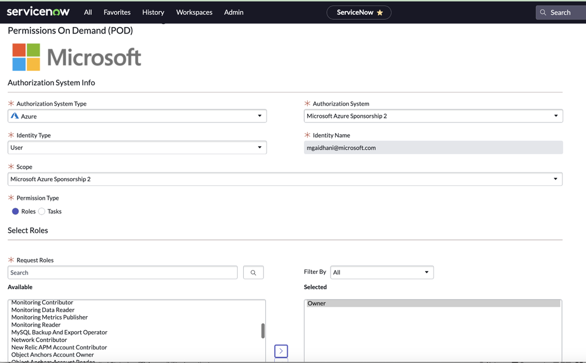

# Microsoft Entra Permissions Management の新機能の紹介

こんにちは、Azure Identity サポート チームの 張替 です。

本記事は、2023 年 12 月 14 日に米国の [Azure Active Directory Identity Blog で公開された Introducing New Features of Microsoft Entra Permissions Management - Microsoft Community Hub](https://techcommunity.microsoft.com/t5/microsoft-entra-blog/introducing-new-features-of-microsoft-entra-permissions/ba-p/2466925) を意訳したものになります。ご不明点等ございましたらサポート チームまでお問い合わせください。

----

Microsoft Entra Permissions Management は、組織のマルチクラウド基盤におけるあらゆる ID の権限管理を支援する Cloud Infrastructure Entitlement Management (CIEM) ソリューションです。Permissions Management を使用することで、ID とその権限を継続的に評価、管理、監視し、過去のアクティビティに基づいてアクセス許可の範囲を適切に管理することができます。
 
本日、Ignite での発表について詳細をお知らせすると共に、Permissions Management の新機能と API を紹介いたします。全体的な権限管理のエクスペリエンスにつながればうれしく思います。

## ServiceNow アプリ内で Permissions Management を利用 (一般利用可能)

ユーザーは、ServiceNow ポータルからマルチ クラウド環境 (Microsoft Azure、Amazon Web Services (AWS)、Google Cloud Platform (GCP)) に対して、期限付きのオンデマンドのアクセス許可を要求できるようになりました。この統合により、ServiceNow の既存の承認ワークフローにアクセス許可の要求が追加され、組織のゼロ トラスト体制を強化することができ、マルチ クラウド環境で最小特権の原則を実施することが可能になります。詳細については、[こちら](https://learn.microsoft.com/ja-jp/entra/permissions-management/how-to-configure-servicenow-application) をご覧ください。

## Microsoft Defender for Cloudとの統合 (パブリック プレビュー)

当社は、クラウド ネイティブ アプリケーション保護プログラム (CNAPP) の取り組みを強化しており、そのために Microsoft Defender for Cloud を通じて基本的な権限管理に関する情報を提供しています。この統合により、クラウド環境における過剰なアクセス許可や設定ミスにより発生する可能性のあるセキュリティ侵害が防止されます。これにより、組織はクラウド リソースに最小特権の原則を導入すると共に、Azure、AWS、GCP 全体でアクセス許可に関するリスクを解決するための推奨事項を得ることが可能となります。詳細については、[こちら](https://learn.microsoft.com/ja-jp/entra/permissions-management/permissions-management-for-defender-for-cloud) をご覧ください。

## Okta と AWS IAM Identity Center のサポート (パブリック プレビュー)

Permissions Management をご利用のお客様は、Okta および AWS IAM Identity Center 上の ID を検出できるようになりました。これにより、お客様は、使用している ID プロバイダーやソリューションに関係なく、すべての ID とそのアクセス許可を一元的に把握できるようになります。お客様はけ数回クリックで Okta と AWS IAM Identity Center を構成いただけます。

## アクセス許可の分析レポート (パブリック プレビュー)

このレポートでは、Permissions Management における ID とリソース全体の詳細を一覧で確認できます。このレポートは、Permissions Management ページで直接表示するか、Excel 形式でダウンロードするか、PDF としてエクスポートすることも可能です。当該レポートは Microsoft Azure、AWS、GCP を含むサポートされているすべてのクラウド環境で利用可能です。 詳しくは[こちら](https://learn.microsoft.com/ja-jp/entra/permissions-management/product-permissions-analytics-reports#download-the-permissions-analytics-report-in-pdf-format) をご覧ください。

## 新しい API

パブリック プレビューとして複数の Microsoft Graph API が Permissions Management に導入され、お客様からのフィードバックに基づく主要なユースケースに対応しました。これらの新しい API により、組織は、オンボード済みの AWS アカウント、Azure サブスクリプション、および GCP プロジェクトの情報を棚卸でき、アクセス許可に関する分析情報を SIEM ツールのダッシュボードに組み込んだり、既存のチケット管理システムでアクセスのレビューを行ったりできるようになります。さらに、Permission on Demand API を用いることで、自動化ソリューションや IT サービス管理 (ITSM) ソリューションとの統合により、必要に応じてユーザー ID またはワークロード ID の権限を柔軟に昇格させることが可能となります。詳細については、[こちら](https://learn.microsoft.com/en-us/graph/api/resources/permissions-management-api-overview?view=graph-rest-beta) をご覧ください。

いつものように、皆様のご意見、ご感想、ご提案をお待ちしております！[Microsoft Entra (Azure AD) フォーラム](https://feedback.azure.com/d365community) で共有するか、以下にコメントを残してください。皆様のご意見をお待ちしております。

Joseph Dadzie, Partner Director of Product Management  
Linkedin: [@joedadzie](https://www.linkedin.com/in/joedadzie/)  
Twitter: [@joe_dadzie](https://twitter.com/joe_dadzie)
