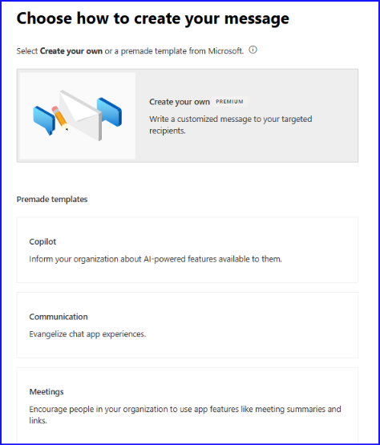
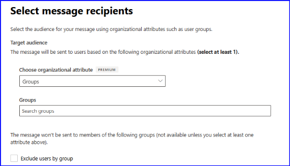
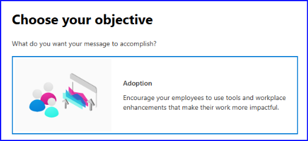
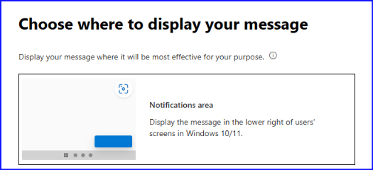
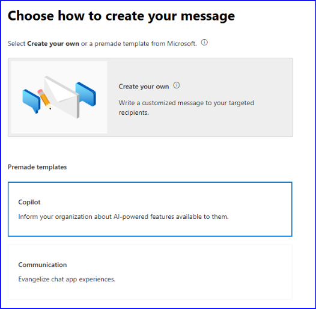
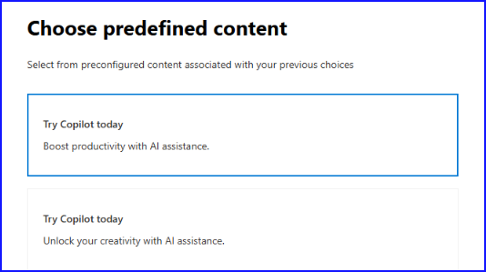
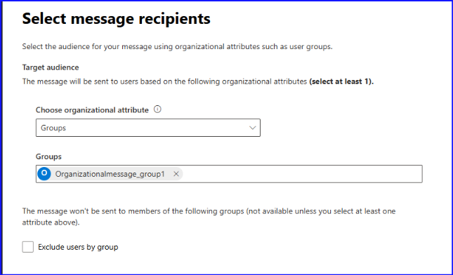
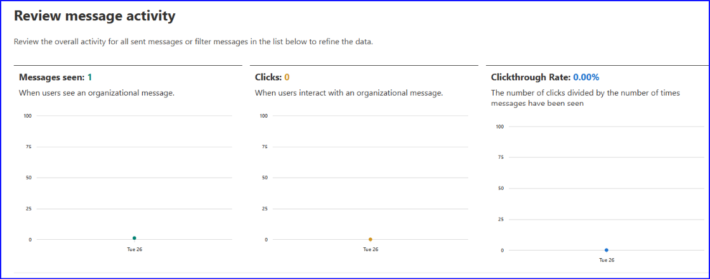

# Microsoft 365 管理センターにおける組織のメッセージの利用方法

こんにちは！ Azure ID チームの小出です。

本記事は、 2024 年 5 月 3 日に公開された [Introducing organizational messages (preview) in the Microsoft 365 admin center](https://techcommunity.microsoft.com/blog/microsoft_365blog/introducing-organizational-messages-preview-in-the-microsoft-365-admin-center/4123890)  と、2024 年 11 月 19 日に公開された [Announcing general availability of organizational messages in the Microsoft 365 admin center](https://techcommunity.microsoft.com/blog/microsoft_365blog/announcing-general-availability-of-organizational-messages-in-the-microsoft-365-/4303367)  をもとに、日本語でわかりやすくおまとめしなおした記事です。

今回は、Microsoft 365 管理センター上に新しくできた「組織のメッセージ」機能について、上記ブログと公開情報、事例をもとに機能について紹介します。

## 組織のメッセージとは？

お客様の環境では、たとえば「自社サービスに障害が起きて業務アプリが開けない」といった障害発生時や、「新しい社員がチームに入社した」といったときに、どのようにユーザーに通知していますでしょうか。一般的には、 Teams のチャネルに投稿を行う、社内ポータルのトップに通知を出す、E メールを送付して共有を図るなどの方法を利用されているお客様が多いかと思います。

組織のメッセージは、事前に作成したメッセージを、ユーザーが利用している Windows デバイスや Microsoft のサービスなどに通知として配信する機能です。事前にどのようなメッセージを誰に配信するかを決めることができるので、全社もしくは特定の部署のユーザーなど、必要な範囲のユーザーに対してのみメッセージを配信することができます。メッセージの内容は、事前に定義されたテンプレートの中から選ぶことができ、そのメッセージをどこに通知するかを指定することも可能ですので、要件にあった形で通知を行うことができます (特定のライセンスをお持ちのお客様は Premium 機能を利用できます。たとえば、テンプレートからの作成ではなく、内容を完全にカスタマイズしたメッセージを作成することも可能です)。

主な機能は下記です。

- **一元管理**: メッセージの使用状況のレポートや展開ガイドなど、さまざまな管理機能が用意されており、さらにテンプレートに基づいてて作成した組織メッセージを Microsoft 365 管理センター内の 1 つの場所ですべて表示できます。 
- **メッセージの作成**: 組織内でメッセージ ライター ロールを持つユーザーは、組織のメッセージの目的に合わせて、カスタマイズされたメッセージを作成したり、テンプレート ベースのメッセージ (メッセージ テキストまたは宛先 URL) をカスタマイズしたりできます。 
- **通知を表示する製品の場所**: Windows 10 と 11 の複数の場所、または Teams アプリの中から選択できます。 
- **メッセージのスケジュール設定と緊急メッセージ**: ユーザーに配信するメッセージを特定の日付の範囲内にスケジュールすることが可能です。Windows 10 および 11 の一部の画面に対しては緊急配信を行うことも可能です。
- **柔軟なターゲティング**: 既存のユーザー グループや、部署や場所などのより高度な属性を使用して、メッセージを適切な受信者に絞り込むことができます。 
- **承認ワークフロー**: テンプレートを利用しないカスタム メッセージを作成する場合、誤った配信が行われないよう必ず承認が必要です。組織のメッセージ承認者ロールを持つユーザーは、カスタム メッセージが送信される前にレビューおよび承認が可能です。 
- **メッセージ アクティビティ レポート**: ユーザーにメッセージが表示されたか、ユーザーがメッセージをクリックしたかどうかなどの詳細を確認することができます。

Teams のチャネル、グループ チャットや E メールなどの既存の通知の仕組みも引き続き利用いただいたうえで組織のメッセージを活用いただくと、より迅速に多くのユーザーにメッセージを共有することが可能です。詳細について下記おまとめしておりますので、ぜひ活用ください。

## メッセージの種類

組織のメッセージには、大きく分けて「通常のメッセージ」と「緊急のメッセージ」の2種類があります。どちらも基本的な機能（メッセージの内容や通知の種類を決めて通知を行う部分）については同じですが、下記のような違いがあります。文字どおり、ユーザーに可能な限り迅速に配信を行いたいような緊急時には緊急メッセージを利用し、急を要さない通知のシナリオにおいては通常のメッセージを利用します。

| | 通常のメッセージ	| 緊急のメッセージ | 
|--- |---|---|
| メッセージをどのように配信するか |	デバイスからのプル型 (デバイス側から問い合わせがあったときに配信する)	| サービスからのプッシュ型 (サービス側から出来る限りデバイスへ配信を行うように働きかける) |
| メッセージの配信頻度 | 配信頻度を週に 1 度など決めることができる | 1 回きりの緊急配信のため頻度は指定できない | 

## Premium 機能でできること

組織のメッセージ機能では、お持ちのライセンスによって利用できる機能に差異があります。ライセンス要件や Premium 機能については [Microsoft 365 管理センター内の組織のメッセージ](https://learn.microsoft.com/ja-jp/microsoft-365/admin/misc/organizational-messages-microsoft-365?view=o365-worldwide#premium-features) の公開情報にて案内されていますが、具体的には下記いずれかのライセンスが必要です。

- Microsoft 365 E3-E5 ライセンス
- Office 365 E3-E5 ライセンス
- Windows 365 E3-E5 ライセンス

Office 365 E3/E5 ライセンスでは Teams 宛てに通知するシナリオでのカスタム メッセージを、Windows 365 E3/E5 ライセンスでは Windows OS の通知領域やタスクバーなど Windows 宛てに通知するシナリオでのカスタム メッセージを作成することが可能です。ライセンスをどちらか片方のみお持ちの場合、Premium 機能の利用可否は、「どこに通知するか」の選択によります。Microsoft 365 E3/E5 をお持ちであれば、どの通知先を選択しても Premium 機能は利用可能です。

なお、現時点で利用できる Premium 機能は下記 2 つです。

**1. カスタム メッセージ**

テンプレートから通知を作成するのではなく、完全にカスタマイズされたメッセージを作成することができます。ライセンス要件を満たしておらず Premium 機能が利用できない場合には、既存のテンプレートから作成するような形になります。具体的には、Premium ライセンスがない場合は下記画面の「Copilot」や「Communication」などをクリックして作成することが可能です。タイトルやメッセージの内容は変更することはできませんが、URL リンクやアイコンは変更可能です。Premium ライセンスがあれば、下記 「Create your own」をクリックすることができるので、カスタマイズされたメッセージを作成することができます。

**2. 通知先となるターゲットの指定**

既定では、指定したグループに対して通知が行われます。グループの指定は以下のメッセージの受信者の設定で行うことができます。Premium 機能が利用できない場合、Groups 以外は指定できませんが、ライセンスがあれば他に Companies, Departments, Locations など、グループ以外の属性で受信者を指定できるようになります。

## 組織のメッセージ機能を触ってみよう！

組織のメッセージ機能は、Microsoft 365 管理センターで利用することができます。通常のメッセージを作成する手順について紹介します。まず、Microsoft 365 管理センターにアクセスし、レポート内の組織のメッセージをクリックします。下記のような画面が表示されます。

通常のメッセージを作成したい場合、Create a message をクリックします。

次の画面は、どういう目的で組織のメッセージを利用したいのかを指定します。

次の画面では、画面のどこにメッセージを表示させたいか、表示場所を指定します。

テンプレートを利用するか、カスタム メッセージを利用するかを指定します。テンプレートの場合、利用できるテンプレートが複数ある場合もあるため、目的に一番近いテンプレートを指定します。

テンプレートを利用する場合、さらに詳細について選択することができるので、どのようなメッセージを通知したいのか指定します。

通知をクリックしたときにどの画面に遷移するのか URL を指定したり、通知のロゴを指定したりします。カスタム メッセージの場合は、メッセージのタイトルや内容をこの画面で指定することができます。

誰にそのメッセージを送付したいのか指定します。この画面で指定するのは、通知を受信したいユーザーが含まれるユーザー グループです。

通常メッセージについてはスケジュールを次の画面で指定します。開始日および終了日や、どのくらいの頻度で通知を繰り返したいかを指定します。

これらの設定が完了すると、レビュー画面が表示されるので、確認のうえメッセージを作成すれば完了です。

## よくある質問

### Q. 前提条件となる Intune ポリシー作成時のグループと、メッセージ作成時の受信者グループの違いが分かりません。どのようなグループを指定すればよいのでしょうか。

A. Intune ポリシー作成時の割り当てグループは、メッセージを受信できるデバイスをまとめるグループです。一方、組織のメッセージの受信者はユーザー単位で管理されています。このため、メッセージ作成時の対象として選択するグループにはユーザーが所属している必要があります。Intune 側のポリシーを割り当てるグループはデバイスを含んだグループを、メッセージ作成時の受信者設定ではメッセージを受信したいユーザーが含まれるグループを指定ください。

### Q. 組織のメッセージを作成するときに、承認制になるパターンとならないパターンがあります。違いは何ですか。

A. Premium 機能で利用可能なカスタマイズ メッセージの場合は承認が必要です。カスタマイズ メッセージでは、管理者が自由に指定したメッセージがユーザーに一括通知されることとなります。誤った内容・不適切な内容をユーザーに広く通知することがないよう、ダブルチェックとして承認が必要です。一方、既定で用意されているテンプレートを利用する場合には承認は不要です。このシナリオの場合、通知されるメッセージ自体はすでに既定で指定されているため、管理者の一任でメッセージを作成および配送できます。

### Q. 通常のメッセージと緊急のメッセージでは、プッシュ型およびプル型の配信方法のほかに、どのような違いがありますか？

A. 通常のメッセージでは、どのような頻度でメッセージを配信したいかを指定することが可能です。1週間に 1 回など、定期的に配信することが可能です。一方、緊急メッセージはユーザーに急いで情報を発信したいときに使うものになるため、配信は 1 度きりとなり、繰り返しの設定や定期配信はできません。

### Q. Premium 機能の前提となるライセンスを持っているのにグレーアウトしていて利用できません。どうしたらいいですか。

A. 事象発生テナントからお問い合わせを起票ください。その際、お持ちのライセンス情報についても記載いただけますとスムーズに対応が可能です。

### Q. メッセージを作成し Active になりましたが、誰がメッセージを見たのかをログなどから確認することはできますか？

A. はい、できます。組織のメッセージ画面にある Review Activity をクリックすると、アクティビティ情報を取得することが可能です。各項目の説明は以下の通りです。

- Messages seen: ユーザーの端末にメッセージが配信され、実際にデバイスに表示された数が表示されています。
- Clicks: ユーザーがその通知されたメッセージをクリックした回数が表示されています。
- Clickthrough Rate: メッセージが表示された回数のうち、クリックされた回数の比率を表示しています。

画面上の下部分を確認すると、以下のようにメッセージごとの回数および比率を確認することも可能です。

上記記事を参考に、ぜひ組織のメッセージ機能をご利用ください！
