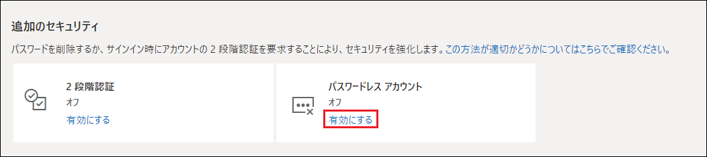
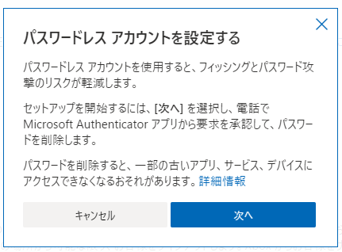
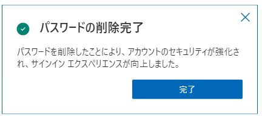
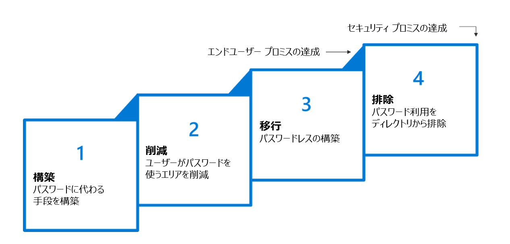

---
title: Microsoft アカウントにおけるパスワード削除機能のご紹介
date: 2021-09-17 10:00
tags:
  - Azure AD
  - US Identity Blog
---

# Microsoft アカウントにおけるパスワード削除機能のご紹介

こんにちは、Azure Identity サポート チームの 村上 です。

本記事は、2021 年 9 月 15 日に米国の Azure Active Directory Identity Blog で公開された [Introducing password removal for Microsoft Accounts](https://techcommunity.microsoft.com/t5/azure-active-directory-identity/introducing-password-removal-for-microsoft-accounts/ba-p/2747280) を意訳したものになります。ご不明点等ございましたらサポート チームまでお問い合わせください。

---

フィッシングやパスワード・スプレー、クレデンシャル スタッフィングなどの一般的な攻撃は、「人間が設定するパスワード (行動) は予測可能である」という不変の真理に基づいています。悪意のある攻撃者は、この "予測可能性" を利用することで、30 年前のツールを使っているにもかかわらず、上記のような攻撃をほぼ成功させています。

本日より、コンシューマー向けの Microsoft アカウントをお使いの皆様は、完全にパスワードレスに移行いただけるようになりました。Microsoft アカウントからパスワードを削除することができ、新しいアカウントをパスワードなしで作成することもできます。サインイン時には、パスワード以外の認証方法である、Microsoft Authenticator アプリ、Windows Hello、物理的なセキュリティ キーを利用することで、より安全で便利な方法でサインインすることができます。

設定に必要なのは、以下の 3 つのステップだけです。

1. 該当のMicrosoft アカウントで、[Advanced Security Options](https://account.live.com/proofs/manage/additional) にアクセスします。

2. [パスワードレス アカウント] 配下の [有効にする] をクリックします。

3. メッセージに沿って設定を進めます。

パスワードを削除した後は、Microsoft Authenticator アプリからの通知を承認することで、アカウントにサインインできます。

こちらの [あなたの Microsoft アカウントにパスワードレスの未来を](https://www.microsoft.com/security/blog/2021/09/15/the-passwordless-future-is-here-for-your-microsoft-account/) という記事では、Vasu Jakkal 氏によりなぜパスワードなしでサインインすることが、より速く、より簡単で、そしてより安全であるか詳しく説明されています。何よりも、パスワードがなくなってしまえば、パスワードを覚えておく必要はありません！

## パスワードが企業にもたらす脆弱性

攻撃者はたった 1 つのパスワードがあればそのアカウントに侵入し、組織に潜入することができます。従業員の 100 人に 1 人でも、重要なアカウントに簡単に推測可能なパスワードを設定していれば、その組織は危険な状況にあるということです。驚くことに、 2011 年に最もよく使われたパスワード (123456、abc123、iloveyou など) は、いまだによく使われるパスワードのトップ 20 にランクインしています。

過去 10 年間、侵害のリスクを 99.9% 削減できる 2 段階認証を提唱してきました。パスワードに加え、追加の要素で本人確認を行うことは有効な手段ではありますが、ハッカーはすでに [第 2 段階認証を突破](https://jpazureid.github.io/blog/azure-active-directory/all-your-creds-are-belong-to-us/) し始めています。今後もパスワードが認証の仕組みの一部である限り、攻撃に脆弱なままとなります。

## パスワードレス技術を取り入れましょう

数年前、組織におけるパスワードの使用を終わらせるための 4 つのステップを紹介しました。

わたしたち ID 製品チームは、ディレクトリからパスワードをなくすことため、Microsfot の製品チームや標準化団体と協力してきました。その結果、本日 [非常に大きな進歩](https://www.microsoft.com/security/blog/2020/12/17/a-breakthrough-year-for-passwordless-technology/) をご紹介することができました。 

10 月 13 日に開催されるデジタル イベント[パスワードレスの未来を今始めよう](https://passwordlessfuturedigitalevent.eventcore.com/auth/login?ocid=AID3037729_QSG_542099) では、私のチーム メンバーである Vasu、そして Microsoft の専門家が、パスワードレスの未来を築くための見識とベストプラクティスを共有します。ご興味のある方は、是非ともご参加ください。

## 今後の展開

私たちは、より多くのお客様にパスワードレスを提供するため、これからも技術革新を行ってまいります。パスワードなしでサインインする新しい方法を構築することに加えて、Azure AD アカウントのパスワードをなくすための開発も間もなく開始します。将来的には、管理者が特定のユーザーに対して、パスワードを必要とするか、利用してもよいとするか、あるいは使用しないかを選択できるようになります。管理者の設定に沿って、ユーザーはアカウント作成時にパスワードを設定しないようにしたり、既存のアカウントからパスワードを削除したりを選択できるようになります。

これからもパスワードレスの未来を築いていく上で、皆様からのフィードバックは非常に貴重なものとなります。ご質問やご意見は、answers.microsoft.com までお寄せください。
