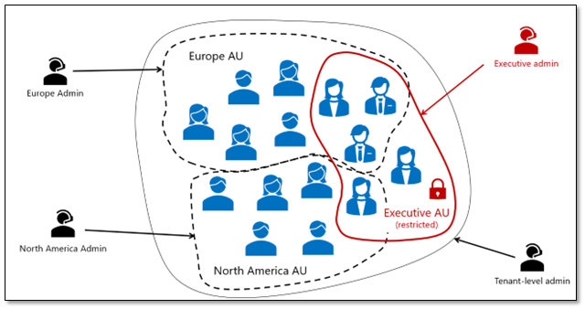

こんにちは、Azure Identity サポート チームの 北村 です。

本記事は、2023 年 7 月 12 日に米国の Microsoft Entra (Azure AD) Blog で公開された [Introducing Restricted Management Administrative Units in Microsoft Entra ID](https://techcommunity.microsoft.com/t5/microsoft-entra-azure-ad-blog/introducing-restricted-management-administrative-units-in/ba-p/3867839) を意訳したものになります。ご不明点等ございましたらサポート チームまでお問い合わせください。

---
# Microsoft Entra ID における制限付き管理の管理単位の紹介

Microsoft Entra ID の新しいロールベースのアクセス制御 (RBAC) 機能である、[制限付き管理の管理単位](https://learn.microsoft.com/ja-jp/azure/active-directory/roles/admin-units-restricted-management) のパブリック プレビューを共有できることを嬉しく思います。

## 制限付き管理の管理単位でできること 

制限付き管理の管理単位を使用すると、Microsoft Entra ID テナント内の特定のユーザー、セキュリティ グループ、またはデバイスを指定して、それらをテナント レベルの管理者から変更ができないようにすることが可能となります。

これは以下のような場合に有用です： 

- 役員など、機密性の高いユーザー アカウントを、通常のヘルプデスク管理者によるパスワードや多要素認証設定の変更から保護したい。
- 特定の国の特定のユーザー アカウント、セキュリティ グループ、またはデバイスを、その国の指定された管理者のみが変更できるようにしたい。
- 機密データへのアクセスを許可する特定のセキュリティ グループがあり、そのメンバーシップを変更できる人を一部の管理者に限定したい。

機密オブジェクトを制限付き管理の管理単位に配置することで、テナント レベルの管理者はそれらのオブジェクトを変更できなくなります。 管理単位自体のスコープに明示的に割り当てた管理者だけが変更を加えることができます。

 

機密性の高いオブジェクトと、その他の機密性の低いオブジェクトを同列に扱うよりも、このように管理単位でまとめる方が遥かに簡単です。

## お使いのテナントで制限付き管理の管理単位を使用する方法 

ここでは、制限付き管理の管理単位を使用して、テナント内の機密性の高いユーザー アカウントを簡単に保護する例を示します： 

1. **[役割と管理者]** で **[管理単位]** を選択し、 **[追加]** をクリックして新しい管理単位を作成します。

  

2. **[制限付き管理の管理単位]** を [はい] に設定し、[次へ: ロールの割り当て] をクリックします。

  

3. 機密性の高いアカウントのヘルプデスク管理者となるべき管理者（アカウントを管理したい人）を追加し、管理単位の作成を完了します。

 

4. この段階で、(他の管理単位の場合と同様に) 作成した制限付き管理の管理単位に、機密性の高いユーザー アカウントを追加することができます。

 

これで完了です！ これで、テナント内で他の管理ロールがどれだけ割り当てられていても、機密性の高いユーザー アカウントは指定したユーザーのみが変更できるようになります。

制限付き管理の管理ユニットがテナント内の機密リソースの保護にどのように役立つかの詳細については、[製品ドキュメント](https://learn.microsoft.com/ja-jp/azure/active-directory/roles/admin-units-restricted-management) をご覧ください！

よろしくお願いします。

Stuart Kwan  
Partner Manager, Product Management  
Microsoft Identity Division
