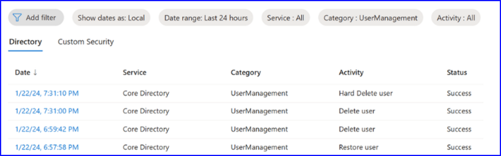
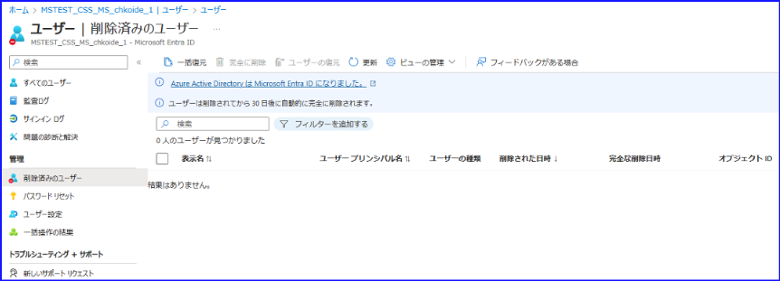
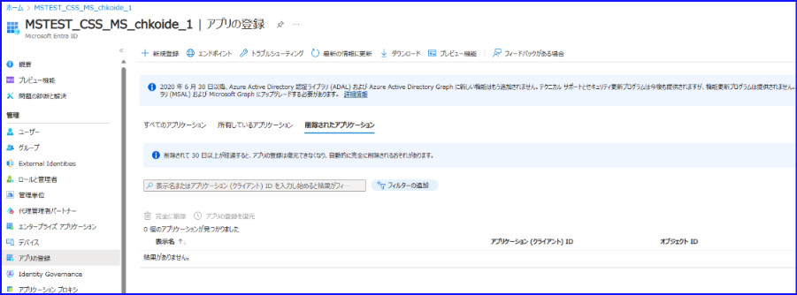
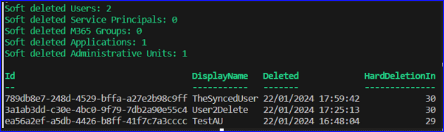

# Microsoft Entra IDにおける削除されたオブジェクトの追跡について

こんにちは！ Azure ID チームの小出です。

本記事は 2024 年 2 月 22 日に米国の Microsoft Entra (Azure AD) Blog で公開された [Keeping track of object deletions in Microsoft Entra ID](https://techcommunity.microsoft.com/t5/microsoft-entra-blog/keeping-track-of-object-deletions-in-microsoft-entra-id/ba-p/4053415) をもとに、日本語に分かりやすくおまとめしなおしたものになります。ご不明点等ございましたらサポート チームまでお問い合わせください。


##  はじめに

他のサービスでも同様ですが、Microsoft Entra ID では、誤ってオブジェクトを削除してしまった、もしくは悪意のあるユーザーに攻撃されてしまったなどの要因により、ユーザーやグループ オブジェクトをはじめ重要なデータを失う可能性があります。このため、どのように失われたオブジェクトを復旧させるかというオブジェクトの復旧戦略を考えることが不可欠です。
 
「完全削除」とは、オブジェクトが永久に消去され、いかなる手段によっても復元できないことです。この場合、弊社サポート部門にお問い合わせをいただいても復旧することはできません。データセンター側からもすべての情報が削除されてしまっているため、以前どのような状態であったかを確認することもできないためです。

しかし、多くのオブジェクトは、「論理的な削除 (Soft-Deleted)」 が利用できるため、完全削除される前にそれらを監視および管理することで対応が可能です。「論理的な削除」が行われると、オブジェクトはサービス内で削除済みとマークされ、ごみ箱に移動されますが、実際には削除されていない状態です。具体的には、たとえば Microsoft Entra ID でユーザーを削除した時、30 日間は「削除済みユーザー」の画面から復元ができるという機能が「論理的な削除」であり、その状態で 30 日を過ぎると削除済みユーザーからも消える動作が「完全削除」です。「論理的な削除」の利点は、30 日以内であればオブジェクトを元の構成と依存関係 (メンバーシップ、割り当て、権限など) とともに復元できることです。

したがって、Microsoft Entra ID で削除されたオブジェクトを監視および管理し、必要に応じて復元するか完全に削除するかを決めることが重要です。  
 
復元できるオブジェクトと復元方法についてまとめたものは下記のとおりです。


|オブジェクトの種類|復元可否 (Entra 管理センター)	|復元可否 (Graph API) | 注記 | 
|---|---|---|---|
| ユーザー (クラウドに作成)	| 〇	| 〇	|  | 
| ユーザー (同期) | × | × | *1 オンプレミス AD 側から操作ください。
| セキュリティ グループ	| ×	| × | *2 |  
| Microsoft 365 グループ | 〇 | 〇 | | 	
| 配布グループ | × | ×	| *2 | 
| アプリケーション | 〇 | 〇 |  | 	
| サービス プリンシパル	|  × | 〇 | 	| 
| 管理単位	| × | 	〇	|  | 
    
*1: ユーザーについて、同期されたユーザーオブジェクトもソフト削除に対応しています。ただし、Microsoft Entra 管理センター側から復元操作を行うのではなく、ソース (Active Directory) でリストアし、再度 Entra ID に同期する必要があります。再同期を行うと、ソフト削除されたオブジェクトが自動的にごみ箱から復元されます。 

*2: 上記表に記載されていますが、グループの論理的な削除は Microsoft 365 グループのみ利用可能です。このため、たとえばセキュリティ グループを誤って削除した場合、論理的な削除は利用できず、いきなり完全削除されてしまいます。緊急のお問い合わせなどで「セキュリティ グループを誤って削除してしまった」という内容も多くありますので、論理的な削除に対応していないグループを削除する際には十分ご留意ください。

## Entra ID 監査ログを使用した削除の追跡  

すべてのオブジェクトの削除は、削除のタイプに応じて監査ログに記録されます。たとえば、ユーザーを論理削除すると、"Delete user "というアクティビティで監査ログに表示されます。ユーザーを完全削除した場合、下図に示すように、"Hard Delete user "が記録されます。グループの場合は、"Delete group " や "Hard Delete group" が記録されます。 



以下の表では、論理削除をサポートするオブジェクトについて、論理削除、完全削除、および復元に関するアクティビティがどのような名前で監査ログに表示されるかをまとめています。

| 操作	| 論理削除に関する操作 | 	完全削除に関する操作 | 	復元に関する操作 | 
|---|---|---|---|
| グループ削除	| Delete group | 	Hard Delete group | 	Restore Group | 
| ユーザー削除	| Delete user | 	Hard Delete user | 	Restore user | 
| アプリ削除	| Delete application | 	Hard Delete application  | Restore application | 
| 管理単位の削除 | 	Delete administrative unit | 	(hard delete not possible) 	| Restore Administrative Unit | 
| サービス プリンシパルの削除 | 	Remove service principal | 	Hard delete service principal | 	Restore service principal | 

監査ログのイベントを扱う際には、以下の点にも注意ください： 

- Kusto Query Language (KQL) は大文字と小文字を区別するため、アクティビティ名の細かい違いに注意ください。厳密な "==" 演算子を使用すると、予期しない結果になることがあります。  
- 論理削除をサポートしないオブジェクトでは、完全削除を意味する "Delete objectType" イベントのみがログに記録されます。例えば、条件付きアクセスポリシーの削除などです。  
- オブジェクトの種類によっては、.csv ファイルを入力として、一括して操作を実行するオプションがあります。このような一括操作では、開始と終了のための追加イベントが記録されますが、リスト上のすべてのオブジェクトに対して個別のイベントが記録されます。たとえば、started (bulk) / Bulk restore deleted users - finished (bulk) のようなアクティビティです。
- 同期されたオブジェクトが Active Directory 上で同期解除または削除されると、Microsoft Entra ID 上でも対応するイベントとともに論理削除されます。    
 
## Microsoft Sentinel で削除を監視するクエリの例  
  
Microsoft Entra ID のログの収集と分析に Microsoft Sentinel または Log Analytics を使用している場合、KQL クエリを利用して、ログの調査やアラートに利用することができます。Microsoft Entra ID からのオブジェクト削除イベントの調査とアラートに役立つ KQL クエリの例をいくつか紹介します。

監査ログのうち、25 日以上前に論理削除されたログを抽出し、まもなく自動的に完全削除されるユーザーを確認する:

```
AuditLogs  
| where OperationName in ("Delete group", "Delete user", "Delete application", "Delete administrative unit",  "Remove service principal")  
| where TimeGenerated between (ago(29d) .. ago(25d))  
```

過去 10 分間に 50 以上のオブジェクトが完全削除されたことを検知する:

```
AuditLogs  
| where TimeGenerated > ago(10m)  
| where OperationName in ("Hard Delete group", "Hard Delete user", "Hard Delete application", "Hard delete service principal")  
| summarize count()  
| where count_ > 50  
```

ユーザー削除に続いて完全削除が行われることを検知する:

```
let queryfrequency = 1h;  
let queryperiod = 2h;  
AuditLogs  
| where TimeGenerated > ago(queryfrequency)  
| where OperationName =~ "Hard Delete user"  
| extend UserId = tostring(TargetResources[0].id)  
| project-rename HardDeletion_TimeGenerated = TimeGenerated  
| join kind=inner (  
    AuditLogs  
    | where TimeGenerated > ago(1d)  
    | where OperationName =~ "Delete user"        
    | extend UserId = tostring(TargetResources[0].id)  
    | project-rename SoftDeletion_TimeGenerated = TimeGenerated  
) on UserId  
| extend TimeDelta = HardDeletion_TimeGenerated - SoftDeletion_TimeGenerated  
| where  TimeDelta between (time(0s) .. queryperiod)  
```

上記のクエリは例として提供されたもので、実際の検出ロジックと閾値は各組織によって異なると思われます。1つのアプローチとして、Sentinel のワークブックを構築してデータを視覚化し、それを元に削除/復元/完全削除のベースラインを確立することで、より検知をやりやすくなると思われます。
 
## 削除されたオブジェクトのレビュー  
 
監視と並行して、削除されたオブジェクトのレビューを行うことをお勧めします。レビューは、定期的に行うことも、前述の検出イベントによって行うこともできます。これは、Microsoft Entra 管理センター、監査ログベースのクエリ、または Microsoft Graph API を使用して実行できます。

### Microsoft Entra 管理センター / Azure ポータル 

削除されたユーザー、グループ、またはアプリケーションの「ごみ箱」を調べる最も簡単な方法は、Microsoft Entra 管理センターまたは Azure ポータルで Microsoft Entra ID を確認することです。ただし、この方法では、オブジェクトの種類によってインターフェイスが若干異なりますし、管理単位やサービス プリンシパルではポータルの画面が用意されていないため、限界があります。







### 監査ログ

監査ログを使用して、過去 30 日間に削除されたすべてのオブジェクトを表示する「論理削除アイテム レポート」を作成することもできます。   

以下は、ユーザー オブジェクトに対するクエリのサンプルです:

```
let Users = AuditLogs  
| where TimeGenerated > ago(30d)  
| where Category == "UserManagement";  
Users  
| where OperationName =~ "Delete user"        
| extend UserId = tostring(TargetResources[0].id)  
| join kind=anti (  
Users  
| where OperationName =~ "Hard Delete user"  
| extend UserId = tostring(TargetResources[0].id)  
) on UserId  
| join kind=anti (  
Users  
| where OperationName =~ "Restore user"  
| extend UserId = tostring(TargetResources[0].id)  
) on UserId  
```


削除済みユーザー (ゴミ箱) の情報を実際に参照することがおすすめですが、この監査ログの方法でもワークブックやレポートを作成する際には有効です。

### Microsoft Graph API

PowerShell と Microsoft.Graph モジュールを使用して Microsoft Graph API を呼び出すことで、ごみ箱に現在あるすべてのオブジェクトのリストを取得できます。以下のサンプル コードは、すべてのオブジェクト タイプのレポートを生成し、必要に応じて、Restore-MgBetaDirectoryDeletedItem コマンドレットを使用して復元を実行するように簡単に調整できます。 

```
Install-Module Microsoft.Graph  
Connect-MgGraph   

$deletedUsers = Get-MgBetaDirectoryDeletedItemAsUser  
$deletedServicePrincipals = Get-MgBetaDirectoryDeletedItemAsServicePrincipal  
$deletedGroups = Get-MgBetaDirectoryDeletedItemAsGroup  
$deletedApplications = Get-MgBetaDirectoryDeletedItemAsApplication  
$deletedAUs = Get-MgBetaDirectoryDeletedItemAsAdministrativeUnit 

$deletedItems = @()  

$deletedItems += $deletedGroups  
$deletedItems += $deletedApplications  
$deletedItems += $deletedUsers  
$deletedItems += $deletedServicePrincipals  
$deletedItems += $deletedAUs  

if ($deletedItems.Count -eq 0) {  
    Write-Host "No soft deleted objects found." -ForegroundColor Green  
}  
else {  
    Write-Host "Soft deleted Users: $($deletedUsers.Count)" -ForegroundColor Green  
    Write-Host "Soft deleted Service Principals: $($deletedServicePrincipals.Count)" -ForegroundColor Green  
    Write-Host "Soft deleted M365 Groups: $($deletedGroups.Count)" -ForegroundColor Green  
    Write-Host "Soft deleted Applications: $($deletedApplications.Count)" -ForegroundColor Green  
    Write-Host "Soft deleted Administrative Units: $($deletedAUs.Count)" -ForegroundColor Green  

    $report = foreach ($item in $deletedItems) {  
        $deletedDate = Get-Date($item.DeletedDateTime)  
        $now = Get-Date  
        $hardDeletedInDays = 30 - ($now - $deletedDate).Days  

        [PSCustomObject]@{  
            Id                  = $item.Id  
            UserPrincipalName   = $item.UserPrincipalName  
            DisplayName         = $item.DisplayName  
            Deleted             = $deletedDate  
            HardDeletionIn      = $hardDeletedInDays  
        }  
    }  
    $report | Sort-Object 'Display Name' | Select-Object Id, DisplayName, Deleted, HardDeletionIn | Format-Table   
    $report | Export-Csv -Path "C:\temp\softDeletedObjects.csv" -Encoding UTF8 -NoTypeInformation  
}  
```


このスクリプトは以下のような .csvファイルを生成し、要約した情報を出力します：




## まとめ

Microsoft Entra ID における削除の追跡は、誤ってまたは悪意を持って削除されたオブジェクトの特定と復元、ディレクトリ内の変更の監視と監査だけでなく、セキュリティ ポリシーと規制の遵守、不要となったオブジェクトの削除によるライセンス使用の最適化などにも役立ちます。

上記のクエリを出発点として削除を監視いただき、削除されたアイテムの定期的なレビューを行って、オブジェクトが完全削除されて復元できなくなる前に、予期せぬ削除を検出できるようにしてください。
