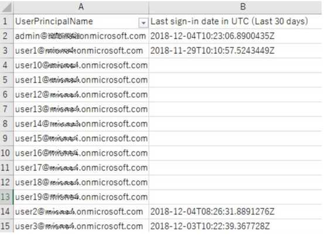

> 本記事は Technet Blog の更新停止に伴い https://blogs.technet.microsoft.com/jpazureid/2018/12/12/last-signin-reports/ の内容を移行したものです。
> 元の記事の最新の更新情報については、本内容をご参照ください。

# PowerShell にて全ユーザーの最終サインイン日時を一括で取得する方法

こんにちは、Azure & Identity サポート チームの小野です。今回は、PowerShell で Azure AD 上の全ユーザー（ゲストユーザーも含む）の最終サインイン日時を一括で取得する方法をご紹介します。

Azure AD における最終サインイン日時は、皆さまから強いご要望を受けており開発チームも機能追加に向け動き出しています。
今回ご案内する方法は正式に機能が追加されるまでの回避策となりますが、ご活用いただけますと幸いです。

この方法を実施すると、以下のようにユーザー毎の最終サインイン時刻が、csv 形式で出力されます。

なお、今回はスクリプトとしてご用意をしたため、Japan Azure ID Support チームの GitHub にアップロードをしましたので、以下サイトをご確認ください。

[Get last-sign-in activity reports](https://github.com/jpazureid/get-last-signin-reports)

今後も、Japan Azure ID Support チームの GitHub には、Azure を利用するにあたり便利なスクリプトをアップロードしてまいります。

ぜひチェックしてみてください！

ご不明な点がございましたら弊社サポートまでお気軽にお問い合わせください。上記内容が少しでも皆様の参考となりますと幸いです。

※本情報の内容（添付文書、リンク先などを含む）は、作成日時点でのものであり、予告なく変更される場合があります。
