# ライフサイクル ワークフローを利用した簡易人事システムの紹介

こんにちは！ Entra ID チームの小出です。
今回は比較的新しく登場した、 Microsoft Entra ID のライフサイクル ワークフローの機能を利用し、簡易人事システムで新入社員のオンボードを自動化するフローをご紹介します。

あっという間に春になり、Microsoft Entra ID を利用されているお客様の中でも特に人事部・システム部の方にはとても忙しい時期になっていたかと思います。
新卒・中途で新しく入られた社員を迎えたり、異動や退職があったりと、アカウントを手動で管理していると膨大なタスクがある時期です。
入社・異動・退職と人事部・システム部には様々なタイミングでアカウントの管理を行う必要がありますが、今回はそのうち、新入社員対応にフォーカスを置き、新しい社員のアカウントを作るだけで残りの操作はすべて実施してくれるワークフローをご紹介します。


## ライフサイクル ワークフローのイメージ

**＜利用前＞**


**＜利用後＞**


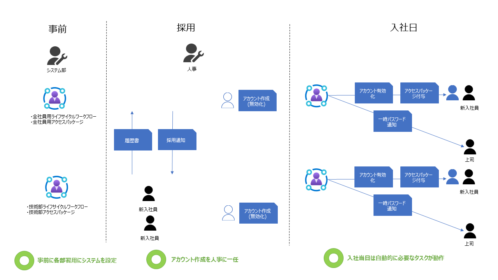


## 具体的なシナリオ
今年 4 月に採用する新卒社員が 3 人、中途社員が 2 人決まりました。 5 人の所属は下記の通りで、全員 4 月 1 日に入社します。（本シナリオに登場する上記ユーザー・企業などはすべて架空のものです。）

| 名前	| 新卒 or 中途	| 部署	| 割り当てるアクセス パッケージ| 
| ---- | ---- | ---- | ---- |
| 田中 美咲	| 新卒	| 企画部 - プロジェクト企画	| Contoso 全社員、Contoso 新卒、企画部 | 
| 山田 花子	| 新卒	| 技術部 - データ分析	| Contoso 全社員、Contoso 新卒、技術部| 
| 伊藤 舞	| 新卒	| 技術部 - 開発	|  Contoso 全社員、Contoso 新卒、技術部 | 
| 鈴木 健太	| 中途	| 技術部 - テクニカル サポート	|  Contoso 全社員、技術部 | 
| 佐藤 健二	| 中途	| 総務部 - 社内セキュリティ	| Contoso 全社員、総務部| 


## システム部門の準備編
上述した新入社員が入社後にすぐに業務に必要なリソースを利用できるようにシステムを設計・構築していきます。

### 前提条件
- 組織のテナントに、 Microsoft Entra ID Governance ライセンスがあること
- 「グローバル管理者」や「Identity Governance 管理者」などのロールを持っており、テナントに変更が加えられる権限があること
- Microsoft Entra ID - セキュリティ - 認証方法の「一時アクセス パス」が有効であること


### 事前準備
- アクセス パッケージで一括割り当てしたいグループや Sharepoint サイトなどのリソースを作成する
- 「Contoso 全社員」「Contoso 新卒」「企画部」「技術部」「総務部」の 5 つのアクセス パッケージを作り、リソースをパッケージに追加しておく

| アクセス パッケージ名	| 含まれているリソース	| 特徴	|
| ---- | ---- | ---- | 
| Contoso 全社員	| グループ <br>・ Contoso 社員<br><br> SharePoint サイト<br>・ Consoto 全体サイト	| ・ 退職しない限り割り当ては削除されない<br><br>・ ゲストではない社内のユーザーなら誰でも承認なく要求ができる |
| Contoso 新卒	| グループ <br>・ 若手社員 (1-3 年目)<br><br> SharePoint サイト<br>・ 新人研修	| ・ 新入社員と若手社員が交流できるグループや研修グループなどがまとまっている<br><br>・ 3 年たったら割り当てが削除される |
| 企画部	| グループ <br>・ 企画部<br><br> | - |
| 技術部	| グループ <br>・ 技術部<br><br> アプリ<br>・ Github| - |
| 総務部	| グループ <br>・ 総務部<br><br> | - |


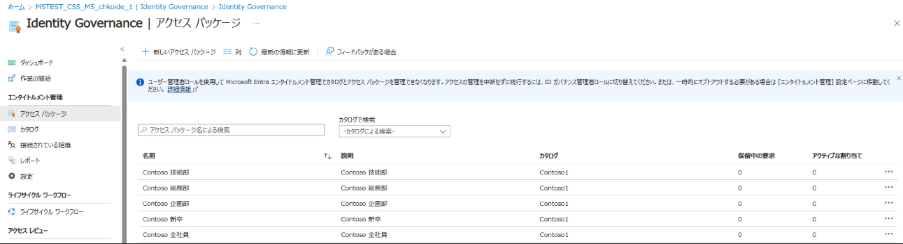

基本的なアクセスパッケージの作成方法は、[こちらのブログ](https://jpazureid.github.io/blog/azure-active-directory/access-management-with-access-package/) の B-2 シナリオを参考にしてください。

アクセス パッケージの中でカスタム拡張機能を利用し、複雑な操作を行いたい場合は、[エンタイトルメント管理におけるカスタム拡張機能の利用方法](https://jpazureid.github.io/blog/azure-active-directory/access-package-with-custom-extension/) を参考にして、ロジック アプリ側で実装します。基本的なロジック アプリや Graph API の知識も必要となりますので、はじめてアクセス パッケージやライフサイクル ワークフローを利用するお客様は、基本的な B-2 シナリオで作成することをお勧めします。

### 今回のシステムで作るもの
- ライフサイクル ワークフロー（LCW）を利用し、新しく入社した全社員向けとして「全社員オンボード LCW」、3 部署分の「各部署オンボード LCW」、最後に新卒者向けリソースを当てる「新卒社員オンボード LCW」を作成します。

### ライフサイクル ワークフローの作成本編

#### 1. ワークフローで実施したいことを決める

まずはどのような作業を自動化したいのか、ワークフローで実施したいことを決めます。またその「やりたいこと」に合致する「タスク」が存在するかを確認します。たとえば今回の場合は下記のような内容です。
| 対象	| やりたいこと	| タスク	| ワークフロー |
| ---- | ---- | ---- | ---- | 
| 全社員	| ・ 入社日に、新入社員のアカウントを有効化する <br><br>・ 入社日に、 新入社員アカウントの一時パスワードをマネージャーに通知する<br><br>・ 入社日に、新入社員アカウントが全社員向けのリソースへアクセスできるようにする 	| ・ユーザー アカウントを有効にする<br><br>・TAP を生成しメールを送信する<br><br> ・ユーザーアクセスパッケージの割り当ての要求|・ 全社員オンボード LCW |
| 全社員	| ・ 入社日に、所属している部署ごとのリソースへアクセスできるようにする（今回は一例として、「技術部」部署を例に紹介します。 	| ・ユーザーアクセスパッケージの割り当ての要求|・ 各部署オンボード LCW |
| 新卒のみ | ・ 入社日に、新入社員のうち新卒の方に、社会人おめでとうメッセージを送る<br><br>・ 入社日に、新入社員のうち新卒の方が、新人研修用リソースにアクセスできるようにする 	| ・ウェルカム メールの送信 <br><br>・ユーザーアクセスパッケージの割り当ての要求|・ 新卒社員オンボード LCW |


「新入社員のアカウント有効化」は全員共通で実施してよいですが、ビジネス マナーなどを教える「新人研修用リソースへのアクセス」は、基本的に新卒の社員だけで良いかと思います。

実際にどのような操作が自動化されれば業務効率化につながるか、人事部とシステム部で相談し、どのようなタスクを組み込むかを決定してください。


#### 2. ワークフローの構成を決める
ワークフローは、「トリガー」と「スコープ」をもとに実行されます。
「トリガー」は指定したユーザー属性がどのような状態になったときにワークフローが実行されるかを決めるものとなり、さらに「スコープ」を利用してしてきめ細かな条件を指定してワークフローの適用有無を設定することが可能です。

今回作成するワークフローは以下のとおりです。

```
全社員オンボード LCW
└trigger: employeeHireDate 0day (「新入社員をオンボードする」テンプレートを使用)
└scope: accountEnabled eq false
└task: 
    ユーザーアカウントを有効にする
    TAP を生成しメールを送信する
    ユーザーアクセスパッケージの割り当ての要求
    └Contoso 全社員
       └ 全社員用グループリソース
       └ 全社員用 SPO リソース
```
 
```
各部署オンボード LCW
└trigger: employeeHireDate 0day (「新入社員をオンボードする」テンプレートを使用)
└scope: department eq "<各部署の名前>"
└task: 
    ユーザーアクセスパッケージの割り当ての要求
    └技術部
       └ 技術部用グループリソース
       └ 技術部用アプリリソース
```

```
新卒社員オンボード LCW
└trigger: employeeHireDate 0day (「新入社員をオンボードする」テンプレートを使用)
└scope: employeeType "新卒"
└task: 
    ウェルカム メールの送信
    ユーザーアクセスパッケージの割り当ての要求
    └ Contoso 新卒
       └ 若手社員 (1-3 年目) グループ リソース
       └ 新人研修SPOリソース 
```
#### 3.上記をもとに、実際にワークフローを作成していきます。

**＜全社員オンボード LCW＞**
1. Azure ポータルより、 Microsoft Entra ID - Identity Governance - ライフサイクル ワークフローを選択します。
2. ワークフローの作成をクリックし、テンプレート選択画面で下記を指定します。

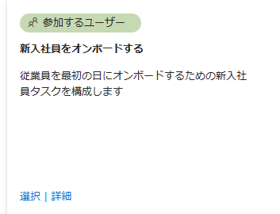

3. 名前と説明を記載します。それ以外の項目はそのまま先に進みます。

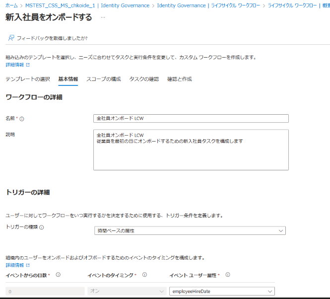

4. スコープを指定します。今回は、まだ有効になっていないアカウントを対象にするので、accountEnabled が False である条件にしました。


5. 下記のようにタスクを追加していきます。アクセス パッケージを要求するタスクでは、どのアクセス パッケージを要求させたいのかまず指定します。

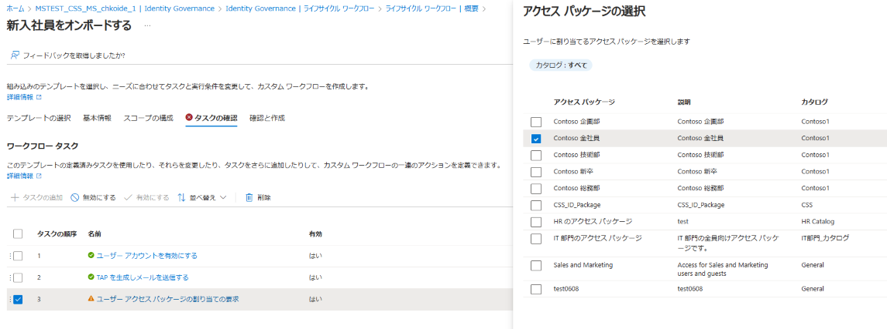

アクセス パッケージを選択したら、ポリシーの選択を行います。

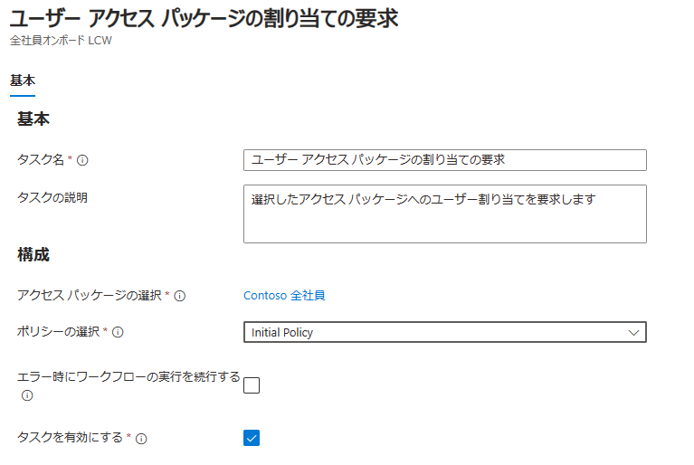

6. 下記のように、すべてのタスクが緑になったら完了です。

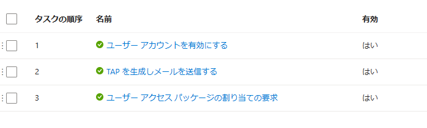

7. 最後のレビュー画面で、下記チェックをオンにして作成します。


**＜各部署オンボード LCW＞（ここでは例として技術部を紹介します。他の部署も作成方法は同様です。）**
1. Azure ポータルより、 Microsoft Entra ID - Identity Governance - ライフサイクル ワークフローを選択します。
2. ワークフローの作成をクリックし、テンプレート選択画面で下記を指定します。


3. 名前と説明を記載します。それ以外の項目はそのまま先に進みます。

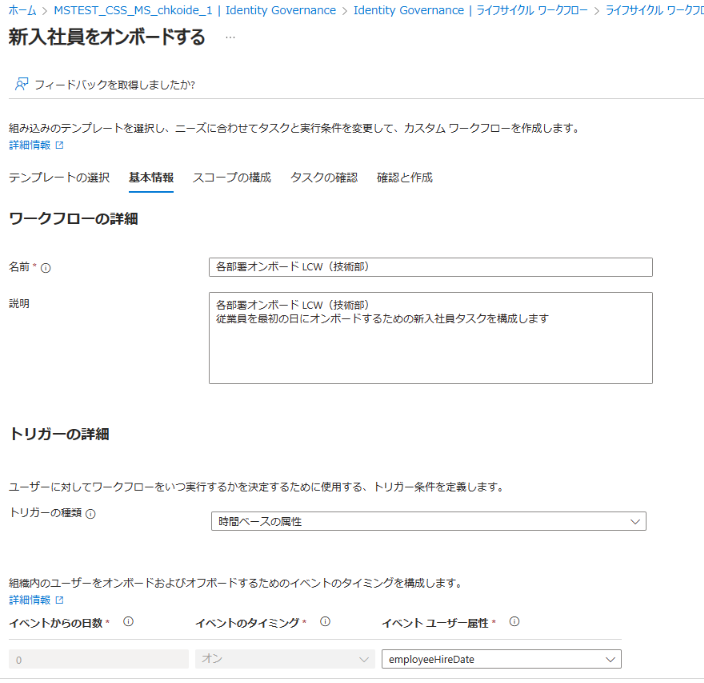

4. スコープを指定します。今回は、部署ごとに実行するワークフローを制御したいので、下記のように department 属性が Tech となっているユーザーのみ対象にします。

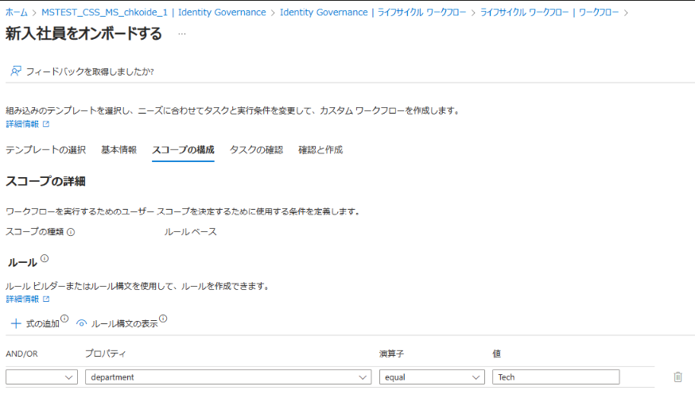

5. 下記のようにタスクを追加していきます。アクセス パッケージを要求するタスクでは、どのアクセス パッケージを要求させたいのかまず指定します。

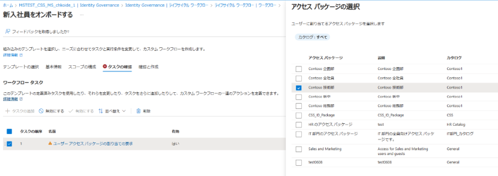

アクセス パッケージを選択したら、ポリシーの選択を行います。

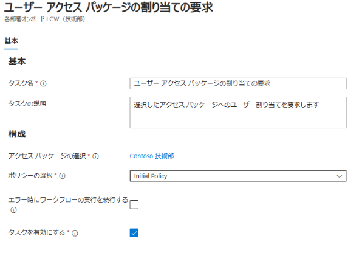

6. 下記のように、すべてのタスクが緑になったら完了です。ほかにも部署ごとに実行したい操作があれば、「タスクの追加」から追加可能です。


7. 最後のレビュー画面で、下記チェックをオンにして作成します。

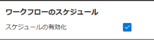

**＜新卒社員オンボード LCW＞**
1. Azure ポータルより、 Microsoft Entra ID - Identity Governance - ライフサイクル ワークフローを選択します。
2. ワークフローの作成をクリックし、テンプレート選択画面で下記を指定します。


3. 名前と説明を記載します。それ以外の項目はそのまま先に進みます。


4. スコープを指定します。今回は、新入社員のうち新卒のみを対象にするために、 employeeType 属性に新卒というワードが記載されているユーザーにスコープを絞ります。この属性を他の用途で使用している場合は、ほかの空いている属性を利用しても問題ありません。

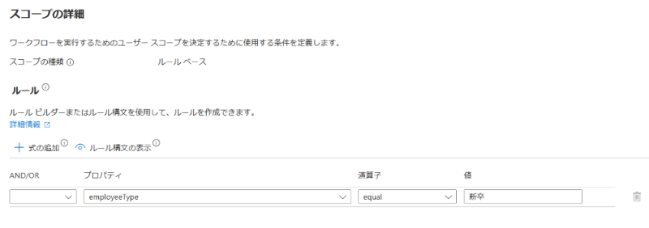

5. ウェルカム メールの送信をタスクとして追加します。(詳細は文末をご参照ください) また、先ほどと同様に新卒向けアクセス パッケージの要求タスクを作成します。

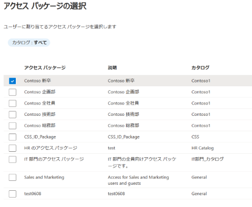

6. スケジュールを有効にして作成します。

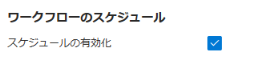


## 人事部門側での実際の操作・動作編（事前編）


1. 面接を経て、新卒社員・中途採用の社員が決まります。
2. 面接のときに利用した履歴書の情報を利用して、ユーザー アカウントを先に作ります。ユーザー管理者ロールもしくはグローバル管理者ロールを保有しているユーザーで、Azure ポータル - Microsoft Entra ID - ユーザーを開き、[新しいユーザー] - [新しいユーザーの作成] をクリックします。

3. すると、ユーザー プリンシパル名など、新しく追加するユーザーの情報入力画面が表示されるので、下記を順番に入力していきます。

| 設定する項目	| 説明 | 
| ---- | ---- | 
| ユーザー プリンシパル名（UPN）| 	ユーザーがサインインするときに利用するアカウント名です。| 
| 表示名 | 	ユーザーの表示名です。| 
| パスワード	| 仮パスワードを指定します。自動作成にチェックを入れて、システムが自動的に作成したパスワードを利用しても問題ありません。 | 
| 有効なアカウント	| まだ入社していないユーザーなので、チェックを外してオフにしておきます。| 


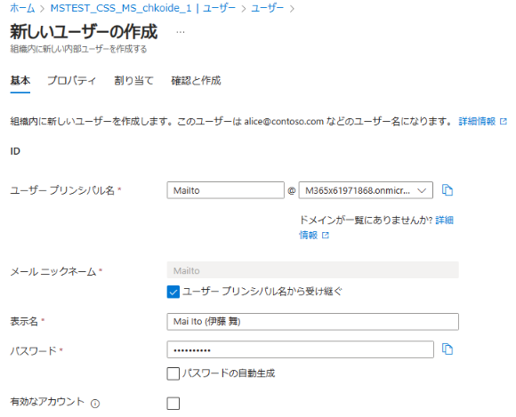

4. 次へ進むと、プロパティ タブに移動するので、下記情報を入力していきます。

| 設定する項目	| 説明 | 
| ---- | ---- | 
|名	| ユーザーの名前です。 |
|姓	| ユーザーの名字です。 |
|役職	| 役職を指定します。 |
|部署	| 所属する部署を指定します。 |
|従業員の種類	 | 新卒入社の方には「新卒」と記載します。 |
|従業員入社日	| ユーザーが入社する日にちを指定します。この項目に指定した日付をもとに、ワークフローが実行されるため、必ず指定してください。|
|マネージャー	| 上司にあたるユーザーです。一時アクセス パスが送付されるユーザーになるので、必ず指定してください。|
|利用場所	| 日本の場合は「日本」を選択します。主に、メール送付系のタスクを組み込み時には、 ExO ライセンスの割り当てが必要となります。ライセンスの割り当てに際し利用場所の登録が必須のため登録してください。グループ ベースでライセンスを管理している場合は、テナントの場所が継承されるため任意です。|

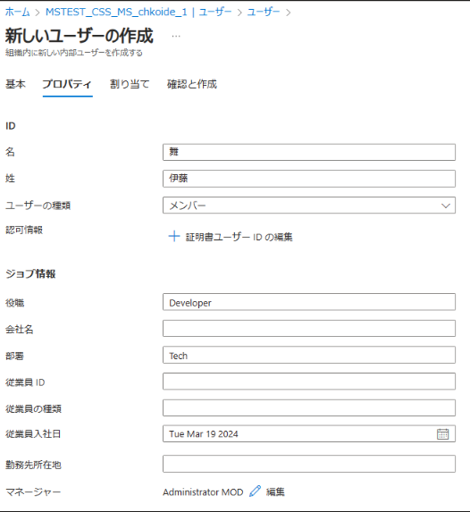


5. ユーザー アカウントを作成します。


## 実際の操作・動作編（当日編）
上記で従業員入社日を指定していれば、ライフサイクル ワークフロー側のスケジュールが自動的に実行され、指定されたタスクが自動実行されます。
当日はシステム部も人事部も何も作業をする必要はありません。

人事部が事前に作成したユーザーアカウントに対して、システム部が事前に作成したワークフローが自動トリガーされます。


## システム部によるトラブルシューティング編

ユーザーからの申告等で何等か問題が発生したことが疑われる場合は、ワークフローの実行が正常に完了しているかを確認してください。下記のように、「ワークフロー履歴」の画面で、状態が緑のチェックと完了と表示されていれば、正常に処理が完了しています。

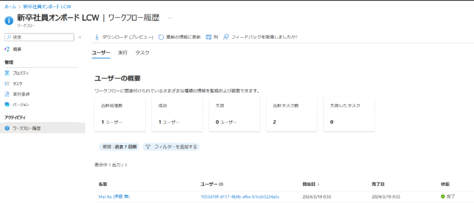

赤いチェックと失敗の文字が表示されていれば、そのユーザーへのタスク実行は失敗しています。


失敗しているユーザー名をクリックすると詳細が確認でき、どの操作で失敗したのかや、その後の処理はどうなったかなどを確認することができます。
ライセンスを割り当てるタスクを入れていたが、「利用場所」に登録を忘れていた、マネージャーにメールを送るタスクなのに「上司」属性に値がなかったなど、失敗の原因が分かる場合には、ユーザー登録時に不足していた情報を追加してください。

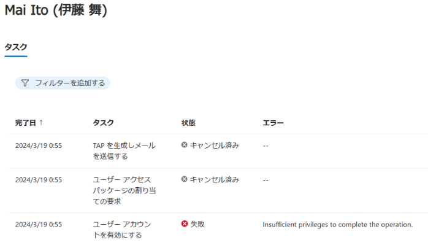

その後、該当のワークフローのトップ画面から「オンデマンドで実行」をクリックし、そのユーザーへのワークフローを再度実行してみてください。
ライフサイクル ワークフローでは、このように手動での実行もできますので、スケジュール実行に失敗したユーザーがいても、再度簡単に実行できます。


## 便利タスク

ライフサイクル ワークフローで利用なタスクは [ライフサイクル ワークフローのタスクと定義](https://learn.microsoft.com/ja-jp/entra/id-governance/lifecycle-workflow-tasks) の公開情報にて確認が可能ですが、そのうち便利なメールの送付機能について簡単に補足します。

### ウェルカムメールの送信機能
ウェルカム メールを送信します。ライフサイクル ワークフローのメール送信タスクは、 Graph API などの操作に詳しくなくても簡単に利用できます。
下記で、 CC としてメールを受信したいユーザーを指定したり、エラーが発生してもワークフローが停止しないようにすることができます。


また、下記のように枠内に件名と本文メッセージを入力するだけで、簡単にメール文面を指定できます。


また、「〇〇さん、入社おめでとうございます！」のように、メールの文面をユーザーに応じて変化させたいこともあると思います。
その際は、{{userDisplayName}} のように、中括弧｛｝を二重にして属性を囲うことで、簡単に動的な値を指定することが可能です。


また、ワークフロー設定にて、カスタム ドメインを利用したアドレスを送付元アドレスとして利用したり、会社のブランドで指定したロゴを利用するかなどカスタマイズ機能も用意されています。
カスタマイズ機能の詳細は [ワークフロー タスクから送信されるメールをカスタマイズする](https://learn.microsoft.com/ja-jp/entra/id-governance/customize-workflow-email) にて案内しております。


前回の記事での案内の通り、アクセス パッケージ内で Graph API を呼び出しメールを送付することも可能ですが、ポータルからより分かりやすい形でメールの設定が可能ですので、こちらのタスクもぜひご利用くださいませ。


今回は、ライフサイクル ワークフローを利用して、新入社員対応に伴う人事処理を自動化できる簡単なシステムを紹介しました。

ライフサイクル ワークフローには様々なテンプレートが用意されておりますので、上記内容を応用することで、異動や退職者対応なども自動化することも可能です。上記内容を参考にライフサイクル ワークフローを活用いただければ幸いです。
