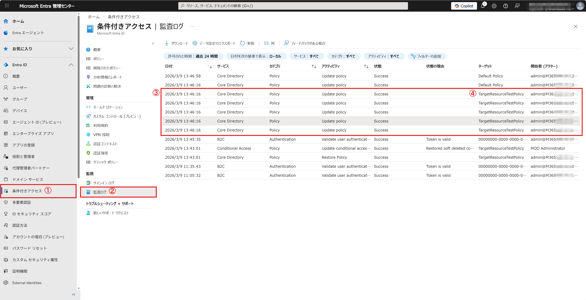

# 条件付きアクセス ポリシー更新時に「Update policy」の監査ログが分割されて記録される挙動について

## はじめに
こんにちは、Azure Identity サポート チーム Lynn です。
条件付きアクセス ポリシーに対して変更を行ったときに記録されるデータ量が多くなる場合、更新操作は 1 回のみであるにもかかわらず、監査ログ上では「Update policy」という同一のアクティビティが、複数件連続して記録されることがあります。
この事象が発生すると、Microsoft Entra 管理センター上で個々の監査ログを確認しても、実際にポリシーのどの設定がどのように変更されたのかを判別しにくい状態になります。
本記事では、この事象の内容と対処方法について解説します。

## 観測される挙動

例として指定するターゲット リソースが多い条件付きアクセス ポリシーに対して変更を行うと、1 回の更新操作に対して「Update policy」の監査ログが複数件、生成される場合があります。
参考までに弊社検証環境における動作として、条件付きアクセスの対象ターゲット リソースを約 480 個指定したうえでターゲット リソースの更新を行ったところ、1 回の更新操作に対して「Update policy」の監査ログが 5 件生成される挙動を確認しました。
これらのログは、同一の日時、同一のターゲット、同一の開始者 (アクター) で連続して記録されており、見た目上は「複数回更新が行われた」ように見える点が特徴です。



しかしながら、これらのログを 1 つずつ確認すると、複数回の更新が行われたのではなく 1 回の更新が複数の監査ログ レコードに分割されて記録されていることに気づきます。
このとき、通常は変更内容が表示される「変更されたプロパティ」タブが空で表示されますが、これは変更が行われていないことを示すものではありません。分割された監査ログ レコードを総合して変更内容を確認する必要があります。

## なぜ監査ログが分割されるのか

通常、条件付きアクセス ポリシーに設定されているターゲット リソースの数が比較的少ない場合には、ポリシー更新時の変更内容は 1 件の監査ログ レコードに記録されます。
一方で、条件付きアクセス ポリシーに対して数百件規模のターゲット リソースを指定している場合、更新時に記録されるデータ量 (アプリケーション GUID などを含む JSON データ) が非常に大きくなります。
その結果、1 件の監査ログ レコードに記録可能なサイズ上限を超過するため、データが欠落しないよう、システム側で監査ログが自動的に複数件に分割されて記録されます。
この挙動は想定された動作であり、また、監査ログの内容そのものが失われているわけではありません。

## 分割された監査ログの構造と読み方

通常、変更内容が比較的少ない場合には、JSON の監査ログ レコードの `targetResources` 内の `modifiedProperties` に変更前・変更後の値が直接表示されます。
しかし、ターゲット リソースに指定したアプリケーション数が多いなど JSON のデータ量が大きくなる場合、変更内容が `modifiedProperties` に収まりきらないため、分割されたデータとして `additionalDetails` 側に記録される挙動に自動で切り替わります。

分割された監査ログでは、Microsoft Graph API の監査ログ (Audit Logs) における `additionalDetails` セクションに、以下のような管理用のキーが含まれます。

|キー|意味|役割|
|---|---|---|
|id|相関 ID (Correlation ID)|分割された複数のログが、同一の操作に属することを示します|
|seq|シーケンス番号|分割されたデータの何番目の断片かを示します (例：1, 2, 3…)|
|b|データ本体|分割された JSON データの一部です|
|c|総数|データが何件に分割されているかを示します|

同一の `id` を持つログを `seq` の順番に並べ、それぞれの `b` の値を順に結合することで、本来 1 回の操作として記録されるべき変更内容を論理的に復元することが可能です。

以下は、実際に API から取得できる「分割されたログの 1 レコード例」です。

> [!NOTE]
> 以下の例では説明のために JSON 内にコメントを付与していますが、実際の API レスポンスにコメントは含まれません。

```json
{
  "id": "Directory_xxx_0001",
  "category": "Policy",
  "activityDisplayName": "Update policy",
  "correlationId": "00000000-0000-1234-5678-0000000090ab",
  "activityDateTime": "2026-03-06T06:02:10Z",
  "result": "success",

  "targetResources": [
    {
      "id": "<対象ポリシーの GUID>",
      "displayName": "ExampleConditionalAccessPolicy",
      "type": "Policy",
      "modifiedProperties": []
      // データが大きいため modifiedProperties は空になる
    }
  ],

  "additionalDetails": [
    {
      "key": "id",
      "value": "policy-id-123"
      // 分割された複数のログが、同一の操作に属することを示します
    },
    {
      "key": "seq",
      "value": "1"
      // 分割ログの順序番号 (同一 "id" 内での位置)
    },
    {
      "key": "b",
      "value": "{ \"Users\": { \"Include\": [ { \"Groups\": [ \"group-id-1\" ] } ],"
      // 実際のポリシー設定 JSON の断片 (文字列) 
      // seq 順にすべて結合して初めて意味を持つ
    },
    {
      "key": "c",
      "value": "5"
      // 重要
      // この操作 (correlationId) で生成された分割ログの総数
      // seq=1 ～ seq=5 が存在することを示す
    }
  ]
}
```

## 分割された監査ログの確認方法 (手動)

分割された監査ログの内容を確認する一例として、テキスト エディターを用いてデータを結合する方法をご紹介します。

1. [Microsoft Entra 管理センター] > [監視と正常性] > [監査ログ] を表示します
2. 同一の日時、同一のターゲット、同一の開始者 (アクター) で連続して記録されている複数の「Update policy」ログを確認します
3. 各ログの `additionalDetails` 内にある `b` の値を、`seq` の順にコピーします
4. 空白や改行を入れずに連結し、1 つの文字列として復元します
5. 復元したデータを確認し、どのような変更が行われたかを確認します

この方法により、分割されて記録された変更内容を確認することが可能です。

## 分割された監査ログの確認方法 (自動化)

上述した手動での結合作業は、分割数が多い場合には煩雑になるため、調査を補助する目的でスクリプトを用いた自動化についてもご案内いたします。

分割された監査ログを Microsoft Graph API 経由で自動的に取得・結合し、変更前後の差分を確認する PowerShell スクリプトを以下の GitHub リポジトリにて公開しています。事前準備や実行手順の詳細についてもリポジトリの README に記載しておりますので、併せてご参照ください。

> [!NOTE]
> なお、以下のスクリプトでは、条件付きアクセスのターゲットリソースが多い場合の変更に特化した処理を実装しています。

- [Recover split audit logs for Conditional Access policy changes](https://github.com/jpazureid/long-audit-log-recovery)

### 免責事項

本サンプル コードは、あくまでも説明のためのサンプルとして提供されるものであり、製品の実運用環境で使用されることを前提に提供されるものではありません。本サンプル コードおよびそれに関連するあらゆる情報は、「現状のまま」で提供されるものであり、商品性や特定の目的への適合性に関する黙示の保証も含め、明示・黙示を問わずいかなる保証も付されるものではありません。マイクロソフトは、お客様に対し、本サンプル コードを使用および改変するための非排他的かつ無償の権利ならびに本サンプル コードをオブジェクト コードの形式で複製および頒布するための非排他的かつ無償の権利を許諾します。但し、お客様は以下の 3 点に同意するものとします。

1. 本サンプル コードが組み込まれたお客様のソフトウェア製品のマーケティングのためにマイクロソフトの会社名、ロゴまたは商標を用いないこと
2. 本サンプル コードが組み込まれたお客様のソフトウェア製品に有効な著作権表示をすること
3. 本サンプル コードの使用または頒布から生じるあらゆる損害 (弁護士費用を含む) に関する請求または訴訟について、マイクロソフトおよびマイクロソフトの取引業者に対し補償し、損害を与えないこと

## まとめ

- 条件付きアクセス ポリシー更新時に監査ログが分割されて記録される場合があります
- 本挙動は、データ量が大きい場合に発生する想定された動作です
- 分割されたログでは、`additionalDetails` 内の情報を基に内容を確認する必要があります
- 単一ログや「変更されたプロパティ」だけで判断しない点にご注意ください

もしも上記の内容について不明点などある場合には、お客様環境などを十分に把握したうえでサポート部門より提供しますので、ぜひ弊社サポート サービスをご利用ください。
