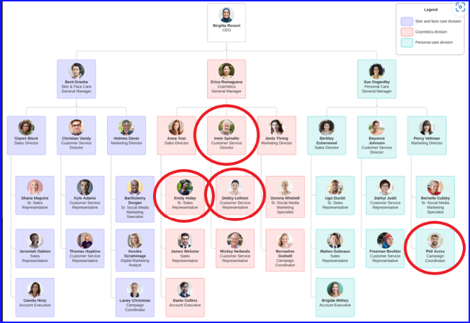
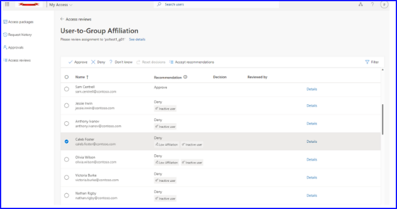

こんにちは。 Azure ID チームの小出です。

この記事では、2022 年 12 月 1 日に公開された [Introducing Machine Learning based recommendations in Azure AD Access reviews](https://techcommunity.microsoft.com/t5/microsoft-entra-azure-ad-blog/introducing-machine-learning-based-recommendations-in-azure-ad/ba-p/2466923) の記事の抄訳をもとに、新しいアクセス レビューの機能について紹介します。

---

従業員やゲスト、ワークロード ID のアクセスを管理できる Azure AD のアクセス レビューの機能は、すでに多くのお客様にご利用いただいております。一方、これまでに「レビューのプロセスを簡単にしてほしい」、「もう少し迅速に決定を下せるようにしたい」とのご要望をいただいていました。

今回は、「ピア外れ値」を活用した、新しいアクセス レビューの「推奨事項」についてご紹介します。

この機能は、高度な機械学習モデルを使用し、組織のレポート構造 (組織図) に基づいて、レビュー対象グループへのユーザーの所属状況を判断します。この機能が「推奨事項」に追加されたことにより、レビュー担当者は、レビューを簡単に行うことができるようになりました。
 

## User-to-Group Affiliation (ピア外れ値) とは何ですか？

User-to-Group Affiliation (ピア外れ値) は、組織のレポート構造 (組織図) に基づいて、グループ内の他のユーザーとユーザーの相対的な所属を比較するものです。機械学習ベースで点数をつけるメカニズムにより、組織階層内のユーザー間の距離を識別する仕組みです。これにより、グループ内の他のユーザー (ピア) と非常に離れているユーザー、つまり「所属度合いが低い」外れ値のユーザーを検出し、システムは「拒否」の推奨事項を表示します。

具体例を用いて紹介しますと、レビュー対象としているグループの中に、下記赤丸の 4 名のユーザーがいたとします。3 名は組織図上同じ部門に所属していますが、 1 名だけ違う部門に所属しており、ほかの 3 名と比べて違和感があります。

このような場合、1人だけ所属から離れたユーザーは「グループに所属すべきではない」と機械学習で判断し、「拒否」の推奨事項を画面に表示します (あくまでも推奨事項のため、推奨事項と異なる決定をすること自体は可能です)。

 ## User-to-Group Affiliation (ピア外れ値) の設定方法

アクセス レビュー作成時の画面で簡単に設定できます。User-to-Group Affiliation (ピア外れ値) のチェックをオンにするだけで、そのほかは通常のレビューと変更ありません。
 

## レビュー担当者がどのように推奨事項を活用できるか？

アクセス レビューのレビュー担当者は、そのユーザーがグループ内の他のユーザーと「関係度合いが低い」場合、既存の非アクティブ ユーザーの推奨事項と同様に、推奨事項の情報を見ることができます。レビュー担当者は、「推奨事項を承認する」をクリックして推奨事項を承認するか、推奨事項に表示された情報に基づいて、手動でアクセスを「承認」または「拒否」することができます (あくまでも推奨事項のため、推奨事項と異なる決定をすること自体は可能です)。

## 承認および拒否の決定を判断するための追加情報について

アクセス判断のために追加情報が必要なレビュー担当者は、追加情報を確認することもできます。「詳細」をクリックすると、アクセスを「許可」または「拒否」するオプションが表示され、推奨事項の理由も表示できます。

レビュー担当者が推奨されるオプションを選択した場合、決定は直接送信されます。一方、レビュー担当者が推奨されるオプションとは異なる決定を行う場合、理由が必要となります。 

## リソースとフィードバック 

詳細については、[本公開情報](https://learn.microsoft.com/ja-jp/azure/active-directory/governance/review-recommendations-access-reviews#user-to-group-affiliation-preview) を併せてご覧ください。また、本プレビューについてのフィードバックを募集しています。aka.ms/AzureADFeedback までお気軽にコメントをお寄せください。
