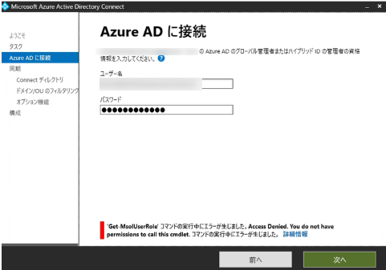
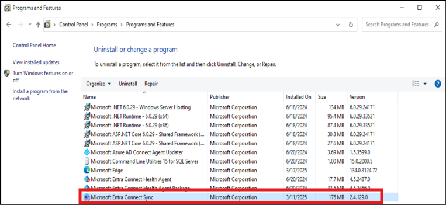

こんにちは、Azure Identity チームの張替です。

2025/3/11 に MC1028312 の通知が行われ、Microsoft Entra Connect Sync (以下、MEC) 2.4.18.0 未満を利用するお客様向けに、2025/4/7 までに 2.4.18.0 以降のバージョンにアップグレードを推奨する旨の通知がされています。
この通知に関する内容について、多くのお問い合わせをいただいており、今回は、本通知に関する概要と必要な対応について、よくある質問形式でおまとめして紹介します。

> [!IMPORTANT]
> 本情報は 2025/3/18 時点の情報を基に執筆しております。

---

## MC1028312 の概要

MC1028312 ではサービスの強化と 2025 年 4 月の MSOnline PowerShell の廃止に向けた準備のためのバックエンド サービスの変更が行われることをお知らせしております。
この廃止と変更の対応にあたり、MEC において影響を受ける機能、影響を受けない機能を以下におまとめしました。


 影響を受ける機能
 - MEC の構成ウィザードで AD FS シナリオの構成ができなくなります。
 - MEC の構成ウィザードで PingFederate シナリオの構成ができなくなります。
 - MEC の構成ウィザード上で認証を行った場合に失敗します。これにより、スキーマ更新、ステージング モードの設定、ユーザー サインインなどの変更が行えなくなります。
 
 影響を受けない機能
 - MEC の同期サービスは通常通り動作し、同期処理は停止しません。
 - MEC のアップグレードは可能で、2025/4/7 以降もアップグレードは実施可能です。
 

 以下の公開情報でも詳細をご案内していますので、合わせてご参照ください。

[Hardening update to Microsoft Entra Connect Sync AD FS and PingFederate configuration - Microsoft Entra ID | Microsoft Learn](https://learn.microsoft.com/en-us/entra/identity/hybrid/connect/harden-update-ad-fs-pingfederate)
 

## 実施いただきたいこと
MEC 2.4.18.0 未満を利用するすべてのお客様は、2025/4/7 までに 2.4.18.0 以降のバージョンへアップグレードを推奨しております。
現時点 (2025/3/18) の最新バージョンは 2.4.129.0 となり、[こちら](https://www.microsoft.com/en-us/download/details.aspx?id=47594) からダウンロードいただけますので、アップグレードについてご検討くださいますようお願いいたします。
 
アップグレードを行わない場合、 MEC 上での構成ウィザードで管理者の認証を行おうとすると、以下のエラーが表示され Entra ID への接続が不可となる動作が想定されます。



エラー メッセージ
```
'Get-MsolUserRole' コマンドの実行中にエラーが生じました。Access Dinied. You do not have permissions to call this cmldet. コマンドの実行中にエラーが生じました
```

エラーにより構成ウィザード上での認証が行えないため、結果的に 構成ウィザードによる設定変更が行えない状況となります。
そのため、スキーマの更新、アクティブ / ステージングの切り替え、同期対象 OU の変更、ユーザー サインインの変更など、MEC 構成ウィザードによる設定変更全般ができなくなることが想定されます。
なお、認証要求が発生する前の操作であれば構成ウィザード上での操作は可能ですので、MEC 上での構成ファイルのダウンロードは可能です。


## よくある質問
**Q. 同期への影響はありますか？**

A. オブジェクト同期、パスワード同期、パスワード ライトバックなどの同期サービスには影響ありません。通常通り同期されます。


**Q. シームレス SSO への影響はありますか？**

A. いいえ、影響ありません。


**Q. パススルー認証への影響はありますか？**

A. いいえ、影響ありません。


**Q. MC906491 との関連性**

A. MC906491 では MEC の構成ウィザードで AD FS / PingFederate シナリオを構成することへの影響についてを通知いたしておりましたが、確認を行った結果、影響範囲が更にあることが確認されました。
MC1028312 に記載の影響範囲が正しい内容となります。


**Q. アップグレード手順を教えてください。**

A. 通常時のアップグレード手順と相違ありません。アップグレード手順につきましては、以下の弊社技術ブログをご参考ください。

[Azure AD Connect アップグレード手順詳細 | Japan Azure Identity Support Blog](https://jpazureid.github.io/blog/azure-active-directory-connect/how-to-upgrade-details/)

> [!TIP]
> なお、旧バージョンからのバージョンアップの場合には、大きく以下の点にご留意ください。
> 
> ・2.3.20.0 以降では TLS 1.2 の有効化を明示的にレジストリへ設定する必要があります。
> 
> [Microsoft Entra Connect 2.3.20 のインストールおよびアップグレードに失敗する際の対応方法 | Japan Azure Identity Support Blog](https://jpazureid.github.io/blog/azure-active-directory-connect/azure-ad-connect-2-3-20/)
> 
> ・2.4.18.0 以降では .NET Framework 4.7.2 以上が必要となります。
> 
> [Microsoft Entra Connect: バージョン リリース履歴 - Microsoft Entra ID | Microsoft Learn](https://learn.microsoft.com/ja-jp/entra/identity/hybrid/connect/reference-connect-version-history#24180)


**Q. 現在の MEC のバージョンの確認方法は？**

A. MEC サーバー上でコントロール パネルに移動し、[プログラム] -> [プログラムと機能] の順に選択して、インストールされている Microsoft Entra Connect Sync のバージョンをご確認ください。




**Q. 回避策はありますか？**

A. 恐縮ながら、アップグレードを実施する以外の方法はございません。


**Q. 延期は可能ですか？**

A. 恐縮ながら、延期は困難な状況です。


**Q. 2025/4/7 までにバージョンアップができなくなった場合、サポートは受け付けてもらえますか？**

A. はい、2025/4/7 を過ぎた場合に何らかの問題が発生した場合、サポート窓口にお問い合わせいただき、調査を行うことは可能です。
しかしながら、調査の結果、サポートされる構成 (サポート内のバージョンへのアップグレードなど) への変更をお願いさせていただく場合もございますので、こちらの点についてご理解ください。


