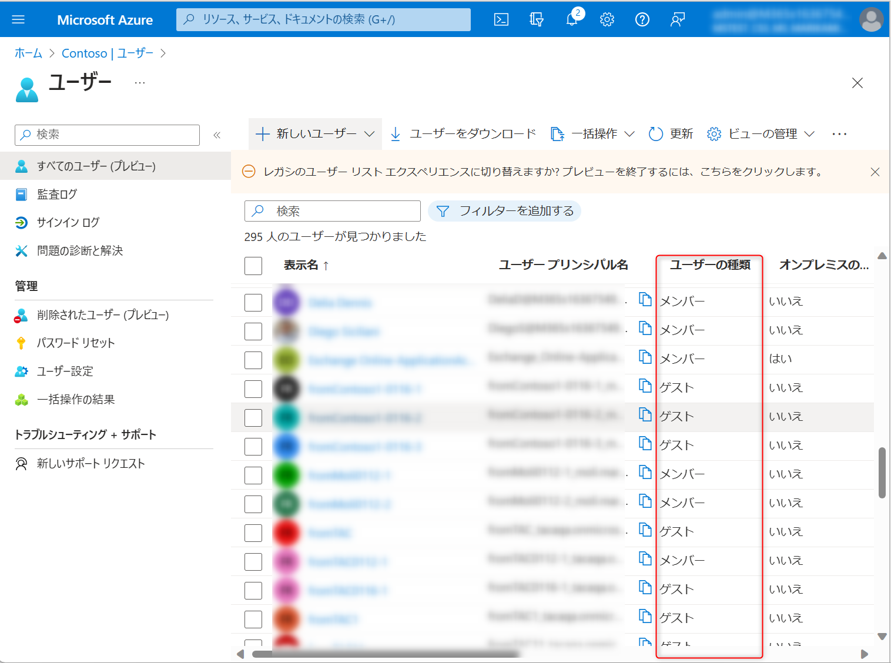
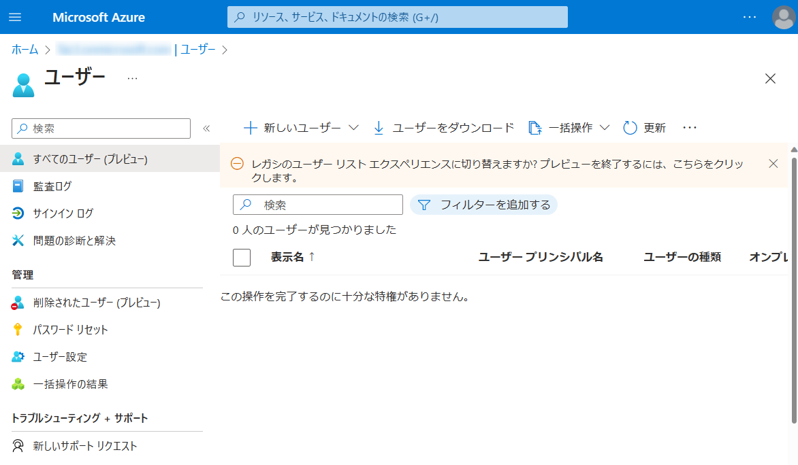
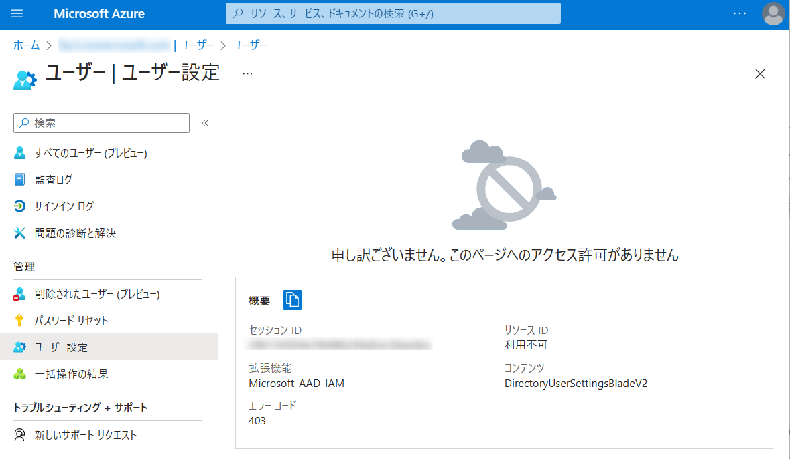
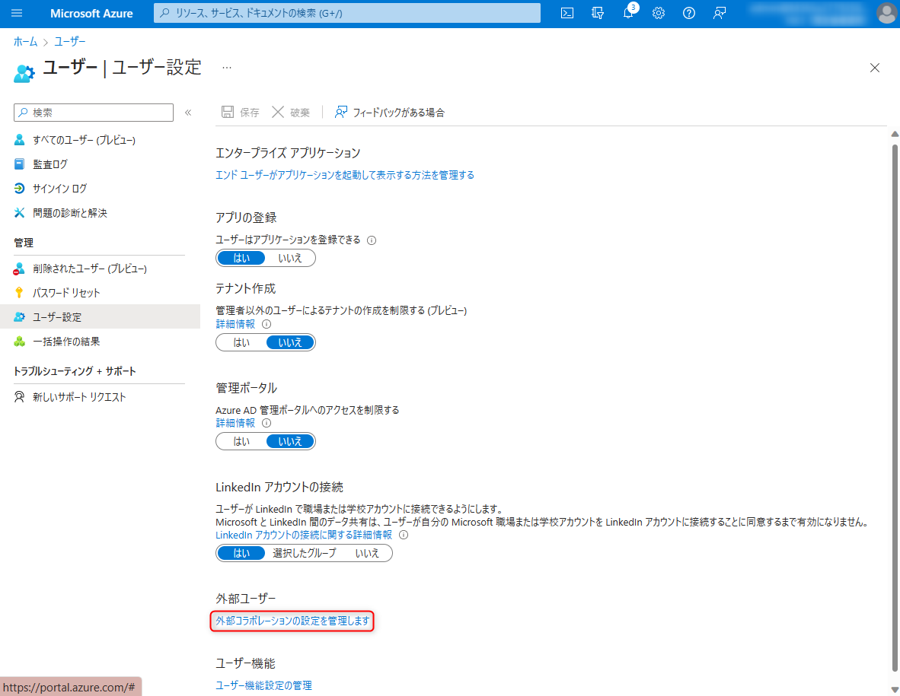
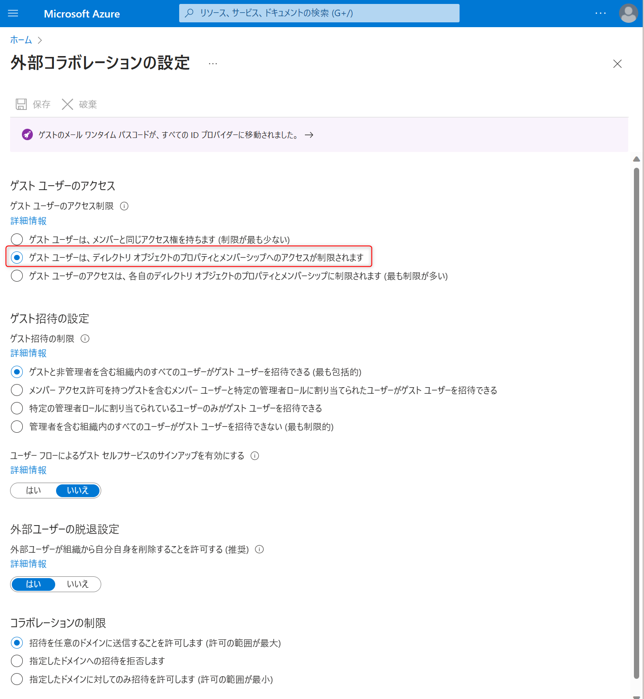

> [!NOTE]
> 本記事は Technet Blog の更新停止に伴い https://blogs.technet.microsoft.com/jpazureid/2017/12/12/azuread-member-guest/ の内容を移行したものです。
> 元の記事の最新の更新情報については、本内容をご参照ください。

> [!NOTE]
> 2017-12-12: 本記事の初版を投稿
> 2023-04-01: Msol コマンドのリタイアおよび Azure ポータル上のメニューの変更に伴い内容を更新

# メンバー ユーザーと ゲスト ユーザーについて

こんにちは、Azure & Identity サポート チームの三輪です。

Azure AD に所属しているユーザーの種類として、下記のように 「メンバー」 と 「ゲスト」があります。今回は、こちらのユーザーの種類について説明します。



## はじめに

下記のように、個人アカウントや別テナントの職場または学校アカウント (組織アカウント) を追加した (Azure AD B2B の機能を利用した) 場合に、ユーザーの種類が 「ゲスト」 として追加されます。


これ以外の Azure のサブスクリプションのサインアップで利用した個人アカウントや組織内のドメイン (上記の例の場合: contso.com) をユーザー名 (例: test@contoso.com) に持つユーザーは「メンバー」として登録されます。また、クラシックポータル  (旧ポータル) より追加した外部ユーザーについては 「メンバー」として登録されております。

## 詳細

既定ではゲスト ユーザーに対しては、 Azure AD のデータへのアクセスを制限しています。そのため、ゲスト ユーザーでサインインした場合、招待された Azure AD のユーザーの一覧を参照することもできませんし、各種設定の参照・変更も制限されています。もちろん、サブスクリプションに対する権限を付与していない場合は、サブスクリプションのリソースを操作することもできません。  
(一般ユーザーとゲスト ユーザーがそれぞれできること (アクセス許可の比較) は、[こちら](https://learn.microsoft.com/ja-jp/azure/active-directory/fundamentals/users-default-permissions#compare-member-and-guest-default-permissions)をご参照ください。)





ゲストに対するアクセス制限は、[すべてのユーザー] - [ユーザー設定] - [ 外部コラボレーションの設定を管理します] と辿り [ゲストのアクセス制限] で変更できます。この設定が “ゲスト ユーザーは、ディレクトリ オブジェクトのプロパティとメンバーシップへのアクセスが制限されます”(既定値) の場合には「ゲスト」の操作は上記のように制限されています。  
(外部コラボレーションの設定については、[こちら](https://jpazureid.github.io/blog/azure-active-directory/external-collaboration-setting-b2b-access/) をご参照ください。)





ユーザーの属性については、Azureポータル上での操作、または PowerShell の実行により、メンバーからゲスト、またその逆についても変更が可能です。ゲストからメンバーに変更する際は「ゲスト」に対して行っていた制御の対象外のユーザーとなるため、セキュリティポリシーに沿った対応や特定のユーザーに絞った設定変更をお勧め致します。

## ユーザー タイプ変更手順

### Azure ポータル上の操作で、該当ユーザーを ゲスト から メンバー に変更する手順
1. 管理者権限で Azure ポータルにサインインします。
2. Azure Active Directory を開き、[ユーザー] を開きます。
3. ユーザー タイプを変更したいユーザーを開きます。
4. [プロパティの編集] をクリックします。
ユーザーの種類のタブを [メンバー] に変更し、[保存] をクリックします。

### PowerShellを実行して、該当ユーザーを ゲスト から メンバー に変更する手順
この作業を実施するためには、Azure AD 用の PowerShell  を利用する必要がありますが、 PowerShell を利用する際には Microsoft アカウントではなく、組織アカウントでのグローバル管理者が必要です (Azure AD の PowerShell については [リンク](https://jpazureid.github.io/blog/azure-active-directory/azuread-module-retirement3/) も参照ください)。そのために対処策は次の手順で実施する必要があります。

1. Azure AD のグローバル管理者アカウントを作成する (※すでに組織アカウントのグローバル管理者が存在する場合は、スキップ)
2. PowerShell を実行し、該当ユーザーを Guest から Member に変更する

### 1. Azure AD のグローバル管理者アカウントを作成する (※すでに組織アカウントのグローバル管理者が存在する場合は、スキップ)

1. [ユーザー] - [＋新しいユーザー] と辿り、 [ 新しいユーザーの作成]  をクリックします。
2. ユーザー名と名前欄に admin1 などの任意の値を入力します。
3. [役割]をクリックし、ディレクトリ ロール欄で “グローバル管理者” を選択し、 [選択] をクリックします。
4. "パスワードを表示" をクリックし、パスワードを控えて [作成] をクリックします。

### 2. PowerShell を実行し、該当ユーザーを Guest から Member に変更する

1. PowerShell を起動します。
※モジュールの入手方法については、弊社[ブログ](https://jpazureid.github.io/blog/azure-active-directory/azuread-module-retirement3/)をご参照ください。インストールされていない環境では  Graph PowerShell SDK のモジュールのインストールをお願いします。
2. 以下のコマンドを実行します。  
Connect-MgGraph -Scope "User.ReadWrite.All"
3. 資格情報の入力を求められるため、1 で作成したアカウントの情報を入力します。
このときパスワードの変更が求められるはずですので、パスワードを新しく設定します。
4. 以下のコマンドを実行して、対象ユーザーの UserPrincipalName および UserType 属性値を確認します。

    ```powershell
    Get-MgUser -All -Property UserPrincipalName,UserType | Format-Table UserPrincipalName,UserType
    ```

    出力例:

    ```powershell
    UserPrincipalName                             UserType
    User1_live.com#EXT#@contoso.onmicrosoft.com   Guest  -> 「Guest」 であることが確認できます。
    ```

5. 以下のコマンドを実行して、対象ユーザーの UserType を 「Member」 に変更します。

    ```powershell
    Update-MgUser -UserId <対象ユーザーの オブジェクトID または UserPrincipalName> -UserType Member
    ```

    実行例:

    ```powershell
    Update-MgUser -UserId User1_live.com#EXT#@contoso.onmicrosoft.com -UserType Member
    ```

 6. 再度以下のコマンドを実行して、対象ユーザーの UserType を確認します。

    ```powershell
    Get-MgUser -All -Property UserPrincipalName,UserType | Format-Table UserPrincipalName,UserType
    ```

    出力例:

    ```powershell
    UserPrincipalName                             UserType
    User1_live.com#EXT#@contoso.onmicrosoft.com   Member  -> 変更されたことを確認します。
    ```

### 参考

「Member」→「Guest」に変更する場合は、UserType に 「Guest」を指定します。

```powershell
Update-MgUser -UserId <対象ユーザーの オブジェクトID または UserPrincipalName> -UserType Guest
```

上記内容が少しでも皆様の参考となりますと幸いです。

## 変更履歴

- 2017/12/12: 公開しました。
- 2018/02/26: Microsoft Connect のリタイアに伴い MSOnline モジュールのダウンロードができなくなったため記載を変更しました。
- 2018/10/31: メンバーとゲストの既定のアクセス許可の比較情報のリンクを追加しました。
- 2023/04/10: Msol コマンドのリタイアに伴い Microsoft Graph コマンドでの実施方法に更新しました。
