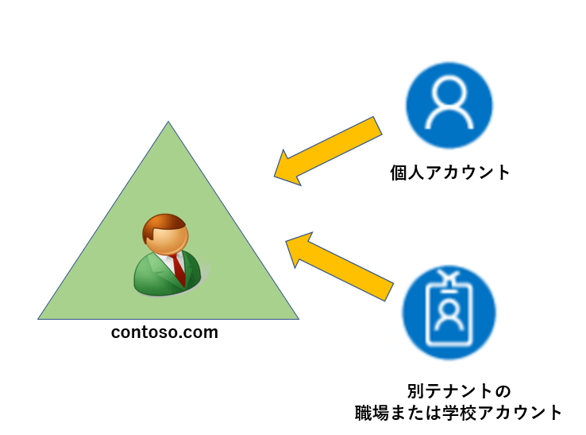
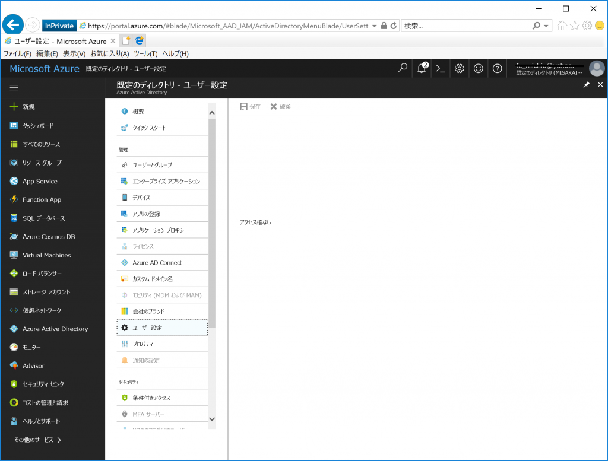
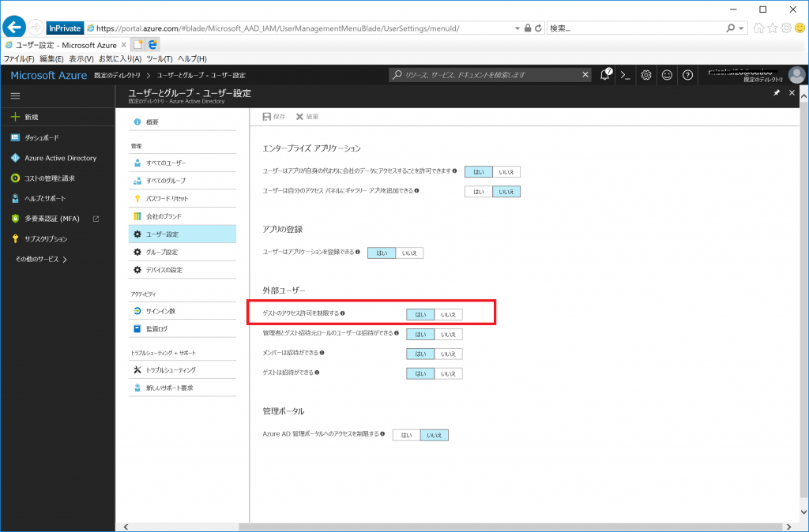

> 本記事は Technet Blog の更新停止に伴い https://blogs.technet.microsoft.com/jpazureid/2017/12/12/azuread-member-guest/ の内容を移行したものです。
> 元の記事の最新の更新情報については、本内容をご参照ください。

# Member ユーザーと Guest ユーザーについて

こんにちは、Azure & Identity サポート チームの坂井です。

Azure AD に所属しているユーザーの種類として、下記のように 「Member」 と 「Guest」があります。今回は、こちらのユーザーの種類について説明します。


## はじめに

下記のように、個人アカウントや別テナントの職場または学校アカウント (組織アカウント) を追加した (Azure AD B2B の機能を利用した) 場合に、ユーザーの種類が 「Guest」 として追加されます。



これ以外の Azure のサブスクリプションのサインアップで利用した個人アカウントや組織内のドメイン (上記の例の場合: contso.com) をユーザー名 (例: test@contoso.com) に持つユーザーは「Member」として登録されます。また、クラシックポータル  (旧ポータル) より追加した外部ユーザーについては 「Member」として登録されております。

## 詳細

既定ではゲスト ユーザーに対しては、 Azure AD のデータへのアクセスを制限しています。そのため、ゲスト ユーザーでサインインした場合、招待された Azure AD のユーザーの一覧を参照することもできませんし、各種設定の参照・変更も制限されています。もちろん、サブスクリプションに対する権限を付与していない場合は、サブスクリプションのリソースを操作することもできません。
(一般ユーザーとゲスト ユーザーがそれぞれできること (アクセス許可の比較) は、こちらをご参照ください。)




ゲストに対するアクセス制限は、以下の赤枠の箇所 (ゲストのアクセス許可を制限する) で変更できます。この設定が “はい” の場合には「Guest」の操作は上記のように制限されています。



ユーザーの属性については、PowerShell を利用することで Member から Guest、またその逆についても変更が可能です。Guest から Member  に変更する際は「Guest」に対して行っていた制御の対象外のユーザーとなるため、セキュリティポリシーに沿った対応や特定のユーザーに絞った設定変更をお勧め致します。

## ユーザー タイプ変更手順

この作業を実施するためには、Azure AD 用の PowerShell (Azure AD v1 の PowerShell) を利用する必要がありますが、 PowerShell を利用する際には Microsoft アカウントではなく、組織アカウントでの全体管理者が必要です (Azure AD の PowerShell については [リンク](https://blogs.technet.microsoft.com/jpazureid/2017/12/04/aad-powershell/) も参照ください)。そのために対処策は次の手順で実施する必要があります。

1. Azure AD の全体管理者アカウントを作成する (※すでに組織アカウントの全体管理者が存在する場合は、スキップ)
2. PowerShell を実行し、該当ユーザーを 「Guest」 から 「Member」 に変更する

### 1. Azure AD の全体管理者アカウントを作成する (※すでに組織アカウントの全体管理者が存在する場合は、スキップ)

1. Azure ポータルにサインインします。
2. Azure Active Directory を開き、[ドメイン名] を開きます。
3. 一覧に表示されている名前で onmicrosoft.com を含む名前を控えておきます。
4. [ユーザーとグループ] - [すべてのユーザー] と辿り、右ペインの上部にある [+ 新しいユーザー] をクリックします。
5. 名前欄に適当な例えば admin1 などを入力し、 ユーザー名として 1-3 で確認した onmicrosoft.com のドメイ
ン名と名前欄に設定したものを組み合わせて admin1@contoso.onmicrosoft.com というように入力します。
6. ディレクトリ ロール欄で "全体管理者" を選択し、 [OK] をクリックします。
7. "パスワードを表示" をクリックし、パスワードを控えて [作成] をクリックします。

### 2. PowerShell を実行し、該当ユーザーを Guest から Member に変更する

1. Azure AD 用の PowerShell (Azure AD v1 の MSOnline の PowerShell) を起動します。
※モジュールの入手方法については、弊社ブログをご参照ください。インストールされていない環境では 1. MSOnline (Azure AD v1) のインストールをお願いします。
2. 以下のコマンドを実行します。
Connect-MsolService
3. 資格情報の入力を求められるため、1 で作成したアカウントの情報を入力します。
このときパスワードの変更が求められるはずですので、パスワードを新しく設定します。
4. 以下のコマンドを実行して、対象ユーザーの UserPrincipalName および UserType 属性値を確認します。

    ```powershell
    Get-MsolUser -All | Format-Table UserPrincipalName,UserType
    ```

    出力例:

    ```powershell
    UserPrincipalName                             UserType
    User1_live.com#EXT#@contoso.onmicrosoft.com   Guest  -> 「Guest」 であることが確認できます。
    ```

5. 以下のコマンドを実行して、対象ユーザーの UserType を 「Member」 に変更します。

    ```powershell
    Set-MsolUser -UserPrincipalName <対象ユーザーの UserPrincipalName> -UserType Member
    ```

    実行例:

    ```powershell
    Set-MsolUser -UserPrincipalName User1_live.com#EXT#@contoso.onmicrosoft.com -UserType Member
    ```

 6. 再度以下のコマンドを実行して、対象ユーザーの UserType を確認します。

    ```powershell
    Get-MsolUser -All | Format-Table UserPrincipalName,UserType
    ```

    出力例:

    ```powershell
    UserPrincipalName                             UserType
    User1_live.com#EXT#@contoso.onmicrosoft.com   Member  -> 変更されたことを確認します。
    ```

### 参考

「Member」→「Guest」に変更する場合は、UserType に 「Guest」を指定します。

```powershell
Set-MsolUser -UserPrincipalName <対象ユーザーの UserPrincipalName> -UserType Guest
```

上記内容が少しでも皆様の参考となりますと幸いです。

## 変更履歴

- 2017/12/12: 公開しました。
- 2018/02/26: Microsoft Connect のリタイアに伴い MSOnline モジュールのダウンロードができなくなったため記載を変更しました。
- 2018/10/31: メンバーとゲストの既定のアクセス許可の比較情報のリンクを追加しました。

