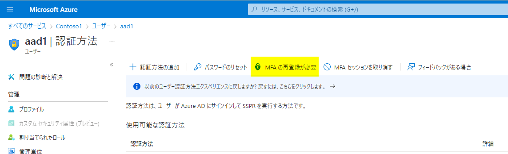

> [!NOTE]
> 本記事は 2018 年に公開した [多要素認証 (MFA) のリセット手順](../azure-active-directory/mfa-reset.md) の内容を更新したものです。
> 現在では 2022 年版から GUI やコマンドなどが変更されているため、最新の記事は [多要素認証 (MFA) のリセット手順 - 2025 年版](../azure-active-directory/mfa-reset-2025.md) をご覧ください。

# 多要素認証 (MFA) のリセット手順 - 2022 年版

こんにちは、Azure & Identity サポート チームの栗井です。

今回は、Azure AD におけるユーザーの多要素認証 (MFA: Multi-Factor Authentication) のリセット手順についてご紹介します。

Azure AD では、ログイン時の追加認証方式として電話やアプリ (Microsoft Authenticator) などを使った多要素認証 (MFA) を利用することができ、パスワードのセルフサービス リセット時にも同認証方式を利用させることが可能です。MFA の設定を有効にしている場合、Azure AD にログインをするためには認証方法に指定したスマートフォンなどを利用できる必要がありますが、スマートフォンを紛失してしまった場合や電話番号が無効になった場合などには、MFA で設定していた認証を利用できない状況となり、ユーザー認証を完了することができずサービスを利用することができなくなる場合がございます。
このような場合は、Azure AD の管理者による対象ユーザーの MFA 設定のリセットを実施します。

なお、一般ユーザー権限では他ユーザーの MFA 認証設定のリセットは行うことができません。一般ユーザーは 、ログインができる状態であればユーザー自身で登録されている MFA の設定を変更することはできますが、MFA の追加の認証を受け取れるスマートフォンを紛失したなどの場合に、自ら MFA 設定のリセットを行うことはできません。

MFA のリセットは、Azure Portal、または PowerShell より行うことが可能です。Azure Portal からの操作では事前準備が不要なため、すぐに操作を実施することができます。

PowerShell からの操作では、CSV 形式で用意した全ユーザーに対してリセットを行うことができるため、多くのユーザーに対し一括でリセットを行いたい場合に有効です。しかし残念ながら、**PowerShell からの操作がサポートされるのは 2022 年 12 月まで**となります (詳細は後述の通りです)。

## Azure Portal での手順
1. 該当ユーザーの認証方法設定画面へアクセスします。認証管理者、特権認証管理者、グローバル管理者、のいずれかで Azure Portal (https://portal.azure.com) へログインします (リセット対象のアカウントが管理者権限を持つアカウントの場合は特権認証管理者またはグローバル管理者にてログインが必要です)。

2. [すべてのサービス] > [Azure Active Directory] > [ユーザー] に移動します。
   
3. ユーザー一覧から、該当ユーザーの行を選択して開きます。 

4. 画面左側のメニューから [認証方法] タブを選択します。

      

5. [MFA の再登録が必要] を押下します。

      

この後、上記操作が行われたユーザーに対して MFA が要求されるタイミングで、MFA のセットアップ画面 (下記) が表示されます。もしくはユーザーが MFA のセットアップ画面 (https://aka.ms/mfasetup) にアクセスすることでも同画面が表示されます。

  

## PowerShell での手順

> [!NOTE]
> 下記の方法がサポートされるのは 2022 年 12 月までです。PowrShell からの操作では Azure AD Module (MSOnline) の PowerShell モジュールを利用します。この MSOnline が内部的に利用している [Azure AD Graph のサポートが 2022 年 12 月頃を目安に廃止](https://techcommunity.microsoft.com/t5/azure-active-directory-identity/update-your-applications-to-use-microsoft-authentication-library/ba-p/1257363) されるためです。

Azure AD Module (MSOnline) の PowerShell モジュールを利用することで、コマンドによるユーザーの MFA リセットが可能です。MS Online の詳細については下記をご覧ください。

- [Azure Active Directory (MSOnline) | Microsoft Docs](https://docs.microsoft.com/en-us/powershell/azure/active-directory/overview?view=azureadps-1.0)

### MSOnline のインストール

後述の手順を実行する前に、下記コマンドによる MSOnline モジュールのインストールが必要となります。

```
Install-Module MSOnline
```

### ユーザーの MFA をリセット

以下コマンドを実行し、ユーザーの MFA 設定をリセットできます。 

```
Connect-MsolService＃Azure AD へログイン
Set-MsolUser -UserPrincipalName "<リセットしたいユーザーのUPN>" -StrongAuthenticationMethods @()
```

### ユーザーの MFA をリセット (一括操作)

以下のように CSV からユーザーを読み込んで、一括でリセットを行うことも可能です。

```
Connect-MsolService＃Azure AD へログイン
$users = Import-Csv "CSV のファイルパス"
foreach ($user in $users) {
    Set-MsolUser -UserPrincipalName $user.UserPrincipalName -StrongAuthenticationMethods @()
}
```

  

### MFA リセット済みのユーザーを確認

以下のコマンドで、該当のユーザーのMFA の設定がされていない（= リセット済み）であるかどうかを確認することができます。

```
Get-MsolUser  -UserPrincipalName "<ユーザーのUPN>" | Select UserPrincipalName, DisplayName, StrongAuthenticationMethods | fl*
```

すべてのユーザーの情報を一括で取る場合、下記コマンドをご利用ください。

```
Get-MsolUser -all | Select UserPrincipalName, DisplayName, StrongAuthenticationMethods
```

リセットが成功している場合、StrongAuthenticationMethods 属性が {} と表示されます。

```
PS C:\Users\mikurii> Get-MsolUser  -UserPrincipalName "user@test.onmicrosoft.com" | Select UserPrincipalName, DisplayName, StrongAuthenticationMethods | fl *


UserPrincipalName           : user@test.onmicrosoft.com
DisplayName                 : 舞黒 太郎
StrongAuthenticationMethods : {}
```

何らかの MFA の方法が登録されている (= リセットされていない) 場合は、StrongAuthenticationMethods 属性に "Microsoft.Online.Administration.StrongAuthenticationMethod" といった値が入ります。

```
PS C:\Users\mikurii> Get-MsolUser  -UserPrincipalName "user@test.onmicrosoft.com" | Select UserPrincipalName, DisplayName, StrongAuthenticationMethods | fl *

UserPrincipalName           : user@test.onmicrosoft.com
DisplayName                 : 舞黒 太郎
StrongAuthenticationMethods : {Microsoft.Online.Administration.StrongAuthenticationMethod, Microsoft.Online.Administration.StrongAuthenticationMethod}
```

ご不明な点がございましたら弊社サポートまでお気軽にお問い合わせください。上記内容が少しでも皆様の参考となりますと幸いです。
