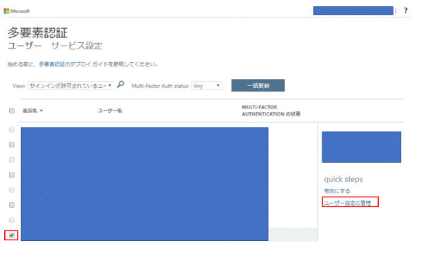
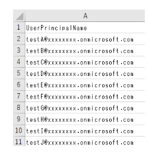

> [!NOTE]
> 本記事は Technet Blog の更新停止に伴い https://blogs.technet.microsoft.com/jpazureid/2018/10/15/mfa-reset/ の内容を移行したものです。
> 元の記事の最新の更新情報については、本内容をご参照ください。

# 多要素認証 (MFA) のリセット手順

こんにちは、Azure & Identity サポート チームの小野です。

今回は、Azure AD における多要素認証 (Multi-Factor Authentication = MFA) のリセット手順についてご紹介します。

Azure AD では、ログイン時の追加認証方式として電話・スマートフォンアプリなどを使った多要素認証 (Multi-Factor Authentication = MFA) を利用することができ、パスワードのセルフサービス リセット時にも同様の認証方式を利用させることが可能です。MFA の設定を有効にしている場合、Azure AD にログインをするためには認証方法に指定したスマートフォンなどを利用できる必要がありますが、スマートフォンを紛失してしまった場合や電話番号が無効になった場合などには、MFA で設定していた認証を利用できない状況となり、ユーザー認証を完了することができずサービスを利用することができなくなります。
このような場合は、Azure AD  の管理者による対象ユーザーの MFA 設定のリセットを実施します。

なお、一般ユーザー権限では他ユーザーの MFA 認証設定のリセットは行うことができません。一般ユーザーは 、ログインができる状態であればユーザー自身で登録されている MFA の設定を変更することはできますが、MFA の追加の認証を受け取れるスマートフォンを紛失したなどの場合に、自ら MFA 設定のリセットを行うことはできません。

MFA のリセットは、Azure Portal、Azure MFA ポータル、または PowerShell より行うことが可能です。Azure Portal と Azure MFA ポータルからの操作では事前準備が不要なため、すぐに操作を実施することができます。PowerShell からの操作では、CSV 形式で用意した全ユーザーに対してリセットを行うことができるため、多くのユーザーに対し一括でリセットを行いたい場合に有効です。

## Azure Portal での手順
1. 該当ユーザーの認証方法設定画面へアクセスします。
  認証管理者、特権認証管理者、グローバル管理者、のいずれかで Azure Portal (https://portal.azure.com) へログインします。
  [すべてのサービス] > [Azure Active Directory] > [ユーザー] に移動し、ユーザー一覧から該当ユーザーの行を選択して開きます。 

2. 画面左側のメニューから [認証方法] タブを選択します。
    

3. [MFA の再登録が必要] を押下します。
    
  

この後、上記操作が行われたユーザーに対して MFA が要求されるタイミングで、MFA のセットアップ画面 (下記) が表示されます。
もしくはユーザーが MFA のセットアップ画面 (https://aka.ms/mfasetup) にアクセスすることでも同画面が表示されます。
  

## Azure MFA ポータルでの手順

1. Azure MFA ポータルへアクセスします。

    全体管理者で Azure Portal (https://portal.azure.com) へログイン後、[すべてのサービス] > [Azure Active Directory] > [ユーザー] > [ユーザーごとの MFA] を選択します。

2. Azure MFA ポータルにて該当のユーザーにチェックをつけ、"ユーザー設定の管理"を選択します。

    

3. "選択したユーザーについて連絡方法の再指定を必須にする" にチェックし、"保存" を選択します。

    

この後、上記操作が行われたユーザーがサインインしようとすると、MFA のセットアップ画面が表示されます。ユーザーは、新しく電話・スマートフォンアプリなどを使用して、多要素認証を構成できます。

## PowerShell での手順

コマンドを実行する前に、MSOnline モジュールのインストールが必要となります。MSOnline モジュールのインストール方法は、下記ブログをご参照ください。

https://blogs.technet.microsoft.com/jpazureid/2017/12/04/aad-powershell/

以下コマンドを実行し、ユーザーの MFA 設定をリセットできます。 

```
Connect-MsolService＃Azure AD へログイン
Set-MsolUser -UserPrincipalName "<リセットしたいユーザーのUPN>" -StrongAuthenticationMethods @()
```

例えば、以下のように CSV からユーザーを読み込んで、一括でリセットを行うことも可能です。

```
Connect-MsolService＃Azure AD へログイン
$users = Import-Csv "CSV のファイルパス"
foreach ($user in $users) {
    Set-MsolUser -UserPrincipalName $user.UserPrincipalName -StrongAuthenticationMethods @()
}
```

  
図: 用意する CSV の例

以下のコマンドで、MFA の設定がされていない（リセット済み）であるユーザーの一覧を確認することができます。

```
Get-MsolUser  -all | ?{ !$_.StrongAuthenticationMethods }
```

ご不明な点がございましたら弊社サポートまでお気軽にお問い合わせください。上記内容が少しでも皆様の参考となりますと幸いです。

