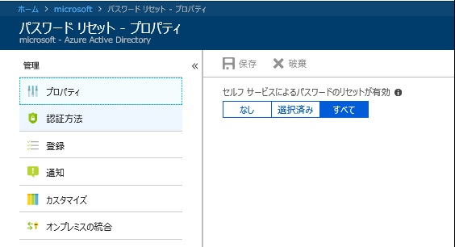
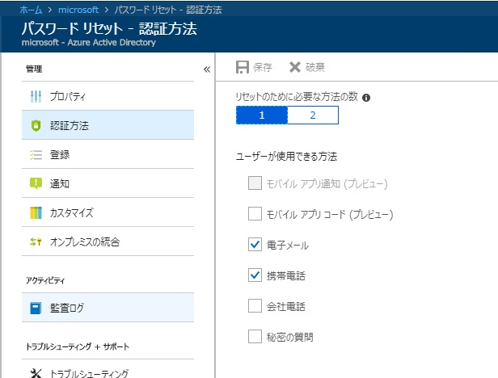
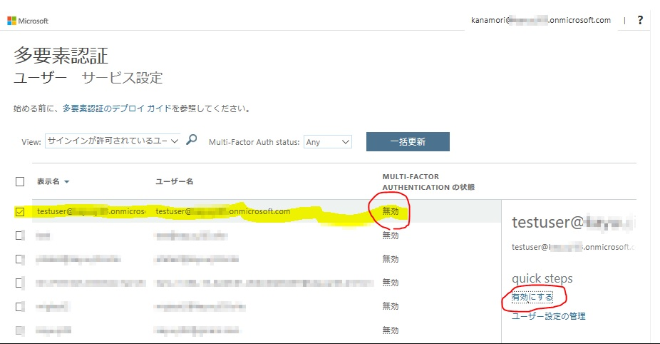
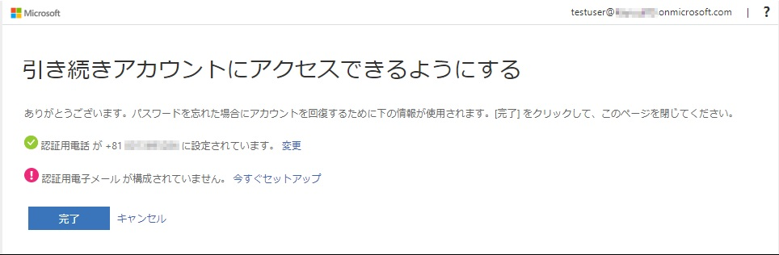
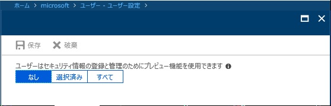
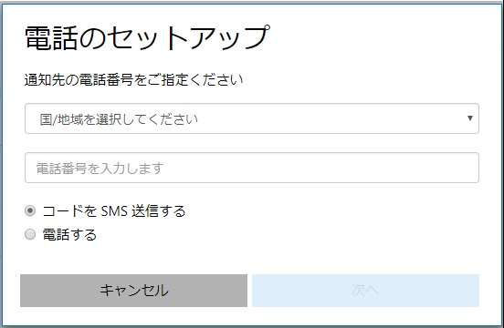
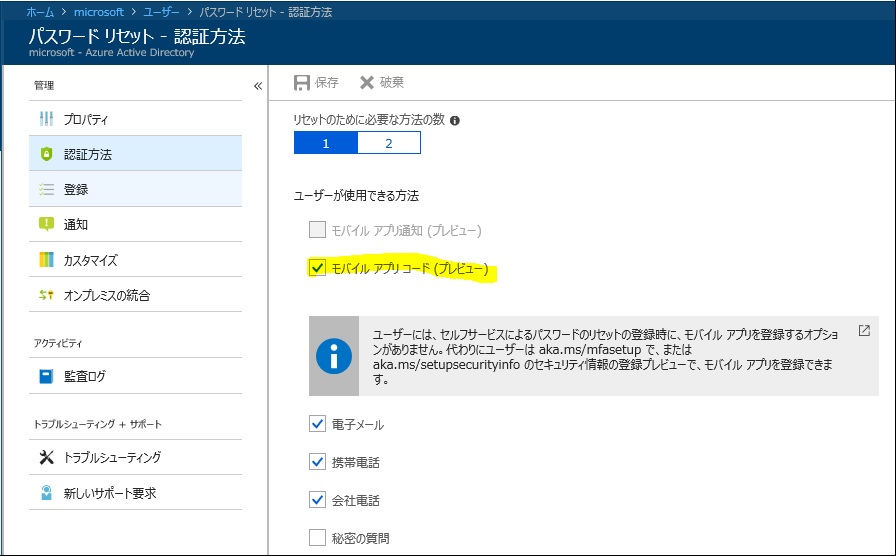
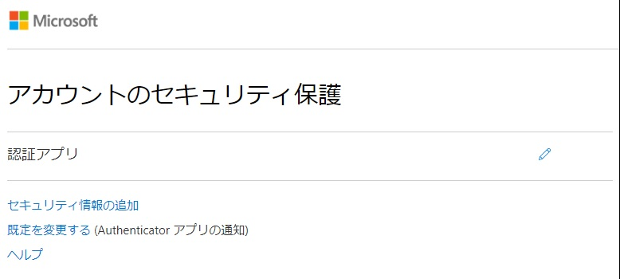

> 本記事は Technet Blog の更新停止に伴い https://blogs.technet.microsoft.com/jpazureid/2018/09/05/mfasetupinteg/ の内容を移行したものです。
> 元の記事の最新の更新情報については、本内容をご参照ください。

# Azure MFA の多要素認証設定の統合

こんにちは。Azure Identity チームの金森です。

今回は先日プレビューとなりました [SSPR と Azure MFA の多要素認証設定の統合] をご紹介したいと思います。  
※ 個人的に待ちに待っていた改善となります！

Converged registration for self-service password reset and Azure Multi-Factor Authentication (Public preview)  
https://docs.microsoft.com/en-us/azure/active-directory/authentication/concept-registration-mfa-sspr-converged  
2018/8/1 に公開された docs 技術情報です。

Combined registration for Azure AD MFA and Self Service Password Reset plus two other cool updates now in public preview!  
https://cloudblogs.microsoft.com/enterprisemobility/2018/08/06/mfa-and-sspr-updates-now-in-public-preview/  
2018/8/6 に公開された Alex の Blog 情報です。こちらの方が私の気持ちを汲んだ内容になっています。

これまで SSPR (Self Service Password Reset) 機能と、Azure MFA (Multi-Factor Authentication) 機能を有効にすると、ユーザーが最初に Azure AD (AAD) へサインインする際にそれぞれの機能毎に追加の認証方法のセットアップが求められていました。  
つまり、AAD ユーザーとしての追加の認証方法という意味は同じなのに、2 回のセットアップ画面での設定を終えないとサービスのご利用を開始できなかったのです。

それぞれのセットアップ画面が分かれていることで操作している対象が分かりやすい、という感想をお持ちの方もいらっしゃるかもしれませんが、これから AAD ユーザーとして利用を開始する方が最初のサインイン時に **あれ？さっき追加の認証方法をセットアップしたのに、似たような画面でもう 1 回セットアップを求められてる？** と煩わしく思われたり、Azure MFA を導入済みの環境に SSPR を追加で導入した場合、 **あれ？以前サービス利用を開始した時に追加の認証方法を設定したはずなのにまた設定するよう求められている？以前セットアップした時とちょっと画面が違うような気もするけど…** と混乱されるようなことがあったかもしれません。

今回のプレビュー機能では、 [SSPR 用の多要素認証方法のセットアップ] と [Azure MFA 用の多要素認証方法のセットアップ] が [AAD ユーザーとしての多要素認証方法のセットアップ] として統合され、1 回の設定で SSPR と Azure MFA それぞれで利用される方法が設定できることになります。

それでは早速以下の順序で今回の変更点を見ていきましょう！

1. SSPR と Azure MFA の有効化
2. 今までの SSPR と Azure MFA の認証方法セットアップ画面
3. プレビュー機能の有効化の方法
4. プレビュー機能を有効にした後の統合された MFA 方法セットアップ画面

### 1. SSPR と Azure MFA の有効化

まずは SSPR と Azure MFA を以下のように有効化します。

SSPR の有効化は、Azure AD ポータルより [パスワード リセット] ブレードを選択した [プロパティ] メニューより設定します。

なお、[認証方法] メニューでは、SSPR を実行するためにセットアップしておくべき MFA 方法の数と方法の種類を指定することが可能です。

Azure MFA に関しては、Azure MFA ポータルでの有効化や条件付きアクセスの評価方法として有効化など、[いつ MFA を求めるか] を複数のパターンで指定することができます。

どんなパターンがあるかに関しては、[[クラウドベースの Azure Multi-Factor Authentication をデプロイする](https://docs.microsoft.com/ja-jp/azure/active-directory/authentication/howto-mfa-getstarted)] の技術情報をご参照ください。

以下はこれまで利用されることが多かったのでは、と思われる  Azure MFA ポータルでユーザー単位で [いつでも AAD への認証時には MFA 認証が必要] という設定を有効にする場合の画面例となりますが、上記の技術情報に記載の通り弊社では**最も柔軟な制御が行える条件付きアクセスのご利用を推奨しておりますので、今後はぜひ条件付きアクセスのご利用をご検討ください！**

Azure MFA ポータルは、AAD ポータルから [ユーザー] ブレードを選択して、[すべてのユーザー] メニューから [Multi-Factor Authentication] をクリックするか、 [https://account.activedirectory.windowsazure.com/usermanagement/multifactorverification.aspx] を直接開くことでアクセスできる管理画面です。

こちらが Azure MFA ポータルです。

MFA を必要とさせたいユーザーを選択して [有効にする] を選択します。

### 2. 今までの SSPR と Azure MFA の認証方法セットアップ画面

SSPR と Azure MFA を有効化した状態で、あるユーザーが Office 365 のように AAD への認証が必要なサービスへ初めてアクセスした場合、以下のような画面遷移になります。

まずはこのようにユーザー名とパスワードを指定します。フェデレーション認証環境の場合はフェデレーション サービス先の認証画面が表示されるので、そちらで認証を行います。

MFA 方法のセットアップが必要ですよ、という画面が表示されるので [次へ] を選択します。

まずは Azure MFA 方法のセットアップ画面が表示されます。  
こちらでご希望の MFA 認証方法を設定し [次へ] をクリックすることで、指定した認証方法を実際に確認する処理の流れになります。

こちらは認証用 (携帯) 電話に SMS メッセージで認証コードを送付するパターンの認証方式の例です。  
受け取った認証コードを画面内のフォームに入力して [確認] を選択することで、MFA 認証方法のセットアップが完了します。

これで該当ユーザーの [MFA 方法のセットアップ] は終わった…と思って進めるともう 1 回以下の画面が表示されます。

さっき MFA 方法セットアップしたけどなあ…という印象をお持ちかもしれませんが [次へ] をクリックします。

先ほどとはちょっと違う画面が表示されますが、こちらが [SSPR でパスワードのリセットを行う際に必要な多要素認証の情報] の指定画面になります。  
すでに [Azure MFA 用の多要素認証の方法] として電話番号を登録していたので、その番号を使いますか？ということで最初から認証用電話の番号が表示されています。  
ここで [確認] をクリックして進めます。

SSPR 用の多要素認証の設定時にも [その指定は正しいですか？] を確認するため、実際にその方法を検証する画面になります。

検証が成功するとこのようにグリーン (検証済み) の認識になります。  
なお、この画面では [SSPR でパスワードをリセットするために必要な追加認証方法の数と指定可能な認証方法の種類] の設定に沿った内容が表示されています。  
この設定は、前述の Azure AD ポータルの [パスワード リセット] ブレードから [認証方法] を選択した画面で変更することも可能です。  
上記のサンプル画面は、規定値である [リセットのために必要な方法の数 : 1] と [ユーザーが使用できる方法 : 電子メール、携帯電話] の設定が反映しています。  
必要な方法の数が 1 なので、1 つの方法だけ登録した時点で [完了] が選択できます。

これで Azure MFA と SSPR、それぞれのための多要素認証方法が設定できました。

### 3. プレビュー機能の有効化の方法

さて、ここからが今回の Blog でお伝えしたい [SSPR と Azure MFA の MFA 方法のセットアップを統合！] プレビュー機能を有効にする手順です。  
AAD ポータルより [ユーザー] ブレードを選択し、[ユーザー設定] メニューを選択します。

[アクセス パネル プレビュー機能の設定を管理] をクリックします。

プレビュー機能は既定で無効になっていますので、有効にしたいユーザーが含まれるグループを選択するか、全ユーザーのいずれかを対象に有効にすることができます。  
設定を変更したら同画面の [保存] ボタンをクリックして終了です。簡単ですね！

### 4. プレビュー機能を有効にした後の統合された MFA 方法セットアップ画面

さて、この状態で [Azure MFA と SSPR 両方が有効になっているユーザーの初回サインイン時] の画面を見てみましょう。

ユーザー名とパスワードでの認証後、多要素認証方法のセットアップが必要であることを伝える画面が表示されるところまでは同じです。

これがプレビューの新しい多要素認証の方法をセットアップする画面です。  
[セットアップ] を選択します。

ポップアップが表示されるのでこちらで認証用の電話番号と認証の方法 (SMS or 電話) を指定して進めます。  
ここでも実際に指定した認証方法に対する検証が行われます。

検証が終了したら [完了] をクリックします。

これだけで SSPR と Azure MFA 両方の [多要素認証の方法] のセットアップが終了です！  
1 回で終了しましたね。シンプルです。

[初回セットアップ時に電話を使った方法 (SMS or 電話) しか選べないの？] という疑問を持たれた方もいるかもしれません。  
これは、SSPR と Azure MFA、それぞれの [利用可能な認証方法] の設定が、既定では電話を使用した方法だけが共通しているためです。

例えば、SSPR の認証方法として以下のようにモバイル アプリも選択可能な方法にします。

Azure MFA の選択可能な認証方法は既定で以下のようになっています。

このような設定状態で [Azure MFA と SSPR 両方が有効になっているユーザーの初回サインイン時] の画面を見ると…

先ほどの例にはなかった [セキュリティ情報の選択] 項目が増えています。  
こちらをクリックすると以下のような画面が表示されます。

認証方法として、電話と認証アプリ (モバイルアプリ) が選択できるようになりました。

なお、最初のセットアップだけではなく、後で認証方法を変更したり別の認証方法を追加したりすることも、これまでと同様に行うことができます。

アクセスパネルから [セキュリティ情報の編集] を選択します。

もしくは [https://aka.ms/setupsecurityinfo] へ直接アクセスしても同じ画面を開くことができます。

このように、登録済みの認証方法の修正や、別の認証方法を追加登録することも可能です。

**Tips**

ユーザーごとの Azure MFA 方法のセットアップ画面  
https://aka.ms/mfasetup

ユーザーごとの SSPR 用の多要素認証方法のセットアップ画面  
https://aka.ms/ssprsetup

New! ユーザーごとの統合された多要素認証方法の設定画面  
https://aka.ms/setupsecurityinfo

上記内容が皆様の参考となりますと幸いです。どちら様も素敵な AAD ライフをお過ごしください。

ご不明な点等がありましたら、ぜひ弊社サポート サービスをご利用ください。

※本情報の内容（リンク先などを含む）は、作成日時点でのものであり、予告なく変更される場合があります。
