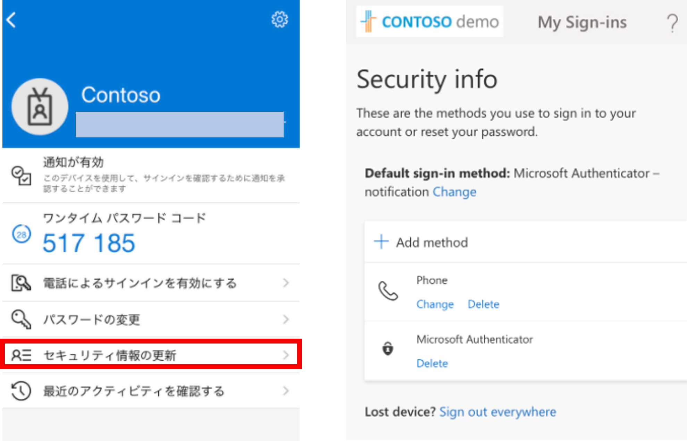
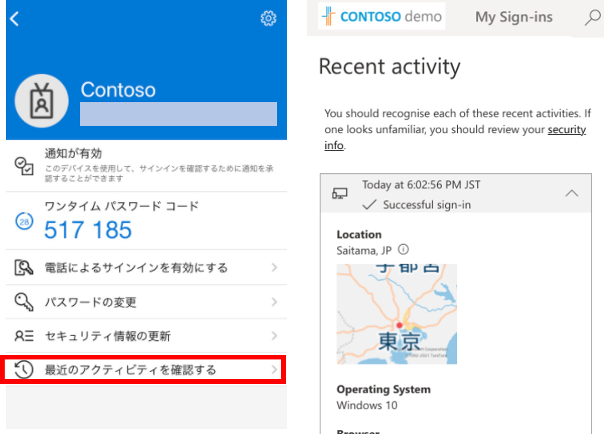
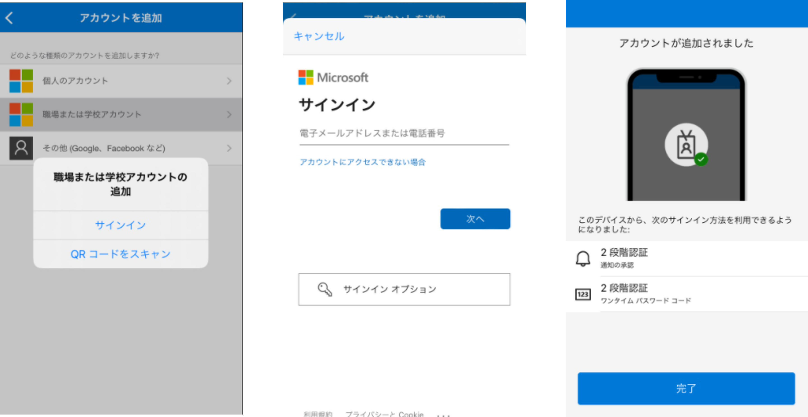
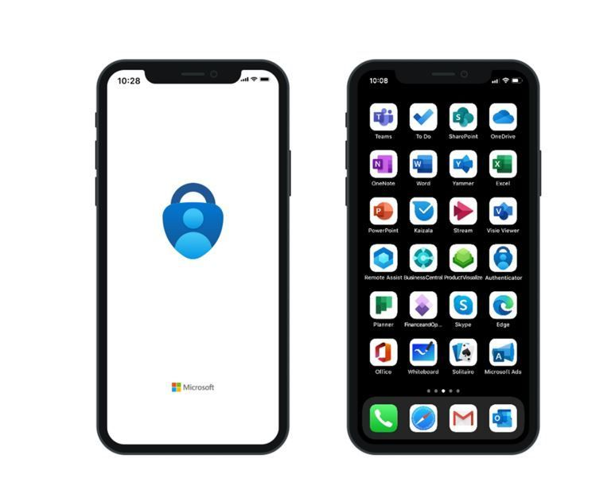

# Microsoft Authenticator アプリ - アイコンを刷新し企業アカウントをより簡単に追加および管理できるようになりました。

こんにちは、Azure Identity サポート チームの中井です。

本記事は、2021 年 11 月 4 日に米国の Azure Active Directory Identity Blog で公開された [Microsoft Authenticator app – easier ways to add or manage enterprise accounts, and a cool new icon](https://techcommunity.microsoft.com/t5/azure-active-directory-identity/microsoft-authenticator-app-easier-ways-to-add-or-manage/ba-p/2464408) を意訳したものになります。ご不明点等ございましたらサポート チームまでお問い合わせください。

----

皆さん、こんにちは。

本日は、[Microsoft Authenticator アプリ](https://www.microsoft.com/ja-jp/security/mobile-authenticator-app?cmp=zgcv4w_jfocsi) にいくつかの素晴らしいアップデートを行い、企業 (会社または学校のアカウント) アカウントにおけるユーザー体験が向上されたことをお伝えします。内容は以下の通りです。

- アプリ内でのアカウント管理
- 企業アカウントのためのアカウント追加機能の改善
- より先進的な印象を与える新しいアイコンへの変更

## アプリ内でのアカウント管理

今年の初めに、Microsoft Authenticator で個人の Microsoft アカウントを直接管理できる機能を [発表](https://techcommunity.microsoft.com/t5/azure-active-directory-identity/update-to-the-microsoft-authenticator-app-now-rolling-out/ba-p/1169863) しました。それ以来、企業のお客様から、会社や学校のアカウントでも Authenticator で同じ機能を利用したいというご意見をいただいていました。本日、Azure AD アカウントでも同じ機能を利用できるようになりました。ここでは、設定を管理する 3 つの方法をご紹介します。

**(1) パスワードの変更**  

Microsoft Authenticator で仕事や学校のアカウントをタップし、新しい「パスワードの変更」オプションをクリックすると、アプリ内からすぐにアカウントのパスワードを変更することができます。

**(2) セキュリティ情報の更新**  

職場や学校のアカウントの認証方法を、Microsoft Authenticator 内で管理することもできるようになりました。Authenticator でアカウントをタップし、「セキュリティ情報の更新」をクリックください。モバイル用の [セキュリティ情報ページ](https://mysignins.microsoft.com/security-info) が表示され、認証方法を管理することができます。

セキュリティ情報ページの詳細については、こちらのブログをご覧ください: [Combined MFA and password reset registration is now generally available](https://techcommunity.microsoft.com/t5/azure-active-directory-identity/combined-mfa-and-password-reset-registration-is-now-generally/ba-p/1257355)

**(3) 最近のアクティビティの確認**  

職場や学校のアカウントのサインイン履歴を Microsoft Authenticator からすぐに確認できるようになり、異常なアクティビティを報告できるようになりました。サインインの履歴を確認するには、Authenticator でアカウントをタップし、「最近のアクティビティを確認する」 をクリックします。

予期せぬサインインを報告する方法について詳しくは、こちらをご覧ください: 
[End users can now report “This wasn’t me” for unusual sign-in activity](https://techcommunity.microsoft.com/t5/azure-active-directory-identity/end-users-can-now-report-this-wasn-t-me-for-unusual-sign-in/ba-p/1257369)

## 企業アカウントの追加方法の改善

Microsoft Authenticator で会社や学校のアカウントを追加する際、ユーザーが常に PC の前など別の画面の前にいるとは限らないと思います (例えば、ユーザーがモバイル デバイスだけを持って移動している場合など)。  
この度、Microsoft Authenticator に直接サインインすることで、別の画面から QR コードをスキャンすることなく、新しい職場や学校のアカウントを追加することができるようになりました。これにより、企業ユーザー向けの Microsoft Authenticator のセットアップが大幅に簡略化されます。詳細についてはこちらもご覧ください: [アプリに仕事用または学校アカウントをMicrosoft Authenticatorする
](https://support.microsoft.com/ja-jp/account-billing/%E3%82%A2%E3%83%97%E3%83%AA%E3%81%AB%E4%BB%95%E4%BA%8B%E7%94%A8%E3%81%BE%E3%81%9F%E3%81%AF%E5%AD%A6%E6%A0%A1%E3%82%A2%E3%82%AB%E3%82%A6%E3%83%B3%E3%83%88%E3%82%92microsoft-authenticator%E3%81%99%E3%82%8B-43a73ab5-b4e8-446d-9e54-2a4cb8e4e93c#sign-in-with-your-credentials)

Microsoft Authenticator にサインインすることで、セットアップを実施する流れは以下の通りです。

1. アカウントの追加ボタン（iOS では右上の「＋」、Android では「＋アカウントの追加」）をタップします。
2. 「職場または学校のアカウント」をタップします。
3. 「サインイン」をタップし、認証情報を入力しサインインします。

必要な手順を経ることで、Authenticator が管理者のポリシーに従って設定されます。

## アイコンをより先進的なデザインに変更

最後に、Microsoft Authenticator アプリケーションのアイコンがアップデートされたことをお知らせいたします。新しいアイコンは先進的かつ、Microsoft の幅広いデザイン言語に準拠しています。下図に示すように、新しいアイコンは既存のお客様にもなじみ深いものと思います。この変更により、Microsoft Authenticator に関する既存の挙動が変更されることはありません。なお、このデザインの変更は、2021 年 11 月以降、複数のプラットフォームで段階的に適用される予定です。

これらの新しいアップデートをお楽しみいただければ幸いです。また、お客様からのご意見やご要望もお待ちしております。以下のコメント欄または [Azure AD フィードバックフォーラム](https://feedback.azure.com/d365community/forum/22920db1-ad25-ec11-b6e6-000d3a4f0789) でご意見をお聞かせください。

Alex Simons ([@Alex_A_Simons](https://twitter.com/Alex_A_Simons))  
Corporate VP of Program Management  
Microsoft Identity Division
