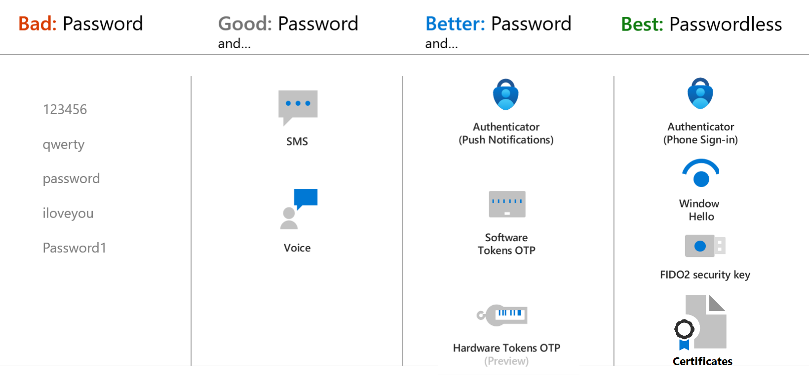
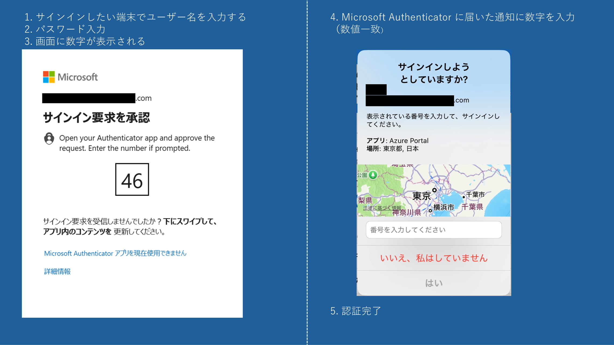
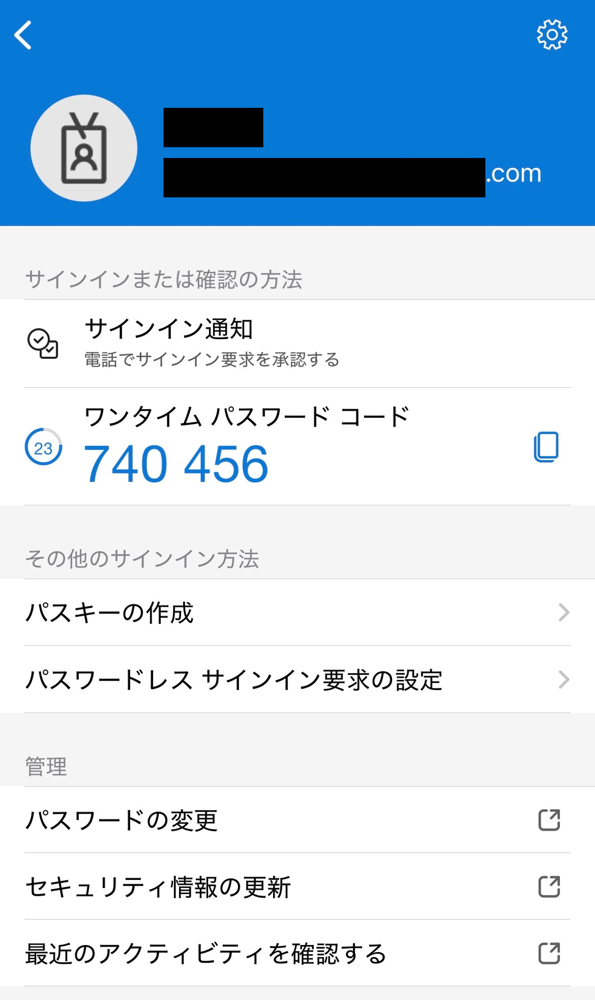
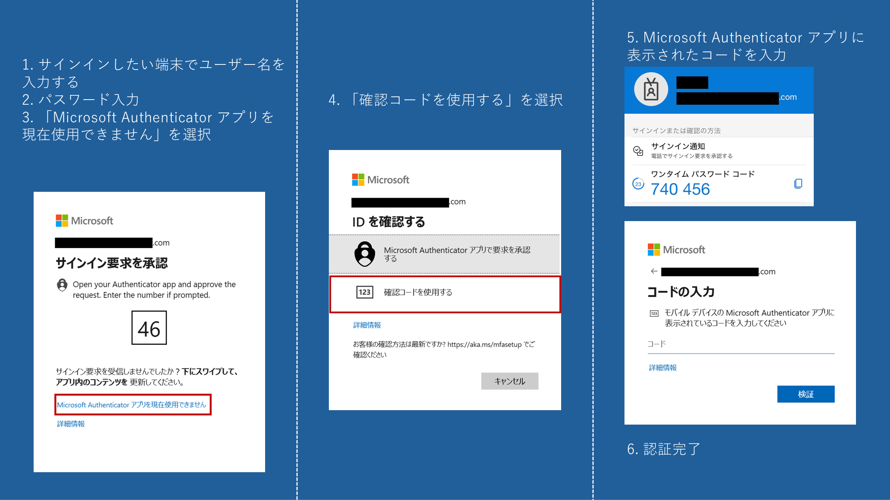
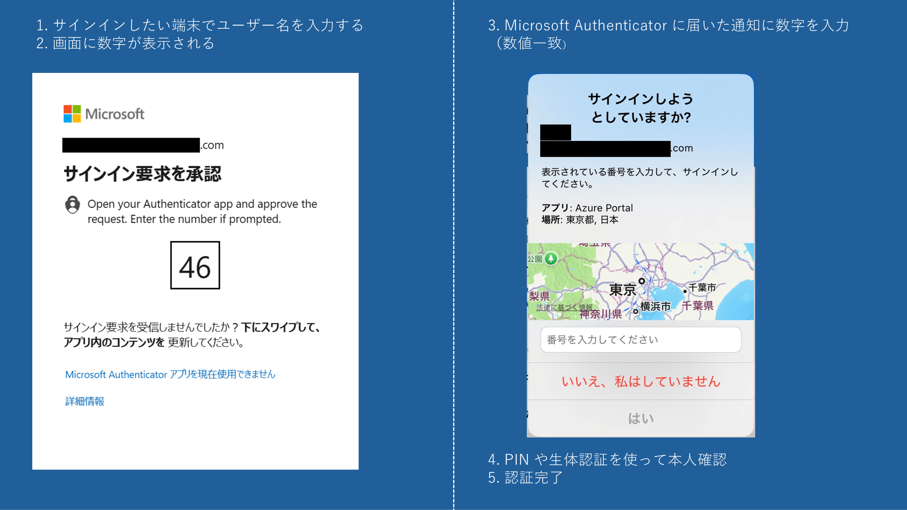
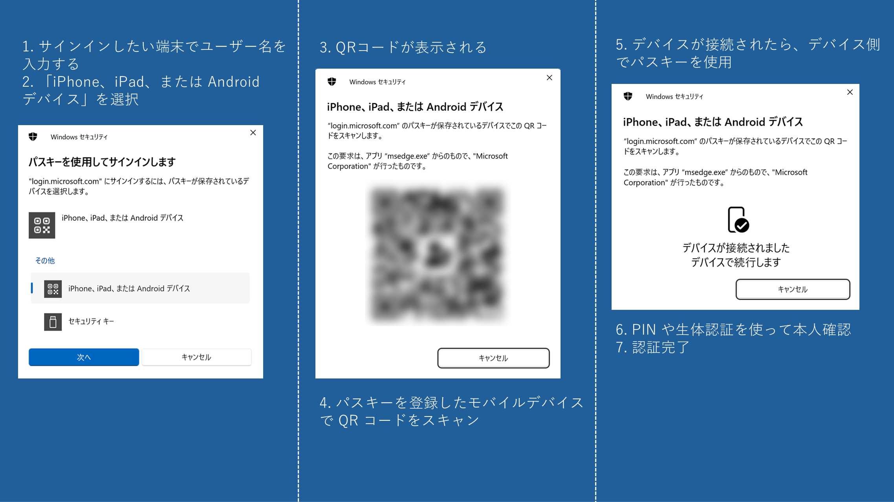
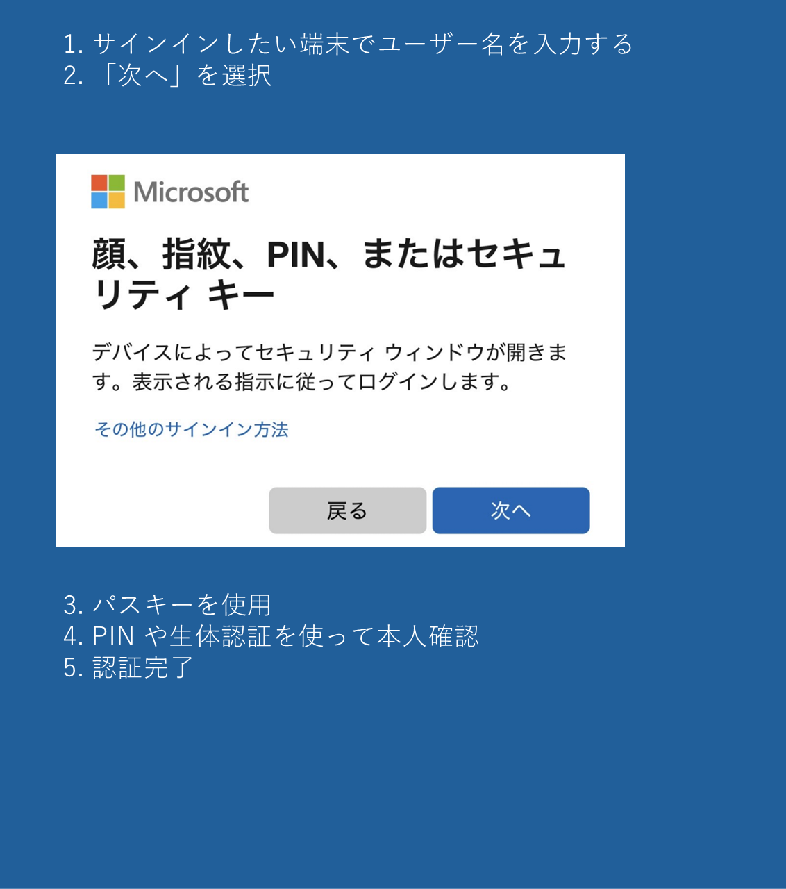

# Entra ID 初学者向けシリーズ 第 4 弾 - Microsoft Authenticator アプリ入門

こんにちは。Azure Identity サポート チームの 喜多 です。  

Microsoft Entra サポート チームでは、Entra を使い始めたばかりのお客様向けに、初学者向けブログシリーズを展開しています。今回は第 4 弾として、「Microsoft Authenticator アプリ入門」をお届けします。

---

**本記事の対象者**

- 多要素認証（MFA）の導入を検討中、またはその効果を知りたい方。
- SMS 認証などを利用中で、より安全な認証方法を探している方。
- Microsoft Authenticator アプリをすでに利用していて、さらにセキュリティを高めたい方。

**記事の概要**

MFA の導入は、現代のセキュリティ対策において不可欠です。SMS や音声通話による認証をご利用中の方も多いと思いますが、Microsoft Authenticator アプリを利用することで、より安全にアカウントを保護できます。本記事では、MFA の基本的な仕組みや導入によるメリットを解説したうえで、Microsoft Authenticator アプリの各認証方式 (プッシュ通知、OATH トークン、パスワードレス、パスキー) を比較しながら紹介します。特に、現在 SMS や音声通話による認証を利用されている方にとって、Microsoft Authenticator アプリへの移行を検討するきっかけとなれば幸いです。

---

## Microsoft Authenticator アプリとは

Microsoft Authenticator アプリは、Microsoft が提供している認証用のアプリです。Microsoft Entra ID や Microsoft アカウントを利用しているお客様は、まずそのサービスの利用にあたりサインインが必要になります。このサインインの体験をよりスムーズかつ安全にするために Microsoft Authenticator アプリが開発されました。Microsoft Authenticator アプリはサインインの流れの中で、特に多要素認証 (MFA) をより簡単かつ安全にするためにデザインされています。

ここで、ご存じかとは思いますが、MFA とは、異なる認証要素を複数組み合わせて本人確認を行う仕組みです。たとえば、パスワード (知識の要素) に加えて、スマートフォンの通知やワンタイム パスワード (所持の要素) などを用いることで、サインイン時に複数の認証要素を提示するよう求めることで、単一の要素 (パスワード) だけの場合よりもセキュリティを強化することが可能です。

パスワードはどれほど強固に設定しても、フィッシングや情報漏洩などによりパスワードが第三者に知られてしまうリスクを排除することはできません。しかし MFA を導入することで、仮にパスワードが漏洩し一つの要素が突破されたとしても、攻撃者は追加の認証要素の認証を満たすことができないため、不正アクセスのリスクを大幅に低減できます。例えば、ユーザーが MFA の要素として Microsoft Authenticator アプリを構成していたとします。この場合、ユーザー名とパスワードが悪意のある第三者に知られたとしても、その第三者が Microsoft Authenticator アプリのインストールされたユーザーのデバイスを奪うという状況が同時に起こる可能性は低いと言えます。このため、第三者による不正なサインインを防ぐことが可能です。

実際に、Microsoft の 2024 年 5 月の研究では、MFA を有効にすることで約 99% のセキュリティリスクを削減できると報告されています。

[How effective is multifactor authentication at deterring cyberattacks?](https://arxiv.org/pdf/2305.00945)

日本のお客様の中には、仕事用デバイスにのみアプリをインストールしたいという声もありますが、Microsoft Authenticator アプリは私物デバイスにインストールしても問題ありません。アプリ自体はデバイスの所有形態に関係なく安全に利用できます。

## より安全な認証方法とは

認証方式にはさまざまな種類があり、Microsoft は以下のようにそれをレベル分けしています。

- **Good**：SMS や音声通話など  
- **Better**：Microsoft Authenticator アプリのプッシュ通知、ソフトウェアトークン OTP など  
- **Best**：Microsoft Authenticator アプリのパスワードレス サインイン、Windows Hello、FIDO2 セキュリティキー（パスキーなど） 

Microsoft Authenticator アプリではいろいろな種類の認証方法を利用でき、Microsoft Authenticator アプリを使用した各認証方式は上記の「Better」および「Best」のレベルに対応しています。Microsoft では、より安全な認証手段として パスワードレス認証 (Best) を推奨していますが、まずは Better な認証方式である Microsoft Authenticator アプリのプッシュ通知をご利用いただくだけでもサインインの安全性を高めることが可能です。

## 認証方式の比較

Microsoft Authenticator アプリには、現在以下の 4 つの認証方式があります:

- プッシュ通知による MFA
- ソフトウェア OATH トークンによる MFA
- プッシュ通知によるパスワードレス認証
- パスキーによるパスワードレス認証

[Microsoft Authenticator の認証方法 - Microsoft Entra ID | Microsoft Learn](https://learn.microsoft.com/ja-jp/entra/identity/authentication/concept-authentication-authenticator-app)

これらを従来の SMS や音声通話と比較しながら、以下に解説していきます。現在 SMS や音声通話による MFA を利用されている方は、まずプッシュ通知による MFA の利用をぜひ検討ください。すでにプッシュ通知による MFA を利用しているお客様は、ぜひパスキーによるパスワードレス認証を検討ください。

### Good: パスワード + SMS/音声通話

SMS や音声通話は MFA の方法として依然として多くのお客様に利用されている一方で、安全性が低い方式です。これらの方式は公衆交換電話網（PSTN）を利用しており、通信の盗聴などのリスクが存在します。 そのため、Microsoft では SMS や音声通話による認証は、アカウント回復時のバックアップとして使用することは認めつつも、より安全な認証手段への移行を推奨しています。

詳しくは以下のブログをご参照ください: [認証に電話網を使うのはそろそろやめよう](https://jpazureid.github.io/blog/azure-active-directory/it-s-time-to-hang-up-on-phone-transports-for-authentication/)

SMS や音声通話を MFA で利用されているお客様に置かれましては、ぜひ Microsoft Authenticator アプリを活用した「Better」および「Best」な認証方式に移行ください。ここからは、これら「Better」および「Best」な認証方式について紹介します。

### Better: プッシュ通知による MFA

この方式は、パスワードで認証した後に Microsoft Authenticator アプリにプッシュ通知が届き、アプリ側でその通知を承認することで認証を完了する仕組みです。信頼性の低い電話網を利用する SMS や音声通話に対し、暗号化された通信を使用することで、通信経路の安全性を確保しています。また、大量の認証リクエストをユーザーに送るなどして、ユーザーに誤って承認させる手法 (MFA 疲労攻撃) への対策として、「数値の一致」機能や「アプリケーション名の表示」機能、「地理的な場所の表示」機能が導入されています。  

数値の一致機能では、サインイン画面に表示される 2 桁の数字を Microsoft Authenticator アプリに入力することで認証が完了します。これはユーザーが必ず認証画面の前におり、画面に表示された番号を見ながら Microsoft Authenticator アプリを操作して承認するということを確実にするための仕組みです。加えて、Microsoft Authenticator アプリの画面には、サインインしようとしているアプリの名前やサインインが開始されたユーザーの地理的な場所を表示するよう構成することもできます。これらの情報により、ユーザーはその要求が確かに自分自身により意図して開始されたものであることを確認して承認することが可能となります。

例えば、ユーザーが画面の前にいない状態で、見知らぬ MFA 要求がスマートフォンに通知されたとしても、ユーザーは正しい数字を知らないため、通知に応答することができません。またユーザーが PC の画面の前にいたとしても、サインインしようとしているアプリとは異なるアプリ名が Microsoft Authenticator アプリに表示されていたり、ユーザーが存在しない場所 (外国など) が Microsoft Authenticator アプリに表示されていたりする場合は、それが自分自身の意図したサインインではないということに気づくことができます。これにより、ユーザーがフィッシングに気づきやすくなります。

プッシュ通知による MFA は、Microsoft が多くのお客様に推奨している方法であり、まだパスワードのみの認証を利用しているお客様や、電話ベースの MFA を利用しているお客様はぜひこのプッシュ通知による MFA をご検討ください。繰り返しとなりますが、Microsoft Authenticator アプリは私物デバイスにインストールしても問題ありません。仕事用デバイスでも、私物デバイスにでも、同等のセキュリティが提供されますので是非お手元のデバイスでのご利用を検討ください。

### Better: ソフトウェア OATH トークンによる MFA

Microsoft Authenticator アプリは、OATH トークン (ワンタイム パスワードの生成器) としても利用可能です。この方式では、アプリに表示される 6 桁の「ワンタイム パスワード コード」をサインイン画面に入力することで認証を完了します。

この方式は、Microsoft Authenticator アプリ側の通信を伴わないため、Microsoft Authenticator アプリを利用している端末がオフライン環境であっても使用できるという利点があります。これにより、インターネット接続が不安定な状況でも安定した認証が可能となります。ただし、この方法はフィッシングに対する対策がありませんので、プッシュ通知やパスワードレス認証が利用可能であれば、この方法は利用しないことがおすすめです。

### Best: プッシュ通知によるパスワードレス認証

Microsoft Authenticator アプリは、認証時にパスワードを利用しないパスワードレス認証にも対応しています。そもそもパスワードを入力する場面を減らすことで、セキュリティを強化するという仕組みです。 

このプッシュ通知によるパスワードレス認証では、ユーザー名を入力した後にパスワードを打たずに Microsoft Authenticator アプリにプッシュ通知が届きます。アプリ側に表示された番号を入力し、承認した後、PIN や生体認証 (指紋や顔) を使ってデバイスの所有者を確認します。プッシュ通知による MFA と比較して、パスワードを入力することなく認証を完了する点が異なります。パスワードの入力を必要としないことで、利便性を向上させながらセキュリティも改善できます。この方式を利用するには、Microsoft Authenticator アプリがインストールされたデバイスを事前に Entra ID に登録しておく必要があります。

### Best: パスキーによるパスワードレス認証 (最も推奨されています)

この方法が現在最もセキュリティが高く推奨されている認証方法です。Microsoft Authenticator アプリは「パスキー（Passkey）」による認証にも対応しています。

この方式では、プッシュ通知が Microsoft Authenticator アプリに来ることはなく、番号の入力も不要です。Microsoft Authetnicator アプリがデバイスにインストールされており、パスキーが構成されていること、そのデバイスに構成された PIN や生体認証を突破するという二つの要素で認証が完了します。パスキーはフィッシング耐性に優れており、最も推奨される認証方式です。

[Android および iOS デバイス用 Authenticator のパスキーを使用してサインインする - Microsoft Entra ID | Microsoft Learn](https://learn.microsoft.com/ja-jp/entra/identity/authentication/how-to-sign-in-passkey-authenticator?tabs=iOS)

別のデバイス (PC など) でサインインするとき:

 
パスキーを登録したモバイル デバイス上でサインインするとき:

## まとめ

MFA の導入は、現代のセキュリティ対策において不可欠です。Microsoft Authenticator アプリは、SMS や音声通話よりも安全な認証方法であり、さらに数値一致やパスワードレス認証、パスキー対応など、さまざまな攻撃に対応して進化を続けています。

SMS や音声通話による認証をご利用中の方は、ぜひこの機会に Microsoft Authenticator アプリの導入をご検討ください。パスキーなどのパスワードレス認証も活用し、より安全にアカウントを保護していきましょう。
