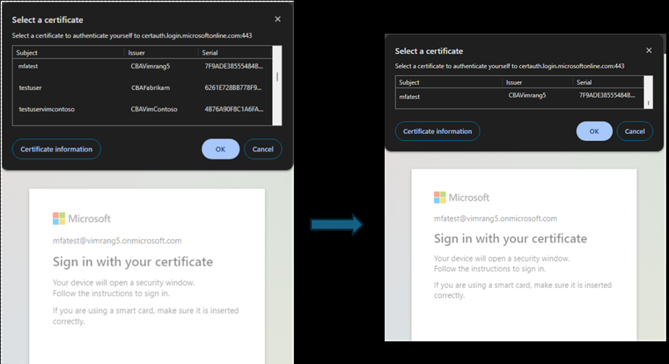

# Microsoft Entra  証明書ベース認証 (CBA) の機能強化

こんにちは、Azure Identity サポート チームの 田辺 です。

本記事は、2024 年 7 月 3 日に米国の Microsoft Entra (Azure AD) Blog で公開された [Microsoft Entra certificate-based authentication enhancements](https://techcommunity.microsoft.com/blog/identity/microsoft-entra-certificate-based-authentication-enhancements/1751778) を意訳したものになります。ご不明点等ございましたらサポート チームまでお問い合わせください。

Microsoft Entra の証明書ベースの認証 (CBA) の最新の機能をご紹介します。CBA は、フィッシングに強く、パスワード不要で、Active Directory フェデレーション サービス (AD FS) などのオンプレミスのフェデレーション基盤に依存せずに、PIV/CAC カードなどの X.509 証明書を使用してユーザーを認証するための便利な方法です。CBA は、すでに PIV/CAC カードを使用しており、フィッシングに強い認証を必要とする [大統領令 14028](https://learn.microsoft.com/ja-jp/entra/standards/memo-22-09-meet-identity-requirements) に準拠しようとしている連邦政府機関にとって特に重要となります。

本日は、[今年初めに導入](https://techcommunity.microsoft.com/blog/identity/introducing-more-granular-certificate-based-authentication-configuration-in-cond/2365668) された多くの改善点の一般提供を発表します。ユーザー名バインド、アフィニティ バインド、認証ポリシー ルール、条件付きアクセスの高度な CBA オプションはすべて GA となりました。また、新機能である **発行者ヒント** のパブリック プレビューを発表できることを嬉しく思います。**発行者ヒント** 機能は、ユーザーが認証に適した証明書を簡単に識別できるようにすることで、ユーザー体験を大幅に向上させます。

Microsoft Entra のプリンシパル プロダクト マネージャーである Vimala Ranganathan より、フィッシングに強い多要素認証 (MFA) に向けた取り組みに役立つこれらの新機能について説明します。

ご意見があればぜひお寄せください！

Alex Weinert

---

皆さん、こんにちは。Microsoft Entra のプリンシパル プロダクト マネージャーである Vimala Ranganathan です。本日は、新しい発行者ヒント機能と、一般提供が開始される機能について説明いたします。

発行者ヒント機能は、ユーザーが認証に適した証明書を簡単に識別できるようにすることで、ユーザー体験を向上させます。テナント管理者によって有効にすると、Microsoft Entra ID は TLS ハンドシェイクの一部として [Trusted CA Indication](https://www.rfc-editor.org/rfc/rfc6066#page-12) という情報を送り返します。ここでいう Trusted CA (CA) というのは、テナントによって [Entra の信頼ストア](https://learn.microsoft.com/ja-jp/entra/identity/authentication/how-to-certificate-based-authentication#step-1-configure-the-certification-authorities) にアップロードされた認証局 (CA) のサブジェクトのことを表します。クライアントまたはネイティブ アプリケーションは、サーバーから返されたヒントを使用して、証明書選択画面に表示される証明書をフィルターし、信頼ストア内の CA によって発行されたクライアント認証証明書のみをユーザーに表示します。

また、以下の機能が一般公開 (GA) となりました。各機能の詳細については、パブリック プレビューを知らせるブログである「[Microsoft Entra 証明書ベース認証 (CBA) の機能強化](https://jpazureid.github.io/blog/azure-active-directory/enhancements-to-microsoft-entra-certificate-based-authentication/)」を参照ください。

**CBA ユーザー名バインド**: CBA は、追加で残りの 3 つのユーザー名バインドのサポートを追加し、オンプレミスの Active Directory と同等の機能を提供するようになりました。追加された 3 つの証明書バインドは以下のとおりです。詳細については [ユーザー名バインド ポリシーを構成する](https://learn.microsoft.com/ja-jp/entra/identity/authentication/how-to-certificate-based-authentication#step-4-configure-username-binding-policy) を参照ください。

- 発行者とシリアル番号
- 発行者とサブジェクト
- Subject

**CBA アフィニティ バインド**: CBA アフィニティ バインドを使用すると、管理者はテナント レベルでアフィニティのバインド設定を構成でき、高アフィニティまたは低アフィニティ マッピングを使用するカスタム ルールを作成することで、お客様が現在使用している多くの潜在的なシナリオをカバーできるようになります。詳しくは [ユーザー名のバインド ポリシー](https://learn.microsoft.com/ja-jp/entra/identity/authentication/concept-certificate-based-authentication-technical-deep-dive#understanding-the-username-binding-policy) をご覧ください。

**CBA 認証ポリシー ルール**: 認証の強度を単一要素または多要素としていずれとして扱うかを決定できます。また、複数のカスタム認証バインドのルールを作成し、証明書の属性 (発行者またはポリシー OID、または発行者と OID の組み合わせ) に基づいて、証明書に関する既定の保護レベルを割り当てることもできます。詳細については、「[認証バインディング ポリシーの構成](https://learn.microsoft.com/ja-jp/entra/identity/authentication/how-to-certificate-based-authentication#step-3-configure-authentication-binding-policy)」を参照ください。

**条件付きアクセスにおける高度な CBA の設定項目**: 証明書の発行者またはポリシー OID のプロパティに基づいて特定のリソースへのアクセス可否を制御できます。認証強度の高度なオプションの詳細については、こちらをご覧ください。

Microsoft Entra CBA の詳細については、[こちら](https://learn.microsoft.com/ja-jp/entra/standards/memo-22-09-meet-identity-requirements) と Microsoft の [大統領令 14028](https://www.microsoft.com/en-us/federal/cybersecurity) に対する取り組みをご覧ください。-

## 今後の取り組み

昨年、多くの連邦政府および規制業界のお客様が、段階的ロールアウトの機能を活用して、AD FS から Microsoft Entra ID にシームレスに移行し、CBA を使用してエンド ユーザーに使い慣れたサインイン体験を提供できています。実際、過去 12 か月で、米国政府のお客様に対するフィッシング耐性のある認証が 1,400% 以上増加しました。
 
フィードバックは [Microsoft Entra コミュニティ](https://techcommunity.microsoft.com/category/microsoftsecurityandcompliance/discussions/azure-active-directory) でお寄せください。弊社は、証明書失効リスト (CRL) の制限の撤廃、新しい認証局の信頼ストア、B2B 外部ゲストユーザーのリソーステナントでの CBA サポート、iOS UX の強化など、さらなる機能強化を実現するために取り組んでいます。
