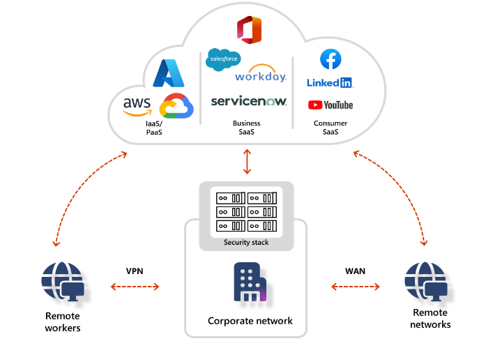
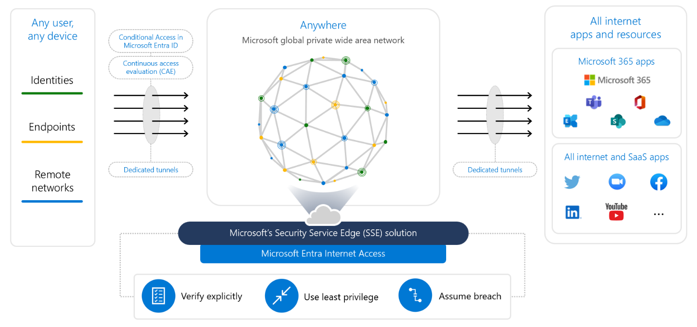
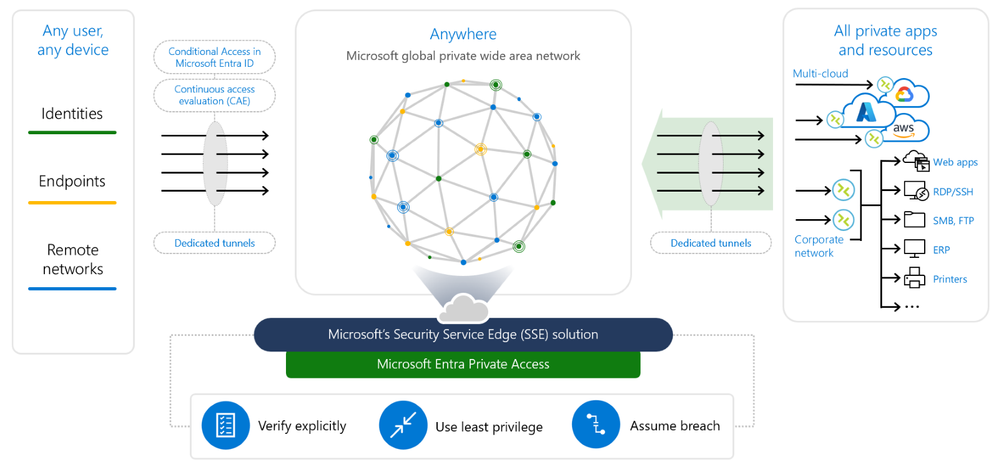
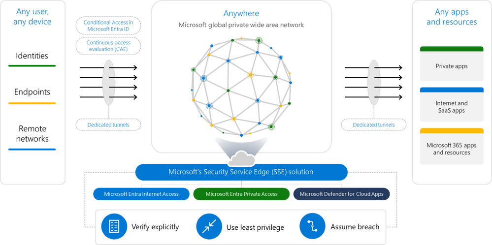

# Microsoft Entra - Security Service Edge へ拡大するための新機能

こんにちは、Azure Identity サポート チームの 姚 (ヨウ) です。

本記事は、2023 年 7 月 11 日に米国の Microsoft Entra (Azure AD) Blog で公開された [Microsoft Entra Expands into Security Service Edge with Two New Offerings - Microsoft Community Hub](https://techcommunity.microsoft.com/t5/microsoft-entra-azure-ad-blog/microsoft-entra-expands-into-security-service-edge-with-two-new/ba-p/3847829) を意訳したものになります。ご不明点等ございましたらサポート チームまでお問い合わせください。

----

柔軟な仕事環境やデジタル トランスフォーメーションにより、どのようにして情報に安全にアクセスするかという方法も変化してきています。従来のネットワークをベースにしたセキュリティのアプローチは現在の環境には適さなくなってきました。従来の方法は、エンド ユーザーの体験を損なうだけでなく、ユーザーに対して、ネットワーク全体に必要以上のアクセス権を与えることになります。攻撃者が、1 名の情報漏洩ユーザー、1 つの感染デバイスなど、1 つのきっかけを得るだけで、内部ネットワークへ自由に入り込み、重要情報資産が流出することになります。

先進的なアクセス ソリューションをシステムに導入したとしても、複数の ID とネットワーク ツールを統合し、管理する必要があります。なぜなら、単独の ID またはネットワーク ツールだけでは、すべてのアクセス ポイントを保護することはできないからです。もしうまく統合できないツールを利用してしまうと、重要な統合ポイントを見逃してしまう可能性があります。熟練した攻撃者はそういったソリューションの間にある隙間を攻撃するのです。全アプリケーションまたはリソースを保護するためには簡単かつアジャイルなアプローチが必要です。本日弊社が紹介する新しいネットワーク モデルにより、アクセス保護の仕方も変わってくるでしょう。

本日は [2 つの新しい製品](https://www.microsoft.com/en-us/security/blog/2023/07/11/microsoft-entra-expands-into-security-service-edge-and-azure-ad-becomes-microsoft-entra-id/) を紹介いたします。

- Microsoft Entra Internet Access
- Microsoft Entra Private Access

ID とネットワーク ソリューションを連携させることにより、個々のアプリにどのツールが適切か考えたり、ID 担当チームが作成したポリシーとネットワーク担当チームが作成したポリシーとを連携させる方法を検討したりすることに時間に費やす必要はなくなります。Microsoft Entra の条件付きアクセスを利用して ID とネットワークを総合的に制御することができるようになります。

クラウドベースの ID 中心のネットワーク アクセス ソリューションを通して、すべてのエンドユーザー、アプリケーション、外部リソースそして IT システムをつなぐことができるようになります。このクラウド サービスはレガシーのオンプレミス システムと比較すると、変化に柔軟で管理が容易であり、コスト効率がよいため、ユーザーの生産性を損なうことはありません。このモデルはゼロ トラストの原則をベースとしており、ID を検証すると共に、リスクに基づいた検出も行うことで、ユーザーの仕事に必要なアプリケーション、リソースにアクセスできるよう支援します。

## Microsoft Entra Internet Access

Microsoft Entra Internet Access は、SaaS アプリケーションおよびインターネット通信向けの、ID を軸とした Secure Web Gateway (SWG) であり、悪意がある接続や危険/非準拠なコンテンツ、外部インターネットからの脅威から保護するためのサービスです。例えば、高リスクと判断されたユーザーまたは非準拠デバイスからのアクセスは、セルフサービス パスワード リセットのページを除いて通信をすべてブロックするということが可能になります。これは、条件付きアクセスの条件の設定をネットワークの条件で拡張するようなものとお考えください。これにより、例えばセッション トークンが盗まれたとしても、その再利用を抑止するために、"準拠ネットワーク" からのみリソースへのアクセスを許可するようにも構成できます。

Universal Tenant Restrictions という Microsoft 365 向けの独自の機能も備えており、匿名アクセスを含め他テナントや個人アカウントへのデータ流出を防止し、リアルタイムに近い脅威の検出、ユーザー、場所およびデバイスに対する高精度のリスク評価、および Microsoft 365 アプリへのよりシームレスなアクセスを実現します。Microsoft Entra Internet Access はメイン ソリューションとしても、ほかの SSE ソリューションと組み合わせても展開でき、新しい Microsoft Graph API による統合も提供されます。また、ネットワーク トラフィックの情報は、エンドユーザーのクロスプラットフォームの OS およびリモート ネットワークの IPSec トンネリングを利用しても取得できます。

Microsoft 365 用および Windows 用の Microsoft Entra Internet Access が現在パブリック プレビューとして公開されています。他のすべてのトラフィック、クラウド ファイヤーウォール、脅威検知および他の OS のサポートは今年の後半に公開予定です。

## Microsoft Entra Private Access

Microsoft Entra の Application Proxy をご存じかと思います。現在数千のお客様が内部ウェブ アプリケーションへのアクセスに Application Proxy を利用しています。本日、これにより優れたソリューションを発表いたします。Application Proxy と同じアプリ コネクターを共有する仕組みでありながら、組織の内部のリソース、ポートまたはプロトコールへのアクセスを保護する、ID 中心のゼロトラスト ネットワーク  アクセス (ZTNA) ソリューションです。

Microsoft Entra Private Access により、ユーザーがオフィスまたはリモートのどこにいようと、アプリケーションがオンプレミスのデータセンターまたは外部クラウドのどこにホストされていようと、より迅速かつ簡単にアプリケーションへ接続となります。これらのアプリケーションに対して何ら変更を加える必要はありません。追加の変更なく、多要素認証 (MFA) やデバイス準拠の検証、ID Protection、ID Governance、およびシングル サインオンを TCP/UDP をベースとしたアプリケーションに構成できます。加えて、SSH、RDP、SAP、SMB ファイル共有やほかの内部リソースもサポートします。

属性ベースの条件付きアクセス ポリシーを利用することにより、エンタープライズ向けのアプリケーションの重要度に基づき、より効果的に複数のアプリケーションを対象にしてシンプルなポリシーを作成することはできます。例えば、MFA を要求するポリシー、デバイスの準拠を要求するポリシー、ユーザーが低リスクであることを要求するポリシー、重要なアプリケーションに対して準拠したネットワークからのアクセスを要求するポリシーが挙げられます。特定のアプリケーションを対象にした個別のポリシーを構成することももちろん可能です。条件付きアクセス ポリシーと継続的アクセス評価 (CAE) との統合によって、レガシー アプリケーションの認証方法である Kerberos または NTLM を変更することなく、安全かつシームレスに先進的な認証を追加することができます。Microsoft Entra Private Access は現在パブリック プレビューです。

## ID 中心の Security Service Edge (SSE) ソリューションでどこからでもアプリケーションやリソースへ安全にアクセス

Microsoft Entra Internet Access と Private Access に加えて、弊社の SaaS - セキュリティに特化した CASB (Cloud Access Security Broker) - である Microsoft Defender for Cloud Apps を組み合わせることによって Microsoft の Security Service Edge ソリューションが構成されます。このソリューションは Microsoft の広範なセキュリティ製品と深く統合されており、オープンなパートナー エコシステムを形成するため、既存のネットワークとセキュリティ ソリューションとも連携できます。

Microsoft Internet Access と Private Access は、同じエージェントを共有しており、複数の種類の OS で動作し、なおかつ複数の種類のデバイスとネットワークで一貫した接続性を提供いたします。アプリケーションまたはウェブサイトに対して、利用する IdP に関係なく、しかもアプリケーションを変更することなく、ID、デバイス、アプリケーション、そして今後はネットワーク条件を考慮した制御を一つの条件付きアクセス ポリシーで実現できるようになるのです。

Microsoft の SSE ソリューションは世界最大の企業ネットワークの 1 つである [Microsoft Global Network](https://learn.microsoft.com/en-us/azure/networking/microsoft-global-network) によって提供されます。Microsoft Global Network は、[185 以上のグローバルなネットワーク接続拠点](https://azure.microsoft.com/en-us/explore/global-infrastructure/global-network/#features) に加え、世界中に巨大な網目のように配置されたエッジ ノードにより、61 の Azure リージョンの[データセンター](https://azure.microsoft.com/en-us/explore/global-infrastructure/) を結んでいます。これにより、ユーザーとデバイスをパブリックおよびプライベートのリソースにシームレスかつ安全に接続できるようになります。現在、Microsoft の SSE は北米とヨーロッパの一部の地域で提供されていますが、今年中に利用できる地域を追加する予定です。

我々の SSE ソリューションの導入により、Microsoft Internet Access と Private Access がユーザーの ID、デバイス 準拠状態、アプリケーション、そして今では新しいネットワークの準拠状態を条件として、どのアプリケーションおよびリソースに対しても、ID を中心とした単一のアプローチで安全な接続を実現します。すべてのアクセス ポリシーを統合し、継続的アクセス評価によりさらにポリシーを強化するということが、これまで以上に簡単になりました。

引き続き製品の Deep Dive ブログにもご期待ください。また、7 月 20 日の [Tech Accelerator Product Deep Dive Session](https://techcommunity.microsoft.com/t5/microsoft-entra-azure-ad-blog/live-series-6-27-amp-7-20-microsoft-entra-tech-accelerator/ba-p/2520433) では、Microsoft Internet Access と Private Access がいかに組織のデジタル資産へのアクセスをより安全にするかという点をさらに紐解いて説明いたします。

このソリューションをより良くするために、ぜひパブリック プレビューに参加いただき、フィードバックを提供ください。

以下の公開情報もご参照いただけますと幸いです。

- [Microsoft Entra Internet Access](https://www.microsoft.com/security/business/identity-access/microsoft-entra-internet-access)
- [Microsoft Entra Private Access](https://www.microsoft.com/en-us/security/business/identity-access/microsoft-entra-private-access)
- [Get started and try previews](https://aka.ms/SSEPublicPreview)
