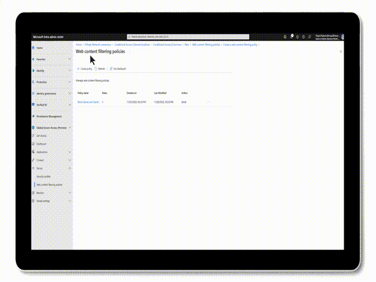
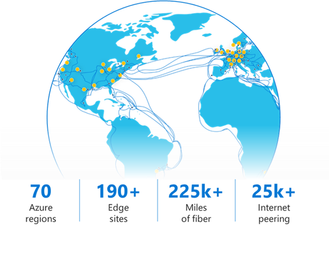
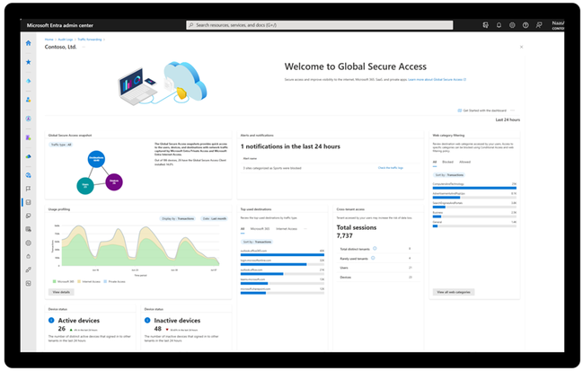
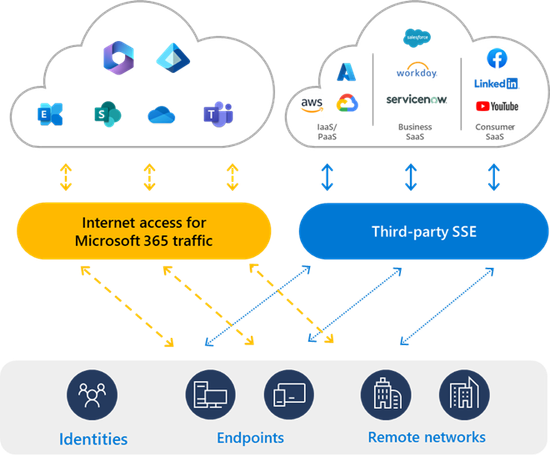

# Microsoft Entra Internet Access のご紹介

こんにちは、Azure Identity サポートチームの 姚 (ヨウ) です。 

本記事は、2024 年 9 月 18 日に米国の Azure Active Directory Identity Blog で公開された [Microsoft Entra Internet Access now generally available - Microsoft Community Hub](https://techcommunity.microsoft.com/t5/microsoft-entra-blog/microsoft-entra-internet-access-now-generally-available/ba-p/3922547?utm_source=substack&utm_medium=email) を意訳したものになります。ご不明点等ございましたらサポート チームまでお問い合わせください。 

---- 

ハイブリッドな働き方が増すにつれ、ID とネットワークのセキュリティ専門家たちは組織を守るための最前線に立たされています。従来のセットワーク セキュリティのツールでは、統合性、複雑性、スケーラビリティという、どこからでもアクセスが可能という昨今のネットワーク環境の要件を満たせなくなっており、組織はセキュリティ リスクと劣悪なユーザー体験にさらされています。これを解決するために、ネットワーク セキュリティと ID を一体化した保護が必要です。ID とネットワークの制御がセキュリティの制御に高度に組み込まれることで、暗黙的な信頼なく、すべてのユーザー、デバイスおよびアプリケーションに対して、必要な対象に必要最低限の特権が許可されるというゼロ トラストの概念に基づく環境を提供可能となります。

## Microsoft Entra Internet Access

2024 年 7 月 11 日に Microsoft Entra Suit の [一般提供を発表](https://jpazureid.github.io/blog/azure-active-directory/microsoft-security-service-edge-now-generally-available/) しました。この Microsoft Entra Suit には Security Service Edge (SSE) ソリューションの一部である Microsoft Entra Internet Access が含まれております。Microsoft Entra Internet Access は、ID を中心に据えたセキュア ウェブ ゲートウェイ (SWG) ソリューションにより、すべてのインターネットおよび SaaS アプリケーションやリソースへのアクセスを保護します。これにより、ID およびネットワーク アクセスの制御が単一のゼロ トラスト ポリシー エンジンを通じて統合され、これまでカバーできていなかったセキュリティの抜け穴が解消されるとともに、サイバー脅威のリスクを最小限に抑えることが可能となります。我々のソリューションは、Microsoft Entra ID をシームレスに統合し、複数の場所 (ツールなど) でユーザー、グループおよびアプリケーションを管理する負担を軽減します。ユニバーサル条件付きアクセス、文脈を意識したネットワーク保護およびウェブ コンテンツ フィルターによってユーザー、デバイスおよびアプリケーションを保護しますので、バラバラな複数のネットワーク セキュリティ ツールの管理に悩むことはなくなります。

### ID とネットワークの統合セキュリティ

Entra ID との強力な統合によって、条件付きアクセスや継続的なアクセス評価 (CAE) をインターネット上のリソースやクラウド アプリケーションなど、Entra ID とフェデレーションしていない [外部の対象にまで拡張](https://learn.microsoft.com/ja-jp/entra/global-secure-access/concept-universal-conditional-access) できます。条件付きアクセスとの統合により、組織に合わせてカスタマイズしたネットワーク保護ポリシーを柔軟に適用し、デバイス、ユーザー、場所およびリスク条件を活用しながら、きめ細かい制御を強制することが可能になります。さらに、Microsoft Entra Internet Access はトークン再生攻撃からの防御やデータ流失の制御などの強化されたセキュリティ機能も提供します。

### 一連の流れを意識したネットワーク セキュリティでユーザーを保護

Microsoft Entra Internet Access により [ネットワークを対象としたセキュリティ ポリシーを条件付きアクセスと連携させる](https://learn.microsoft.com/ja-jp/entra/global-secure-access/how-to-configure-web-content-filtering#create-and-link-conditional-access-policy) ことができるようになるため、SWG のポリシーを強制するにあたり、お客様は様々なシナリオに対応できる新たなツール得ることになります。[Web カテゴリ フィルター](https://learn.microsoft.com/ja-jp/entra/global-secure-access/reference-web-content-filtering-categories) により、事前に用意された [ウェブ カテゴリ](https://learn.microsoft.com/ja-jp/entra/global-secure-access/reference-web-content-filtering-categories) にもどづいて広範なインターネット アクセス先を許可/ブロックするような構成を実現できます。さらにきめ細かいポリシーを構成したい場合は、完全修飾ドメイン名 (FQDN) フィルターを利用して、特定のエンドポイント用のポリシーを設定したり、既定の Web カテゴリー ポリシーを上書きしたりすることも可能です。

例えば、会計部門のチームに重要な会計アプリケーションへアクセスを許可する一方で、組織のほかの部門からアクセスを制限するようなポリシーを作成できます。また、Entra ID Protection によってユーザー リスクが上昇したメンバーに対しては、動的にユーザーのリスク レベルに対応し、これら重要なリソースへのアクセスを制限するリスクベースのフィルター ポリシーを追加することも可能です。これにより組織に対し、より強力な保護を提供することができます。さらに別の例としては、Microsoft Entra Internet Access、条件付きアクセス、および Entra ID Govermance ワークフローを組み合わせて活用することで、Dropbox に Just-In-Time アクセスを実現し、ほかのすべての外部ストレージ サイトへのアクセスはブロックするいうことも可能です。

今後、TLS インスペクションおよび URL フィルターの機能を追加し、Web フィルター ポリシーでさらにきめ細かい制御ができるようにする予定です。加えて、既知の悪意あるインターネット サイトへのユーザーによるアクセスを防ぐために、脅威インテリジェンス (TI) のフィルターも追加する予定です。

### 準拠ネットワークのチェックでトークン再生攻撃へ多層防御を提供

新機能である [準拠ネットワーク](https://learn.microsoft.com/ja-jp/entra/global-secure-access/how-to-compliant-network) の制御により、Microsoft 365 アプリケーションを含め Entra ID とフェデレーションしているインターネット アプリケーションに対し、準拠ネットワークのチェック機能を条件付きアクセスと組み合わせて適用できるため、認証プレーン全体でトークン再生攻撃を防ぐことが可能となります。この機能により、ユーザーがアプリケーションにアクセスする際に、SSE のセキュリティ機能を迂回できないようにできます。送信元 IP を用いた場所に基づく強制には、煩雑な IP 管理に加え、支店ネットワークを経由してアクセスしてくるユーザーとトラフィックの紐づけという固有の問題点がありますが、準拠ネットワークの機能を用いればその欠点も解消可能です。

### ユニバーサル テナント制限 (TRv2) による制御でデータ流出を防止

Microsoft Entra Internet Access では OS やブラウザに依存せず、すべての管理対象デバイスで [ユニバーサル テナント制限](https://learn.microsoft.com/ja-jp/entra/global-secure-access/how-to-universal-tenant-restrictions) の制御を有効にできます。テナント制限 v2 は強力なデータ流出防止機能であり、外部の ID およびアプリケーションへアクセス可能/不可能かを許可または拒否リストできめ細かく選定することにより、管理対象デバイスおよびネットワークに対する外部からのアクセスのリスクを管理可能となります。

 

### ユーザーの送信元 IP を隠蔽しない

従来のサードパーティ SEE ソリューションはユーザーの送信元 IP を隠し、プロキシー サーバーの IP アドレスだけを見せますが、これでは Entra ID ログの信頼性が低下し、条件付きアクセスの制御においても制御の正確性が損なわれます。我々のソリューションでは、Entra ID の監査ログやリスク評価において可能な限り [エンドユーザーの送信元 IP を復元](https://learn.microsoft.com/ja-jp/entra/global-secure-access/how-to-source-ip-restoration) します。これにより、条件付きアクセス ポリシーで送信元 IP ベースの場所チェックを引き続き利用できますので、後方互換性も維持できます。

### グローバル スケールで高速かつ安定したアクセスを提供

弊社はグローバル規模でプロキシを展開しており、インターネットへ流れるトラフィックを最適化するためにユーザーの近くにエンドポイントを展開し、通信に必要なホップ数を削減しています。ユーザーからわずか数ミリ秒の距離にある弊社のグローバル  セキュア エッジを経由して、リモートワークをしている従業員や支店とをつなげることができるのです。弊社はインターネット プロバイダーや SaaS サービスと数千のピアリングの接続を保持しており、加えて、Microsoft 365 および Azure のようなサービスには Microsoft WAN 基盤へ直接トラフィックを送ることにより、追加の通信ホップによるパフォーマンス劣化を回避しつつ、全体のユーザー エクスペリエンスを向上させています。

### 製品内のダッシュボードで高度な詳細情報とネットワーク解析情報を得る

弊社が提供する製品内の包括的なレポートとダッシュボードにより、お客様は手軽に詳細情報を確認でき、組織全体のエコシステムを完全に把握可能です。包括的なネットワークとポリシー監視のログを通して展開状況を監視でき、緊急な脅威も特定でき、さらに迅速に問題に対処できます。このダッシュボードでは、ユーザー、デバイスおよび Microsoft の SSE ソリューションを経由した接続先の概要情報を確認可能です。企業内で行われるクロステナント アクセスの状況や、よくアクセスしているネットワーク接続先、その他のポリシーの解析情報も表示しています。

## Microsoft Entra Internet Access のアーキテクチャ概要

Microsoft SSE の [クライアント](https://learn.microsoft.com/ja-jp/entra/global-secure-access/how-to-install-windows-client) と [リモートネットワーク](https://learn.microsoft.com/ja-jp/entra/global-secure-access/how-to-create-remote-networks?tabs=microsoft-entra-admin-center) のアーキテクチャによりネットワーク アクセスとセキュリティが効率されます。デバイスで動作する Global Secure Access クライアントは現在 Windows と Android で利用可能です。MacOS と iOS 用のものは近日に公開されます。拠点間の接続は、ネットワーク デバイスから Microsoft の SSE エッジサービスへの Site-To-Site 接続に基づいて動作します。[Microsoft トラフィック](https://learn.microsoft.com/ja-jp/entra/global-secure-access/how-to-manage-microsoft-profile) はすでに一般公開されていますが、[インターネット アクセス プロファイル](https://learn.microsoft.com/ja-jp/entra/global-secure-access/how-to-manage-internet-access-profile) も近日に追加される予定です。エンドユーザーのデバイスと拠点ネットワーク間の通信モデルは Microsoft の SSE エッジを経由して保護およびトンネリングされています。さらに、弊社は [HPE Aruba](https://community.hpe.com/t5/networking/secure-access-to-saas-applications-with-hpe-aruba-networking-and/ba-p/7220489) と [Versa](https://versa-networks.com/blog/versa-sd-wan-and-microsoft-entra-combine-for-end-to-end-networking-and-security/) とパートナー提携を行い、弊社の SSE ソリューションと SD-WAN ソリューションとを統合するべく取り組んでいます。近日には他のパートナーとも追加の提携を行う予定です。

## サードパーティの SSE ソリューションとの並列した相互運用

Microsoft の SSE の独自の利点の 1 つは [サードパーティの SSE ソリューション](https://learn.microsoft.com/ja-jp/entra/global-secure-access/concept-netskope-coexistence) と既定で互換性がある点です。これにより必要な通信だけを Microsoft の SSE エッジに流れるようにできます。例えば、Microsoft トラフィック プロファイルを利用して、Microsoft 365 と Entra ID の通信だけを管理し、Microsoft アプリケーションへのアクセスのパフォーマンスを最適化しつつ、他の通信は別のプロバイダーで管理するように構成可能です。トラフィック転送プロファイルの構成はシンプルなので、インターネットおよび Microsoft 365 を含めた SaaS アプリケーションへの通信を正確に制御できます。トラフィック プロファイルはユーザーごとに設定できますので、組織の要件に応じてグループ単位で割り当てることもできます。

 

## まとめ

Microsoft Entra Internet Access は強力な ID 中心の SWG ソリューションであり、インターネットおよび SaaS アプリケーションへの通信をセキュリティで保護します。ID、エンドポイントおよびネットワークを横断して条件付きアクセスに統合することより、ハイブリッドな職場環境の要件を満たし、高度なサイバー攻撃にも対処できます。この戦略的な取り組みにより、セキュリティの強化だけでなく、ユーザー体験の最適化も実現されます。これこそが、クラウド ファーストの環境への移行をリードていくという Microsoft のコミットメントを示しています。

### 是非サービスをお試しください

Microosft Entra Internet Access のブログや Microsoft Entra Private Access の Deep Dive にもご注目ください。より詳細については、弊社の直近の [Tech Accelerator product deep dives](https://aka.ms/accelerateentra) もご覧ください。

利用を開始したい場合は、Microsoft の営業担当に連絡し、トライアルを開始して、一般公開された Microsoft Entra Internet Access と Microsoft Entra Private Access をお試しください。このソリューションをよりよくするために、ご意見がありましたら是非お知らせください。

Anupma Sharma, Principal Group Product Manager
