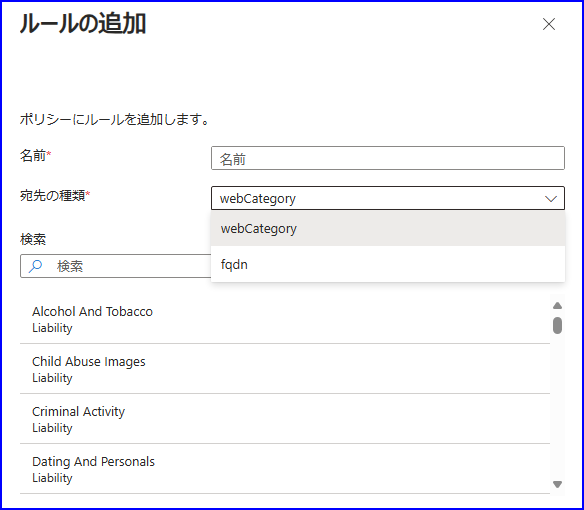
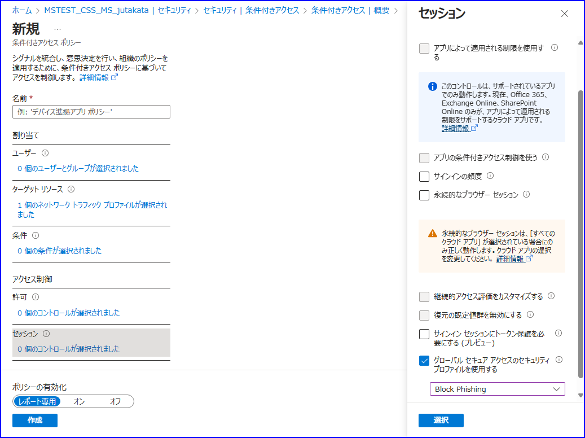

# Microsoft Entra Internet Access: Security Service Edge を ID とアクセス管理で統合する

こんにちは、Azure Identity サポート チームの 高田 です。

本記事は、2024 年 3 月 28 日に米国の Microsoft Entra (Azure AD) Blog で公開された [Microsoft Entra Internet Access: Unify Security Service Edge with Identity and Access Management](https://techcommunity.microsoft.com/t5/microsoft-entra-blog/microsoft-entra-internet-access-unify-security-service-edge-with/ba-p/4088980) の抄訳です。ご不明点等ございましたらサポート チームまでお問い合わせください。

----

最新の [Microsoft Ignite イベント](https://www.youtube.com/watch?v=_EGK57wwHfs&t=1027s) では、Microsoft Entra Internet Access という、すべてのエンタープライズのアクセス ガバナンスを一元化できる、ID 中心の Secure Web Gateway (SWG) ソリューションの新機能を発表し、デモをしました。これらの機能は、ID とネットワーク アクセス制御を統合し、複数のセキュリティ ソリューションを使用することによって生じるセキュリティの抜け穴と管理の複雑さを排除するのに役立ちます。これにより、企業は悪意のあるインターネット トラフィックやインターネットからの他の脅威に対して防御が可能になりす。

このブログでは、統一されたポリシー エンジンである Entra ID 条件付きアクセスを活用して、すべての Web ベースのインターネット リソースと SaaS アプリケーション全体で動作する Entra Internet Access の Web コンテンツ フィルタリング機能について、その利点を紹介いたします。

## インターネットへの条件付きアクセス ポリシーの拡張

Microsoft Entra Internet Access は、条件付きアクセス ポリシーをより文脈に沿って洗練させ、それをエンタープライズ SWG フィルタリングに拡張するというものです。これにより、ユーザー、デバイス、場所、およびリスク条件に基づいて、任意のインターネットの宛先に対してきめ細かい Web フィルタリングを適用することが可能になります。さまざまな文脈と条件に基づいて異なるフィルタリング ポリシー (将来的には、脅威保護ポリシー、DLP ポリシーなど) を適用するという機能は、今日のエンタープライズの複雑な要求に対応するために重要です。ID とネットワークの文脈を同時に考慮して、条件付きアクセスを通じて粒度の細かいポリシーを強制するという機能こそが、Microsoft Entra Internet Access を世界初の ID 中心の SWG ソリューションたらしめるのです。

## Web コンテンツをフィルタリングして攻撃対象を減らす

Microsoft Entra Internet Access は、Windows と Android の両プラットフォームで利用可能なクライアント接続モデルを使用して、エンタープライズ ユーザーが望ましくない Web コンテンツへのアクセスを防ぐための広範な Web コンテンツ フィルタリングを提供します。近く、他の OS プラットフォームとブランチ接続のサポートを追加する予定です。

例えば、[Web カテゴリ フィルタリング](https://learn.microsoft.com/ja-jp/entra/global-secure-access/how-to-configure-web-content-filtering) を使用すると、[Web コンテンツの広範な分類](https://learn.microsoft.com/ja-jp/entra/global-secure-access/reference-web-content-filtering-categories) リポジトリを使用してポリシーを作成し、カテゴリ全体でインターネットのエンドポイントを簡単に許可またはブロックすることができます。カテゴリの例としては、法的責務、高帯域幅、ビジネス利用、生産性の損失、一般的なネット利用、セキュリティ (マルウェア、危険なサイト、スパムサイトなどを含む) などがあります。

さらに詳細なアプリケーション層のアクセス制御を提供するために、[完全修飾ドメイン名 (FQDN) フィルタリング](https://learn.microsoft.com/ja-jp/entra/global-secure-access/how-to-configure-web-content-filtering) を使用してポリシーを作成し、特定のエンドポイントを単独のポリシー設定を通じて許可またはブロックすしたり、もしくは Web カテゴリ ポリシーに簡単に例外を追加したりすることができます。

Microsoft Entra Internet Access を使用すると、インターネット フィルタリング ポリシーはより簡潔で理解しやすく、包括的になり、攻撃対象を減らしつつ、管理体験をよりシンプルにするのに役立ちます。

## 条件付きセキュリティ プロファイルで事前に設定する

セキュリティ プロファイルを使用すると、Web コンテンツ フィルタリング ポリシー (そして将来的には、保護ポリシーや DLP ポリシーなども含む）の論理的なグループを作成し、それらを条件付きアクセス ポリシーに割り当てることが簡単にできます。さらに、セキュリティ プロファイルは優先順位をつけて整理することもでき、どのユーザーが Web コンテンツ フィルタリング ポリシーの影響を受けるかについての明確に制御が可能です。

仕組みは以下のとおりです。たとえば、財務部門だけが財務アプリケーションにアクセスできるようにするとします。すべてのユーザーに適用される基本プロファイル (優先度 65000) に、財務ウェブ カテゴリのブロック ポリシーを追加できます。財務部門のために、財務ウェブ カテゴリを許可するセキュリティ プロファイル (優先度 200) を作成し、それを財務グループに強制する条件付きアクセス ポリシーに関連付けることができます。財務部門を許可するセキュリティ プロファイルは基本プロファイルよりも優先度が高いため、財務部門は財務アプリにアクセスできます。ただし、財務部門のユーザー リスクが高い場合、そのアクセスは拒否されるべきです。したがって、財務ウェブ カテゴリをブロックする追加のセキュリティ プロファイルを作成し (優先度 100)、それをユーザー リスクが高いユーザーに強制する条件付きアクセス ポリシーに関連付けます。

## まとめ

弊社の 2023 年の Ignite リリースでは、SWG、トランスポート層セキュリティ (TLS) インスペクション、クラウド ファイアウォール、ネットワーク データ損失防止 (DLP)、および Microsoft Threat Protection 機能を含む、完全に統合されたセキュリティサービスエッジ（SSE）ソリューションを提供することで、お客様の仕事をより楽にしていきたいという Microsoft の願いが表されています。これは、皆様の企業と従業員の皆様を保護していくという道のりの中の、多くの段階的なマイルストーンの一つであるのです。

皆様におかれましては、ぜひ [Microsoft Entra Internet Access Public Preview](https://entra.microsoft.com/#view/Microsoft_Azure_Network_Access/Welcome.ReactView) の機能をテストし始め、間もなくリリースされる Internet Access の最新情報をお楽しみにお待ちください。

Anupma Sharma  
Principal Group Product Manager, Microsoft
