# [パブリック プレビュー] Microsoft Entra Internet Access のご紹介

こんにちは！ Azure ID チームの小出です。

本記事は、2023 年 9 月 18 日に公開された [Microsoft Entra Internet Access: An Identity-Centric Secure Web Gateway Solution](https://techcommunity.microsoft.com/t5/microsoft-entra-azure-ad-blog/microsoft-entra-internet-access-an-identity-centric-secure-web/ba-p/3922548) の記事を日本語に分かりやすくおまとめしなおした記事となります。ご不明点などございましたら、お気軽にサポートまでお問い合わせをいただけますと幸いです。

なお、本記事は 下記記事の続編となりますので、併せてご確認ください。

① [Microsoft Entra - Security Service Edge へ拡大するための新機能](https://jpazureid.github.io/blog/azure-active-directory/microsoft-entra-expands-into-securityserviceedge-with-two-new-offerings/)
② [Microsoft Entra Private Access: ID を中心としたゼロ トラスト ネットアーク アクセス ソリューション](https://jpazureid.github.io/blog/azure-active-directory/microsoft-entra-private-access-an-identity-centric-zero-trust-network-access-solution/)

ご不明点などございましたら、お気軽にサポートまでお問い合わせをいただけますと幸いです。

----

## これまでのシリーズ記事

多くのお客様では、ネットワークの境界にファイアウォールなどを設置し、内部ネットワークへのアクセスには VPN を使うなどしてセキュリティを管理していると思います。こうした方法は、ネットワーク内にリソースとユーザーを囲い込み、外部からのリモート アクセスを許可するという従来のシナリオでは有益でしたが、クラウド化やリモート ワークおよびハイブリッド ワークの広がりにより現代のセキュリティ要件やビジネス要件を満たせなくなってきつつあります。

また、内部ネットワークにさえは入れれば権限管理が厳密に行われてないことも多く、ユーザーの資格情報が 1 人漏洩するだけで、攻撃の横展開を許し、機密情報など重要な情報が流出してしまう危険などもあります。従業員が様々な場所からインターネットを介し、より安全に情報にアクセスできるよう、Microsoft では、2023 年 7 月に、2つの新しい機能が利用できるようになりました。

- Microsoft Entra Internet Access
- Microsoft Entra Private Access

この概要を、上記 ① のブログにて以前紹介させていただき、Microsoft Entra Private Access の詳細な紹介を ② にておまとめしております。今回は残りの、 Microsoft Entra Internet Access の機能について紹介します。

## Microsoft Entra Internet Access

Microsoft Entra Internet Access は、ID を中心とした Secure Web Gateway (SWG) と呼ばれる機能です。悪意のあるインターネット通信、安全でないコンテンツ、コンプライアンス違反のコンテンツなどの脅威から保護します。一部のシナリオ向けに先にパブリック プレビューが開始されておりましたが、現在まだご利用いただけていないシナリオにおいても、間もなくパブリック プレビューが開始されます。この機能は、以前ご案内した Microsoft Entra Private Access やその他の Microsoft Entra 製品と連動しています。例えば、条件付きアクセスを利用して、Microsoft 365 を含む様々なインターネット上の情報と SaaS アプリケーションへのアクセス ポリシーを一本化可能です。

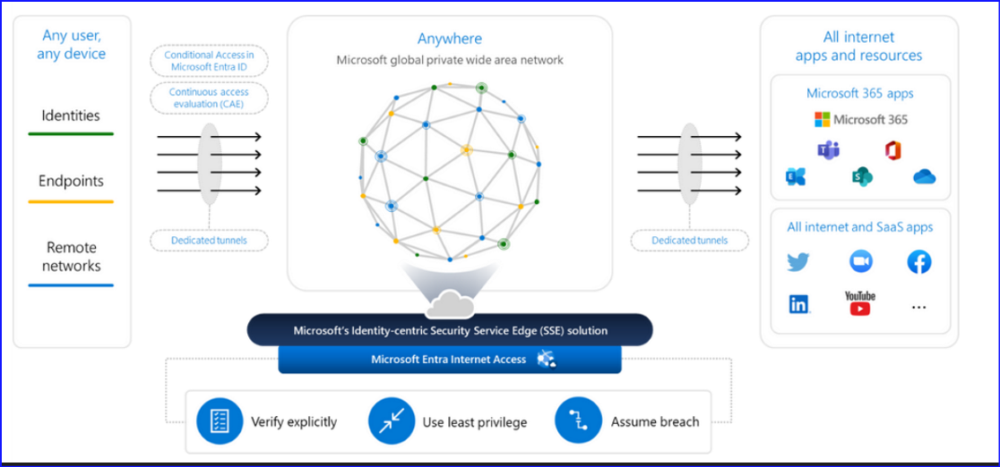

セキュリティ担当者は、ユーザー、デバイスのエンドポイント、ネットワークなどに対し、きめ細やかなアクセス制御を行うことができます。Webフィルタリング、クロステナント保護、データ損失防止、パケット インスペクションなど高度な機能によって、ユーザーやアプリ、リソースを保護できます。

## 特徴

1. ID 中心のアクセス制御と Microsoft Entra との連携

    Microsoft Entra と深く紐づいている機能のため、条件付きアクセスにてより多くの対象を保護できるようになります。あらゆる外部通信、インターネット リソース、およびクラウド アプリケーションの指定などが可能です。「継続的なアクセス評価」も含まれるようになるため、例えば ID への攻撃が検出された場合など、条件が変われば即座にアクセスを取り消すことができるようになります。

    この条件付きアクセスとの統合により、SWG、CASB、ファイアウォールの各種ポリシーを適用しながら、デバイス、ユーザー、場所、およびリスクなどきめ細かな条件を活用して、企業の状況に応じたセキュリティ要件を実現することができます。

2. 高いパフォーマンスと柔軟性

    マイクロソフトのプライベート広域ネットワークやマイクロソフトのグローバルネットワーク、ユーザーに最も近い PoP (Points of Presence) を利用したグローバル分散プロキシを利用することで、余分なホップを排除してアプリやリソースへのルーティングを最適化しています。これにより、離れた場所からのアクセスでも高速で利用できます。

    また、ユーザーの所在地からわずかミリ秒しか離れていないエッジを通じて、リモートで働く従業員と支社をシームレスに接続できるようになりました。これにより、インターネットとの往来におけるトラフィックの無用な往復や単一障害点を回避することができます。

3. Microsoft 365 アプリケーションのセキュリティとデータ監視の強化

    Microsoft 365 向けに、独自のセキュリティと監視機能を多数提供しています。Microsoft 365 向けのデータ保護の仕組みとしては、きめ細かな適応型アクセス制御、トークンの盗難やデータの流出に対する保護が含まれます。また、ユーザー、デバイス、および場所に関するほぼリアルタイムなログ取得を通じて、セキュリティ上重要な活動を監視しています。

4. サードパーティの SSE ソリューションとのサポート

    Microsoft Entra Internet Access は、すべてのインターネット リソース、SaaS、Microsoft 365 へのアクセスを保護するメインのソリューションとして導入することも、他の SSE ソリューションと並行して導入することもできます。たとえば Microsoft Entra Internet Access は Microsoft 365 向けのセキュリティと監視機能に利用し、それ以外のインターネット トラフィックと SaaS アプリは、選択した他の SSE ソリューションで保護するような構成も可能です。お客様の環境に応じて、Microsoft Entra Internet Access のみを利用するか、現在利用している他のサービスと併用するか柔軟に決めることができます。

    トラフィックは、エンドユーザーのデバイスからクライアント ベースのアプローチで取得することも可能ですし、またはリモート ネットワークから Ipsec トンネルを実行する方法でも取得可能です。Microsoft Entra の管理センターで、Microsoft 365 トラフィックへのセキュアなアクセスを簡単に有効にすることができます。

    

## Internet Access の主要な機能

1. 条件付きアクセスのカバー範囲の拡大

    これまで条件付きアクセスでは、ターゲット リソースとしてアプリケーションを明示的に指定したり、アプリ フィルターを用いて特定のカスタム セキュリティ属性をもつアプリを対象にするような構成としていたかと思います。この新機能を利用すると、下記の画面にてインターネット トラフィックを選択できるようになるため、ポリシーの対象として、アプリだけでなく、アクセス先のネットワーク自体を指定できるようになり、より広くきめ細かな範囲にポリシーを適用できるようになります。

    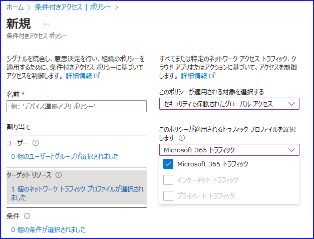

    ※ 2023/10/19 現在、インターネット トラフィックおよびプライベート アクセス  トラフィックへの条件付きアクセスの適用はサポートされていません。それぞれ下記の公開情報をもとに、代替案やプライベート プレビューへの申請をご検討ください。

    [Global Secure Access 経由のユニバーサル条件付きアクセスについて説明します](https://learn.microsoft.com/ja-jp/entra/global-secure-access/concept-universal-conditional-access#known-limitations)

        - プライベート アクセス トラフィックへの条件付きアクセス ポリシーの適用は現在サポートされていません。 この動作をモデル化するために、クイック アクセスと Global Secure Access アプリに対してアプリケーション レベルで条件付きアクセス ポリシーを適用できます。 詳細については、https://learn.microsoft.com/ja-jp/entra/global-secure-access/how-to-target-resource-private-access-apps を参照してください。
        - インターネット トラフィックへの条件付きアクセス ポリシーの適用は現在サポートされていません。 インターネット トラフィックはプライベート プレビュー段階です。 プライベート プレビューへのアクセスを要求するには、https://forms.office.com/Pages/ResponsePage.aspx?id=v4j5cvGGr0GRqy180BHbR7Lm8YtbKDdHu3wnC0DGKg5UQUhPRU44R0RLVEwySTJYVUVGNEwyVjVIVi4u に入力してください。

2. データ流出の防止

テナント制限 v2 は強力なデータ流出防止機能であり、管理対象デバイスや指定されたネットワークからの外部アクセスのリスクを管理できます。 Microsoft Entra Internet Accessでは、企業側でプロキシを使用することなく、すべての OS およびブラウザ プラットフォームで一括してテナント制限の機能を適用できるため、より柔軟できめ細かな制御が可能になります。

  

3. トークンの窃取からの保護

    Internet Access 機能では、条件付きアクセスに統合された構成として、準拠済みネットワークの概念を導入しています。この制御により、Microsoft Entra と統合されたクラウド アプリケーションをトークンの盗難から保護し、ユーザーが重要なクラウド サービスにアクセスする際に、テナント固有のネットワーク セキュリティポリシーを迂回しないようにすることができます。また、トークンの盗難が検出された場合は、継続的なアクセス評価を使用して Microsoft 365 アプリやリソースへのアクセスを即座にブロックすることもできます。

    なお、Microsoft 365 トラフィックに対する条件付きアクセスについては、継続的アクセス評価が現在サポートされていないため、今後のアップデートをお待ちください。
    [Global Secure Access 経由のユニバーサル条件付きアクセスについて説明します](https://learn.microsoft.com/ja-jp/entra/global-secure-access/concept-universal-conditional-access#known-limitations)

4. ソース IP アドレスを維持する

    一般的なプロキシは、ユーザーの元のソース IP を隠蔽し、条件付きアクセスの場所ポリシーの適用を困難にしてしまいます。そのため、リスク検出とアクティビティログの精度に影響を与えていました。Microsoft Entra Internet Access は、ユーザーの元のソース IP が維持されるようにすることで、条件付きアクセス、継続的なアクセス評価、ID のリスク検出、およびログにおける信頼できる場所の確認において、下位互換性を提供します。

    関連する設定箇所については以下をご覧ください。まず、グローバル設定 - セッション管理 内の下記画面にてチェックをオンにします。

    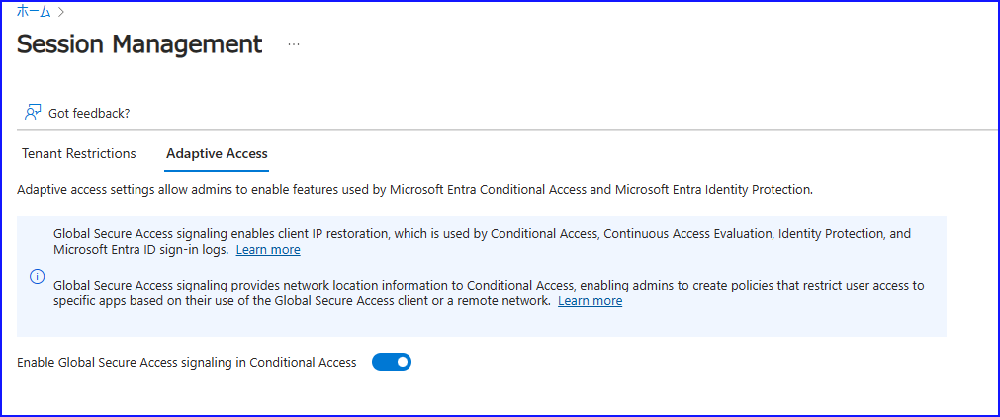

    下記にて場所ポリシーを厳密に管理するよう条件付きアクセスを構成することで、ロケーションに関するポリシーがより厳密に動作します。

    

5. 条件付きアクセスでネットワーク アクセス制御を統一的に管理 

    ユーザー、デバイス、場所、リスク構成など、条件付きアクセスで利用可能な豊富な条件に基づいて、あらゆるインターネットの宛先にネットワーク セキュリティ ポリシーを適用できるようになります。条件付きアクセスのセッション タブに「Global Secure Access Policy を利用する」の設定が追加され、今後利用できるようになります。

    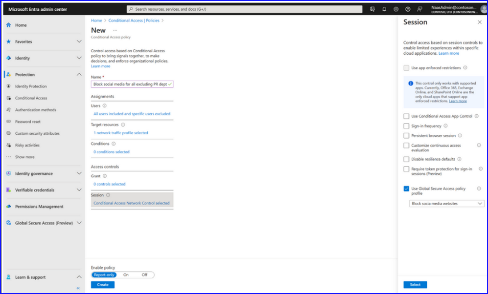

6. エンド ユーザーによる安全でないコンテンツへのアクセスを制限します。

    条件付きアクセスにおける、ユーザー、デバイス、場所の制御により、Web コンテンツ フィルタリング (URL、FQDN、Web カテゴリ) をもちいたアクセス制限も可能になります。攻撃対象の領域を減らし、ネットワーク セキュリティの管理体験がよりシンプルになります。

    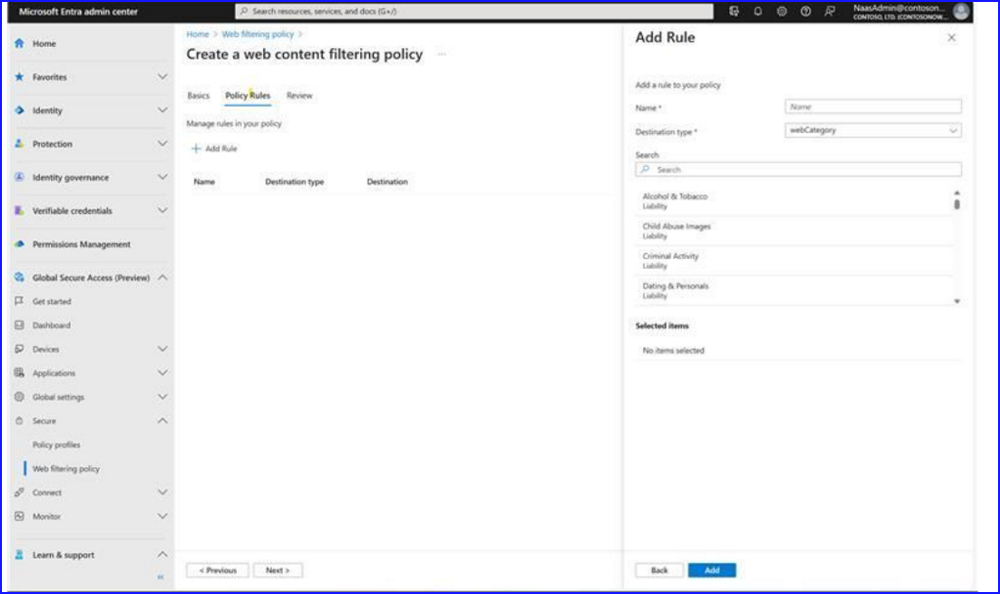

    ※ 本機能は現在プライベート プレビューのため、まだ一般にはご利用いただけません。下記のような画面が表示されますので、パブリック プレビューの展開をお待ちください。

    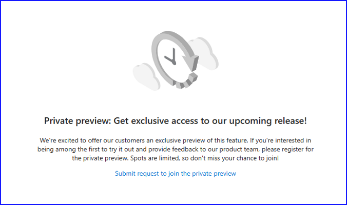

7. 製品レポートとダッシュボード

    レポートとダッシュボードにより、環境の全体像を簡単に把握し、組織で共有することが可能となります。導入状況を確認し、新たなリスクを検出し、問題を迅速に修正することもできます。当社のダッシュボードは、マイクロソフトの SSE ソリューションを通じて接続されているユーザー、デバイス、宛先のその時点での全体像を提供します。来年早々には、ポリシーに関する解析情報と推奨事項が強化され、高度なアプリとネットワークの検出機能が提供される予定です。クライアントがインストールされているアクティブなデバイスの数や、どのあて先に通信が多く行われているかなども確認可能です。

  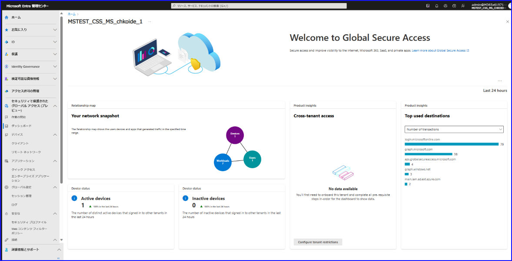

8. ネットワーク トラフィック ログに基づくカスタム ビューとダッシュボード

    トラフィック ログのページでは、ソリューションを通じて発生したすべてのリクエストとレスポンスのトランザクションを可視化することができます。これらのログでは、デバイス ID、オペレーティング システム名とバージョンなど、デバイスから収集された情報を見ることもできます。 また、ソース IP とポート、宛先 IP とポート、FQDN などの関連するパケット情報も見ることができます。

    

    診断設定で NetworkAccessTrafficLogs にチェックを入れて転送すると、 Log Analytics 側にてログを確認することができます。

    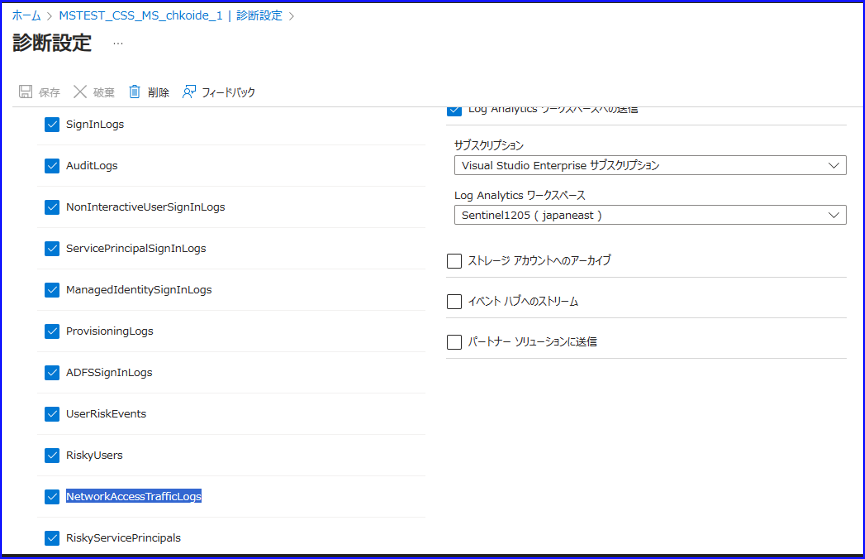

    Entra 管理センター上では一覧でしか確認できませんが、クエリを利用すれば、特定の条件のログを抽出することなども可能です。

    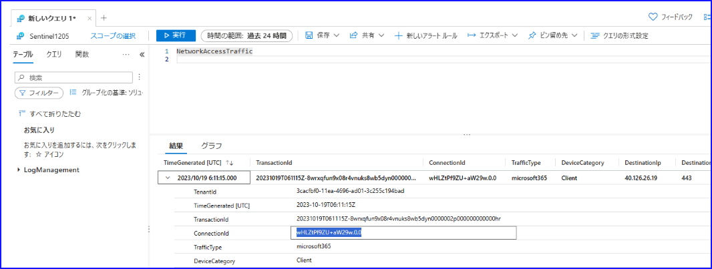

9. Microsoft 365 のセキュリティ イベントをリアルタイムに可視化

    精細なログから、Microsoft 365 アプリとリソースの脅威を簡単かつ迅速に検出いただけます。インターネット アクセス ソリューションは、Microsoft 365 のログをユーザー、場所、デバイスの豊富な情報で拡張し、ユーザーの利用に影響を与えずに、ほぼリアルタイムに情報を提供します。

    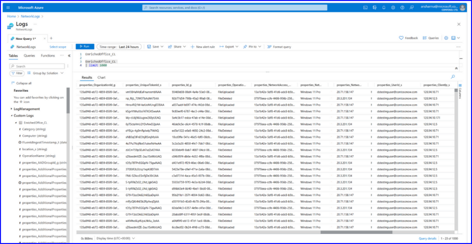

下記の機能は現在開発中で、来年早々にリリースされる予定です:
 
・ 送受信トラフィックの制限機能: ユーザーの利用形態を考慮したクラウド ファイアウォールを活用することで、たきめ細かなポリシー条件により、IP アドレス、ポート、プロトコルなどに基づいて制限を行えるようにします。
・ 悪意のあるネットワーク活動の特定とブロック: 侵入検知防御システム (IDPS) と脅威インテリジェンスにより、既知の悪意のある IP/FQDN/URL を特定およびブロックします。
・ 暗号化されたトラフィックの検査: すべての TCP/UDP トラフィックに対してきめ細かな TLS のインスペクションを行います。

## Microsoft Entra Internet Access の展開方法

下記公開情報に記載の手順を 4 つ実施いただくことで構成が可能です。2 の手順にて、エンド ユーザーのデバイスにクライアントをインストールする手順がございますので、あらかじめ要件を満たす Microsoft Entra 参加済みデバイスもしくはハイブリッド参加済みデバイスをご用意のうえ実施いただけますと幸いです。

[Global Secure Access の概要 (プレビュー)](https://learn.microsoft.com/ja-jp/entra/global-secure-access/how-to-get-started-with-global-secure-access#microsoft-entra-internet-access)

   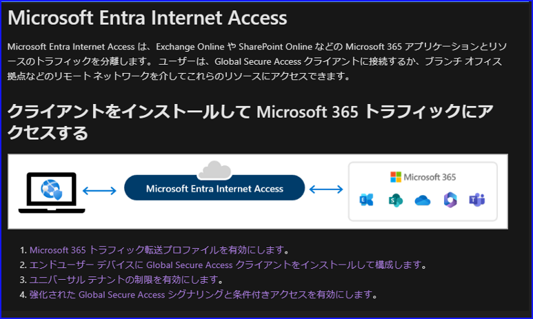