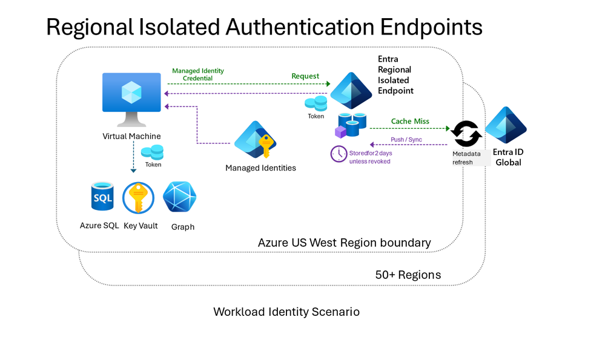

# Microsoft Entra の耐障害性を高める取り組み: ワークロード ID 認証

こんにちは、Azure Identity サポート チームの 五十嵐 です。

本記事は、2024 年 3 月 29 日に米国の Microsoft Entra (Azure AD) Blog で公開された [Microsoft Entra resilience update: Workload identity authentication](https://techcommunity.microsoft.com/t5/microsoft-entra-blog/microsoft-entra-resilience-update-workload-identity/ba-p/4094704) の抄訳です。ご不明点等ございましたらサポート チームまでお問い合わせください。

---

Microsoft Entra は、ユーザーの ID システムであるだけではなく、Azure ベースのサービス、Microsoft すべての内部基盤サービス、およびお客様のワークロード ID の「ID およびアクセス管理 (IAM) システム」でもあります。これが、99.99% のサービスレベルの約束がワークロード ID の認証にまで及んでいる理由であり、バックアップ認証システムを含む多層的なアプローチを通じてサービスの耐障害性を向上させ続けている理由です。

2021 年、弊社は **バックアップ認証システム** を業界初のイノベーションとして導入しました。これは、プライマリの Microsoft Entra ID サービスが低下または利用できない場合に、サポートされているワークロードの認証を自動的かつ透過的に処理するものです。2022 年から 2023 年にかけて、クラウドやアプリケーションの種類を問わず、バックアップ サービスの適用範囲を拡大し続けました。

本日は、この [耐障害性に関するブログポスト](https://azure.microsoft.com/en-us/blog/advancing-azure-active-directory-availability/) シリーズ をさらに発展させ、ワークロード ID が、どのようにして **地域ごとに分離された認証エンドポイント** および **バックアップ認証システム** から耐障害性を高めているかについて紹介します。ここでは、弊社が提供する地域ごとおよびグローバルの基盤に沿った、2 つのシナリオについて模索していきたいと思います。ワークロード ID 認証の 1 つの例は、Azure 仮想マシン (VM) が Azure ストレージに対して ID 認証を行う場合です。もう 1 つの例は、顧客のワークロードがアプリケーション プログラミング インターフェイス (API) に対して認証を行う場合です。

## 地域ごとに分離された認証エンドポイント

地域ごとに分離された認証エンドポイントは、Azure リージョンに対して地域ごとに分離された認証サービスを提供します。頻繁に使用されるすべての ID は、他の Azure リージョンに依存することなく正常に認証されます。地域ごとに分離された認証エンドポイントは、基本的には Azure の基盤サービスの主要なエンドポイントであると同時に、[Azure リソースのマネージド ID](https://learn.microsoft.com/ja-jp/entra/identity/managed-identities-azure-resources/overview) の主要なエンドポイントでもあります。マネージド ID は、サービスの依存関係を統合することでリージョン外の障害の影響を防ぐとともに、証明書の有効期限切れやローテーション、信頼を地域内で管理することで耐障害性を向上させるのにも役立ちます。

この保護と分離のレイヤーを利用するにあたり、Azure のお客様が設定を変更する必要はありません。主要な Azure の基盤サービスはすでにこのレイヤーを採用しており、Azure 基盤サービスに依存するお客様のワークロードを保護するために、マネージド ID サービスと統合されています。

## 地域ごとに分離された認証エンドポイントの仕組み

各 Azure リージョンには、ワークロード ID 認証用の一意のエンドポイントが割り当てられています。各リージョンは、Microsoft Entra ID の地域ごとに配置された特別なインスタンスによってカバーされます。この地域ごとのインスタンスは、ワークロード ID の認証要求に効率的かつ柔軟に応答するために、メタデータ (ローカルでトークンを発行するために必要なディレクトリ データなど) のキャッシュを活用しています。この軽量設計により、他のサービスへの依存を減らし、認証全体を単一のリージョン内で完了できるようにすることで、耐障害性を向上させています。ローカル キャッシュ内のデータは、適宜リフレッシュされます。

地域ごとのサービスは、必要なデータが不足したとき (キャッシュ ミス) や、サポートされているサービスのセキュリティ状態の変更を検出したときに、Microsoft Entra ID のグローバル サービスを利用してキャッシュを更新します。地域ごとのサービスに障害が発生した場合、リクエストは Microsoft Entra ID のグローバル サービスによってシームレスに処理されるため、地域ごとのサービスの中断はお客様からは見えません。

## 高性能で、耐障害性があり、広く利用可能

このサービスは 2020 年からその実績があり、現在では世界中で 1 日あたり 60 億のリクエストを処理しています。グローバル サービスと連携する地域のエンドポイントは、99.99% の SLA を上回っています。Azure 基盤の耐障害性は、Azure クライアント SDK が保持するワークロード側のキャッシュによってさらに高められています。地域とグローバルのサービスを組み合わせることで、依存する基盤サービスではほとんどのサービス低下に気づけないようになっています。インシデント発生後の復旧も自動的に処理されます。地域ごとの分離は、パブリック クラウドとすべてのソブリン (米国政府や中国向けなど) クラウドでサポートされています。

基盤側の認証リクエストは、ワークロードをホストしているのと同じ Azure データセンターによって処理されます。つまり、地域ごとに分離されたエンドポイントはパフォーマンス上のメリットも享受できます。

## 基盤認証用のワークロード ID をカバーするバックアップ認証システム

マネージド ID に依存しないワークロードの ID 認証については、バックアップ認証システムが利用されており、これにより追加の耐障害性が提供されています。2021 年 11 月の [ブログポスト](https://azure.microsoft.com/en-us/blog/advancing-service-resilience-in-azure-active-directory-with-its-backup-authentication-service/) では、以前から一般公開されているユーザー認証のアプローチについて説明しました。バックアップ認証システムは Microsoft のクラウド上で動作しますが、プライマリの Microsoft Entra ID システムとは別個の独立したシステムとネットワーク経路上で動作します。つまり、多くの Microsoft Entra ID や依存する Azure サービスでサービス、ネットワーク、またはキャパシティに問題が発生した場合でも、運用を継続できます。現在、この立証済みのアプローチをワークロード ID にも適用しているところです。

ワークロード ID をこのバックアップ認証システムでカバーしていく行う計画は、2024 年前半の Microsoft 365 の最大の内部基盤サービスを皮切りに、現在は Microsoft 全体で順次にロールアウト中です。Microsoft Entra ID のお客様のワークロード ID は、2025 年後半から順次カバーされていく予定です。

## ワークロードの保護

地域ごとに分離されたエンドポイントとバックアップ認証システムの両方の恩恵は、弊社のプラットフォームにネイティブに組み込まれています。現在および将来の耐障害性とセキュリティへの投資のメリットをさらに最適化するために、開発者の皆様には Microsoft Authentication Library (MSAL) を使用し、可能な限りマネージド ID を活用することをお勧めします。

## 今後の取り組み

私たちは 99.99% の稼働率保証を維持するとともに、万が一の障害が生じた際もそれをカバーするシステムを拡大し、来年にはサード パーティの開発者向けを含めたすべての基盤認証に自動カバレッジの範囲を拡大するよう、継続的に取り組んでいくことをお客様にお約束したいと思います。システムのキャパシティ、パフォーマンス、全クラウドにまたがるカバレッジの改善計画など、進捗状況を随時お知らせしてまいります。

Nadim Abdo
CVP, Microsoft Identity Engineering
