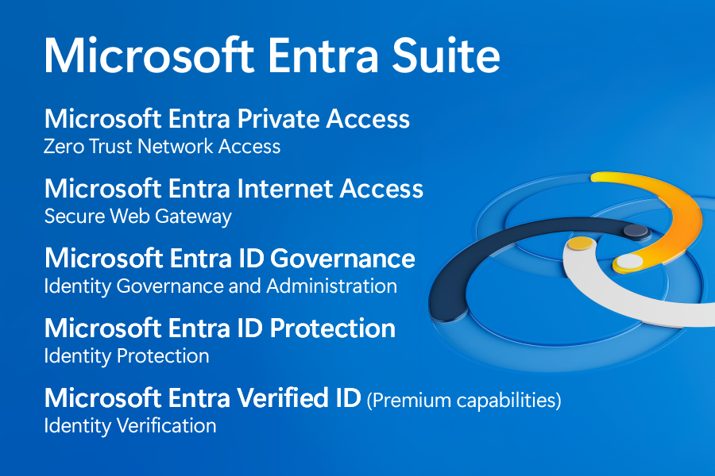

# Microsoft Entra Suite が一般提供 (GA) されました

こんにちは、Azure Identity サポート チームの 夏木 です。
 
本記事は、2024 年 7 月 11 日に米国の Microsoft Entra (Azure AD) Blog で公開された [Microsoft Entra Suite now generally available](https://techcommunity.microsoft.com/t5/microsoft-entra-blog/microsoft-entra-suite-now-generally-available/ba-p/2520427) の抄訳です。ご不明点等ございましたらサポート チームまでお問い合わせください。

----

本日、弊社は **Microsoft Entra Suite** の一般提供開始を [発表](https://aka.ms/ZeroTrustBlog-July2024) しました。これは、業界で最も包括的な従業員向けの安全なアクセス ソリューションです。Microsoft Entra Suite は、最も包括的なゼロ トラスト ユーザー アクセス ソリューションを提供し、ID、エンドポイント、プライベートおよびパブリック ネットワークにまたがるアクセス ポリシー エンジンの統合を可能にします。

## Microsoft Entra Suite とは？

Microsoft Entra Suite は、従業員が安全にアクセスするための完全なクラウドベースのソリューションを提供します。これは、ID とネットワーク アクセスを統合し、あらゆる場所からクラウドまたはオンプレミスのアプリケーションやリソースへの従業員のアクセスを保護し、一貫して最小特権アクセスを適用し、従業員体験を向上させるというものです。

この新しい製品は、AI 時代における [ユニバーサル トラスト ファブリック](https://www.microsoft.com/en-us/security/blog/2024/05/08/how-implementing-a-trust-fabric-strengthens-identity-and-network/) として機能し、信頼できる ID をどこからでもあらゆるものと安全に接続できる [Microsoft Entra](https://www.microsoft.com/en-us/security/blog/2022/05/31/secure-access-for-a-connected-worldmeet-microsoft-entra/) 製品のビジョンを実現するものです。最近のブログ投稿では、このようなトラスト ファブリックを組織に作成するための [4 つの段階](https://www.microsoft.com/en-us/security/blog/2024/06/04/the-four-stages-of-creating-a-trust-fabric-with-identity-and-network-security/) についても紹介しました。これは、ゼロ トラストの基本的な適用から始まり、従業員のアクセス保護、顧客やパートナーのアクセス保護、そしてあらゆるクラウドのアクセス保護にまで拡張していくというものです。Microsoft Entra Suite は、そのうちの第 2 段階である従業員の安全なアクセスのための完全なツールセットを提供します。

Microsoft Entra Suite に含まれる製品は以下のとおりです:

- [Microsoft Entra Private Access](https://www.microsoft.com/ja-jp/security/business/identity-access/microsoft-entra-private-access): ID 中心のゼロ トラスト ネットワーク アクセスで、社内 (プライベート) アプリおよびリソースへのアクセスを保護し、レガシー VPN を置き換えることで運用の複雑さとコストを削減します。
- [Microsoft Entra Internet Access](https://www.microsoft.com/ja-jp/security/business/identity-access/microsoft-entra-internet-access): ID 中心の Secure Web Gateway (SWG) で、SaaS アプリやインターネット トラフィックを保護し、悪意のあるインターネット トラフィックや安全でないコンテンツ、コンプライアンス違反のコンテンツ、およびオープン インターネットからのその他の脅威から保護します。
- [Microsoft Entra ID ガバナンス](https://www.microsoft.com/ja-jp/security/business/identity-access/microsoft-entra-id-governance): ID とアクセスのライフサイクルを自動化し、適切なユーザーが適切なタイミングで適切なアプリやサービスにアクセスできるようにする、完全な ID ガバナンスおよび管理ソリューションです。
- [Microsoft Entra ID Protection](https://www.microsoft.com/ja-jp/security/business/identity-access/microsoft-entra-id-protection): より信頼性の高い認証方法、自動的なリスクと脅威の評価、ならびに高度な機械学習により柔軟にアクセス ポリシーを適用して、リアルタイムで ID の侵害をブロックする高度な ID ソリューションです (Microsoft Entra ID P2 に含まれます)。
- [Microsoft Entra Verified ID](https://www.microsoft.com/ja-jp/security/business/identity-access/microsoft-entra-verified-id): オープン スタンダードに基づく管理された検証可能な資格情報サービスで、安全かつプライバシーを尊重する形でリアルタイムな ID の検証を可能にします。Microsoft Entra Suite には、Face Check を皮切りに、Verified ID のプレミアム機能が含まれています。

## Microsoft Entra Suite で次のことが可能になります:

- ID とネットワークの条件付きアクセス ポリシーを統一します。
- すべてのリソースおよびアプリにアクセスするすべてのユーザーに対して最小特権アクセスを確保します。
- オフィス内およびリモートワーカー両方のユーザー体験が向上します。
- 複数のベンダーによるセキュリティ ツールを管理する複雑さとコストを削減します。

以下の Microsoft Entra Suite の紹介ビデオをご覧ください: 

### ID とネットワークの条件付きアクセス ポリシーを統一

1 つのポータルでまとめてポリシーを管理するだけで、ID とネットワークの両方のアクセス制御を構成できます。条件付きアクセスは、アクセス要求がどこから来るかに関係なくあらゆるアクセス要求を評価し、リアルタイムのリスク評価を行い、不正アクセスに対する保護を強化します。

### すべてのリソースおよびアプリにアクセスするすべてのユーザーに対して最小特権アクセスを確保

新入社員が組織に加わる日から、すべての役割の変更を経て、退職する時までのアクセス ライフサイクルを自動化できます。従業員がどれほど長く、多面的なキャリアを歩んでいても、Microsoft Entra ID ガバナンスは従業員が必要とするアプリケーションやリソースに適切にアクセスできるようにし、侵害が発生した場合にも攻撃者が組織内で横断的に活動できないようにします。

### オフィス内およびリモートワーカー両方のユーザー体験を向上

従業員がより迅速で簡単なオンボーディング体験、パスワードレス認証による迅速で安全なサインイン、すべてのアプリケーションのシングル サインオン、優れたパフォーマンスを享受できるようにします。セルフサービス ポータルを使用すると、従業員は関連するパッケージへのアクセス要求、承認とアクセスレビューの管理、要求と承認の履歴を表示できます。Microsoft Entra Verified ID の Face Check は、従業員 ID のリアルタイム検証を可能にし、リモート オンボーディングとパスワードレス アカウントのセルフサービス リカバリを効率化します。

### 複数のベンダーによりセキュリティ ツールを管理する複雑さとコストを削減

従来のオンプレミスのセキュリティ ソリューションは、最新のクラウドファーストや AI ファーストの環境のニーズに対応できないため、企業はクラウドから資産を保護および管理する方法を模索しています。Microsoft Entra Suite を使用することで、従来の仮想プライベート ネットワーク (VPN) やオンプレミスの Secure Web Gateway (SWG)、オンプレミスの ID ガバナンスなど、複数のオンプレミスのセキュリティ ツールを廃止できます。

Microsoft Entra Suite は、現在、ユーザーあたり月額 12 ドルで提供されています。利用には、Microsoft Entra P1 ライセンスが前提条件として必要です。詳細については、[Microsoft Entra Suite の価格ページ](https://www.microsoft.com/en-us/security/business/microsoft-entra-pricing) を参照ください。

## 今後のイベントにご参加ください！

[2024 年 7 月 31 日に開催される Zero Trust spotlight](https://aka.ms/ZeroTrustWebcast) では、Microsoft の専門家が Microsoft Entra Suite の一部である [Entra Internet Access および Entra Private Access](https://aka.ms/Blog-SSEGATechCommunity) の一般提供開始についても触れる予定です。今回の発表やその他の発表について深く掘り下げる予定となっています。さらに、2024 年 8 月 14 日に開催される [Tech Accelerator に登録](https://aka.ms/AccelerateEntra) し、Microsoft Entra Suite、Private Access および Internet Access の製品についての詳細をご確認ください。

## 詳しく知る

Microsoft Entra Suite の提供は、よりシームレスで堅牢な安全なアクセス体験を提供し続け、あらゆる場所で働く従業員の生産性を高めるという当社のコミットメントにおける重要なマイルストーンです。詳細は公式発表からご覧ください。

[Microsoft Entra Suite のトライアルページ](https://aka.ms/EntraSuiteTrial) にアクセスして、ぜひ製品をお試しください。

Irina Nechaeva, General Manager, Identity and Network Access Product Marketing
