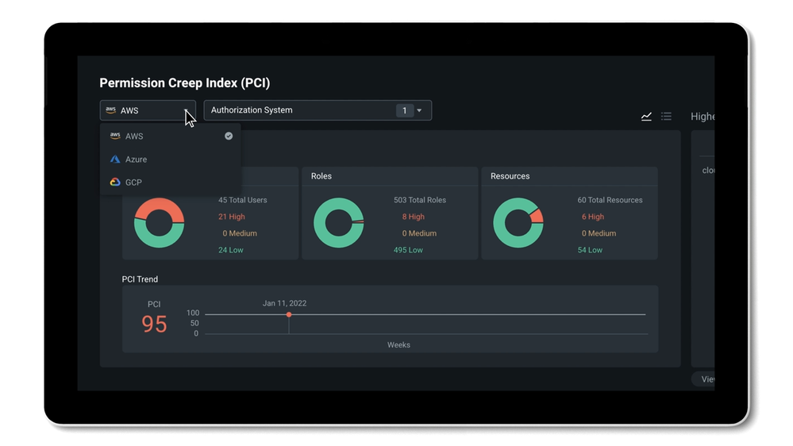
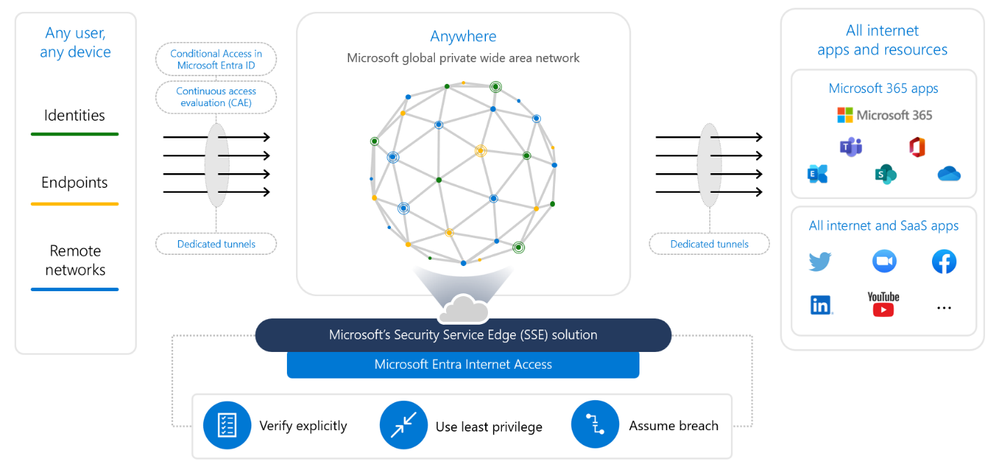

# Microsoft Entra の 2023 年の機能トップ 50

こんにちは、Azure Identity サポート チームの 五十嵐 です。

本記事は、2024 年 1 月 19 日に米国の Microsoft Entra (Azure AD) Blog で公開された [Microsoft Entra’s Top 50 Features of 2023](https://techcommunity.microsoft.com/t5/microsoft-entra-blog/microsoft-entra-s-top-50-features-of-2023/ba-p/3796392) の抄訳です。ご不明点等ございましたらサポート チームまでお問い合わせください。

---

2024 年の幕開けとして、昨年 1 年間に Microsoft Entra で提供された主な機能を振り返りたいと思います。弊社は、マルチクラウドの ID およびネットワーク アクセス製品により、あらゆる種類の ID を検証し、あらゆるリソースへのアクセスを保護、管理、統制するために、何千ものお客様にサービスを提供いたしました。Microsoft Entra の最新の進歩の波は、Security Service Edge (SSE)、人工知能 (AI) にまで広がり、分散型 ID、マルチクラウド、人間以外の ID などの他の重要な分野におけるイノベーションを加速しつつ、**100 以上の機能を提供しました**。以下に、お客様からのフィードバックや市場のニーズに基づき実現した上位 50 の機能をご紹介します。包括的なリストについては、[リリース ノート](https://learn.microsoft.com/ja-jp/entra/fundamentals/whats-new) をご参照ください。これらの最新の ID イノベーションを採用することで、デジタル資産の保護を強化し、セキュリティへの投資からより多くの効果を得ることができます。

1. **AI 時代における安全なアクセス** - Microsoft Ignite 2023 で、Microsoft [Security Copilot](https://www.microsoft.com/ja-jp/security/business/ai-machine-learning/microsoft-security-copilot) が Microsoft Entra（[プライベート プレビュー](https://jpazureid.github.io/blog/azure-active-directory/identity-at-microsoft-ignite-securing-access-in-the-era-of-ai/)）に登場し、一般的なタスクの自動化、トラブルシューティングの迅速化、複雑なポリシーの解釈、ワークフローの設計を支援することを発表しました。 この画期的な機能は、強力で一貫性のある **ID セキュリティ** を維持するための 1 つの要素に過ぎません。Microsoft Entra の幅広いソリューションは、マルチクラウドやハイブリッド環境の従業員、第一線で働く従業員、お客様、パートナー、そしてアプリ、デバイス、ワークロードを保護します。

2. 企業や政府機関のお客様をサポートする **物理的な FIDO2 セキュリティ キーに代わる、フィッシングに強い** [パスキー](https://jpazureid.github.io/blog/azure-active-directory/identity-at-microsoft-ignite-securing-access-in-the-era-of-ai/) のサポートを予定しています。
3. リスク シグナル、ライセンス、使用状況に基づいてテナントを保護する [Microsoft Entra 条件付きアクセス ポリシーの自動ロールアウト](https://www.microsoft.com/en-us/security/blog/2023/11/06/automatic-conditional-access-policies-in-microsoft-entra-streamline-identity-protection/) ([Microsoft マネージド ポリシー](https://learn.microsoft.com/ja-jp/entra/identity/conditional-access/managed-policies)) により、**既定で安全が確保されます**。
4. [サインイン セッションに対するトークン保護の条件付きアクセスの実施 (パブリック プレビュー)](https://jpazureid.github.io/blog/azure-active-directory/public-preview-token-protection-for-sign-in-sessions/) により、**トークンの盗難やリプレイ攻撃に対処** します。
5. [保護されたアクションのための条件付きアクセス](https://jpazureid.github.io/blog/azure-active-directory/conditional-access-for-protected-actions/) により、組織は、条件付きアクセス ポリシーの変更、アプリケーションへの資格情報の追加、フェデレーション信頼の設定変更など、**重要な管理操作を保護** することができます。
6. [条件付きアクセスの概要ダッシュボード](https://jpazureid.github.io/blog/azure-active-directory/conditional-access-overview-and-templates/) により、条件付きアクセスの状態とテンプレートが包括的に表示され、Microsoft の推奨事項に沿った新しいポリシーの展開が容易になります。
7. [条件付きアクセスの認証強度](https://jpazureid.github.io/blog/azure-active-directory/ca-authentication-strength-ga/) は、ユーザーのサインイン リスク レベルやアクセス先のリソースの機密性に基づいて認証方法の要件を適用することを可能にします。**規制の厳しい業界** や厳格なコンプライアンス要件を持つ組織にとって **特に有用です**。
8. [場所に基づくポリシーの厳密な適用 (パブリック プレビュー)](https://jpazureid.github.io/blog/azure-active-directory/public-preview-strictly-enforce-location-policies-with-contiunuous-access-evaluation/) により、IP アドレスの場所を使用したポリシーに違反したトークンを無効化し、**トークンのリプレイ攻撃をほぼリアルタイムで防止** することでゼロ トラスト アクセス制御を実現します。
9. 新しい [Microsoft Entra ID Protection のダッシュボード (パブリック プレビュー)](https://jpazureid.github.io/blog/azure-active-directory/what-s-new-with-microsoft-entra-id-protection/) は、ID の管理者や IT 担当者がセキュリティの状態をよりよく把握し、ID の侵害に対して効率的に対応するのに役立ちます。
10. 新しい Microsoft Entra ID Protection の検出機能: [検証済み脅威アクター IP と中間者攻撃の検出](https://jpazureid.github.io/blog/azure-active-directory/what-s-new-with-microsoft-entra-id-protection/#%E6%96%B0%E3%81%97%E3%81%84%E9%AB%98%E5%BA%A6%E3%81%AA%E6%A4%9C%E5%87%BA%E6%A9%9F%E8%83%BD) により、悪意のある攻撃者やアクティビティから組織を保護します。
11. Microsoft Entra ID Protection の [リアルタイムな脅威インテリジェンス](https://jpazureid.github.io/blog/azure-active-directory/what-s-new-with-microsoft-entra-id-protection/#%E3%83%AA%E3%82%A2%E3%83%AB%E3%82%BF%E3%82%A4%E3%83%A0%E3%81%AA-Azure-AD-%E8%84%85%E5%A8%81%E3%82%A4%E3%83%B3%E3%83%86%E3%83%AA%E3%82%B8%E3%82%A7%E3%83%B3%E3%82%B9) の検出により、リスク ベースの条件付きアクセス ポリシーを適用して ID を保護することができます。
12. マルチクラウドのインフラにおける ID の権限管理 - **マルチクラウドのインフラにおける ID** の権限を管理し、最小特権の原則を確実にすることで、ID のセキュリティ体制を改善します。

13. Microsoft Entra ID Protection の活用 - **ハイブリッド環境におけるユーザー リスクを効果的に管理する** ために、[オンプレミスのパスワード変更によりユーザー リスクを修復できます (パブリックプレビュー)](https://jpazureid.github.io/blog/azure-active-directory/Remediate-User-Risks-in-Microsoft-Entra-ID-Protection-Through-On-premises-Password-Changes/)。
14. [Microsoft Entra ID Protection を Microsoft 365 Defender と統合](https://jpazureid.github.io/blog/azure-active-directory/what-s-new-with-microsoft-entra-id-protection/#%E4%B8%80%E8%88%AC%E6%8F%90%E4%BE%9B-Microsoft-Entra-ID-Protection-%E3%81%A8-Microsoft-365-Defender-%E3%81%A8%E3%81%AE%E7%B5%B1%E5%90%88) することで、インシデントを効率的かつ効果的に調査し、**攻撃の全体像を把握する** と共に、ID の侵害に対して迅速に対処できるようになります。
15. [システム優先 MFA の機能](https://jpazureid.github.io/blog/azure-active-directory/ga-system-preferred-multifactor-authentication/) により、管理者が設定したポリシーで有効化している方法のうち、ユーザーが登録済みの MFA の方法の中から最も安全な方法を選んでサインインするよう促します。
16. [モバイル デバイスでの証明書ベース認証 (CBA)](https://jpazureid.github.io/blog/azure-active-directory/azure-ad-certificate-based-authentication-cba-on-mobile-now/) を使用して、ユーザーのモバイル端末に証明書を展開しなくても、モバイル端末に対してフィッシング耐性のある多要素認証 (MFA) を要求できるようになります。
17. [証明書ベース認証 (CBA) の新機能と機能強化](https://jpazureid.github.io/blog/azure-active-directory/enhancements-to-microsoft-entra-certificate-based-authentication/) により、政府機関が大統領令 14028 の要件に準拠できるようになり、Active Directory フェデレーション サービスからの移行を支援します。
18. [Microsoft Entra Verified ID を使用した LinkedIn 上の職場の検証](https://jpazureid.github.io/blog/azure-active-directory/introducing-a-new-way-to-verify-your-workplace-on-linkedIn-with-microsoft-entra-verified-id/) - オープン スタンダードに基づく Verifiable Credentials を通じて、**分散型 ID** の利用を検討ください。
19. [統合された認証方法](https://jpazureid.github.io/blog/azure-active-directory/modernizing-authentication-management/) - 多要素認証 (MFA) とセルフサービス パスワード リセット (SSPR) に使用される認証方法を、FIDO2 セキュリティ キーや証明書ベースの認証 (CBA) のようなパスワードレス認証の方法と併せて 1 つのポリシーで管理できます。
20. Microsoft Entra ワークロード ID の [App Health 推奨機能](https://jpazureid.github.io/blog/azure-active-directory/new-app-health-recommendations-in-microsoft-entra-workload-identities/) を使用して、**人間以外の ID を保護します**。
21. [AD FS アプリケーションの移行](https://techcommunity.microsoft.com/t5/security-compliance-and-identity/introducing-ad-fs-application-migration-your-path-to-simplicity/ba-p/3980232) - クラウドベースの ID サービス、セキュリティの強化、ユーザー エクスペリエンスの向上により、**ID に関わる資産を刷新** ください。
22. FIDO2 セキュリティキーを使用して、[iOS および macOS Web ブラウザー](https://jpazureid.github.io/blog/azure-active-directory/advancing-modern-strong-authentication/#iOS-%E3%81%8A%E3%82%88%E3%81%B3-macOS-%E3%83%96%E3%83%A9%E3%82%A6%E3%82%B6%E3%83%BC%E3%81%A7%E3%81%AE-FIDO2-%E3%82%B5%E3%83%9D%E3%83%BC%E3%83%88%E3%81%AE%E4%B8%80%E8%88%AC%E6%8F%90%E4%BE%9B%E9%96%8B%E5%A7%8B) で Microsoft Entra ID 連携アプリケーションにサインインできます。
23. [Apple デバイス向けの Microsoft Enterprise SSO](https://jpazureid.github.io/blog/azure-active-directory/enterprise-sso-ga/) を使用して、すべてのアプリケーションで macOS、iOS、および iPadOS 上の Microsoft Entra ID アカウントのシングル サインオン (SSO) を構成できます。
24. [macOS 向けのプラットフォーム SSO (パブリック プレビュー)](https://jpazureid.github.io/blog/azure-active-directory/coming-soon-platform-SSO-for-macOS/) を使用して、フィッシングに強い認証方法または従来のパスワードのいずれかを設定できます。
25. [Microsoft Entra ID を使用した Windows ローカル管理者パスワード ソリューション](https://jpazureid.github.io/blog/azure-active-directory/Windows-Local-Administrator-Password-Solution-with-Microsoft-Entra-ID-now-Generally-Available!/) を使用して、**ローカル管理者アカウントを保護** できます。
26. [カスタム クレーム プロバイダー](https://jpazureid.github.io/blog/azure-active-directory/customize-your-authentication-flows-with-custom-claims-providers/) を使用して認証フローをカスタマイズし、外部システムから認証クレームを取得できます。
27. [Microsoft Entra External ID (パブリック プレビュー)](https://techcommunity.microsoft.com/t5/microsoft-entra-blog/microsoft-entra-external-id-public-preview-developer-centric/ba-p/3823766) - **外部 ID** に対してより安全な関係を確立し、人間中心なユーザー体験を実現すると共に、安全なアプリケーションの開発を加速します。

28. [Microsoft Graph アクティビティ ログ](https://jpazureid.github.io/blog/azure-active-directory/graph-activity-log-in-preview/) を使用すると、サインイン ログのトークン要求から、Microsoft Graph アクティビティ ログの API 要求アクティビティ (読み取り、書き込み、および削除) 、監査ログに出る最終的なリソース変更まで、テナント内のアクティビティの全体像を調査できるようになります。
29. [制限付き管理の管理単位](https://jpazureid.github.io/blog/azure-active-directory/introducing-restricted-management-au-in-microsoft-entra-id/) : Microsoft Entra ID テナント内の特定のユーザー、セキュリティ グループ、またはデバイスを指定し、テナントレベルの管理者による変更から保護できるようになります。
30. Microsoft Entra ID の [IPv6 サポート](https://jpazureid.github.io/blog/azure-active-directory/ipv6-coming-to-azuread/) により、IPv4、IPv6、またはデュアル スタックのエンドポイントから Entra サービスにアクセスできます。
31. [Microsoft Entra Permissions Management - Microsoft Defender for Cloud (MDC) との統合 (パブリック プレビュー)](https://jpazureid.github.io/blog/azure-active-directory/identity-at-microsoft-ignite-securing-access-in-the-era-of-ai/#%E3%82%88%E3%82%8A%E5%BC%B7%E5%9B%BA%E3%81%AA%E6%A8%A9%E9%99%90%E7%AE%A1%E7%90%86%E3%81%AE%E3%81%9F%E3%82%81%E3%81%AE%E6%A9%9F%E8%83%BD%E3%81%AE%E7%B5%B1%E5%90%88) : ID とアクセス許可に関する分析情報を、他のクラウド セキュリティ情報と統合し、単一のインターフェイスで表示します。
32. [Microsoft Entra Permissions Management - ServiceNow との統合](https://jpazureid.github.io/blog/azure-active-directory/identity-at-microsoft-ignite-securing-access-in-the-era-of-ai/#%E3%82%88%E3%82%8A%E5%BC%B7%E5%9B%BA%E3%81%AA%E6%A8%A9%E9%99%90%E7%AE%A1%E7%90%86%E3%81%AE%E3%81%9F%E3%82%81%E3%81%AE%E6%A9%9F%E8%83%BD%E3%81%AE%E7%B5%B1%E5%90%88) : ServiceNow のお客様は、ServiceNow ポータルを介してマルチクラウド環境 (Azure、AWS、Google Cloud) に対し、期限付きのオンデマンド許可を要求できます。
33. 使用している [ID プロバイダーのソリューション](https://jpazureid.github.io/blog/azure-active-directory/identity-at-microsoft-ignite-securing-access-in-the-era-of-ai/#Security-Service-Edge-%E3%81%A7%E3%81%99%E3%81%B9%E3%81%A6%E3%81%AE%E3%82%A2%E3%83%97%E3%83%AA%E3%82%B1%E3%83%BC%E3%82%B7%E3%83%A7%E3%83%B3%E3%81%A8%E3%83%AA%E3%82%BD%E3%83%BC%E3%82%B9%E3%81%B8%E3%81%AE%E3%82%A2%E3%82%AF%E3%82%BB%E3%82%B9%E3%82%92%E4%BF%9D%E8%AD%B7) に関係なく、すべての ID とそのアクセス許可を一元管理できます (パブリック プレビュー)。
34. Microsoft Entraでネットワーク アクセスを保護 - 2023 年 7 月に 2 つの新製品を発表しました: [Microsoft Entra Internet Access (パブリック プレビュー)](https://www.microsoft.com/ja-jp/security/business/identity-access/microsoft-entra-internet-access?rtc=1) と [Microsoft Entra Private Access (パブリック プレビュー)](https://www.microsoft.com/ja-jp/security/business/identity-access/microsoft-entra-private-access) です。ID ソリューションとネットワーク アクセス ソリューションが連携することで、企業はアプリケーションごとにどのツールがより効果的かを決定したり、ID 部門が作成したポリシーとネットワーク部門が作成したポリシーをどのように橋渡しするかを決定したりするのに時間を費やす必要がなくなります。統合された柔軟性のある制御を適用し、ネットワーク アクセスのセキュリティを簡素化することで、ID 中心の Security Service Edge (SSE) ソリューションで優れたユーザー エクスペリエンスをどこでも提供することができます。

35. [Identity Platform Developer Center](https://devblogs.microsoft.com/identity/build-ciam-dev-center/) : 開発者が ID の概念について理解し、Microsoft Entra External ID の機能を学び、新しいプラットフォームを使用して素晴らしい消費者向けアプリケーションを構築するための最適な方法を学ぶために必要な **すべてのものをワンストップで** 提供します。
36. [強化された会社のブランド機能](https://jpazureid.github.io/blog/azure-active-directory/company-branding-ga/) - 既定のサインイン ページだけでなく、特定のブラウザー言語をターゲットにしたページもカスタマイズできます。
37. [クロステナント アクセス設定の新機能](https://jpazureid.github.io/blog/azure-active-directory/xtap-new-feature/) - テナントを跨いだコラボレーション シナリオを保護し、パートナーのエンドユーザー体験を向上させます。
38. テナント間のアクセスを保護する [テナント制限 v2](https://jpazureid.github.io/blog/azure-active-directory/how-tenant-restrictions-v2-can-be-used-to-prevent-data/) を使用して、**データの流出を防止** します。
39. ID Governance にライフサイクル ワークフローが登場 - 2023 年 6 月 7 日に [Microsoft Entra ID Governance](https://techcommunity.microsoft.com/t5/microsoft-entra-blog/microsoft-entra-id-governance-is-generally-available/ba-p/2466932) が **一般利用可能** になり、最新の機能の 1 つが追加されました。**ライフサイクル ワークフロー (LCW)** です。**新しいライフサイクル ワークフロー** では、**より詳細なワークフローの実行監査** が可能になり、いつでも [ライフサイクル ワークフローの監査ログ](https://entra.microsoft.com/#view/Microsoft_AAD_LifecycleManagement/CommonMenuBlade/~/auditlogs) や [Entra Identity Governance の監査ログ](https://entra.microsoft.com/#view/Microsoft_AAD_ERM/DashboardBlade/~/Audit%20logs) に移動することができるうようになりました。これにより、ワークフロー実行情報やその他のワークフローの管理アクティビティに詳細にアクセス可能となります。

40. **機械学習** をベースとしたレビュー担当者向けの [推奨事項](https://jpazureid.github.io/blog/azure-active-directory/microsoft-entra-id-governance-introduces-two-new-features-in-access-reviews/)
41. [Microsoft Entra ID Governance の新しいダッシュボード](https://jpazureid.github.io/blog/azure-active-directory/new-microsoft-entra-id-governance-dashboard-experience-rolling/) により、現在の ID ガバナンスの状態を一目で把握できるようになり、ID Governance の各種機能にすぐにアクセスしたり、コンプライアンスのレポートへも素早くアクセスできたりします。
42. 機密リソースへのアクセスを承認する前に、[Verified ID を必要とする](https://jpazureid.github.io/blog/azure-active-directory/identity-governance-with-verified-id/) ようにできます。
43. ゼロ トラストでのアクセス コントロール - [グループ向けの PIM](https://jpazureid.github.io/blog/azure-active-directory/pim-for-group-ga/) を使用して、必要な時に必要な時間だけ (Just-In-Time) 特権ロールへのアクセス付与を行えます。
44. [条件付きアクセスと PIM の統合](https://jpazureid.github.io/blog/azure-active-directory/pim-for-group-ga/#%E6%9D%A1%E4%BB%B6%E4%BB%98%E3%81%8D%E3%82%A2%E3%82%AF%E3%82%BB%E3%82%B9%E8%AA%8D%E8%A8%BC%E3%82%B3%E3%83%B3%E3%83%86%E3%82%AD%E3%82%B9%E3%83%88%E3%82%92%E5%88%A9%E7%94%A8%E3%81%97%E3%81%9F-PIM-%E3%81%AE%E7%AE%A1%E7%90%86) により、アクティブ化にセキュリティ要件を適用します。
45. [API 駆動型プロビジョニング (パブリック プレビュー)](https://learn.microsoft.com/ja-jp/entra/identity/app-provisioning/inbound-provisioning-api-concepts) - 従業員やパートナーの生産性を向上させ、**堅牢な ID ガバナンス** を通じてコンプライアンスや規制要件への対応を支援します。
46. **オンプレミス** [アプリケーション](https://jpazureid.github.io/blog/azure-active-directory/automate-provisioning-and-governance-of-your-on-premises/) のプロビジョニングとガバナンスを **自動化** します。
47. [組織固有のプロセスとビジネス ロジック](https://jpazureid.github.io/blog/azure-active-directory/entitlement-management-ga/) でアクセス ライフサイクルを拡張します。
48. ユーザーが自身でアクセス要求を行う代わりに、アクセス パッケージへの [アクセスを自動的に割り当てます](https://jpazureid.github.io/blog/azure-active-directory/entitlement-management-ga/)。
49. [エンタイトルメント管理における Verified ID チェックの設定](https://jpazureid.github.io/blog/azure-active-directory/entitlement-management-ga/#3-%E3%82%A8%E3%83%B3%E3%82%BF%E3%82%A4%E3%83%88%E3%83%AB%E3%83%A1%E3%83%B3%E3%83%88%E7%AE%A1%E7%90%86%E3%81%AB%E3%81%8A%E3%81%91%E3%82%8B-Verified-ID)
50. [条件付きアクセスにおけるエンタイトルメント管理のサポート](https://jpazureid.github.io/blog/azure-active-directory/entitlement-management-ga/#4-%E6%9D%A1%E4%BB%B6%E4%BB%98%E3%81%8D%E3%82%A2%E3%82%AF%E3%82%BB%E3%82%B9%E3%81%AB%E3%81%8A%E3%81%91%E3%82%8B%E3%82%A8%E3%83%B3%E3%82%BF%E3%82%A4%E3%83%88%E3%83%AB%E3%83%A1%E3%83%B3%E3%83%88%E7%AE%A1%E7%90%86%E3%81%AE%E3%82%B5%E3%83%9D%E3%83%BC%E3%83%88)

## ID セキュリティの道のりは絶え間なく続く

ID セキュリティ市場は絶えず発展していますが、これは悪意のあるアクターやハッカーによる脅威やリスク、AI の進歩も同様です。こうした変化に対応するため、組織は ID セキュリティに対して積極的かつ包括的なアプローチを取り、信頼できるベンダーと協力して最適なソリューションを提供する必要があります。2023 年が終わっても、ソリューションに対する需要は依然として高く、弊社からは 2024 年に何を計画しているか今後徐々に明らかにしたいと考えています。

よろしくお願いいたします。
Shobhit Sahay
