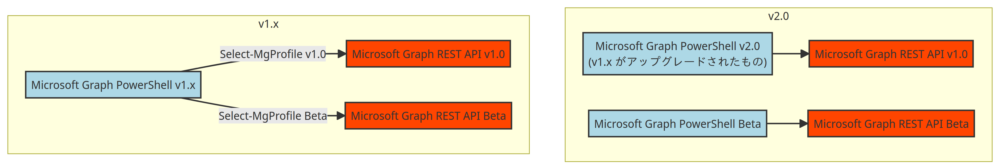

# Microsoft Graph PowerShell v2.0 でサポートされた認証方法と変更点

こんにちは。Azure Identity チームの沓澤です。

多くのお客様にお使いいただいている Microsoft Graph PowerShell モジュールの v2.0 が 2023/7/5 にリリースされました！モジュールの再インストールやアップデートを実施した際に Microsoft Graph PowerShell v2.0 以降がインストールされるようになります。Microsoft Entra ID 関連の変更点としては、サポートされる認証方法が増えます。一方で、Microsoft Entra ID を含め全てのサービスに関連いたしますが、今回のアップデートには破壊的変更があります。

本記事では Microsoft Graph PowerShell v2.0 のインストール方法の説明した後、サポートされるようになった認証方法と破壊的変更の内容について説明します。

## Microsoft Graph PowerShell v2.0 のインストール

Microsoft Graph PowerShell は Microsoft Graph REST API (v1.0/Beta) を呼び出すためのモジュールです。Microsoft Graph PowerShell v1.x では 1 つのモジュール (Microsoft Graph PowerShell) で Microsoft Graph REST API v1.0 と Microsoft Graph REST API Beta の両方を呼び出せます。

一方、Microsoft Graph PowerShell v2.0 では、大きく二つのモジュールに分けられており、Microsoft Graph REST API v1.0 の呼び出しには Microsoft Graph PowerShell モジュールを使用し、Microsoft Graph REST API Beta の呼び出しには Microsoft Graph PowerShell Beta モジュールを使う必要があります。そのため、Microsoft Graph REST API Beta の呼び出しを計画している場合には Microsoft Graph PowerShell Beta のインストールが必要です。



以下では、Microsoft Graph PowerShell モジュールおよび Microsoft Graph PowerShell Beta モジュールのインストール方法を説明します。

公開情報は既に v2.0 を前提とした説明に更新されていますので詳細は [Install the Microsoft Graph PowerShell SDK](https://learn.microsoft.com/en-us/powershell/microsoftgraph/installation?view=graph-powershell-1.0#installation) をご確認ください。

### Microsoft Graph PowerShell モジュールのインストールおよびアップデート

Microsoft Graph PowerShell を初めて使用する場合は以下のコマンドでインストールください。

```powershell
Install-Module Microsoft.Graph
```

既に Microsoft Graph PowerShell v1.x を使用中の場合は以下のコマンドでアップデートできます。

```powershell
Update-Module Microsoft.Graph
```

### Microsoft Graph PowerShell Beta モジュールのインストール

Microsoft Graph PowerShell Beta モジュールは、Microsoft Graph PowerShell モジュールと別々にインストールできます。言い換えますと Microsoft Graph PowerShell と Microsoft Graph PowerShell Beta は共存できます。運用環境にて Beta エンドポイントの利用を避けたい (v1.0 エンドポイントのみを利用したい) 場合は、上記手順で Microsoft Graph PowerShell モジュールのみをインストールし、Microsoft Graph PowerShell Beta モジュールをインストールしないということも可能です。

インストールするには以下コマンドを実行します。

```powershell
Install-Module Microsoft.Graph.Beta
```

## v2.0 からサポートされる認証方法

以下 2 つを使用した認証方法がサポートされるようになりました。

- マネージド ID
- クライアント シークレット

### マネージド ID

システム割り当てマネージド ID での認証をする場合は以下コマンドを実行ください。

```powershell
Connent-MgGraph -Identy
```

ユーザー割り当てマネージド ID での認証をする場合は以下コマンドを実行ください。

```powershell
Connect-MgGraph -Identity -u <ユーザー割り当てマネージド ID のアプリケーション ID>
```

### クライアント シークレット

クライアント シークレットで認証する場合は以下コマンドを実行ください。認証ポップアップにクライアント シークレットの文字列を入力します。

```powershell
$ClientSecretCredential = Get-Credential -Username "<アプリケーション ID>" Message "Enter the client secret string."
Connect-MgGraph -TenantId "<テナント Id>" -ClientSecretCredential $ClientSecretCredential
```

## 破壊的変更

Microsoft Graph PowerShell を使用し Microsoft Entra ID 関連のデータ操作をする際に、関連するものを数点ピックアップします。

詳細については GitHub の [v2.0 へのアップグレード ガイド](https://github.com/microsoftgraph/msgraph-sdk-powershell/blob/dev/docs/upgrade-to-v2.md) をご確認ください

### Select-MgProfile コマンドの廃止

Microsoft Graph PowerShell v1.x では Select-MgProfile コマンドにより Microsoft Graph REST API v1.0 と Microsoft Graph REST API Beta との呼び出し先の振り分けていました。v2.0 からは Select-MgProfile コマンドは廃止され、上述のとおり Microsoft Graph PowerShell モジュールからは Microsoft Graph REST API v1.0 を呼び出し、Microsoft Graph PowerShell Beta モジュールからは Microsoft Graph REST API Beta を呼び出すように変更になりました。

### Microsoft Graph REST API Beta を呼び出す際のコマンドの命名規則が \<Verb\>-Mg**Beta**\<Noun\> に

Micrsosft Graph REST API Beta を呼び出す際には Microsoft Graph PowerShell Beta モジュール内のコマンドを使用します。命名規則は \<Verb\>-Mg**Beta**\<Noun\> です。

下表に例を記載します:
| v1.0 | Beta |
|:---:|:---:|
| Get-MgUser | Get-MgBetaUser |
| Get-MgUserMessage | Get-MgBetaUserMessage |

### Connect-MgGraph コマンドにおける -ForceRefresh オプションの廃止

Connect-MgGraph -ForceRefresh が使用不可になり、代わりに Disconnect-MgGraph 後に Connect-MgGraph を実行する必要があります。

### Connect-MgGraph コマンドにおける -AccessToken オプションでは SecureString 型の引数が必要に

以下コマンドではエラーが生じます。

```powershell
Connect-MgGraph -AccessToken <アクセス トークンの文字列>
```

代わりに以下のように SecureString 型の引数を指定する必要があります:

```powershell
$st = ConvertTo-SecureString <アクセス トークンの文字列> -AsPlainText -Force
Connect-MgGraph -AccessToken $st
```

### モジュール名のリネーム

モジュール名の変更を下表にまとめます:

| v1.x | v2.0 |
|:---:|:---:|
| DeviceManagement.Enrolment | DeviceManagement.Enrollment |
| DeviceManagement.Enrollment | Identity.Governance |

スクリプト内で Import-Module をしている場合にはモジュール名の変更が必要です。
