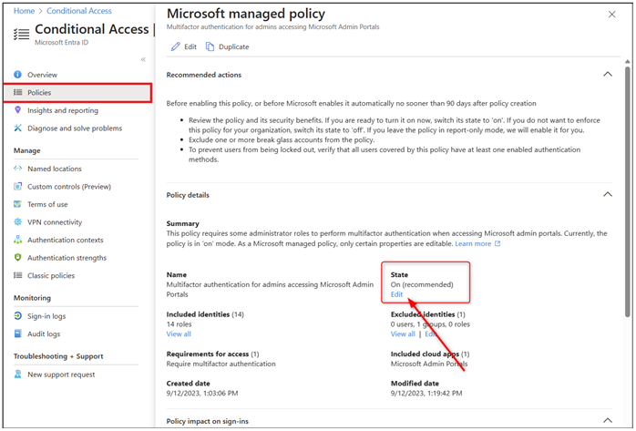

こんにちは、Azure & Identity サポート チームです。

今回は、最近お問い合わせをよくいただく「Microsoft マネージド条件付きアクセス ポリシー」についてです。Microsoft マネージド条件付きアクセス ポリシーについて、概要とよくいただくご質問を Q&A 形式でおまとめいたしました。既存のドキュメントではカバーされていない動作や質問について今後も適宜内容を拡充していきますので、ご参照いただければと思います。

# 概要

2020 年に Microsoft Entra ID は「セキュリティの既定値群」の機能を導入し、お客様に無料で多要素認証を提供することでお客様のセキュリティ強化に取り組んできました。そしてこの度、更なるセキュリティ向上のための継続的な取り組みとして、2023 年 11 月から 12 月後半にかけて、「Microsoft マネージド 条件付きアクセス ポリシー」の機能が導入されます。

Microsoft マネージド条件付きアクセス ポリシーは、Microsoft Entra ID P1 および P2 ライセンスをお持ちのお客様を対象にしたものです。P1 および P2 ライセンスをお持ちであるにもかかわらず、まだ条件付きアクセス ポリシーを有効活用していないと思われるお客様に対して、弊社がお客様テナントに自動的に条件付きアクセス ポリシーを作成します。この機能の有効化対象となったお客様には、以下の 3 つのポリシーがテナントに自動的に作成されます (後述しますように自動的に作成される条件があるため必ずしも 3 つ全てが作成されるわけではありません)。

- Microsoft 管理ポータルへアクセスする管理者に多要素認証を必須とする
- "ユーザーごとの MFA" 機能を使用しているユーザーに多要素認証を必須とする
- リスクの高いサインインに対して多要素認証と再認証を必須とする

これらのポリシーはレポート専用モードで作成されます。このため即時にユーザーに影響はなく、アクセスがブロックされたり MFA が要求されたりすることはありません。また、これらのポリシーが仮に有効化された場合に想定されるユーザー影響についてのレポートも生成されます。

Microsoft マネージド条件付きアクセス ポリシーは、作成されてから 90 日間レポート専用モードの状態が維持されます。その間に管理者がポリシーを有効もしくは無効とすることが可能です。無効化せずにレポート専用モードの状態を維持した場合、90 日間の猶予期間の後に、ポリシーは有効となります。ポリシーが有効になると、ポリシーの対象となるユーザーは各ポリシーの条件に従って多要素認証が要求され、より高いセキュリティで保護されることになります。

# 各ポリシーの詳細

3 つの Microsoft マネージド条件付きアクセス ポリシーは、それぞれ作成条件が異なります。どのポリシーがお客様テナントで作成されるかはテナントの設定や状況に依存します。テナントによっては、3 つのポリシー全てが作成される場合もあれば、一部のポリシーのみ作成される場合や、どのポリシーも作成されない場合もあります。

それぞれのポリシーについての概要および作成の対象となるテナントに以下におまとめしました。

> [!NOTE] 
> Microsoft マネージド 条件付きアクセス ポリシーの自動作成は、2023 年 11 月から 12 月後半に順次行われます。このため現時点でこれらのポリシーはお客様のテナントに存在しない可能性があります。ポリシーの作成はシステムにより自動的に行われるため、どのテナントにいつポリシーが作成されるかを弊社からお答えすることは困難です。現時点でポリシーがテナントに存在しなくても、焦らずお待ちください。お客様テナントが以下の条件に合致してポリシーが自動作成されても 90 日の猶予があるため、その間にお客様影響が及ぶことはありません。 

## Policy 1 : Microsoft 管理ポータルへアクセスする管理者に多要素認証を必須とする

このポリシーは、特権を持つ管理者ロールを対象に、Microsoft 管理ポータルにアクセスする際に多要素認証を要求します。このポリシーでは、以下の 14 の Microsoft Entra ロールが対象となります。

- グローバル管理者
- アプリケーション管理者
- 認証管理者
- 課金管理者
- クラウド アプリケーション管理者
- 条件付きアクセス管理者
- Exchange 管理者
- ヘルプデスク管理者
- パスワード管理者
- 特権認証管理者
- 特権ロール管理者
- セキュリティ管理者
- SharePoint 管理者
- ユーザー管理者

また、このポリシーは、以下の管理ポータルへのアクセスが対象となります。

- Azure ポータル
- Exchange 管理センター
- Microsoft 365 管理センター
- Microsoft 365 Defender ポータル
- Microsoft Entra 管理センター
- Microsoft Intune 管理センター
- Microsoft Purview コンプライアンス ポータル
- Microsoft Teams 管理センター

このポリシーは、以下の 2 つの条件を両方満たすテナントに自動的に作成されます。

- 「セキュリティの既定値群」機能が無効である
- 月間アクティブ管理者ユーザー分の Microsoft Entra ID P1 または P2 のライセンスがテナントに存在する

## Policy 2 : "ユーザーごとの MFA" 機能を使用しているユーザーに多要素認証を必須とする

このポリシーは、"ユーザーごとの MFA" 機能を使用しているユーザーを対象に、全てのクラウド アプリにアクセスする際に MFA を要求します。このポリシーは、"ユーザーごとの MFA" 機能と同様に動作します。"ユーザーごとの MFA" 機能はレガシーな機能として非推奨であるため、"ユーザーごとの MFA" 機能から「条件付きアクセスを用いた多要素認証を要求する構成」への移行を促すポリシーとなります。

このポリシーは、以下の 3 つの条件をすべて満たすテナントに自動的に作成されます。

- 「セキュリティの既定値群」機能が無効である
- "ユーザーごとの MFA" 機能で MFA が有効/強制されているユーザーが 500 未満である
- 上記ユーザー数分の Microsoft Entra ID P1 または P2 ライセンスがテナントに存在する

## Policy 3 : リスクの高いサインインに対して多要素認証と再認証を必須とする

このポリシーは、テナント内のすべてのユーザーを対象とし、リスクの高いサインインを検出した場合に多要素認証と再認証を要求します。

「リスクの高いサインイン」とは、ユーザーのサインインが通常とは異なる場合を意味します。たとえば、通常とは異なる移動、パスワード スプレー攻撃、トークンの問題などが含まれます。これらのリスク定義の詳細については、[リスク検出とは](https://learn.microsoft.com/ja-jp/entra/id-protection/concept-identity-protection-risks#sign-in-risk-detections)の記事を参照ください。

このポリシーは、以下の 2 つの条件を両方満たすテナントに自動的に作成されます。 

- 月間アクティブ ユーザー分の Microsoft Entra ID P2 ライセンスがテナントに存在する
- リスク ベースの条件付きアクセス ポリシーが構成されていない  

# よくあるご質問
以下に、 Microsoft マネージド 条件付きアクセス ポリシーについて、お問い合わせの多いご質問を Q&A 形式でおまとめいたしました。

---

Q. いつ Microsoft マネージド条件付きアクセス ポリシーが作成されますか？

A. Microsoft マネージド条件付きアクセス ポリシー (以降ポリシー) は、2023 年 11 月から 12 月後半にかけて作成されます。

---

Q. まだ自社テナントに Microsoft マネージド条件付きアクセス ポリシーがありません。いつ作成されるか具体的な日時を教えてくれますか？

A. 恐れ入りますが、いつどのテナントに Microsoft マネージド条件付きアクセス ポリシーが作成されるかをお答えすることは困難です。ポリシーの作成はシステムにより自動的に順次行われます。恐れ入りますが、現時点でポリシーがテナントに存在しなくても、焦らずお待ちください。弊社サポートにお問い合わせをいただいても、確実な答えは致しかねます。

---

Q.  Microsoft マネージド条件付きアクセス ポリシーが作成されると、どのような影響がありますか？

A. これらのポリシーは、レポート専用モードで作成されるため、即時に影響はありません。これらのポリシーは、90 日間レポート専用モードの状態が維持され、その間に管理者がポリシーを有効もしくは無効とすることが可能です。レポート専用モードを維持した場合、90 日間の猶予期間の後に、ポリシーは自動的に有効となります。

---

Q.  Microsoft マネージド条件付きアクセス ポリシーを無効化することはできますか？

A. はい、ポリシーを無効にすることができます。自動有効化をご要望でない場合は、無効に設定してください。

---

Q.  Microsoft マネージド条件付きアクセス ポリシーを無効化する方法を教えてください。

A. 条件付きアクセス ポリシーの設定ページから対象のポリシーを選択し、その状態 ("State") を [無効] にご変更ください。

---

Q.  Microsoft マネージド条件付きアクセス ポリシーのポリシー内容を変更することはできますか？

A. Microsoft マネージド条件付きアクセス ポリシー自体の設定を変更することはできません。管理者が可能な操作はポリシーの状態の変更 (有効、無効またはレポート専用) と、除外対象として特定のユーザー、グループ、ロールを指定することのみです。ポリシーの内容を変更したい場合、該当のポリシーを複製することで、ご要件に沿って複製したポリシーをカスタマイズすることができます。自動的に作成されたポリシーを無効に設定し、複製を行いカスタマイズしたポリシーを有効とすることで、お客様のご要件に沿った内容のポリシーをご利用いただけます。

---

Q.  Microsoft マネージド条件付きアクセス ポリシーを削除することはできますか？

A. いいえ、自動的に作成されたポリシー自体を削除することはできません。ポリシーが適用されないようにするためには、対象のポリシーを無効に設定してください。

---

Q.  自社テナントの条件付きアクセス ポリシーの設定を見直す必要はありますか？

A. 必ずしもテナントの条件付きアクセス ポリシーを見直す必要はございませんが、この機会に、お客様のご要件に応じて必要なセキュリティ上の保護が適用されているか確認することをお勧めいたします。また、 Microsoft マネージド条件付きアクセス ポリシーは多くの利用シナリオにおいて、有効化しておくことが望ましい設定となりますので、すでに同様の設定を実施していない環境では、有効とすることを推奨します。

---

Q.  Microsoft マネージド条件付きアクセス ポリシーが作成されるテナントの条件を教えてください。

A. それぞれの Microsoft マネージド ポリシーが作成される条件は以下のとおりです。

- Microsoft 管理ポータルへのアクセスする管理者に多要素認証を必須とするポリシー
セキュリティの既定値群が無効であり、かつ月間アクティブな管理者分の Microsoft Entra ID P1 または P2 のライセンスを持つテナントが対象となります。

- "ユーザーごとの MFA" 機能を使用しているユーザーに多要素認証を必須とする Microsoft マネージド条件付きアクセス ポリシー
セキュリティの既定値群が無効であり、全てのユーザー分の Microsoft Entra ID P1 または P2 ライセンスを持ち、さらにユーザーごとの MFA が有効/強制されているユーザーが 500 未満のテナントが対象となります。

- リスクの高いサインインに対して多要素認証と再認証を必須とするポリシー
月間アクティブユーザー分の Microsoft Entra ID P2 ライセンスを持ち、リスク ベースの条件付きアクセス ポリシーが構成されていないテナントが対象となります。

---

Q.  作成された Microsoft マネージド条件付きアクセス ポリシーはどこで確認できますか？

A.  Microsoft Entra ポータルまたは Azure ポータルの条件付きアクセス ポリシーの設定ページから、Microsoft マネージド条件付きアクセス ポリシーと作成数を確認することができます。

---

Q.  テナントやユーザーの設定やライセンスを変更したら Microsoft マネージド条件付きアクセス ポリシーも変更されますか？

A. Microsoft マネージド ポリシーは、ポリシーが初めに作成された時点でのテナントの設定に依存します。一度ポリシーが追加されたら、テナントやユーザーの設定が変更されても、ポリシーの内容は変更されません。また、初めにポリシーが作成された時点で追加されなかったポリシーが、それ以降に追加されることもございません。

---

Q.  Microsoft マネージド条件付きアクセス ポリシーが作成されるとライセンスは消費されますか？

A. Microsoft マネージド条件付きアクセス ポリシーの対象となるユーザーに自動的にライセンスが割り当てられることはありません。Microsoft マネージド条件付きアクセス ポリシーを利用される場合には、その対象となるユーザーへ Microsoft Entra ID P1 以上 (Policy3 の場合は Microsoft Entra ID P2) のライセンスを割り当てください。

---

Q.  "ユーザーごとの MFA" の機能を現在利用しているかどうか、どうやって確認すればいいでしょうか？

A. "ユーザーごとの MFA" を利用しているかは [Azure Portal (portal.azure.com)] > [Microsoft Entra ID (Azure Active Directory)] > [ユーザー] > [ユーザーごとの MFA] からご確認いただけます。対応する公開情報のページは[こちら](https://learn.microsoft.com/ja-jp/entra/identity/authentication/howto-mfa-userstates#view-the-status-for-a-user)です。

一覧に表示されるユーザーの [MULTI-FACTOR AUTHENTICATION の状態] が [有効] もしくは [強制] となっている場合、"ユーザーごとの MFA" の機能により MFA が要求されています。  
※ [MULTI-FACTOR AUTHENTICATION の状態] についてフィルターを利用した検索が可能です。

---

Q.  「"ユーザーごとの MFA" 機能を使用しているユーザーに多要素認証を必須とする Microsoft マネージド条件付きアクセス ポリシー」は、どのユーザーが対象になりますか？

A. このポリシーが作成された時点で、"ユーザーごとの MFA" 機能により多要素認証が有効または強制されている既存のユーザーが、ポリシーの対象となります。「"ユーザーごとの MFA" 機能を使用しているユーザーに多要素認証を必須とする Microsoft マネージド ポリシー」が追加された後に作成されたユーザーや新たに "ユーザーごとの MFA" を有効化されたユーザーは、このポリシーの対象とはなりません。

---

Q.  「"ユーザーごとの MFA" 機能を使用しているユーザーに多要素認証を必須とする Microsoft マネージド条件付きアクセス ポリシー」が作成された後、"ユーザーごとの MFA" 機能の設定はどうなりますか？

A.  「"ユーザーごとの MFA" 機能を使用しているユーザーに多要素認証を必須とする Microsoft マネージド条件付きアクセス ポリシー」が作成された後も、"ユーザーごとの MFA" 機能の設定は以前の状態のまま維持されます。"ユーザーごとの MFA" 機能はレガシーな非推奨の機能であるため、条件付きアクセス ポリシーによる多要素認証への移行をお勧めします。Microsoft マネージド条件付きアクセス ポリシーの対象となったユーザーについては、"ユーザーごとの MFA" 機能による多要素認証の状態を無効へ変更ください。

---

Q.  Microsoft マネージド条件付きアクセスポリシーは Azure AD B2C テナントに作成されますか？

A.  いいえ、Microsoft マネージド条件付きアクセスポリシーは Azure AD B2C テナントには作成されません。

