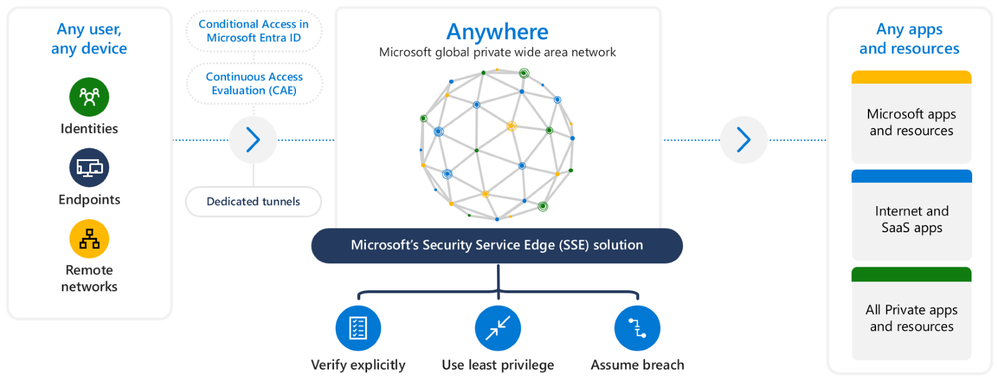
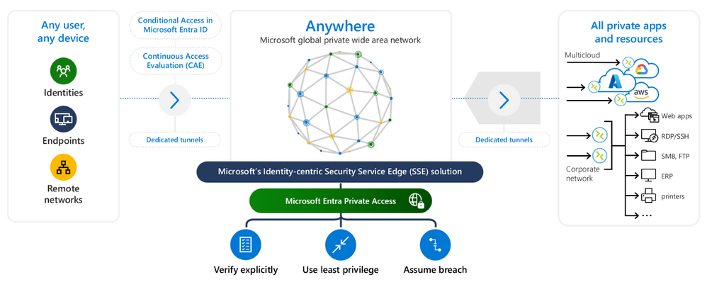
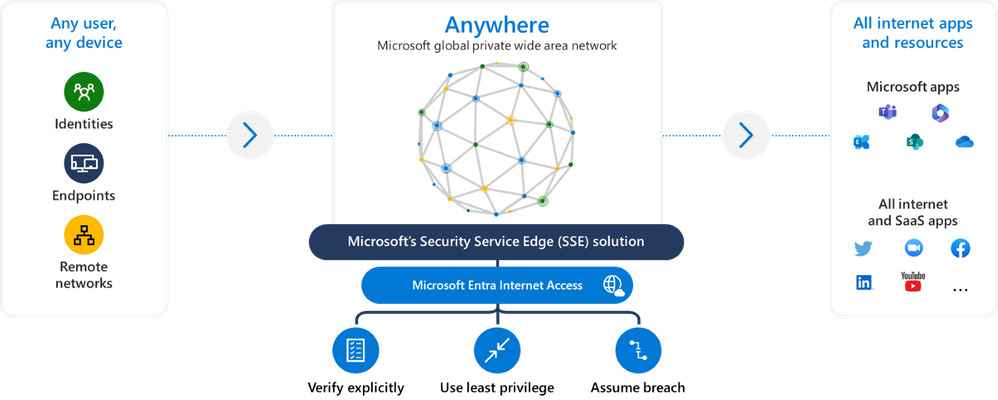

# Microsoft Security Service Edge が一般提供 (GA) されました

こんにちは、Azure Identity サポート チームの 五十嵐 です。

本記事は、2024 年 7 月 11 日に米国の Microsoft Entra (Azure AD) Blog で公開された [Microsoft Security Service Edge now generally available](https://techcommunity.microsoft.com/t5/microsoft-entra-blog/microsoft-security-service-edge-now-generally-available/ba-p/3847828) の抄訳です。ご不明点等ございましたらサポート チームまでお問い合わせください。

----

本日、弊社は ID およびネットワーク アクセス制御を統合し、クラウドまたはオンプレミスのアプリケーションやリソースにあらゆる場所から安全にアクセスできる Microsoft Entra Suite の一般提供を [発表](https://aka.ms/ZeroTrustBlog-July2024) しました。Microsoft Entra Suite により、最小特権のアクセスを一貫して適用しつつ、従業員のユーザー体験を向上させながら、ガバナンス要件を達成可能となります。

現在、企業にはセキュリティに注力する十分な理由があります。生成 AI の大規模言語モデルが、スケーラビリティの向上、効率化、コスト削減といったあらゆるメリットを我々に提供する一方で、こうした利点は、悪意のある攻撃者が高度な技術を悪用してマルウェアを作成したり、ネットワークの脆弱性を狙ったり、フィッシング攻撃を発生させたりして、組織のデータと評判をより高いリスクにさらすことも可能にしています。

ID ソリューションとネットワーク アクセス ソリューションが連携せずに単独で運用されると、複雑性が増すと共にポリシーに一貫性がなくなり、個別のソリューション間で全体性を欠いた状態が生まれます。その結果、意図せずセキュリティ態勢がバラバラの状態となり、攻撃者に悪用されうる脆弱性が生じることで、ビジネスの継続性が阻害され、ユーザー体験が損なわれる可能性があります。

ID とネットワーク セキュリティを個別に管理するだけではすべてのアクセス シナリオを保護できるわけではないため、ユーザーやリソースがどこにあろうと、進化する脅威に対抗し、重要な資産を保護するための包括的な戦略を採用する必要性が浮き彫りになっているのです。

## 統合型セキュリティの提案: 戦略的取り組み

Microsoft Entra Suite の一般提供開始と併せ、Microsoft の Security Service Edge (SSE) ソリューションである、[Microsoft Entra Private Access](https://www.microsoft.com/ja-jp/security/business/identity-access/microsoft-entra-private-access) および [Microsoft Entra Internet Access](https://www.microsoft.com/ja-jp/security/business/identity-access/microsoft-entra-internet-access) の一般提供の開始も [発表](https://www.microsoft.com/en-us/security/blog/2024/07/11/simplified-zero-trust-security-with-the-microsoft-entra-suite-and-unified-security-operations-platform-now-generally-available/) しました。この 2 つの製品は、セキュリティに特化した SaaS の CASB ([Microsoft Defender for Cloud apps](https://www.microsoft.com/ja-jp/security/business/siem-and-xdr/microsoft-defender-cloud-apps)) と組み合わせることで、Microsoft の Security Service Edge ソリューションを構成します。これは、クラウドで提供される ID 中心のネットワーク モデルであり、アクセス保護の仕組みを変革するものです。

Microsoft の SSE ソリューションは、オンプレミスかクラウドかを問わず、すべてのアプリケーションとリソースに条件付きアクセスと継続的アクセス評価を拡張し、セキュリティ保護における抜け穴をなくすよう実現します。

ここでは、Microsoft の SSE ソリューションが組織にもたらす主な利点について詳しく説明します。

### ID とネットワーク アクセスが独立して動作することによるセキュリティの抜け穴の排除

Microsoft の SSE ソリューションでは、[ID ソリューションとネットワーク アクセス ソリューションが連携して動作します](https://sponsored.bloomberg.com/article/microsoft-security/Time-to-Break-the-Silos-Between-Identity-and-Network-Security)。これら別々の要素を統合することで、新たな脅威に直面する中で、お客様のセキュリティ担当チームが組織のセキュリティ態勢を強化可能となるのです。アプリケーションごとにどのツールが有効かを決めたり、ID チームとネットワーク チームが作成したポリシーをどのように橋渡しするかを決めたりする必要はもうありません。このソリューションにより、あらゆるアプリケーション、リソース、アクセス先に対して、管理しやすく、統一された ID 中心のアプローチでアクセスを保護することができます。複雑でバラバラなセキュリティ管理によってユーザーの生産性を犠牲にすることはありません。

### グローバル規模でアクセスをよりシンプルにしエンドユーザー体験を向上

Microsoft の SSE ソリューションは、世界最大級のグローバル プライベート ネットワークの 1 つである [Microsoft のグローバル ワイド エリア ネットワーク](https://learn.microsoft.com/ja-jp/azure/networking/microsoft-global-network) から提供されます。このネットワークは、61 の Azure リージョンにまたがる Microsoft の [データセンター](https://azure.microsoft.com/ja-jp/explore/global-infrastructure/) を、[185 以上のグローバル ネットワーク接続拠点](https://azure.microsoft.com/ja-jp/explore/global-infrastructure/global-network/#features) と、世界中に戦略的に配置された膨大な数の SSE エッジ ロケーションで接続しています。これにより、ユーザーとデバイスがパブリック リソースおよびプライベート リソースにシームレスかつ安全に接続できるようになり、従業員に高速で一貫性のあるハイブリッドな業務体験が提供されることで、成果や生産性を高めることができます。

### 他の SSE やネットワーク ソリューションとの柔軟な並行展開オプションを提供

Microsoft Entra Private Access と Microsoft Entra Internet Access は、それ単体または他の SSE ソリューションと並行して導入できます。[Global Secure Access クライアント](https://learn.microsoft.com/ja-jp/entra/global-secure-access/concept-clients) は、ユーザーのエンドポイント デバイスでネットワーク トラフィックを制御し、特定の [トラフィックの種類](https://learn.microsoft.com/ja-jp/entra/global-secure-access/concept-traffic-forwarding) を Microsoft の SSE ソリューションにルーティングする機能を提供します。[Windows](https://learn.microsoft.com/ja-jp/entra/global-secure-access/how-to-install-windows-client) と [Android](https://learn.microsoft.com/ja-jp/entra/global-secure-access/how-to-install-android-client?tabs=device-administrator) オペレーティング システム用のクライアントは現在一般提供されており、iOS と Mac オペレーティング システム用はパブリック プレビュー版となっています。柔軟に設定が可能なため、お客様が構成した転送プロファイルに基づいて、Global Secure Access クライアントが Private Access、Internet Access および Microsoft のトラフィックを取得して処理可能です。

例えば、プライベート アクセス プロファイルを構成することで、どこでもサードパーティの従来の VPN を ID 中心の ZTNA (ゼロ トラスト ネットワーク アクセス) ソリューションに置き換え可能です。また、Microsoft プロファイルを構成して、Microsoft アプリケーションのパフォーマンスを向上させながら、プライベート トラフィックとインターネット トラフィックをお好みの SSE ソリューションで保護することもできます。

## Microsoft Entra Private Access の詳細

Microsoft Entra Private Access は、ID を中心とした ZTNA ソリューションで、ユーザがどこにいようがすべてのプライベート アプリとリソースに安全にアクセスできるようにします。Private Access では、従来の VPN を ZTNA に置き換えることで、プライベート リソースへの完全なネットワーク アクセスを提供することなく、ユーザーをあらゆるプライベート リソースやアプリケーションに安全に接続することができます。このソリューションは、アプリごとにきめ細かく構成が可能であり、さらに柔軟に最小特権のアクセス ポリシーを適用しながら、サイバー空間上の脅威から組織を保護しつつ、攻撃者の横展開を防ぐゼロ トラストの原則を採用しています。Microsoft のグローバル プライベート ネットワークを使用することで、セキュリティと生産性のバランスが取れた、高速でシームレスなアクセス体験をユーザーに提供できます。

ここでは、Microsoft Entra Private Access の主な使用例について詳しく説明します。

### 従来の VPN を ID 中心の ZTNA ソリューションに置き換える

Microsoft Entra Private Access を使用すると、[従来の VPN を簡単に廃止し](https://sponsored.bloomberg.com/article/microsoft-security/Its-Time-to-Move-Beyond-Traditional-VPNs)、ID 中心の ZTNA ソリューションにアップグレードが可能です。これにより、攻撃対象領域を減らしつつ、攻撃者の横展開を水平移動を軽減し、IT チームにとって不必要な運用の複雑さを取り除くことができます。従来の VPN とは異なり、Microsoft Entra Private Access は、リモートかローカルかを問わず、すべてのハイブリッド ユーザーにネットワークへの最小特権のアクセスを許可し、オンプレミスまたはクラウド上のレガシー アプリ、カスタム アプリ、最新のアプリ、またはプライベート アプリへのアクセスを保護します。

### すべてのプライベート リソースに条件付きアクセスを強制

セキュリティ態勢を強化し、攻撃対象領域を最小限に抑えるには、プライベート アプリケーションやリソースに変更を加えることなく、多要素認証 (MFA) などの堅牢な [条件付きアクセス](https://learn.microsoft.com/ja-jp/entra/identity/conditional-access/overview) 制御を実装することが極めて重要です。また、最新の認証に対応していない可能性のあるレガシー アプリケーションや独自のアプリケーションを含め、すべてのプライベート リソースとアプリケーションでシームレスに [シングル サインオン](https://learn.microsoft.com/ja-jp/entra/identity/enterprise-apps/what-is-single-sign-on) (SSO) を有効にすることもできます。

### グローバル規模で迅速かつ容易なアクセスを実現

オンプレミス、プライベート データセンター、クラウドを問わず、Microsoft の広大なエッジ ネットワークを活用することでプライベート アプリケーションやリソースへの高速かつ容易なアクセスが提供され、従業員の生産性が向上します。ユーザーは、最も近い世界規模の POP (Points-of-Presence) を介した最適化されたトラフィック ルーティングの恩恵を受けますので、高速なハイブリッドワーク体験を遅延なく受けられます。

## Microsoft Entra Internet Access の詳細

Microsoft Entra Internet Access は、SaaS アプリケーションとインターネット トラフィックを対象とした ID 中心の Secure Web Gateway (SWG) です。これは、企業のすべてのアクセス制御を一箇所に集約できる、業界初の真に ID 中心の SWG ソリューションです。これにより、複数のセキュリティ ソリューションを使用することで生じるセキュリティの抜け穴をなくすと同時に、悪意のあるインターネット トラフィックや安全でないコンテンツ、コンプライアンス違反のコンテンツ、およびオープン インターネットからのその他の脅威から企業を保護します。Microsoft Entra Private Access やその他の Microsoft Entra ID の機能と組み合わせることで、すべてのインターネット リソースと SaaS アプリのアクセス ポリシーを統一して適用することが可能です。

### インターネット上の脅威から組織を保護

Microsoft Entra Internet Access は、企業のユーザーが望ましくないオンライン コンテンツにアクセスしないように制限する、堅牢な Web コンテンツ フィルタリング オプションを提供しています。[Web カテゴリ フィルタリング](https://learn.microsoft.com/ja-jp/entra/global-secure-access/how-to-configure-web-content-filtering) を使用すると、法的責任、高帯域、生産性の損失、一般的なブラウジング、およびセキュリティの脅威 (マルウェア、危険な Web サイト、スパム サイトなど) のサイトを含む、事前に用意された [Web カテゴリ](https://learn.microsoft.com/ja-jp/entra/global-secure-access/reference-web-content-filtering-categories) に基づいて、インターネットの膨大な接続先を簡単に許可またはブロックすることができます。より詳細な制御を行うには、完全修飾ドメイン名 (FQDN) フィルタリングを使用して、特定のエンドポイントを許可またはブロックするポリシーを作成したり、Web カテゴリ ポリシーを上書きしたりすることも可能です。

### 条件付きアクセスの豊富な機能をインターネット セキュリティに拡張

現代のビジネスでは、さまざまなシナリオに対応する汎用性の高いフィルタリング ポリシーが求められています。Microsoft Entra Internet Access は、ユーザーやデバイス、リスク、および場所の情報を活用して、[SWG ポリシーに条件付きアクセスの制御を適用し](https://learn.microsoft.com/ja-jp/entra/identity/conditional-access/concept-conditional-access-session#use-global-secure-access-security-profile-preview)、関連するインターネット接続先へのアクセスを許可またはブロックする機能を提供します。Internet Access は、ネットワークと ID のアクセス制御を 1 つのポリシー エンジンに統合し、Microsoft Entra ID と連携していない外部接続先やクラウド サービスも含め、すべての外部接続先やクラウド サービスに [条件付きアクセス (および将来的には継続的アクセス評価)](https://learn.microsoft.com/ja-jp/entra/global-secure-access/concept-universal-conditional-access) を適用できるようにします。さらに、Entra ID との密な統合により、[トークンの窃取防止](https://learn.microsoft.com/ja-jp/entra/global-secure-access/how-to-compliant-network)、[ソース IP の復元](https://learn.microsoft.com/ja-jp/entra/global-secure-access/how-to-source-ip-restoration)、[ユニバーサル テナント制限](https://learn.microsoft.com/ja-jp/entra/global-secure-access/how-to-universal-tenant-restrictions) によるデータ流出防止などの重要な機能も提供します。

### グローバル規模で高速かつ一貫性のあるアクセスを提供

ユーザーとプライベート WAN の近くに POP を配置し、[グローバルなネットワーク エッジ](https://learn.microsoft.com/ja-jp/entra/global-secure-access/reference-points-of-presence) を通じて高速かつスムーズなアクセスを提供することで、ユーザーの生産性を高めることが可能です。インターネット プロバイダーと多数のピアリング契約を活用していますので、最高のパフォーマンスと信頼性を提供します。ホップ数を最小限に抑え、すべての Microsoft サービスのトラフィック ルーティングを最適化しています。サードパーティの SSE プロバイダーのソリューションと並列でアクセスの構成が可能ですので、それらと組み合わせて Microsoft アプリケーションの最適なトラフィック管理を実装いただけます。

## まとめ

組織は、すべてのアプリケーションとリソースへのアクセスを保護するために、よりシンプルで柔軟なアプローチを必要としています。これらの機能により、重要な資産がどこにあろうとそれらを保護いただけます。Microsoft の SSE ソリューションである Microsoft Entra Internet および Private Access 製品は、本日より一般提供を開始します。このソリューションは、ID セキュリティ制御とアクセス ガバナンスをネットワークにまで拡張することで、悪質ある攻撃者が機密データにアクセスすることを困難にします。

これらの機能により、ユーザーが必要なリソースにのみアクセスできるという先進のセキュリティ環境が実現され、業務も効率化されると期待されます。条件付きアクセスにより、きめ細かな ID ポリシーとネットワーク アクセス ポリシーが統合され、重大なセキュリティの抜け穴が解消され、運用の複雑さも軽減されます。Microsoft が提供するグローバルなプライベート広域ネットワークは、シームレスで効率的なハイブリッドワーク体験を保証します。また、Microsoft の広範なセキュリティ ポートフォリオ、およびパートナー エコシステムとの統合により、セキュリティ環境全体でゼロ トラストの原則の導入がサポートされ、全体的な保護が強化されます。

2024 年 7 月 31 日に開催予定の [Zero Trust spotlight](https://aka.ms/ZeroTrustWebcast) にぜひご登録ください。この会では、Microsoft の専門家によりこれらの発表についてより深く解説がなされる予定です。また製品の詳細ブログや、2024 年 8 月 14 日に開催予定の [Tech Accelerator での製品の詳細セッション](https://techcommunity.microsoft.com/t5/tech-community-live/microsoft-entra-suite-tech-accelerator/ec-p/4189272) にもご期待ください。これらのイベントでは、Microsoft の SSE ソリューションとその 2 つのコア製品である Microsoft Entra Private Access と Microsoft Entra Internet Access が、どのようにして組織のデジタル資産全体を保護していくかというそのアプローチをお見せできると存じます。

Microsoft の営業担当者に連絡して試用版をぜひお試しいただき、Microsoft Entra Private Access と Microsoft Entra Internet Access にぜひ触れていただきたく思います。このソリューションをより良いものにするために、皆様のご意見をお聞かせください。

Sinead O'Donovan
Vice President of Product Management, Identity and Network Access at Microsoft
