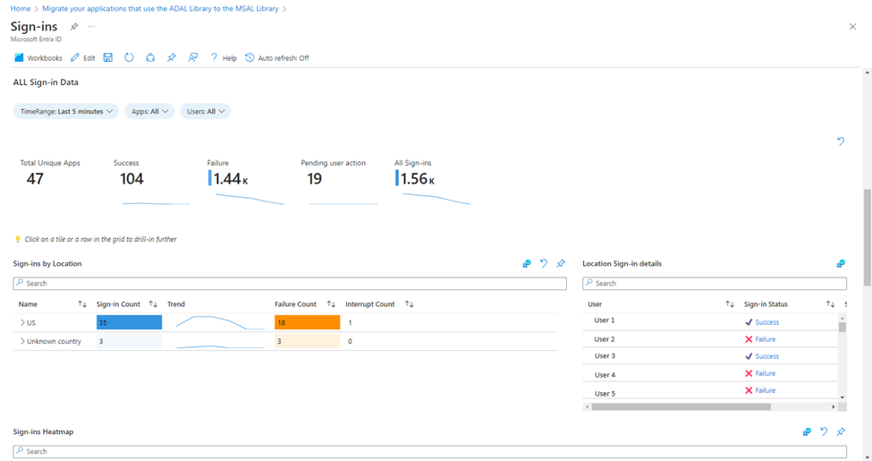

# ADAL アプリを MSAL に移行して分析情報を強化しましょう

こんにちは、Azure Identity サポート チームの 五十嵐 です。

本記事は、2024 年 7 月 26 日に米国の Microsoft Entra (Azure AD) Blog で公開された [Migrate ADAL apps to MSAL with enhanced insights](https://techcommunity.microsoft.com/t5/microsoft-entra-blog/migrate-adal-apps-to-msal-with-enhanced-insights/ba-p/4194361) の抄訳です。ご不明点等ございましたらサポート チームまでお問い合わせください。

----

Microsoft Entra 管理センターのサインイン ワークブックの大幅なアップデートを発表いたします。このツールは、Azure Active Directory Authentication Libraries (ADAL) から Microsoft Authentication Libraries (MSAL) へ移行する組織で有用活用いただけるものです。これらのアップデートは、ADAL を利用するアプリケーションの関連データについて包括的な分析情報を提供することで、ADAL の移行プロセスを最適化することを目的としています。

## どうして今回の発表が重要なのか？

弊社は 2020 年 6 月に ADAL の終了を、2023 年 6 月はセキュリティ アップデートのサポート終了を [発表](https://techcommunity.microsoft.com/t5/microsoft-entra-blog/update-your-applications-to-use-microsoft-authentication-library/ba-p/1257363) しました。つまり、ADAL を使用しているアプリケーションは最新のセキュリティ機能を利用できず、将来のセキュリティの脅威に対して脆弱なままとなります。クライアント アプリケーションの認証と認可のセキュリティ態勢と耐障害性を改善するために、ADAL を使用しているアプリケーションを MSAL に移行することを強くお勧めします。

MSAL は、マネージド ID、継続的アクセス評価 (CAE)、パスキー [など](https://learn.microsoft.com/ja-jp/entra/identity-platform/msal-migration#why-switch-to-msal)、Microsoft Entra ID の最新のセキュリティ機能をサポートしています。このたび更新されたサインイン ワークブックはこの移行に不可欠なツールであり、移行を実行するにあたり十分な情報に基づいた意思決定に必要な分析情報とデータを提供します。

## サインイン ワークブックの新機能は？

サインイン ワークブックは、テナント内で ADAL を使用しているアプリケーションを一元的かつ詳細に表示したいという要望を持つ管理者向けに再設計されています。これらの追加された分析情報により、MSAL への移行を成功させるための ADAL アプリケーションの特定、調査、検証が容易になります。  

以下は、最新の機能強化で得られるものの一覧です:

1. **サインイン ログを包括的に集約**: ワークブックでは、対話型、非対話型、サービス プリンシパルのサインインを含む、さまざまな種類のサインイン イベントのログが統合されるようになりました。
2. **データの視覚化を強化**: ADAL アプリケーション全体のサインインを一覧として確認できるように、新しく集約したメトリクスでレポートを更新しました。特定の分析ニーズにも応えられるよう、ワークブックにはカスタム フィルターとクエリも適用が可能です。このような柔軟性により、ADAL 移行作業にとって最も重要な情報に集中することができます。
3. **Microsoft Entra レコメンデーションとの統合**: ADAL から MSAL への推奨事項のページからこのサインイン ワークブックに直接アクセスして、推奨事項の詳細ページに一覧された ADAL アプリケーションのリストを深く掘り下げることができるようになりました。Microsoft Entra ID 用のワークブックを使用するには、P1 ライセンスを持つ Microsoft Entra ID テナントが必要です。

## アプリケーションの更新を計画しましょう

まずは、[ワークブックにアクセスして、すべての ADAL アプリケーションと、それらに関連する詳細のリストを取得する](https://learn.microsoft.com/ja-jp/entra/identity-platform/howto-get-list-of-all-auth-library-apps) ことから始めましょう。[移行ガイド](https://learn.microsoft.com/ja-jp/entra/identity-platform/msal-migration) では、ADAL を使用するアプリケーションから MSAL を使用するアプリケーションに移行するためのすべての手順について説明しています。

Neha Goel 
Senior Product Manager, Microsoft
