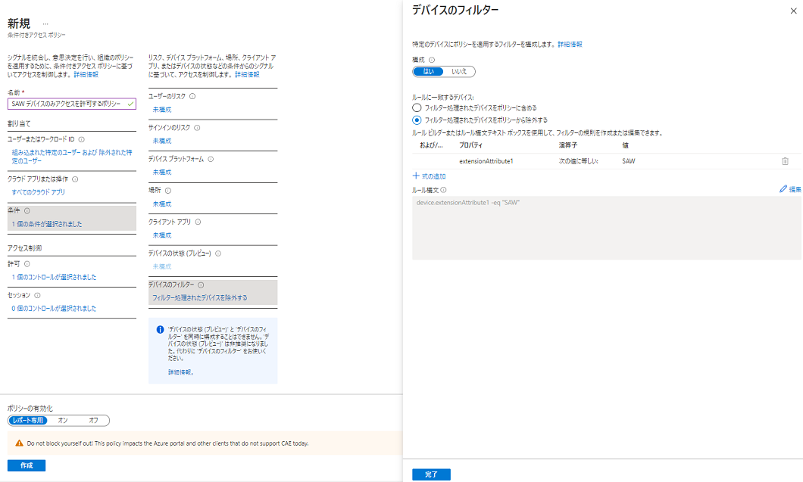
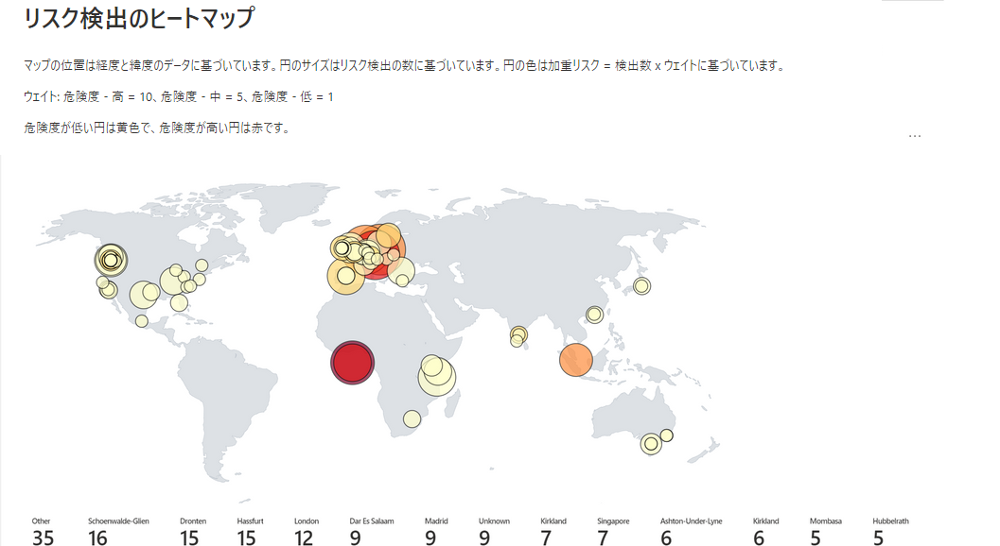

# ゼロ トラスト展開のためのよりよいコントロールとインサイト

Ignite 2021 はお楽しみいただけましたか？ ユーザーやアプリケーションを脅威から保護するために、ゼロ トラストを展開するうえで、どのように Azure Active Directory を使っているか、皆様からのご意見を伺うことができました。多くの方から、ID 環境の保護と調査のために、より強力で使いやすいツールを求める声をいただいています。そこで本日は、Azure AD の条件付きアクセスと Identity Protection の新機能について詳しくご紹介します。新しい機能を使うと、ID の保護を強化するとともに、業務をより簡単に進めることができるようになります。
 
## Azure AD の条件付きアクセスと Identity Protection の新機能

Ignite では、複数の強力な機能を発表しました。より使いやすくなった条件付きアクセスに加え、ゼロ トラストの展開を加速させるインサイトの提供、さらに主要なシナリオについてより包括的な保護を行えるようになりました。**条件付きアクセスの概要を示すダッシュボード** (パブリック プレビュー版) では、ポリシーの適用範囲におけるギャップを素早く見つけることができ、テンプレートを使用することで推奨されるポリシーをより簡単に導入することができます。また、デバイス用のフィルターやアプリ用のフィルター (一般公開 / GA) では、特権操作を行うワークステーションへ管理者のみがアクセスできるよう制限するなど新たなシナリオが追加され、主要なシナリオをより包括的にカバーできるようになりました。最後に、**リスク データのエクスポート** (新しいトークン シグナルを含む) がより簡単になり、素晴らしいワークブックも追加されたので、お客様側でリスクについての詳細 (およびその対処法) を得ることもできるようになりました。
 
### 条件付きアクセスの概要ダッシュボード

まず、**条件付きアクセスの概要ダッシュボード** を見てみましょう。ポリシーの数が増えてくると、管理者はそのポリシーが本当に組織全体を保護しているかどうか把握する必要があります。条件付きアクセスの新しい概要ダッシュボードでは、ポリシーの適用範囲内にあるユーザ、アプリ、デバイスをまとめ、ポリシーの適用範囲にあるギャップを明らかにすることで、包括的なポリシーの展開がこれまで以上に容易になります。

  

ダッシュボードは4つのメインタブで構成されています。

- はじめに: 条件付きアクセスを初めて利用する方は、ポリシーを構成する要素について学んで新しいポリシーを作成ください。  
- 概要: 条件付きアクセスで保護されているユーザー、デバイス、アプリケーションの概要を確認できます。また、テナント内のサインイン アクティビティ データに基づいて推奨されるポリシーを表示したり、ポリシー テンプレートからすばやくポリシーを展開したりすることができます。  
- カバレッジ:  テナント内で最も頻繁にアクセスされるアプリケーションが、条件付きアクセスによって保護されていることを確認できます。  
- 監視: テナント内の各ポリシーの影響を視覚化し、フィルターを追加してゲスト アクセスやレガシー認証、危険なサインイン、管理外のデバイスなどの傾向を確認できます。 
- チュートリアル: 一般的に導入されている条件付きアクセス ポリシーとそのベストプラクティスについて学べます。  
 
### 条件付きアクセス テンプレート

さらに、マイクロソフトが推奨するベスト プラクティスに沿った新しいポリシーを展開する際、簡単にサンプルとして利用できる方法を提供し、進化する脅威への対応を支援するため、**条件付きアクセス テンプレート** を発表しました。これらのテンプレートは、ユーザーやデバイスを最大限に保護し、さまざまなユーザーの種類や場所で共通して使用可能なポリシーを作成するのに役立ちます。

14 種類の組み込みテンプレートから、新しいポリシーをすばやく作成できます (今後、お客様のご意見や新しい機能、新しい攻撃タイプへの対応に基づいてテンプレートを追加していきます)。テンプレートからポリシーを展開するのは簡単です。テンプレートを使用するだけでもよいかもしれませんが、テンプレートから始めて、ビジネス ニーズに合わせてカスタマイズしていくこともできます。  

  
図 1: 条件付きアクセス テンプレートの管理画面  

### デバイス用条件付きアクセス フィルター

[デバイス用のフィルター](https://docs.microsoft.com/ja-jp/azure/active-directory/conditional-access/concept-condition-filters-for-devices) を使用すると、デバイスの属性にもとづいて、一連のデバイスに条件付きアクセス ポリシーを適用できます。この機能により、重要なリソースへのアクセスに特権アクセスのワークステーションを必要とするなど、お客様が求めていた多くの新しいシナリオが実現します。また、デバイス フィルター条件を使用して、IoT デバイス (Teams ミーティング ルームを含む) の使用を保護することも可能です。Surface Hubs、Teams 電話、Teams 会議室をはじめ、あらゆる IoT デバイスに対応しています。Azure AD の動的グループや、 Microsoft Endpoint Manager ですでに提供されているものと同じようにルール作成ができるよう、デバイス用のフィルターを設計しました。  

デバイス ID 、表示名、モデル、モバイル デバイス管理 (MDM) のアプリ ID など、組み込みで用意されているデバイスのプロパティに加えて、最大 15 個の [追加拡張属性](https://docs.microsoft.com/ja-jp/azure/active-directory/conditional-access/concept-condition-filters-for-devices)をサポートしています。ルール ビルダーを使えば、ブール論理を使ったデバイスのマッチング ルールを簡単に構築することができます。また、ルールの構文を直接編集して、より高度なマッチング ルールを実現することもできます。この新しい条件を用いることで、お客様の環境にてどのようなシナリオを実現できるのかとても楽しみです。

  
図 2: デバイス用フィルターの管理画面  

### アプリケーション用フィルター

条件付きアクセスでは、デバイス用のフィルタに加えて、アプリケーション用のフィルターも使用できます。テナント上のアプリの数が爆発的に増えているため、大規模なアプリにポリシーを適用するための簡単な方法が必要だとの声をいただいています。アプリ用のフィルターを使用すると、カスタム セキュリティ属性にもとづいて、条件付きアクセスの対象アプリをより簡単に指定できます。一連のアプリにカスタム セキュリティ属性のタグを付けるだけで、すべてのアプリを個別に選択するのではなく、その属性を持つアプリに直接ポリシーを適用することができます。新しいアプリが導入された場合も、ポリシーを更新するのではなく、アプリに属性を追加するだけで済みます。

アプリ用のフィルターは、新しい Azure AD カスタム セキュリティ属性を使用します。カスタム セキュリティ属性は、組織ごとに作成および管理されるため、自社に適した属性を定義して、条件付きアクセスポリシーで使用することができます。また、カスタム セキュリティ属性は、豊富な委任モデルをサポートしています。アプリに特定の属性を追加できるユーザーを選択したり、アプリの所有者がこれらの属性を変更できないようにしたりすることも可能です。これにより、管理者がポリシーを変更したり、誤って変更したりすることなく、一連の管理者がアプリに条件付きアクセス ポリシーを簡単に導入し管理できるようになります。アプリ用の条件付きアクセス フィルターは、近日中にパブリック プレビュー版が公開される予定です。  

   
図 3: アプリ フィルター  

### 診断設定での新しいエクスポート オプション
Identity Protecion の豊富な検知機能とシグナルを元に、2 つの大きな改善を行い、リスク データを活用してお客様の環境の傾向を簡単に把握できるようにしました。

1 つ目の改善点は、**診断設定** の拡張です。リスク データをエクスポートするための新しい方法を追加しました。ワンクリックでリスクのあるユーザーやリスクの検出データを Log Analytics やサードパーティの SIEM に送信することができます。また、既定の保存期間を超えてデータを保持する必要がある場合には、数ヶ月分のデータをワンクリックでストレージ アカウントに送信できるようになりました。  

  
図 4: Identity Protection 診断設定の管理画面  

### リスク分析ワークブック

また、組織内のリスクの傾向についてより深いインサイトを、簡単な設定で得たいというご要望もいただきました。そこで、Log Analytics と拡張された診断設定をベースに、Identity Protection のための新しい「リスク分析ワークブック」をリリースしました。このワークブックには、最も多く発生しているリスクの種類と、それらが発生している場所が示されています。さらに、お客様の環境で検出されたリスクにどれだけ効果的に対応しているかを可視化し、ポリシー設定を改善できるよう着目点を示すように支援します。  

  
図 5: ヒート マップ  

新しいワークブックを使用するには  
    1. Azure ポータルにサインインします。  
    2. [Azure Active Directory」→ [監視] タブ →「Workbooks」に移動します。  
    3. [Identity Protection リスク分析] をクリックします。  
 
条件付きアクセスのこれらの新機能により、ゼロ トラストの導入がさらに容易になり、お客様にとって新しいシナリオが利用可能となれば幸いです。また、2 つの Identity Protection の機能は、シンプルでありながら強力なインサイトを備えており、お客様の環境をより把握するのに活用いただけると考えています。皆様からのフィードバックをお待ちしております。Microsoft Tech Community での会話に参加して、ご意見やご提案をお聞かせください。
