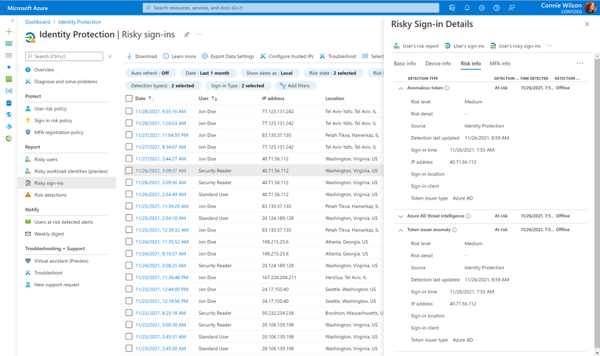

# ID の保護をより広範囲に

こんにちは、Azure Identity サポート チームの 高田 です。

本記事は、2021 年 11 月 29 日に米国の Azure Active Directory Identity Blog で公開された [AMore coverage to protect your identities](https://techcommunity.microsoft.com/t5/azure-active-directory-identity/more-coverage-to-protect-your-identities/ba-p/2365685) を意訳したものになります。ご不明点等ございましたらサポート チームまでお問い合わせください。

---

[Microsoft Ignite 2021](https://myignite.microsoft.com/sessions/fe5951da-9fa5-4e09-b529-007fff7a2add?source=sessions) では、激化する ID への攻撃から守るために、Microsoft がサイバー セキュリティのコミュニティとどのように協力してきたかを紹介しました。今回のブログ記事では、[Azure Active Directory (AD) Identity Protection](https://docs.microsoft.com/ja-jp/azure/active-directory/identity-protection/overview-identity-protection) と [条件付きアクセス](https://docs.microsoft.com/ja-jp/azure/active-directory/conditional-access/overview) について発表された ID セキュリティ機能について深く掘り下げてみたいと思います。これらの ID セキュリティ機能は以下のような機能を提供します。

- 新たな脅威の見える化 (Identity Protection におけるトークン窃取の検出)
- ほぼリアルタイムでの保護 (継続的なアクセス評価)
- ワークロード ID への保護の拡張 (ワークロード ID 用の条件付きアクセス)

## 新たな攻撃手段の検出: トークン窃取の検出

攻撃者はトークンを窃取して再利用し、被害をうけるリソースに継続的にアクセスしたり、取得済みの多要素認証のクレームを取得して高い権限を取得したりする場合が増えています。トークンの窃取は、主にマルウェアや MITM (Machine-In-The-Middle) のフィッシング攻撃によって行われています。攻撃者はユーザーやアプリなどの ID からトークンを盗むと、それを使って ID になりすまし、データを盗むことができます。

Ignite では、トークンの再利用について管理者に警告する **2 つの新しい検出機能** の一般提供を発表しました。それぞれ「**異常なトークン**」と「**セッション クッキーの通常とは異なるサインイン プロパティ**」です。これらの新しい検出機能は、トークン内のクレーム、トークンが発行されてからの時間、およびその他の認証属性に異常がないかを確認します。これらのリスクが検出された場合、まずはユーザーのアクティブなトークンを失効させ、トークンがどのように盗まれたかを評価し、マルウェアが存在する場合はそれを除去するまでユーザーのアクセスをブロックするようご対応ください。アクティブなトークンの失効については、Revoke-AzureADUserAllRefreshToken の PowerShell コマンドレットを使用いただけます。

トークン再利用の検知と防止に加えて、トークンの窃取を検知して対応する機能を開発しています。次の検知機能である **トークン発行者の異常** は、攻撃者がトークンを自由に発行できてしまう、侵害されたオンプレミスの SAML ID プロバイダーを特定するための最初の取り組みとなります。この検出結果を調査した結果、攻撃があったと判断した場合は次のことを行うようお勧めします。

- 署名証明書の不正使用の原因を特定し排除する。
- すべての [SAML トークン署名証明書](https://docs.microsoft.com/ja-jp/azure/active-directory/manage-apps/manage-certificates-for-federated-single-sign-on) を入れ替える。
- Revoke-AzureADUserAllRefreshToken の PowerShell コマンドレットを使用してアクティブなトークンを取り消す。
- AD FS を使用している場合は、[AD FS と Web Application Proxy の安全性を確保するためのベスト プラクティス](https://docs.microsoft.com/ja-jp/windows-server/identity/ad-fs/deployment/best-practices-securing-ad-fs) を確認する。
- [https://aka.ms/protectm365](https://aka.ms/protectm365) に基づきオンプレミスの SAML 信頼への依存度を減らす。
- [HSM を使用して SAML トークン署名証明書を管理](https://docs.microsoft.com/ja-jp/azure/dedicated-hsm/faq) する。

## ほぼリアルタイムでのポリシー適用: 継続的なアクセス評価

新しい検知機能は、セッションや更新トークンが悪意を持って再利用された際の検知に有効です。しかし、認証プロトコルでは、トークンをチェックするのはそれらが更新されたときのみです (アクセス トークンの場合、通常 1 時間に 1 回程度)。つまり、ユーザーやポリシーの状態の変化を検知するには、更新間隔の時間分だけ遅れてしまうのです。[継続的なアクセス評価 (CAE)](https://docs.microsoft.com/ja-jp/azure/active-directory/conditional-access/concept-continuous-access-evaluation) は、Azure AD がアプリとのやり取りを維持して、そのギャップを解消するための仕組みです。CAE は、ユーザーのサインインがブロックされたり、信頼できない場所に移動したり、ユーザーのリスクが検出されたりするなど、条件の変化にリスクが生じた場合に、リアルタイムでアクセスを取り消すことができます。

例えば、CAE を有効にして、信頼できない IP 範囲やマルウェアに感染したデバイスをブロックするように条件付きアクセス ポリシーを構成することができます。これを有効にすると、信頼できる IP 範囲にある感染したデバイスから盗まれたトークンは、信頼できる範囲外で再利用されると拒否されます (悪意があると想定されるため)。このようなことが起こる前であっても、トークンを盗んでいるマルウェアが検出された場合、トークンを無効にすることができます。CAE と Identity Protection が連携することで、定義した条件以外でのトークンの再利用をブロックし、トークンの再利用が試みられた場合には、それを検知して自動的に修復します。CAE は、**2021 年末までに一般提供** を開始する予定です。それ以降は、CAE の構成を何も変更していない場合は、デフォルトで CAE が有効になります (何か構成を変更している場合は、その設定が尊重されます)。それまでは、条件付きアクセス配下の設定で CAE の構成を変更することができます。

## 保護の範囲をさらに拡大: ワークロード ID 用の条件付きアクセス

洗練され、組織的で様々な手法を組み合わせた攻撃が増加しています。そのため、すべての企業や組織にとって、[ゼロ トラスト戦略](https://docs.microsoft.com/ja-jp/security/zero-trust/) が必須となっています。ゼロ トラストの中核となるのが、Azure AD 条件付きアクセスであり、この機能ではすべての ID に対して明示的に検証を行います。人間の ID を保護するだけでなく、アプリやサービス プリンシパルなどのワークロード ID を用いたアプリのみの認証も保護するように、条件付きアクセスの機能を拡張しています。環境内のワークロード ID を保護することは、悪意のある人物がこれらの ID を侵害および使用して環境にアクセスすることを防ぐために重要です。

[ワークロード ID 用の条件付きアクセス](https://docs.microsoft.com/ja-jp/azure/active-directory/conditional-access/workload-identity) では、信頼できるネットワーク外からの認証をブロックすることで、サービス プリンシパルの不正使用を防ぐことができます。ワークロード ID のための条件付きアクセスは、現在パブリック プレビュー中です。

Microsoft Ignite 2021 をお楽しみいただけておりましたら幸いです。質問やコメントがありましたら、お声がけください。皆様からのフィードバックをお待ちしております。
