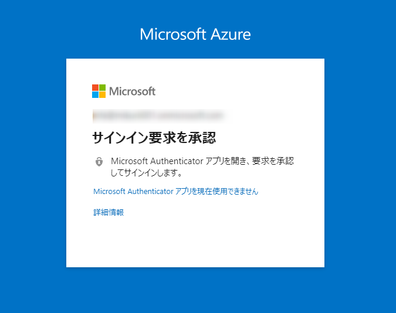
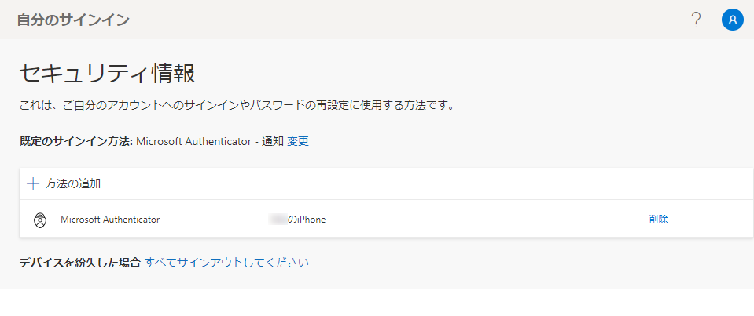
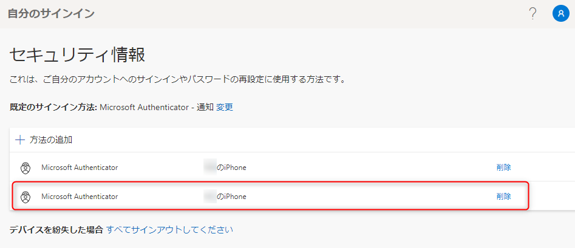
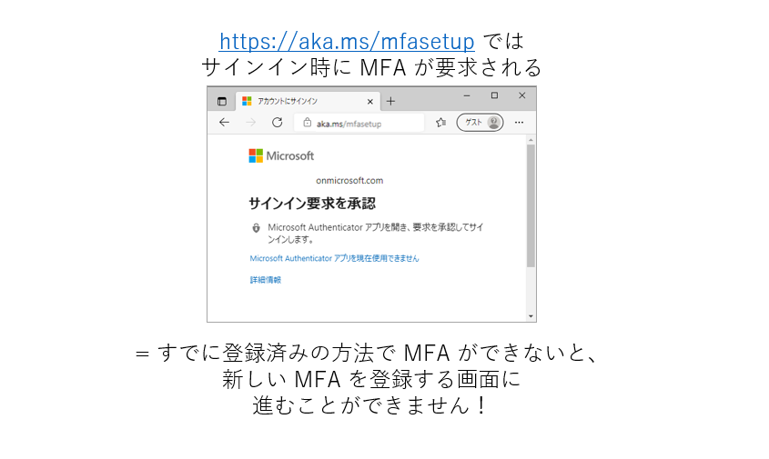

# スマホを替える時は、Microsoft Authenticator の移行を忘れないでください！

> [!NOTE]
> 検索キーワード : Offce 365 / Microsoft 365 / Azure AD / Azure Active Directory / Multi Factor Authentication / MFA / 多要素認証 / 変更 / 買い替え / Microsoft Authenticator / アカウント / ロックアウト / サインインできない / ログインできない / サインイン要求を承認

こんにちは。Azure Identity チームの栗井です。

Microsoft のクラウド サービスを利用しているすべての人々にお願いです。**スマートフォンを替える時は、Microsoft Authenticator (以下 MS Authenticator) の移行を忘れないでください！** 

※ 加えて、末尾の **まとめ : スマートフォン移行にあたっての注意点** に記載の注意事項も一読ください。

## よくあるお問い合わせ
「スマートフォンを替えたところ、下記画面で要求される多要素認証 (以下 MFA) を完了することができなくなってしまいました。
おそらく、以前のスマートフォン宛に要求が送信されているのだと思います。どうやったら新しい端末で MFA ができるようになりますか？」

## 原則 : 古い端末を破棄する前に、かならず新しい端末への移行作業をしてください
新しい端末への移行作業を忘れていると、MFA を完了できずに、Office 365 や Azure ポータルなどに入れなくなってしまう恐れがあります。そのため、新しい端末に移行する際は、すみやかに MS Authenticator の移行を実施ください。

移行作業の大まかな手順は下記の通りです。

### MS Authenticator の移行方法
1. 任意の端末 (PC 端末が見やすいです) で https://aka.ms/mfasetup にアクセスします。
 
2. 登録済みの MFA の方法一覧が表示されます。
   
   
3. [+ 方法の追加] を押下します。画面の指示に従って、新しいスマートフォンの MS Authenticator をセットアップします。
   
   
4. 新しいスマートフォンが一覧に追加されます。
   

5. 以前のスマートフォンは不要になったら、上記の一覧から削除しましょう。

## もし移行作業を忘れてしまったら ?

移行作業を忘れたまま以前の端末をリセット・破棄してしまった場合、前述の <MS Authenticator の移行方法> が実施できません。なぜなら https://aka.ms/mfasetup にサインインする際に、既存の方法による MFA が要求されるためです。

このような場合の回避策は下記の通りです。

- 回避策 1 : MS Authenticator 以外の方法 (SMS、音声通話 等) で MFA を完了
  
  MS Authenticator 以外の方法で MFA が可能な場合、https://aka.ms/mfasetup へ問題なくアクセスが可能です。前述の <MS Authenticator の移行方法> の手順でご対応ください。

  

- 回避策 2 : 社内の管理者に依頼して、MFA のリセットを依頼
  
  管理者アカウントを持つユーザーに、自身の MFA をリセットしてもらうよう依頼してください。

- 回避策 3 (最終手段) : マイクロソフトに MFA の一時解除を依頼
  
  回避策 1 と 2 の両方が実施不可能な場合、具体的には下記のすべてを満たすような場合には、お客様側での対処策が無く、マイクロソフトのデータセンター側での対応が必要になります。対応完了には数営業日いただくことになりますので、予めご了承ください。
  - MS Authenticator 以外の方法での MFA が構成されていない
  - テナント唯一の全体管理者
  - Azure ポータルにアクセスする際にも MFA が求められる

各回避策の詳細については [別記事 「MFA 認証方法を、変更 / 再登録 / 追加 したい！」](https://jpazureid.github.io/blog/azure-active-directory/change-mfa-verification-method/) をご確認ください。

## まとめ : スマートフォン移行にあたっての注意点

上記の内容をふまえて、下記の 3 つの注意事項にご留意ください。

1. 【最重要】 スマートフォンを買い替える時は、MS Authenticator の移行を忘れないでください！

2. MFA の方法は、あらかじめ複数登録しておくと安心です
   - もし MS Authenticator の移行を忘れてしまった場合でも、SMS 等による MFA が可能であれば、前述の回避策がご利用いただけます。
 
3. 【管理者向け】テナントに、複数の管理者を用意しておきましょう。
   - 上記の 1 と 2 が満たされていない場合でも、管理者のアカウントによって、当該ユーザーの MFA をリセットすることができるためです。なお、管理者自身が MS Authenticator の移行を忘れてしまった時のために、管理者は複数いることが望ましいです。

## 関連情報
- [MFA 認証方法を、変更 / 再登録 / 追加 したい！ | Azure AD サポート チーム ブログ](https://jpazureid.github.io/blog/azure-active-directory/change-mfa-verification-method/)
- [Azure AD Multi-Factor Authentication | Microsoft Docs](https://docs.microsoft.com/ja-jp/azure/active-directory/authentication/concept-mfa-howitworks)
- [Azure AD Multi-Factor Authentication の機能とライセンス | Microsoft Docs](https://docs.microsoft.com/ja-jp/azure/active-directory/authentication/concept-mfa-licensing)

## 編集後記
ありがたいことに、昨今では数多くの組織・学校のお客様によって、多要素認証 (MFA) を導入のうえ、MS Authenticator をご活用いただいております。

一方で、**スマートフォンを替える場合、MS Authenticator の移行が必要である**という事実は、まだあまり多くのユーザーの方にご認識いただけていない現状があります。

MS Authenticator の移行を忘れて、各種サービスにアクセスできなくなってしまうことによる業務影響は、お客様によってはかなり深刻です。大事なプレゼンテーションの直前に PowerPoint が開けなくなってしまったら ? 取引先に緊急の連絡が必要なのに、Outlook に入れなくなってしまったら ?

怖がらせるような例ばかりを並べてしまってすみません。しかしいずれも起こりうることです。

「そのようなリスクがあるのなら、MFA 自体を無効化してしまおう !」、そう考える管理者の方いらっしゃるかもしれません。しかしこれは、セキュリティ性を大きく損ねることになるので、お勧めすることができません。
ベスト プラクティスは MFA を利用しつつ、ユーザーの方には前述の「まとめ : スマートフォン移行にあたっての注意点」にご留意いただくことです。

そのため、もしこのブログ記事を読んでくださっている方の中で、社内の情報システム部門の方がいらっしゃれば、社内ポータルや配布資料などに、このブログ記事の URL をご記載いただけますと嬉しいです。

本記事の Twitter や facebook 等の SNS へのシェアも大歓迎です。[Microsoft Azure のフィードバックサイト](https://feedback.azure.com/d365community/) へのご意見もお待ちしております。

**スマートフォンを替える場合、MS Authenticator の移行が必要である** ということを、もっと多くのご利用者の方にご認識いただけるよう、弊社としても引き続き情報発信を進めて参ります。
