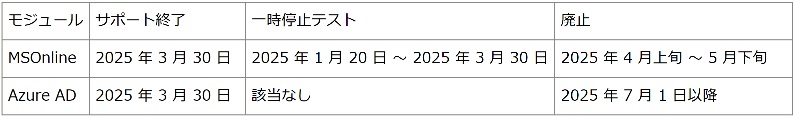

# MSOnline および AzureAD PowerShell の廃止 - 2025 年の情報とリソース

こんにちは、Azure Identity サポート チームの 名取 です。

本記事は、2025 年 1 月 14 日に米国の Microsoft Entra Blog で公開された [Action required: MSOnline and AzureAD PowerShell retirement - 2025 info and resources](https://techcommunity.microsoft.com/blog/identity/action-required-msonline-and-azuread-powershell-retirement---2025-info-and-resou/4364991) を意訳したものになります。ご不明点等ございましたらサポート チームまでお問い合わせください。

----

## MSOnline PowerShell の廃止は 2025 年 4 月に始まりますのでスケジュールと必要な対応について確認ください。

Microsoft Entra の [新着情報](https://entra.microsoft.com/#view/Microsoft_AAD_IAM/ChangeManagementHubList.ReactView) や以前の [ブログ](https://jpazureid.github.io/blog/azure-active-directory/important-update-deprecation-of-azure-ad-powershell-and-msonline/
) 更新でお知らせいたしました通り、MSOnline と Microsoft AzureAD PowerShell モジュールは 2024 年 3 月 30 日に非推奨となりました。MSOnline PowerShell モジュールの廃止は 2025 年 4 月初旬に始まり、2025 年 5 月下旬に完了します。この日程以降の影響を避けるために、MSOnline の使用を [Microsoft Graph PowerShell SDK](https://learn.microsoft.com/en-us/powershell/microsoftgraph/installation?view=graph-powershell-1.0) または現在プレビュー中の [Microsoft Entra PowerShell](https://learn.microsoft.com/en-us/powershell/entra-powershell/installation?view=entra-powershell&tabs=powershell&pivots=windows) に移行する必要があります。

## 主なポイント

- MSOnline PowerShell は 2025 年 4 月初旬から 5 月下旬の間に廃止され、使用できなくなります。
- AzureAD PowerShell は 2025 年 3 月 30 日以降サポートされなくなりますが、廃止は 2025 年 7 月 1 日以降に行われます。サポート終了と廃止時期に差があるのは、MSOnline PowerShell の移行を完了するための時間をお客様に確保いただくためです。
- MSOnline PowerShell の廃止に備えるため、2025 年 1 月から 3 月の間にすべてのテナントで繰り返し一時的な停止テストが実施されます。

MSOnline の使用を [Microsoft Graph PowerShell SDK](https://learn.microsoft.com/en-us/powershell/microsoftgraph/installation?view=graph-powershell-1.0) または [Microsoft Entra PowerShell](https://learn.microsoft.com/en-us/powershell/entra-powershell/installation?view=entra-powershell&tabs=powershell&pivots=windows) にできるだけ早く移行することを計画ください。MSOnline PowerShell からの移行が完了した後は、AzureAD PowerShell からの移行に取り組むようご対応ください。

## タイムラインの概要

## MSOnline PowerShell

セキュリティへの継続的な取り組みの一環として、MSOnline PowerShell の廃止が先行して 2025 年 4 月初旬から 5 月下旬の間に行われます。廃止されると、MSOnline PowerShell は使用できなくなります。

この廃止に備えるため、2025 年 1 月から 3 月の間に繰り返し一時的にサービス停止が実施されます。これらの一時停止中は、MSOnline のコマンドレットの使用が禁止されている旨のメッセージが表示され、コマンドレットを使用できなくなります。これらの一時停止の予定は以下の通りです:

- 2025 年 1 月 20 日から 2 月 28 日の間に、各テナントで 3 ～ 8 時間の一時停止が少なくとも 2 回発生します。これらは異なる時間帯に行われます。
- 2025 年 3 月中には、すべてのテナントが MSOnline PowerShell の廃止準備のために、より長時間にわたり一時停止が生じます。

これらの一時停止の後は機能が復旧し、MSOnline PowerShell の移行に引き続き取り組んでいただけます。

## AzureAD PowerShell 

AzureAD PowerShell の廃止に関する通知は 2025 年 3 月 30 日に終了します。この日以降、メンテナンスやサポートは行われません。お客様が MSOnline からの移行に集中できるようにするため、AzureAD PowerShell の廃止は 2025 年第 3 四半期を目標としています。
  
## 今後も最新情報にお気を付けください

このブログ記事は 2025 年を通じて定期的に更新され、これらの廃止に関する最新情報をお届けする予定です。お客様テナントに影響が生じる場合は、可能な限り、[Microsoft 365 メッセージセンター](https://learn.microsoft.com/en-us/microsoft-365/admin/manage/message-center?view=o365-worldwide) や Microsoft Entra 管理センターの通知を通じて情報をお知らせします。

## テナントでの MSOnline と AzureAD PowerShell モジュールの使用を確認する

### サインインログ

Microsoft Entra のサインイン ログを使用して、MSOnline および AzureAD PowerShell からのログインを識別できます。これらのログ イベントでは、PowerShell セッションのクライアントとユーザーに関する情報を確認可能です。以下が手順になります。

1. Microsoft Entra 管理センターに移動します。
2. [ID] を展開し、[さらに表示] をクリックします。
3. [監視と正常性]で、[サインイン ログ]を選択します。
4. [ユーザーのサインイン (非対話型)] タブを選択し、[フィルターの追加] をクリックしてフィル度の選択画面を起動します。
5. [アプリケーション］を選択し、［適用］をクリックします。
6. [アプリケーション] の入力項目に Azure Active Directory PowerShell と入力し、[適用] をクリックします。
7. [ユーザーのサインイン (対話型)] のログについても、以下の手順を繰り返します。

MSOnline PowerShell と AzureAD PowerShell の両方のサインイン イベントが、アプリケーション名 Azure Active Directory PowerShell で表示されます。 

### Entra の推奨事項

AzureAD PowerShell の利用状況についての追加情報は、[Microsoft Entra の推奨事項](https://learn.microsoft.com/entra/identity/monitoring-health/recommendation-migrate-to-microsoft-graph-api) にある「Azure AD Graph API の廃止に伴うサービス プリンシパルの Microsoft Graph への移行」に記載されています。この推奨事項には、Microsoft Entra 管理センターの [ID] > [概要] > [推奨事項] からアクセスできます。

Kristopher Bash
Product Manager, Microsoft Graph 
[LinkedIn](https://www.linkedin.com/in/kristopher-bash-aa3224133/)
