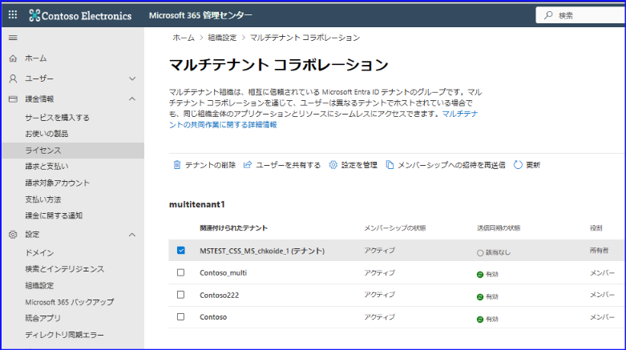

# マルチテナント組織 (MTO) が一般公開されました！

こんにちは。 Azure ID チームの小出です。

本記事は 2024 年 4 月 25 日に米国の Microsoft Entra (Azure AD) Blog で公開された [Collaborate across M365 tenants with Entra ID multi-tenant organization](https://techcommunity.microsoft.com/t5/microsoft-entra-blog/collaborate-across-m365-tenants-with-entra-id-multi-tenant/ba-p/4120309) と、Microsoft 365 側にて公開された  [Multi-tenant organization capabilities now available in Microsoft 365](https://techcommunity.microsoft.com/t5/microsoft-365-blog/multi-tenant-organization-capabilities-now-available-in/ba-p/4122812) をもとに、日本語に分かりやすくおまとめしなおしたものになります。ご不明点等ございましたらサポート チームまでお問い合わせください。

---

## マルチテナント組織 (MTO) が一般公開されました！

Microsoft Entra ID には、これまでも B2B コラボレーションやクロステナント アクセス設定、テナント間同期など、外部のテナントのユーザーとコラボレーションするにあたり様々な機能を用意してきました。

上記の機能はすでに多くのお客様にご利用いただいていますが、これらの機能を活用しても、たとえば会社の買収や合併など、複数のテナントとコラボレーションするにあたってはそれぞれ設定を行う必要がありコストや手間がかかっていました。テナントがバラバラだと、管理者が複数のテナントを管理しつつ、各テナントのユーザーがコラボレーションに必要なリソースにアクセスできるように適切に構成する必要があるからです。

マルチテナント組織は、複数のテナントを「マルチテナント組織 (MTO)」という組織にまとめてグループ化します。クロステナント アクセス設定やテナント間同期のように 1:1 の関係性ではなく、下記のように複数のテナントと関係性を持てるイメージです。

マルチ テナント組織 (MTO) を構成すると、Microsoft Teams ではテナントをまたがる統一チャットを、Viva Engageではテナントをまたがるシームレスな従業員エンゲージメントとコミュニティ体験を実現できます。ほかにも、この MTO の機能を使うと、以下５つのことが実現できます。５つの詳細は [こちらの英語のブログ](https://techcommunity.microsoft.com/t5/microsoft-365-blog/multi-tenant-organization-capabilities-now-available-in/ba-p/4122812) にて画面ショット付きで紹介しておりますので、ぜひご利用ください。

- 改善された人名検索により、統一された方法で同僚を検索できます。検索の際に返す結果が統一され、簡単に目的の同僚とつながれます。
- 会議ロビーの障壁なく、テナントをまたいで通話、チャット、ミーティングに参加できます。会議コンテンツやコラボレーションツールにもリアルタイムでアクセスできるようになりました。 
- Viva Engage の機能を拡張し、テナント間でのアナウンスや、テナントの枠を超えたコミュニティ交流やキャンペーンへの参加ができるようになりました。   
- Microsoft Defender XDR では、テナントのビューを切り替えることなく、迅速なインシデント調査と高度な脅威ハンティングができるようになりました。
- マルチテナント組織の設定においては、Graph API や Microsoft 365 管理センターを用いて、設定の有効化やユーザー共有などの操作を簡単に行うことができます。

## マルチテナント 組織を使ってみよう！

ではさっそくマルチテナント組織を利用してみましょう。まずは例として利用方法を紹介します。今回の例では以下のような会社名や部門をもとに案内します。

### シナリオ

- 下記のような日本部門や北米部門とった形で、部門ごとに Microsoft Entra ID テナントを保有しています

    - Contoso Electronics 日本部門
    - Contoso Electronics 北米部門
    - Contoso Electronics 欧州部門

- どのテナントにいるユーザーもアプリ A を利用できるように、アプリを共有して利用している
- Teams と Viva Engage を使ってテナント間でコミュニケーションをとれるようにしたいので、マルチテナント組織を利用したい

### 前提条件

- マルチテナント組織 (MTO) の機能を利用するためには、Microsoft Entra ID P1 が必要です。マルチテナント全体で 1 ユーザーごとに 1 つの Microsoft Entra ID P1 ライセンスをご用意ください。
- マルチテナント組織 (MTO) は、一般の Azure 商用クラウドで利用できます。米国政府機関向けテナントや 中国向け 21vianet 環境などでは利用できません。
- マルチテナント組織の作成などにあたっては管理者ロールが必要です。グローバル管理者ロールのユーザーで操作ください。

### 前提知識

マルチテナント組織においては、組織を作成したテナントを「所有者」と呼び、作成された組織に参加しているテナントを「メンバー」と呼びます。このため、たとえば本社と支社が複数ある構成の企業の場合は、本社テナントで MTO を作成し、作成された MTO に支社テナントで参加するような構成とすると分かりやすいです。

### 手順

1. まずは、MTO の所有者となるテナントを決めます。上記シナリオの場合、Contoso Electronics には 3 つの部門があり、それぞれが Microsoft Entra テナントを保有していますので、４つのうちどのテナントが MTO の所有者となるのか決定します。たとえば今回は下記のような構成とすることにしました。

    - Contoso Electronics 日本部門（所有者）
    - Contoso Electronics 北米部門（メンバー）
    - Contoso Electronics 欧州部門（メンバー）

2. 所有者となるテナントで Microsoft 365 管理センターにアクセスし、[Microsoft 365 でマルチテナント組織を設定する](https://learn.microsoft.com/ja-jp/microsoft-365/enterprise/set-up-multi-tenant-org?view=o365-worldwide) の手順をもとにマルチテナント組織を作成します。その後、メンバーとなるテナントを追加します。

3. 所有者がテナントを MTO に追加すると、追加されたテナントの管理者は MTO への参加操作を実施できるようになります。今回の場合、メンバーとなる 2 つのテナントの管理者は、[Microsoft 365 でマルチテナント organization に参加または脱退する](https://learn.microsoft.com/ja-jp/microsoft-365/enterprise/join-leave-multi-tenant-org?view=o365-worldwide#join-an-existing-multitenant-organization) の手順をもとに、MTO に参加します。

4. 下記のように、所有者とメンバーのテナントの情報が表示されるようになるかご確認ください。MTO の参加操作が完了するまでには 4 時間ほどかかることがあるので、時間を空けて確認ください。

    

5. 各テナントが MTO に参加できたら、 MTO の構成自体は完了です。
6. その後、コラボレーションを行うためのユーザーの同期設定をすることもできます。既存のテナント間同期を活用することもできますが、上記画面の「ユーザーを共有する」から共有ができます。たとえば日本部門のテナントからユーザーを共有すると、MTO に所属しているすべてのテナント（北米および欧州テナントのすべて）に外部メンバーとしてアカウントが作成されます。M365 管理センター上に用意されている「ユーザーを共有する」機能を使うと、一度の設定で MTO に参加しているすべてのテナントにユーザーを同期してくれるため便利です。

なお、ユーザーの同期および共有については、サービスによって要件が異なります。

Microsoft Teams のコラボレーション体験の向上は、コラボレーションを行うテナント間での相互プロビジョニングに依存しています。つまり、Teams におけるコラボレーション機能を利用したい場合、たとえば Contoso Electronics 日本部門のユーザーが Contoso Electronics 北米部門のテナントのユーザーとコラボレーションする際においては以下の相互の招待が必要になります。  

- 日本部門のユーザーは北米部門のテナントに外部メンバー ユーザーとしてゲスト招待されている
- 北米部門のユーザーは日本部門のテナントに外部メンバー ユーザーとしてゲスト招待されている

Viva Engageによる従業員エンゲージメント体験の向上は、従業員の中央テナントへの集中プロビジョニングに依存しています。このため、新しい Viva Engage 機能を利用したい場合は、北米および欧州部門のユーザーは、中央テナントである日本部門のテナントに外部メンバー ユーザーとして招待されている必要があります。
 
ゲスト招待はテナント間同期を利用して個別に同期対象の構成などを実施することもできますが、上記 6 のように「ユーザーを共有する」ボタンから一気に MTO 所属テナントすべてに同期を行うことも可能です。MTO のユーザー共有も、裏側ではテナント間同期の機能が使用されておりますので動作としては同様です。MTO 側から操作すると、複数テナントに一度に同期してくれるため便利ですが、一方で、同期される属性や値のルールは事前に決められているため、テナント間同期を個別に利用する方が柔軟に対応できるという点もご認識ください。

ここまで実行すれば、あとはサービス側の要件を確認すれば、上記紹介した Teams や Viva Engage などの新しい機能を利用できます。新しい Teams クライアントの使用など、Microsoft Teams の要件は [こちらの公開情報](https://learn.microsoft.com/ja-jp/microsoft-365/enterprise/plan-multi-tenant-org-overview?view=o365-worldwide) に記載されています。Viva Engage の設定要件は [こちらの公開情報](https://learn.microsoft.com/ja-jp/Viva/engage/mto-setup) をご覧ください。

上記サービスごとの要件を満たしている状況であれば、 MTO を利用して、 Teams や Viva Engage の新しいエクスペリエンスを利用できますので、複数のテナントからなる組織全体でシームレスにコラボレーションできるようになります。マルチ テナント組織についてフィードバックがございましたら、[こちらのサイト](https://feedback.azure.com/d365community) よりお寄せください。
