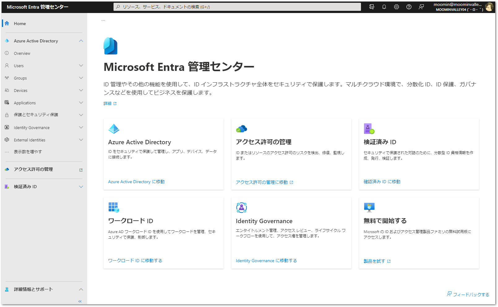

#  新しい管理センターにおける Azure AD および他の ID とアクセス製品の統合  

PR1

こんにちは、Azure Identity サポート チームの 竜 です。

本記事は、2022 年 12 月 1 日に米国の Azure Active Directory Identity Blog で公開された [New Admin Center Unifies Azure AD with Other Identity and Access Products](https://techcommunity.microsoft.com/t5/microsoft-entra-azure-ad-blog/new-admin-center-unifies-azure-ad-with-other-identity-and-access/ba-p/2792595) を意訳したものになります。

----

Microsoft の ID に関するビジョンは、従来の ID 管理を超えて、マルチクラウドやマルチプラットフォーム環境におけるすべての人、すべてのものへのアクセスを保護するツールセットをお客様に提供することです。今年初めには、[Microsoft Entra](https://www.microsoft.com/ja-jp/security/business/microsoft-entra) と新しい [Microsoft Entra 管理センター](https://entra.microsoft.com/)を発表し、このビジョンを大幅に前進させました。

Microsoft 365 および Azure Active Directory (Azure AD) のお客様を対象とした Entra 管理センターの段階的なロールアウトをお知らせします。今月から、多くのお客様の手元でも、Azure AD 管理センター ([aad.portal.azure.com](https://aad.portal.azure.com)) に代わり、Microsoft 365 から [entra.microsoft.com](https://entra.microsoft.com) に自動的に遷移され始めるようになります。

## Microsoft Entra の管理センターを知る

[Microsoft Entra の管理センター]((https://entra.microsoft.com/#home)) は、以下のような [Microsoft Entra](https://www.microsoft.com/ja-jp/security/business/microsoft-entra) の ID とアクセス ソリューションの全体像を可視化し管理機能を統合します。  

  **Azure AD**

  30 万以上の組織で使用されているマルチクラウドの ID およびアクセス管理ソリューションで、人々をアプリケーション、デバイス、データに結び付け、組織を保護します。

  **Microsoft Entra Permissions Management**

  クラウド基盤のエンタイトルメント管理 (CIEM: Cloud Infrastructure Entitlement Management) ソリューションにより、マルチクラウド インフラ全体の権限リスクを発見し、修復し、監視することができます。

  **Microsoft Entra Verified ID**

  プライバシーを尊重した非中央集権的な ID 資格情報の作成、発行および検証を行う ID 検証ソリューションで、あらゆる人や物事に対して、より安全なやり取りを実現することができます。

  **Microsoft Entra ワークロード ID**

  アプリケーションやサービスなどのデジタル ワークロードの ID を管理し、保護することができます。リスクベースのポリシーと最小特権アクセスの実施により、クラウド リソースへのアクセスを制御します。

  **Microsoft Entra Identity Governance**

  オンプレミスおよびクラウド ベースのユーザー ディレクトリにまたがる完全なソリューションにより、運用を簡素化すること、規制要件を満たすこと、および複数の個別ソリューション (特定の個別事象を解消するための機能) を統合することを実現します。

2023 年には、Microsoft Entra 管理センターを通じて、さらに多くの機能が提供される予定です。

## Azure AD はどうなるのでしょうか？

Microsoft Entra の管理センターから、Azure AD の管理タスクをすべて完了させることができます。Azure AD 管理センターにある機能は、すべて、Entra 管理センターの左パネル内の [Azure AD] タブから引き続き利用できます。また、Entra 管理センターにあるリンクから、Azure AD 管理センターに戻ることができます。

Azure AD は、Azure AD アプリケーション ギャラリー、多要素認証、パスワードレスなどご好評いただいている機能により、従業員、顧客、パートナーのアクセスを保護するための基本的なソリューションを提供し続けています。[Microsoft は、2022 年に Gartner® Magic Quadrant™ for Access Management にて 6 年連続でリーダーに選ばれており](https://www.microsoft.com/en-us/security/blog/?p=124436)、認証、回復性、条件付きアクセスの分野で [日々進化を続けて](https://techcommunity.microsoft.com/t5/microsoft-entra-azure-ad-blog/bg-p/Identity) います。

## Microsoft Entra 管理センターへの移行を準備する

管理画面に継続してアクセスできるよう、組織は必要に応じて、ファイアウォール ルールを更新する必要があります。

Microsoft Entra の管理センターは、本日より [entra.microsoft.com](https://entra.microsoft.com) で利用できますので、完全移行に向けてぜひご活用ください。

[管理センター](https://entra.microsoft.com/) から、ご意見をお寄せいただけるのをお待ちしております。

Kristina Hotz, Principal Manager of Product Management
