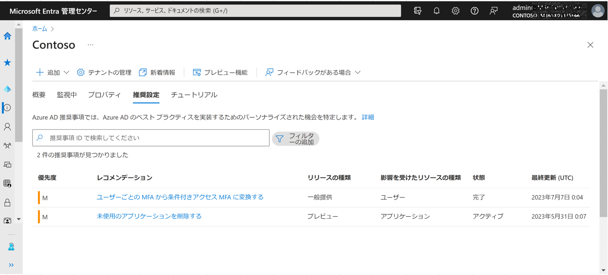

# Microsoft Entra ワークロード ID の新しい App Health 推奨機能

こんにちは、Azure Identity サポート チームの 名取 です。

本記事は、2023 年 6 月 29 日に米国の Azure Active Directory Identity Blog で公開された [New App Health Recommendations in Microsoft Entra Workload Identities](https://techcommunity.microsoft.com/t5/microsoft-entra-azure-ad-blog/new-app-health-recommendations-in-microsoft-entra-workload/ba-p/2959984) を意訳したものになります。ご不明点等ございましたらサポート チームまでお問い合わせください。

---

先日、弊社では [2023 年クラウドにおけるアクセス許可のリスク状態](https://query.prod.cms.rt.microsoft.com/cms/api/am/binary/RW10qzO) のレポートを発表し、クラウド環境の拡大だけでなく、重要なクラウド リソースにアクセスする ID の種類の増加に関して非常に興味深い調査結果を公表しました。このレポートでは、ワークロード ID のセキュリティ保護がこれまで以上に重要になっている理由について興味深い調査結果が明らかにされています:

- ワークロード ID は、人間の ID を 10:1 で上回り、2021 年の 2 倍になりました。この大幅な増加により、新たなセキュリティ リスクが生じています。
- ワークロード ID の 80% 以上が非アクティブであり、2021 年に報告された割合の 2 倍となっています。
- ワークロード ID は付与されたアクセス許可の 5% 未満しか使用していません。
- ワークロード ID の約 70% が機密データにアクセスできます。

膨大な数の非アクティブなワークロード ID と資格情報が存在するということは、特にその多くが高いアクセス許可を持っており、クラウド全体で動作していることを考えると、大幅なリスク軽減の機会となります。非アクティブな ID や古い認証情報は侵害のターゲットになりやすく、通常は削除しても影響はありませんが、資格情報の有効期限が切れると障害がにつながる可能性もあります。

Kuppinger Cole のホワイトペーパー[Securing Non-Human Identities](https://www.kuppingercole.com/reprints/cb05bfdbbdb25b6535a42835b77465e2#heading1) によると、直近での大きな変化は、ワークロード ID を含む人間以外の ID の数と種類が急速に増加していることです。ビジネス リスク、セキュリティ リスク、コンプライアンス リスクにさらされないように、適切に ID を管理することはますます難しくなっています。

人間以外の ID に関する新たな問題を解決するために、[2022 年 11 月に Microsoft Entra Workload Identities](https://jpazureid.github.io/blog/azure-active-directory/managing-governing-and-securing-identities-for-apps-and-services/) を発表しました。これにより、企業はワークロード ID に対して条件付きアクセス、ID Protection、資格情報ポリシー、およびアクセス レビューを構成できるようになります。つまり、ユーザーとは異なる動作をしている可能性のあるワークロードのリスクを検出して修正することが可能になります。

どの ID に危険な構成があるのか​​、または完全に削除する必要があるのかどうか​​を容易に確認することが非常に重要になっています。そのため、Microsoft Entra ワークロード ID 内の新機能であるアプリの正常性に関する推奨事項をこの度発表いたします。

## App Health 推奨事項によるアプリの正常性強化

ワークロード ID の 80% 以上が非アクティブであるため、これらのアプリやサービスを可視化することは非常に重要です。Microsoft Entra ワークロード ID のアプリの正常性に関する推奨機能は、システム環境を保護し、推奨されるベスト プラクティスに従って障害を回避するのに役立つ知見と実用的なガイダンスを提供します。例えば、30 日以上使用されていないアプリケーションへの対処、未使用のアプリケーションの資格情報の削除、期限切れが近い資格情報の更新などです。

未使用のアプリケーションおよび未使用のアプリケーション認証情報を削除することで、ワークロード ID 全体のセキュリティ体制が向上し、良好な ID の状態が実現されます。これにより、攻撃者が未使用のアプリケーションを発見して悪用するなどの侵害のリスクが軽減されます。未使用の ID に付与されたアクセス許可によっては、組織の機密データの漏洩につながったり、攻撃者がより攻撃の幅を広げてしまう可能性があります。

## 推奨事項とその対処方法

これらの新機能は、[Azure AD の推奨事項](https://learn.microsoft.com/azure/active-directory/reports-monitoring/overview-recommendations) で利用可能です。各推奨事項には、問題の説明、アクションを実行する利点、段階的な改善手順を含むアクション プランが含まれています。Microsoft Entra ワークロード ID の一部として最初に提供される、3 つのアプリの正常性に関する推奨事項は次のとおりです:

1. 未使用のアプリケーション
2. 未使用のアプリケーション資格情報
3. 期限切れのアプリケーション資格情報

推奨事項の **状態** は、手動かシステムによって自動で更新されます。すべてのリソースがアクション プランに従って対処されると、その次に推奨事項のサービスが実行されるときに、推奨事項のステータスが自動的に「完了」に変わります。

上記画面を確認し、最善の対応を行うには、以下の手順を実施ください:

　1. Microsoft Entra 管理センター > Azure AD > [概要] に移動し、[推奨設定] を選択します。
　2. リストから推奨事項を選択すると、詳細、状態、アクション プランが表示されます。
　3. アクション プランに従い操作を行います。
　4. 該当する場合は、推奨事項内のリソースのステータスをクリックし、[次としてマーク] を選択してステータスを選択します。

 Microsoft Graph を使用してアプリの正常性に関する推奨事項を操作したい場合は、[こちらのドキュメント](https://learn.microsoft.com/en-us/azure/active-directory/reports-monitoring/howto-use-recommendations?toc=%2Fazure%2Factive-directory%2Fworkload-identities%2Ftoc.json&bc=%2Fazure%2Factive-directory%2Fworkload-identities%2Fbreadcrumb%2Ftoc.json) を参照ください。

## アプリの正常性に関する推奨事項を今すぐ試してベスト プラクティスを実施ください

クラウド基盤にアクセスするワークロード ID が増加し続ける中、企業が攻撃や停止のリスクを軽減するために、セキュリティ体制を見直すことが重要です。

**参考情報:**

- 人間以外の ID、アクセス許可のリスクについて詳しく知り、Microsoft Entra ワークロード ID と Permissions Management の概要を把握するには、この [Kuppinger Cole whitepaper](https://www.kuppingercole.com/reprints/cb05bfdbbdb25b6535a42835b77465e2#heading1) と [2023 年のクラウド アクセス許可リスクの状況レポート](https://query.prod.cms.rt.microsoft.com/cms/api/am/binary/RW10qzO) を参照ください。
- Microsoft Entra のワークロード ID のベスト プラクティスの詳細については、以下を参照ください:
  - [ワークロード ID をセキュリティで保護する](https://learn.microsoft.com/ja-jp/azure/active-directory/identity-protection/concept-workload-identity-risk)
  - [ゼロ トラストの原則を使用してアプリケーションのセキュリティを強化する](https://learn.microsoft.com/ja-jp/azure/active-directory/develop/zero-trust-for-developers)
  - [Azure Active Directory でのアプリケーション プロパティのセキュリティに関するベスト プラクティス](https://learn.microsoft.com/ja-jp/azure/active-directory/develop/security-best-practices-for-app-registration)
