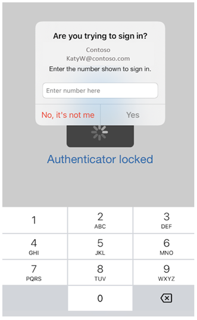
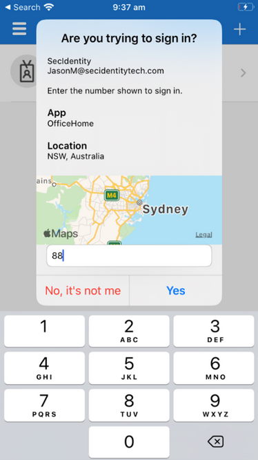
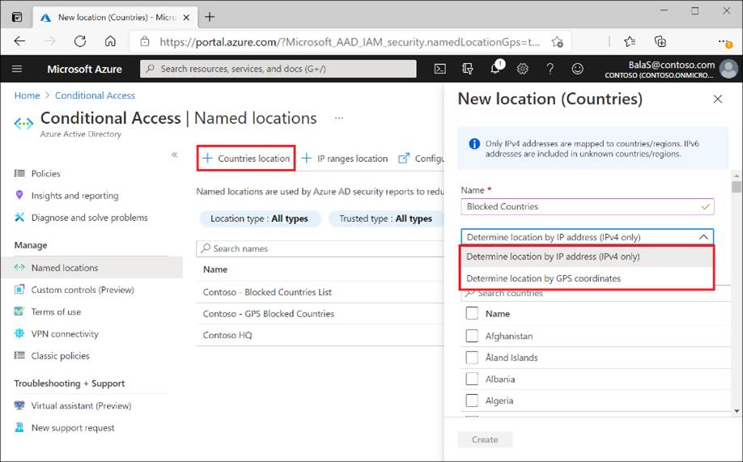
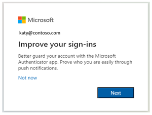

こんにちは、Azure Identity サポート チームの中井です。

本記事は、2021 年 11 月 18 日に米国の Azure Active Directory Identity Blog で公開された [New Microsoft Authenticator security features are now available!](https://techcommunity.microsoft.com/t5/azure-active-directory-identity/new-microsoft-authenticator-security-features-are-now-available/ba-p/2464386) を意訳したものになります。ご不明点等ございましたらサポート チームまでお問い合わせください。

----

# Microsoft Authenticator の新たなセキュリティ機能が利用可能となりました！

皆さん、こんにちは。

昨年、私たちは「[認証のための SMS や音声通話を使うのはそろそろやめよう](https://techcommunity.microsoft.com/t5/azure-active-directory-identity/it-s-time-to-hang-up-on-phone-transports-for-authentication/ba-p/1751752)」(原題: "It's Time to Hang Up on Phone Transports for Authentication") という記事を公開しました。今日、弊社は Microsoft Authenticator をユーザーにとってより安全に、管理者にとってはより簡便に展開できるようにしました。

1. 管理者は Microsoft Authenticator において、番号照合や追加情報の提示により、誤った承認を防ぐことができるようになりました (パブリック プレビュー)。
2. 管理者は Microsoft Authenticator を使用して、GPS 位置情報に基づく条件付きアクセス ポリシーを設定することができるようになりました (一般提供)。
3. 管理者は「登録キャンペーン」機能を使用して、サインイン時に Microsoft Authenticator を設定するようユーザーに促すことができるようになりました (一般提供)。

これらの Microsoft Authenticator のセキュリティ アップグレードを是非お試しいただき、ご意見をお聞かせください。これら新機能の詳細については以下をご覧ください。

## Microsoft Authenticator で MFA を利用する際の番号照合 (パブリック プレビュー)

セキュリティを高め誤った承認を減らすために、管理者は Authenticator で MFA リクエストを承認する際に、サインイン画面に表示されている番号の入力をユーザーに要求することができます。

ユーザーに番号照合を利用させる方法については、[こちら](https://aka.ms/numbermatchdoc) をご覧ください。

## Microsoft Authenticator の承認リクエストにおける追加情報の提示 (パブリック プレビュー)

誤った承認を減らすためのもう一つの方法は、Authenticator の通知でユーザーに追加の情報を表示することです。この機能は、ユーザーがどのアプリケーションにサインインしているか、また IP アドレスに基づいてサインインしている場所を表示します。

ユーザーに追加の情報を表示する方法については、[こちら](https://aka.ms/additionalcontextdoc) をご覧ください。

## GPS ベースのネームド ロケーション (一般提供)

管理者は、条件付きアクセス ポリシーを使用して、Microsoft Authenticator の GPS を使用して、リソースへのアクセスを特定の国の境界内に制限できるようになりました。

この機能を有効にしたユーザーは、サインイン時に Microsoft Authenticator アプリを使用して GPS 位置情報を共有するよう求められます。GPS 位置情報の完全性を確保するため、デバイスが脱獄またはルート化されている場合、Microsoft Authenticator は認証を拒否します。

詳細については、[管理者向けドキュメント](https://docs.microsoft.com/ja-jp/azure/active-directory/conditional-access/location-condition)、[Graph API ドキュメント](https://docs.microsoft.com/ja-jp/graph/api/resources/countrynamedlocation?view=graph-rest-1.0)、[FAQページ](https://support.microsoft.com/en-us/account-billing/common-problems-with-the-microsoft-authenticator-app-12d283d1-bcef-4875-9ae5-ac360e2945dd) をご覧ください。

## Microsoft Authenticator 登録キャンペーン (一般提供)

Microsoft Authenticator 登録キャンペーンの機能を使用することで、ユーザーに Authenticator の設定を促し、安全性の低い SMS / 電話認証からの移行を促すことができます。この機能は、Microsoft Authenticator が有効でありながら設定されていないユーザーを対象としています。ユーザーは MFA サインインの完了後に Authenticator の設定を促され、設定後は既定の認証方法が Microsoft Authenticator アプリに変更されます。

ユーザーの登録キャンペーンを有効にする方法については、[こちら](https://docs.microsoft.com/ja-jp/azure/active-directory/authentication/how-to-mfa-registration-campaign)をご覧ください。

皆様からのご意見をお待ちしております。以下にコメントをお寄せいただくか、 aka.ms/AzureADFeedback までご連絡ください。

Alex Simons ([@Alex_A_Simons](https://twitter.com/Alex_A_Simons))
Corporate VP of Program Management
Microsoft Identity Division
