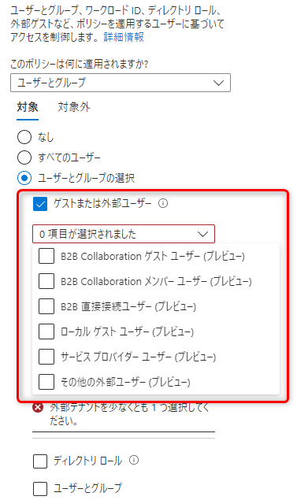

# CSP プログラムにおけるパートナーセンターから顧客テナントにアクセスする際の条件付きアクセス ポリシーについて - 「外部ユーザーの種類の指定」による解決方法

> [!NOTE]
> 本記事内では、顧客テナントに対して代理管理者権限を持つ、CSP パートナー テナントのアカウントを、「CSP アカウント」と記載します。

こんにちは。Azure & Identity サポート チームの栗井です。

今年 2022 年の 7 月に下記ブログ記事を公開していますが、このブログ記事のリンクをエンドの顧客に案内して問題が解決できた、等のとても嬉しいフィードバックをいただいています。
- [CSP プログラムにおけるパートナーセンターから顧客テナントにアクセスする際の条件付きアクセス ポリシーについて](https://jpazureid.github.io/blog/azure-active-directory/capolicy-for-csp-account/)

このブログ記事の趣旨は「顧客テナントで作成した条件付きアクセス ポリシーが、意図せず CSP パートナーのアカウントによるアクセスを阻害してしまう」という問題に対して、ポリシーの構成を工夫することでいかに回避するか ? という方法をご提案することでした。

ここで朗報です ! このたびプレビュー機能として公開された「外部ユーザーの種類の指定 (仮称)」では、 CSP アカウントを条件付きアクセス ポリシーの対象・対象外として指定するためのオプションが登場しました。このオプションは「CSP アカウント "のみ" をポリシーの対象外にしたい」というご要望に対して過不足のない解決方法であり、かつ、設定方法はとても簡単です。

おかげさまで前述のブログ記事は、公開からほんの 3 ヶ月過ぎであるにもかかわらず、その役目を引退してもらうこととなりそうです (気合いを入れて執筆した自信作なのですが)。

## 前提 : 条件付きアクセス ポリシーが CSP アカウントをブロックしてしまう問題について
詳細については、[前述のブログ記事](https://jpazureid.github.io/blog/azure-active-directory/capolicy-for-csp-account/)を参照ください。本記事では概要のみご紹介します。

CSP パートナー テナントに所属するアカウントは、代理管理者権限を持つ場合、パートナー センター (https://partner.microsoft.com) 経由で、リセラー関係を結ぶ顧客のテナントに対しての特権アクセス (グローバル管理者相当) が可能です。

顧客テナントで有効化されている条件付きアクセス ポリシーにおいて、割り当て対象として "すべてのユーザー" もしくは "すべてのゲスト ユーザー" が選択されている場合、CSP アカウントによるアクセスに対してもポリシーが適用されます。

この動作が原因による「CSP アカウントによる顧客テナントへのアクセスが、意図せずブロックされてしまう」というご相談を、これまで多くの CSP パートナーから頂いていました。

## 解決策 : 外部ユーザーの種類の指定による、CSP アカウントに対してのポリシー適用を回避

### 新機能 : 外部ユーザーの種類の指定
現在、条件付きアクセス ポリシーのユーザー割り当て設定画面をご覧いただくと、"ゲストまたは外部ユーザー" 項目の真下に、下記の選択肢が表示されます。

  

上記はいずれも、ゲスト・外部ユーザーの種類を示します。これまでは "ゲストまたは外部ユーザー" という選択肢によって一括りにされていたのですが、より詳細な種類を指定したポリシーの構成が可能になりました。

それぞれの選択肢の説明については、[公開情報の記載 (現在英語版のみ)](https://learn.microsoft.com/en-us/azure/active-directory/external-identities/authentication-conditional-access#assigning-conditional-access-policies-to-external-user-types-preview) をご参照ください。

### "サービス プロバイダー ユーザー (プレビュー)" の選択による CSP アカウントの指定

**上記 6 つの選択肢のうち、"サービス プロバイダー ユーザー (プレビュー)" は、CSP アカウントによるアクセスを示します。**
この選択肢を利用することで、任意の条件付きアクセス ポリシーにおいて、CSP アカウントによるアクセスを割り当て対象外として明示的に指定することができます。

1. 顧客テナントにおいて、該当の条件付きアクセス ポリシーの設定画面を開きます。
2. [対象] > [ユーザーとグループ] を開きます。
3. [対象外] タブを開き、下記のように構成します。
   - "ゲストまたは外部ユーザー" にチェックマークを入れます。
   - "サービス プロバイダー ユーザー" にチェックマークを入れます。
     

4. ポリシーを保存します。

手順はたったのこれだけです。

2022 年 10 月末時点で、外部ユーザーの種類の指定は、プレビューの機能です。
プレビュー期間の終了後は、[CSP プログラムにおけるパートナーセンターから顧客テナントにアクセスする際の条件付きアクセス ポリシーについて](https://jpazureid.github.io/blog/azure-active-directory/capolicy-for-csp-account/) の一部内容を、本記事に統合をすることも検討中です。

上記内容が少しでも皆様の参考となりますと幸いです。ご不明な点がございましたら、弊社サポートまでお気軽にお問い合わせください。
