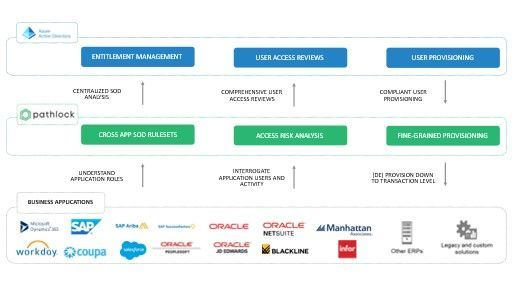
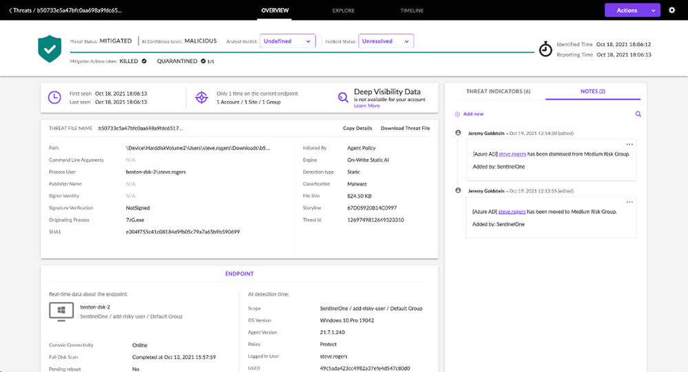
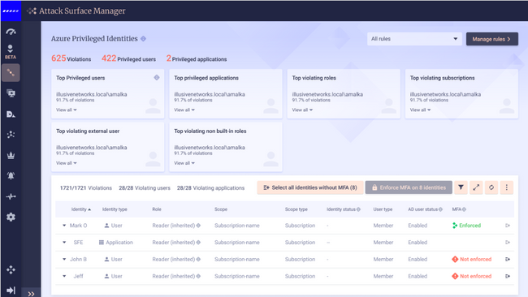
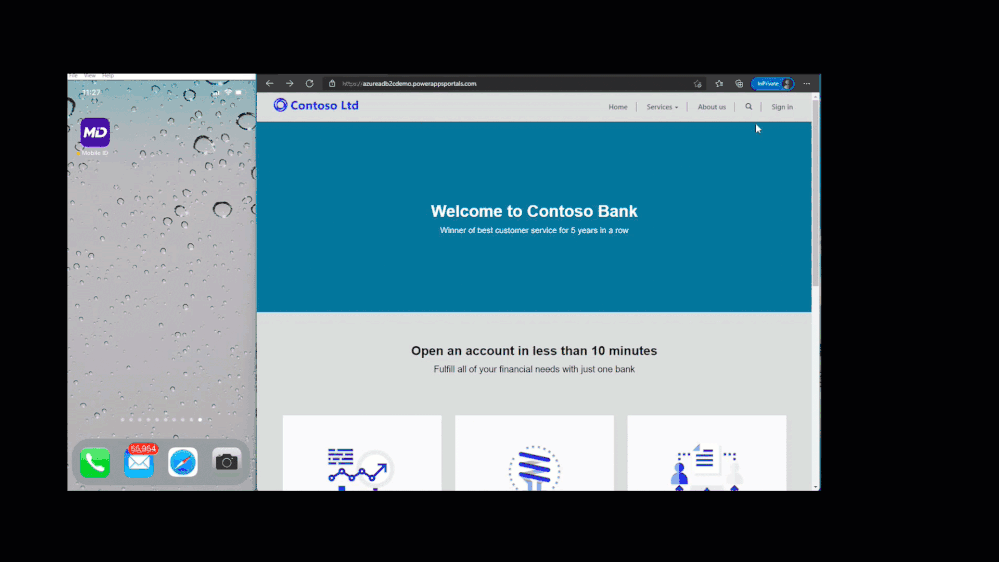
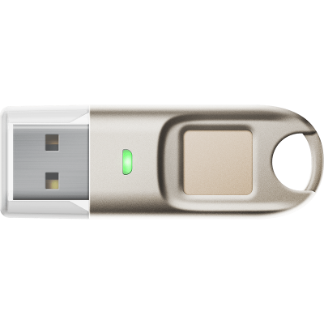
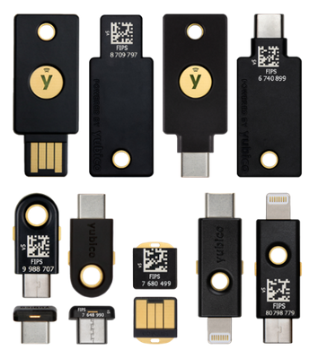

---
title: 新しい ID パートナーシップとの統合により、お客様のセキュリティを強化します
date: 2021-11-16 09:00
tags:
  - Azure AD
  - US Identity Blog
---

# 新しい ID パートナーシップとの統合によるお客様のセキュリティの強化

こんにちは、Azure Identity サポート チームの 村上 です。

本記事は、2021 年 11 月 3 日に米国の Azure Active Directory Identity Blog で公開された [New identity partnerships and integrations to strengthen your security](https://techcommunity.microsoft.com/t5/azure-active-directory-identity/new-identity-partnerships-and-integrations-to-strengthen-your/ba-p/2810629) を意訳したものになります。ご不明点等ございましたらサポート チームまでお問い合わせください。

---

今週の Microsoft Ignite では、お客様が様々なプラットフォームやクラウド間で耐障害性、安全性、生産性を向上できるようリリースした [最新のアイデンティティ イノベーション](https://techcommunity.microsoft.com/t5/azure-active-directory-identity/identity-at-ignite-strengthen-resilience-with-identity/ba-p/2747271) について紹介いたしました。今週初めに紹介した新しいイノベーションに加えて、私たちは Azure Active Directory (Azure AD) の機能を拡張するために、さまざまなテクノロジー パートナーと協力してきました。私たちは複数のパートナーと協力しアプリケーションを統合することで、シームレスなアクセスを提供し、お客様固有の環境でのセキュリティをより強化しています。現在利用可能な新しいパートナー統合機能については、以下をご覧ください。

## Azure AD アプリ ギャラリーで利用可能な新たな統合済みアプリ

Azure AD との統合において、私たちは独立系ソフトウェア ベンダー (ISVs) と密に提携し、Azure AD アプリ ギャラリーに統合済みのアプリを追加し続けています。7 月以降、[シングルサインオン（SSO）をサポートする 101 の新しいアプリ](https://docs.microsoft.com/ja-jp/azure/active-directory/fundamentals/whats-new#new-federated-apps-available-in-azure-ad-application-gallery---september-2021) と、[23 の新しいプロビジョニング コネクタ](https://docs.microsoft.com/ja-jp/azure/active-directory/fundamentals/whats-new#new-provisioning-connectors-in-the-azure-ad-application-gallery---september-2021) を追加しました。構築済みのこれらのアプリやコネクタを統合することにより、Azure AD で使用するアプリケーションの設定や管理、セキュリティ強化が容易になります。Azure AD アプリ ギャラリーに追加された注目のアプリは以下のとおりです。

## Pathlock 社との統合により、職務分離チェックの準拠状態を確認

Azure AD の [エンタイトルメント管理](https://jpazureid.github.io/blog/azure-active-directory/ensure-compliance-using-separation-of-duties-checks-in-access-jp/) において、職務の分離チェック機能がプレビューで利用できるようになり、ユーザーが過剰なアクセス権を保持しないように管理することができます。運営者やアクセス管理者は、ユーザーがすでに他のアクセス パッケージに割り当てられていたり、要求されたアクセスと互換性のない他のグループのメンバーであったりする場合、ユーザーが追加のアクセス パッケージを要求するのを防ぐことができます。

これまで SAP や Oracle、その他の財務アプリケーションやビジネス アプリケーションに厳しい規制要件を持つ企業は、IT ガバナンス、リスク管理、コンプライアンス (GRC) の専門ベンダーを活用して、これらのアプリケーション内でトランザクション レベルの制御やアクセスに関するレポートを行ってきました。当社が GRC パートナーやビジネス アプリケーションの開発者と共同で開発している統合機能により、金融アプリケーションやその他のビジネス クリティカルなアプリケーション、さらに Azure AD に統合されたアプリケーションの間においてアクセス制御を一貫して確認し、職務の分離チェックを実施することが可能になります。

近日、私たちはアクセス オーケストレーションのベンダーである [Pathlock](https://pathlock.com/) 社と提携し、Azure AD のエンタイトルメント管理を同社のソリューションに統合しました。 この統合により、Pathlock 社のお客様は、Azure AD のアクセス パッケージで詳細な職務の分離チェック機能を活用できるようになり、将来的には 140 以上の重要な [ビジネス アプリケーション](https://pathlock.com/integrations/) に対してサーベンス オクスリー法 (SOX 法) などコンプライアンス要件に対応できるようになります。

 
 ## SentinelOne 社 や Illusive Networks 社との統合により、条件付きアクセスを利用したセキュリティを強化

多くの場合、情報や脅威インテリジェンス、リスクの共有は縦割りの組織構造により分断されており、お客様にとってセキュリティ上の課題となっています。だからこそ、私たちのソリューションが幅広く連携して動作できるよう、セキュリティ エコシステム全体でパートナー関係を確立するることが重要だと考えています。

先日、当社は SentinelOne 社と提携し、Azure AD を [SentinelOne Singularity Platform](https://www.sentinelone.com/platform/) に統合しました。SentinelOne をエンドポイントに直接展開し Azure AD と統合することで、両社のお客様はすべてのユーザー ID やエンドポイントに対して、継続的かつ自動的に信頼性を検証する仕組みを利用いただけます。また、SentinelOne でユーザーが何かしらの影響を受けたことが確認された場合、ユーザーの情報はリアルタイムで Azure AD と共有され、[組織の条件付きアクセス ポリシーが作動](https://www.youtube.com/watch?v=7ihTzvnmkeI) します。

上記に加えて、マイクロソフトは Illusive Networks 社と提携し、[Illusive 社のアイデンティティ リスク管理ソリューション](https://illusive.com/illusives-integration-with-azure-active-directory-conditional-access/) に条件付きアクセス ポリシーを統合しました。Illusive Networks 社は、ID のリスクやポリシー違反を自動的に軽減することで、特権を持つ ID に対する攻撃を減らすことが可能です。これは特に機密性の高い認証情報にリスクが検出された場合に、条件付きアクセス ポリシーをより強力に適用することで実現します。

## 未来に向けて検証済みの安全なデジタル ID を創る

当社は ID コミュニティのリーダーと協力して、[認証された情報や資格情報が安全で標準化された方法でやり取り](https://www.microsoft.com/ja-jp/security/business/identity-access-management/verifiable-credentials) されることを可能にし、[プライバシー、セキュリティ、公正さ、個人のコントロールの原則](https://www.microsoft.com/security/blog/2021/10/06/microsofts-5-guiding-principles-for-decentralized-identities/) に沿ったテクノロジーによって、すべての人が自分自身の ID を所有および管理できるよう取り組んでいます。

先日、当社は [CLEAR](https://www.clearme.com/) とのコラボレーションを発表しました。これにより、CLEAR の利用者は、プライバシーとセキュリティを維持しながら、デジタル ID をより多くの場所で活用できるようになります。この Azure AD との統合により、ユーザーは Authenticator アプリを通じて、CLEAR によって検証されたデジタル資格情報にアクセスできるようになります。この資格情報には、健康状態、ワクチン接種記録、年齢認証、支払い方法などが含まれますが、これらに限定されるものではありません。

## IDEMIA mID によるサインインとサインアップの効率化

現在プレビュー中の機能で、Azure AD B2C のお客様は、IDEMIA mID ソリューションでモバイル運転免許証の [サインイン / サインアップ](https://docs.microsoft.com/ja-jp/azure/active-directory-b2c/partner-idemia?pivots=b2c-custom-policy) が可能となります。IDEMIA 社の [Mobile ID](https://www.idemia.com/mobile-id) により、市民は政府発行の信頼されたデジタル ID を利用できるようになり、自撮り写真の照合や自分で選択した PIN、TouchID/FaceID を活用することで、ID を検証できるようになります。Mobile ID を用いると、市民が取引に必要な情報のみを共有でき、自分の ID をコントロール可能となります。

## 新しい FIPS 認定済みの FIDO2 セキュリティ キー

2021 年 5 月に発表された [大統領令](https://www.federalregister.gov/documents/2021/05/17/2021-10460/improving-the-nations-cybersecurity) 以来、弊社は Yubico 社や FEITIAN 社などの FIDO2 セキュリティ キーのトップ ベンダーと協力して、両ベンダーのソリューションとして FIPS 140-2 認定を完了し、これらのセキュリティ キーが Windows 11 や Azure AD と互換性があることを確認してきました。新しい認定済みのキーは、以下のｔおおりです。

Letter | Digit
------ | -----
      | **FEITIAN バイオメトリック FIDO セキュリティ キー**: FEITIAN 社は現在、[バイオメトリック](https://www.ftsafe.com/article/792.html) FIPS 140-2 検証済みの FIDO2 セキュリティ キーを提供しており、FIPS 140-2 レベル 2 を達成しています。

 | **Yubico 5 シリーズ**: Yubico 社は、[YubiKey 5](https://www.yubico.com/products/yubikey-fips/) シリーズで FIPS 140-2 の検証を完了しました。FIPS 140-2 検証により、政府機関や規制産業は、新しい NIST SP800-63B ガイダンスの最高レベルである [認証保証レベル 3 (AAL3)](https://docs.microsoft.com/ja-jp/azure/active-directory/standards/nist-authenticator-assurance-level-3) の要件を満たすことができます。

## ゼロ トラスト ガイダンス センターで、次の統合を始めましょう

マイクロソフト セキュリティ製品と統合したゼロ トラスト対応ソリューションの開発に関心のあるパートナー様のために [ゼロ トラスト リソース センター](https://docs.microsoft.com/ja-jp/security/zero-trust/integrate/overview) に新しいテクノロジー パートナー統合セクションを追加しました。新しいテクノロジー パートナー統合セクションでは、複数のゼロ トラスト テクノロジーの分野に渡り、パートナーの皆様が統合の機会について学ぶことができます。Azure AD や Azure AD B2C と統合するゼロ トラスト対応ソリューションの構築方法や、ソリューションを活用できる ID 管理のシナリオについては、以下の動画でご紹介しております。

【動画】 [Microsoft Azure Active Directory: Zero Trust partner integrations](https://youtu.be/2QY-aDFvnO8)

セキュリティ エコシステム全体のパートナーシップに感謝申し上げるとともに、今後のより幅広い統合の機会に期待しております。ご意見がございましたら、Twitter の [@Sue_Bohn](https://twitter.com/Sue_Bohn) までコメントをお寄せください。

Sue Bohn  
Vice President of Program Management  
Microsoft Identity Division  
Twitter: [@Sue_Bohn](https://twitter.com/Sue_Bohn)

