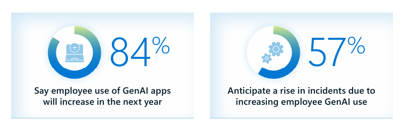

# AI のセキュリティと ID の保護を強化する Microsoft Entra の新しいイノベーション

こんにちは、Azure Identity サポート チームの 五十嵐 です。

本記事は、2025 年 3 月 24 日に米国の Microsoft Entra (Azure AD) Blog で公開された [New innovations in Microsoft Entra to strengthen AI security and identity protection](https://techcommunity.microsoft.com/blog/microsoft-entra-blog/new-innovations-in-microsoft-entra-to-strengthen-ai-security-and-identity-protec/3827393) の抄訳です。ご不明点等ございましたらサポート チームまでお問い合わせください。

----

皆さん、こんにちは！

AI が日進月歩の進歩を遂げ、私たちの働き方、そして同様に重要なことですが、組織のセキュリティのあり方を大きく変えようとしていることに、皆様もワクワクされていることと思います。AI は意思決定のスピードを加速するとともに、攻撃からの防御を自動化し、さらに強化しています。しかし、AI 自体にもセキュリティが必要です。組織が AI を導入するにつれて、新たな脅威に対して ID、データ、アクセスを確実に保護することが求められています。

そして、その課題は増大の一途をたどっています。下の図にあるように、**ID およびネットワーク セキュリティ業界のリーダーの 84％ が、従業員による生成 AI アプリの利用が 2025 年に増加すると回答しています。** そして半数以上が、この導入の急増によるセキュリティ インシデントの増加をすでに報告しています。

ID およびネットワーク アクセスの責任者である 300 人を対象とした当社の最新調査で、ID のセキュリティ リーダーがどのようにこの課題に対応しているかについて、さらに深く知ることが可能です。先日弊社の Irina により、重要な知見をまとめたブログが発表されました。詳細はこちらの [レポート](https://aka.ms/SecureAccessReport) からご覧いただけます。

それでは、AI の時代におけるアクセス保護に関して、皆様の懸念を和らげられるよう、[Microsoft Entra](https://learn.microsoft.com/ja-jp/entra/) と [Microsoft Security Copilot](https://learn.microsoft.com/ja-jp/copilot/security/) における AI 駆動型の新機能をここから見ていきましょう。ここでは、内容を 2 つに分けて説明いたします:

- **AI のためのセキュリティ**: 進化する脅威から、AI アプリケーション、ID、アクセス ポイントをセキュリティで守ります。
- **セキュリティのための AI**: AI を活用したアプリのリスク調査、ライフサイクル ワークフローの管理、条件付きアクセス ポリシーの最適化など、運用をよりシンプルにしながら ID のセキュリティを強化します。

## AI のためのセキュリティ: AI アプリケーションとワークロードの保護

### 生成 AI アプリケーションに対するきめ細かなアクセス制御

AI を活用したイノベーションを推進する中で、生成 AI アプリケーションへのアクセスを保護することは、これまで以上に重要になっています。Microsoft の [セキュア アクセス サービス エッジ (SASE) ソリューション](https://learn.microsoft.com/ja-jp/entra/global-secure-access/) の一部である Microsoft Entra Internet Access を使用すると、すべての AI アプリとリソースに対して ID を中心としたリアルタイムのアクセス制御を実施し、インターネット上の脅威、コンプライアンス リスク、シャドー AI から従業員を保護することができます。

また、きめ細かな ID ベースのアクセス制御により、ユーザーの役割、コンテキスト、リスク レベル、その他の条件に基づいて、さまざまな AI アプリのポリシーを調整することもできます。AI 専用の Web カテゴリや URL フィルタリング (現在プレビュー中) などのフィルタリング機能が強化され、AI 関連のトラフィックをより詳細に制御できるようになりました。例えば、開発者のみが GitHub Copilot にアクセスでき、加えてトレーニングを完了して、組織が作成した AI 利用規約に署名した後にのみアクセスができるというポリシーを作成することも可能です。

Microsoft Entra 条件付きアクセスを使用して、Interenet Access または Private Access に適用するポリシーを設定する方法については次のリンクをご覧ください: [Global Secure Access 経由のユニバーサル条件付きアクセス](https://learn.microsoft.com/ja-jp/entra/global-secure-access/concept-universal-conditional-access)

## セキュリティのための AI: AI による ID 保護の強化

ID の保護は防御の第一線に当たるため、ポリシーの見直し、アクセス リクエストの管理、セキュリティの抜け穴の対応に数え切れないほどの時間を費やしていることと思います。これは大変な作業であり、常に注意を払うべきものです。見落としが重大なインシデントにつながる可能性があるからです。

Security Copilot には、ID ライフサイクル管理を簡素化し、進化する脅威からアプリケーションを保護するだけでなく、業務ワークフローと効率を改善する新機能がいくつも提供されています。この機能が皆様の役にも立つはずです！また、条件付きアクセス ポリシーの最適化を支援する Microsoft Entra 初の Security Copilot エージェントもぜひ紹介させてください。さらに、AI 駆動のユーザー体験を活用している企業向けには、AI エージェントと対話する外部ユーザーの認証をより安全にすることにも取り組んでいます。

### Entra の Microsoft Security Copilot がさらに進化

Microsoft は、[Microsoft Entra 管理センター](https://entra.microsoft.com/) 内で、皆様が Microsoft Security Copilot の価値を最大限に引き出せるように取り組んでいます:

- **条件付きアクセスの最適化エージェント**: ユーザー、アプリケーション、およびアクセスのニーズは時間の経過とともに変化するため、一貫性のあるポリシーを適用しそれを維持していくのは難しい課題です。このエージェントは、既存の CA ポリシーでカバーされていない新しいユーザーやアプリを監視し、潜在的なセキュリティの抜け穴を検出します。また変更内容を提案したら、ワンクリックでその影響を把握できるようにもしています。
- **Security Copilot を使用したライフサイクル ワークフロー管理の支援**: 入社、異動、離職するユーザーに対し、Security Copilot を使用して、ID ライフサイクル タスクを刷新し、セキュリティとコンプライアンスを確保しつつ手作業の負担を削減できます。
- **Security Copilot を使用したアプリケーション リスク管理の支援**: リスクのあるアプリケーションを迅速に調査し、修復します。脅威が拡大する前にアプリの動作をリアルタイムで把握し、設定ミスを検出し、より細かく制御が可能となります。
 
それぞれについてもう少し詳しく説明しましょう。

### 条件付きアクセスの最適化エージェント: スマートなポリシー管理

Microsoft Security Copilot は、お客様の問題を積極的に解決するエージェントです。Microsoft Entra にある条件付きアクセスの最適化エージェント (プライベート プレビュー中) は、環境を継続的に評価し、新しいユーザーやアプリケーションなどの変更を監視します。既存のポリシーでカバーできていない部分を特定し、ワンクリックで修正提案を提供することで、進化するセキュリティのニーズにアクセス制御が追随するよう調整されるようにします。

自作の Excel シートや PowerShell スクリプトなど手動での作業をやめていきましょう。このエージェントは最適化を提案し、ポリシーの更新を迅速に行えるようにし、さらに設定ミスを減らしてセキュリティ体制を強化します。特殊な場合分けやビジネス ルールがある場合は、カスタムの指示をエージェントに与え、ニーズにより適した形に調整することも可能です。

条件付きアクセスの詳細については、以下のリソースを参照ください:

- [条件付きアクセスとは](https://learn.microsoft.com/ja-jp/entra/identity/conditional-access/overview)
- [条件付きアクセスのデプロイを計画する](https://learn.microsoft.com/ja-jp/entra/identity/conditional-access/plan-conditional-access)

### ライフサイクル ワークフローの管理: ID ガバナンスの自動化

 [Microsoft Entra の ID ガバナンス機能](https://learn.microsoft.com/ja-jp/entra/id-governance/identity-governance-overview) が Security Copilot でパブリック プレビューとなり、ライフサイクル ワークフローにおいても AI を活用したガイダンスが得られるようになりました。入社、異動、離職のいずれを管理する場合でも、Security Copilot が知見とステップ バイ ステップのサポートを提供することでプロセスが簡略化されます。

Microsoft Entra 管理センターでは、メニュー バーの [Copilot] ボタンをクリックすることで Security Copilot を起動できます。このとき、提案されたプロンプトを使用して自然言語で Security Copilot と対話できます:

- ライフサイクル ワークフローを設定するためのステップバイステップのガイダンスを得る
- 利用可能なワークフローの構成を調べる
- アクティブなワークフローのリストを分析する
- ワークフローの処理結果のトラブルシューティングを行う

Entra の Microsoft Security Copilot を使用した従業員のライフサイクル管理の詳細については、[こちら](https://learn.microsoft.com/ja-jp/entra/fundamentals/copilot-entra-lifecycle-workflow) を参照ください。

### アプリケーションのリスク管理: AI 駆動のアプリ セキュリティ

昨年 11 月の Ignite では、[Microsoft Security Copilot のパブリック プレビューとしてアプリのリスク シナリオを紹介](https://jpazureid.github.io/blog/azure-active-directory/security-copilot-for-microsoft-entra/) しました。このシナリオでは、自然言語のプロンプトを使用して、Microsoft Entra のアプリに関連するリスクを簡単に特定し、把握することができます。「テナント内でのリスクのあるアプリの詳細を表示して」などのプロンプトを使用することで、高い特権のアクセス許可や未使用のアプリ、外部のアプリに関する知見を即座に得ることができます。Security Copilot はプロンプトを処理し、危険なアプリとそのアクセス許可のリストなど、関連する詳細情報を返信します。加えて、Microsoft Entra 管理センターでさらに調査して対応が取れるよう、管理センターとの紐づけ情報も提示してくれます。

その後、皆様から寄せられたフィードバックに基づき、さらに多くの機能を追加しました:

- アプリまたはサービス プリンシパルの所有者の特定 - 未使用のアプリの扱いを検討するために重要です。
- アプリに検証済みの発行元があるかどうかの検出 - 外部アプリのリスクを評価するために重要です。
- Security Copilot チャットのリンクから Identity Protection のリスク検出レポートなど管理センターのレポートに直接アクセス

AI を活用したリスク評価をワークフローに直接組み込むことで、危険なアプリが被害をもたらす前に、プロアクティブに、もしくは発生したアプリの脅威に対応する形で迅速にリスクを検出し、保護することができます。

より多くの組織が AI エージェントを導入し、お客様や外部のユーザーとやり取りしています。スムーズなユーザー体験を維持しながら、これらのやり取りを安全に実施することが非常に重要です。

Microsoft Entra External ID を使用すると、[Copilot Studio エージェントの顧客認証](https://devblogs.microsoft.com/identity/integrate-copilot-studio-with-external-id/) 機能を安全に利用することが可能になります。つまり以下のようなことが可能となります:

- ID を意識したセキュアな対話 - お客様や外部ユーザーが安全にログインでき、AI を活用したユーザー体験へのアクセスが保護されます。
- パーソナライズされた体験 - ユーザーは関連サービスやアカウントの詳細に安全にアクセスできるため、パーソナライズされた AI 体験によりサービスへの満足度が向上します。
- エンタープライズ グレードの ID セキュリティ - AI 駆動型システムと認証したうえでシームレスなインタラクションを実現しつつ、不正アクセスのリスクを低減する ID Protection の機能を活用できます。

この統合により、信頼性の高い、ID セキュリティで保護された AI エクスペリエンスが得られるため、すべてのやり取りが信頼性高く、パーソナライズされ、保護された状態に保たれます。

Entra の Microsoft Security Copilot を使用したアプリケーション リスクの調査と修復の詳細については、[こちら](https://learn.microsoft.com/ja-jp/entra/fundamentals/copilot-security-entra-investigate-risky-apps) をご覧ください。

## まとめ

AI は、私たちの働き方、セキュリティの維持の仕方、そして AI 自体の保護の仕方も変革しつつあります。Microsoft Entra と Microsoft Security Copilot により、弊社はリアクティブかつプロアクティブな AI 駆動型のセキュリティを提供してまいります。これにより、脅威の先手を打ち、ID の運用を簡素化し、お客様の組織の規模に応じてアクセスの最適化を図ってまいります。

お客様の目的が AI アプリのセキュリティ確保であれ、ID セキュリティをよりインテリジェントかつ効率的にすることであれ、これらのイノベーションによって防御が強化され、お客様の業務負荷もより減っていくことでしょう。この取り組みはまだ始まったばかりであり、弊社は今後もこの取り組みを進めてまいります。

皆様の環境でこれらの機能がどのように活用されるのか、今から楽しみでなりません。さらなるアップデートにご期待ください。またいつものように、皆様からのフィードバックをお待ちしています！
